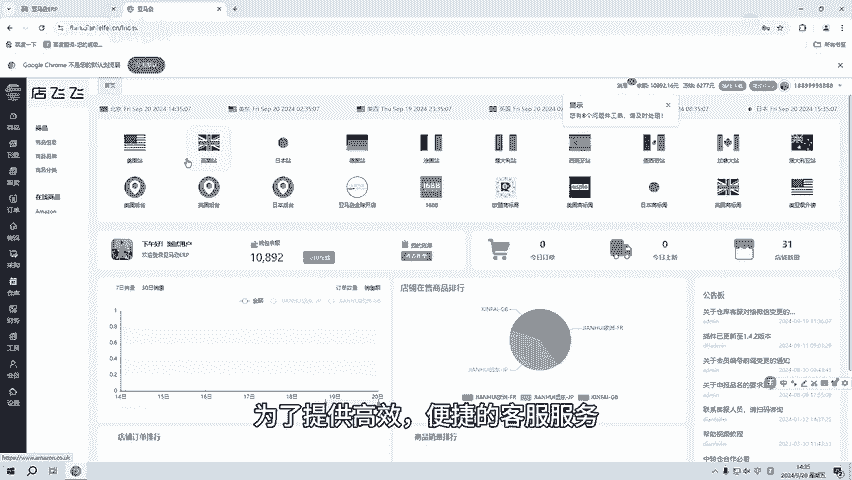
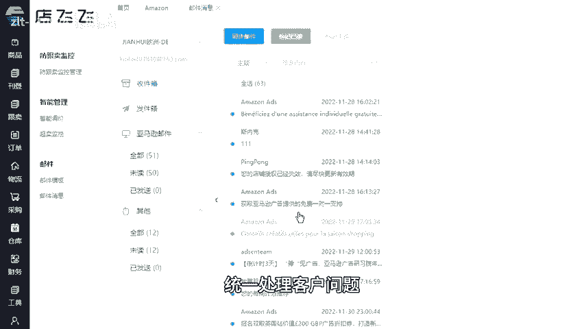
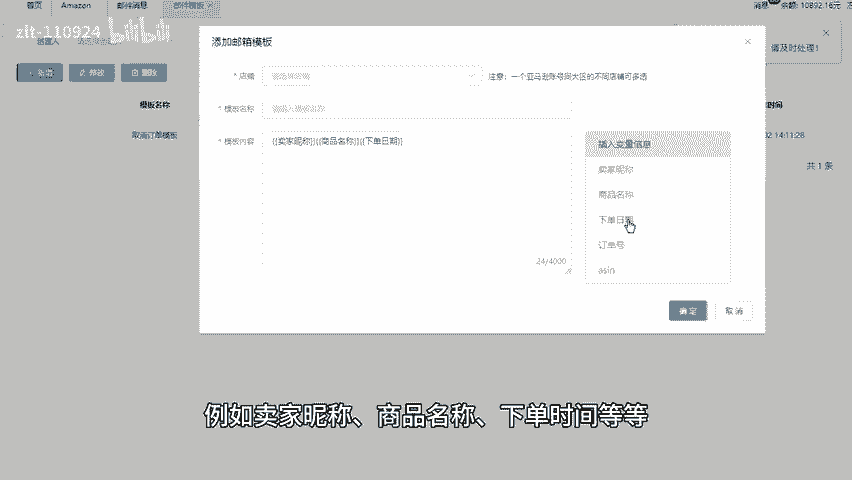
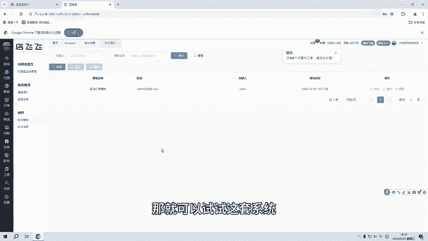

# 亚马逊自发货erp，店铺授权、邮箱绑定无限制无杂费 - P1 - 洋少AL885918 - BV1Webce6Ezt

大家好，很多亚马逊卖家通过ERP系统辅助店铺运营，而这套ERP系统不局限于前期的辅助工作。还有多店群邮箱统一管理。如果说你同时运营多个站点及多家店铺，那产品的售后就将是一个大工程。

为了提供高效便捷的客服服务，就可以使用系统中的邮箱管理工具。首先，需要在会员功能中的店铺管理里面去授权店铺在店铺授权成功之后，就可以绑定邮箱，在到工具功能中的邮件这里选接邮件信息，在这个邮件信息信息。

统一的收发管理，有区分亚马逊邮件和其他邮件，在任务栏上可以自由的去选择店铺快速回复客户的需求。下邮件客服功能，可以给卖家朋友们的所有邮箱提供统一平台统一处理客户问题，节省卖家们的时间。

为了更高效的回复客户信息，可以在邮件模板中创建模板，模板内容可以插入电量信息，例如卖家昵称商品名称、下单时间等等。在客服邮箱管理中的店铺授权其邮箱绑定是无限制前没有任何杂费的。

如果你还在为了回复不同的邮箱的客户信息，以及经常有回复不及时的情况。

需要反复切换浏览器，那就可以试试这套系统后台私信我分享免费的试用链接。

