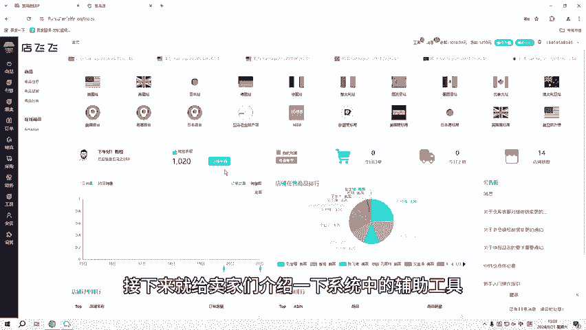
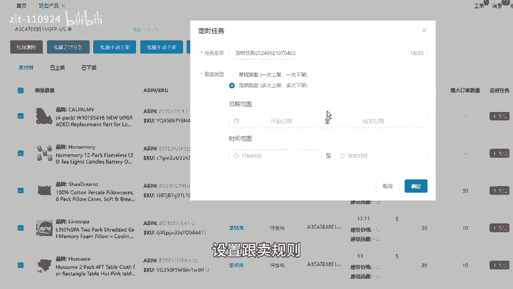
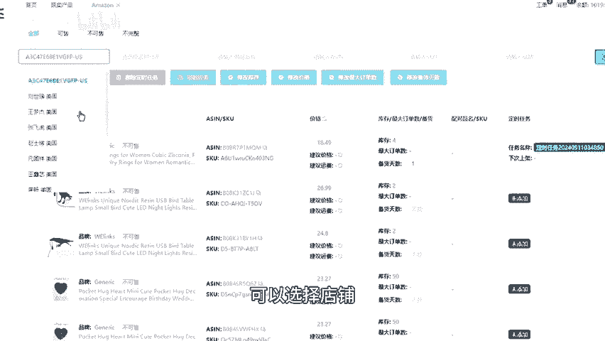
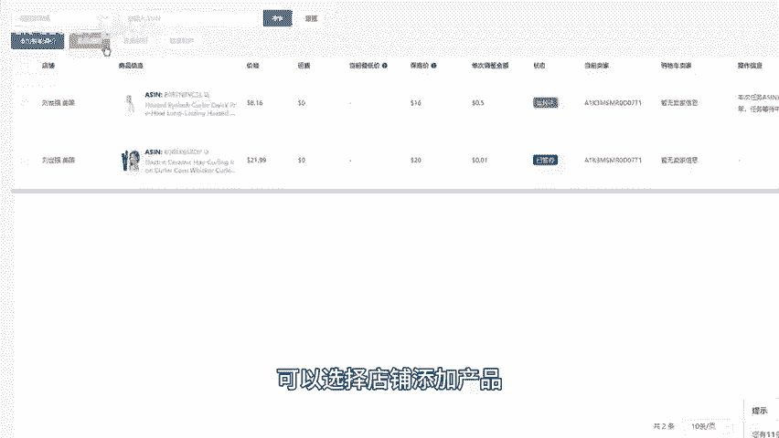
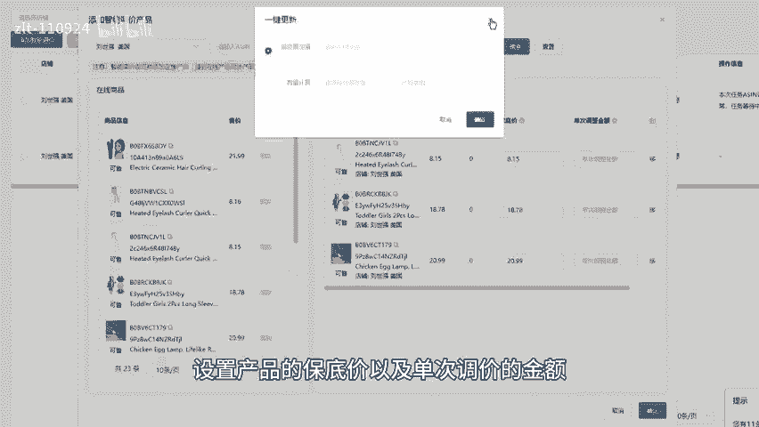
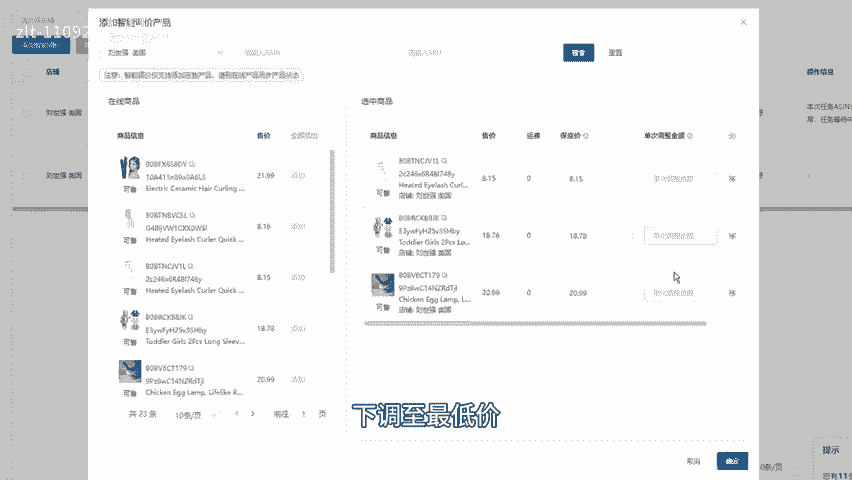
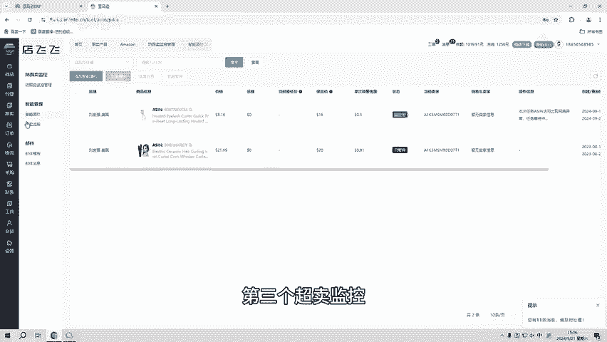
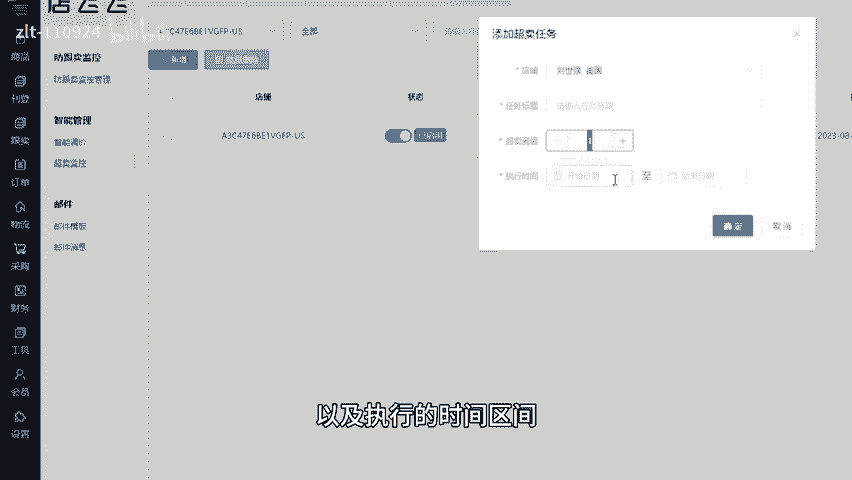
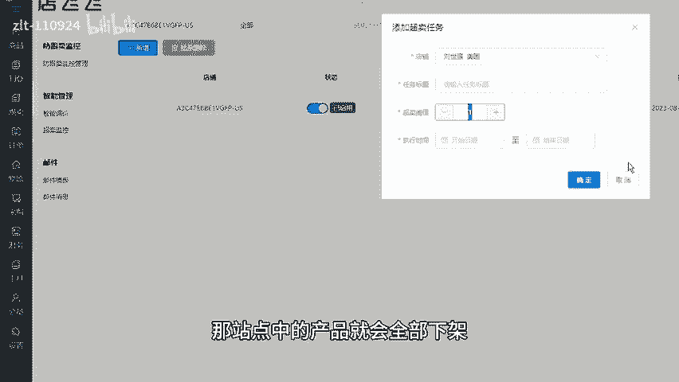
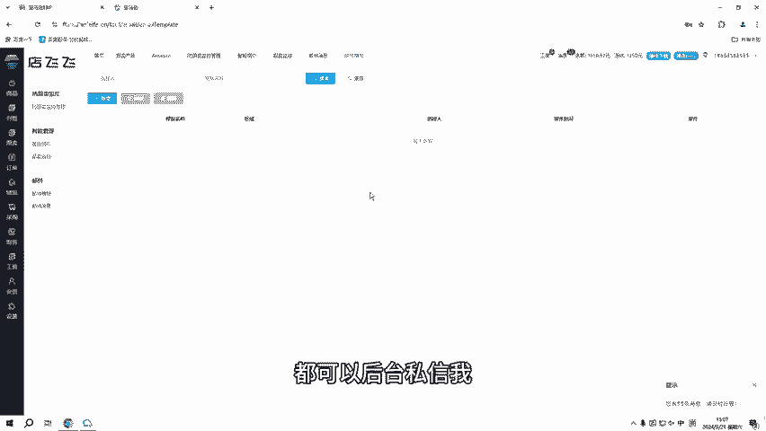

# 亚马逊自发货erp，必备辅助工具无套路消费 - P1 - 洋少AL885918 - BV1y6tke9E7v

大家好，亚马逊1RP系统除了能够帮助卖家们快速选品，一站式的解决产品的所有问题之外，系统中还有很多辅助工具，可以增加产品的出单率，店铺的曝光度以及售后统一处理等等。

接下来就给卖家们介绍一下系统中的辅助工具。第一个定时上下架，在跟卖功能的跟卖产品中，可以对跟卖热领的产品设置定时任务。这里有常规跟卖及定期更卖，可以选择跟卖类型，设置跟卖规则。那到规定的日期及时间段。

系统就会自动的对产品进行定时上下架，也可以在商品的在线商品中对店铺中的产品进行定时任务，可以选择店铺选择产品，点击定时任务，设置降价价的日期及时间，都可以点击确定。

第二个，防跟卖监控和智能调价，可选择店铺添加产品设置产品的保底价以及单次调价的金额。那当竞品的价格比我们低的时候，系统就会根据单次调价金额下调至最低价，那竞品上调或只剩自己的时候。

系统就会上调或回到原始价。第三个超卖监控需要先选择店铺设置超卖数以及执行的时间区间。那在规定日期内，店铺中的产品售卖超过设置的数量，那站点中的产品就会全部下架，是为了防止新店，因为销量积增。

导致店铺被封。第4个，一上是管理所有邮箱信息，可以自由的选择店铺，那邮箱的信息就会全部显示在这里，同时也可以添加邮件模板快速回复客户信息，除了以上的功能以外，系统还有自动虚拟发货，凡同行恶意竞争。

预力试算在线修图在线翻译等等辅助工具。如果想要测试ERP或者在测试期间遇到任何问题，都可以后台自询我。

