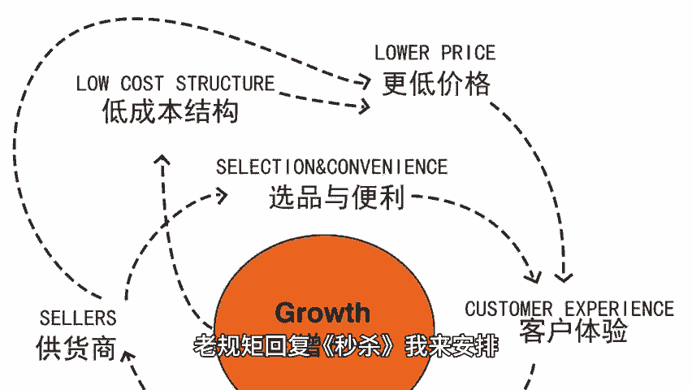
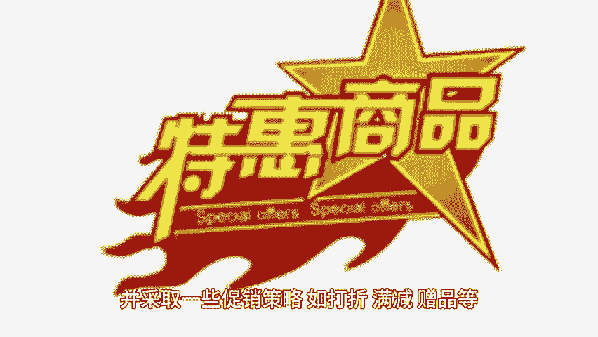
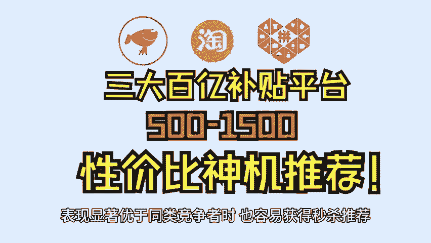

# 亚马逊获得秒杀推荐的技巧 - P1 - 小猛龙跨境俱乐部 - BV1AtsSeNE4G

🎼秒杀推荐是指亚马逊平台，根据用户需求和购买行为。嗨本期小猛龙给大家分享亚马逊秒杀提交步骤详解，同时为大家准备了亚马逊秒杀关键策略，老规矩回复秒杀，我来安排，获得秒杀推荐，不仅可以提升店铺的曝光度。

还能带来更多的销售量和收益。那么要在亚马逊上获得秒杀lightning dealsLD deals BD give of the day doctor的推荐，卖家需要遵循一定的策略和技巧。

首先是优化产品信息使用准确，简洁具有吸引力的关键词来描述产品，确保产品信息的完整性和准确性，这有助于提高商品的搜索排名，增加被推荐的机会，提供清晰真实具有吸引力的商品图片，展示商品的细节和特点。

🎼图片应符合亚马逊规定的尺寸和格式，避免使用模糊、重复或与商品无关的图片，包含提升商品评价，及时回应用户的评价，解答用户的疑问和问题，提供优质的售后服务。🎼最有助于提升店铺的好评率和信誉度。

增加被推荐的机会。🎼通过优惠券、赠品等方式鼓励用户留下正面评价，同时关注并处理负面评价，以维护良好的产品形象。根据市场需求和竞争情况，设置合理的价格，并采取一些促销策略，如打折、满减、赠品等。

吸引用户购买，如秒杀限时特价等，提高商品的曝光度和销售量，同时，注意遵守亚马逊的促销规则，避免违规行为，确保所售商品的质量，符合亚马逊的要求和用户的期望，减少退货和投诉，提供快速准确的物流配送服务。

提升用户体验和满意度，建立健全的售后服务体系。

🎼及时解决用户的问题和投诉，提升用户信任度和忠诚度。如果新品在类目中销量增长快速并持续上升，亚马逊可能会更倾向于推荐其参与秒杀活动。在市场上销量稳定，长期保持在小类目前十的老品也有很大机会获得秒杀推荐。

老品在短时间内的销量表现显著优于同类竞争者时。

🎼也容易获得秒杀推荐。具体操作技巧包含在秒杀前通过SU站外推广等方式，提升产品的主要关键词排名，使产品更容易被用户发现。根据目标受众的在线时间，选择活跃度较高的时间段进行秒杀活动，以提高转化率。

尽量将秒杀的起始数量设置为最低值，以便在秒杀时更快卖完并达到较高的达成率。在秒杀前半小时使用优惠券，快速提升进度条完成率，争取更高的秒杀排位。亚马逊秒杀推荐的更新频率是不确定的。

通常由亚马逊平台根据市场需求，和用户行为进行动态调整，一般来说，亚马逊会定期更新推荐列表，以确保推荐的商品符合用户的需求和利益。店铺运营者可以通过持续优化商品信息，提高服务质量，参与促销活动等方式。

提高商品被推荐的机会，获得亚马逊秒杀推荐使提升。🎼店铺曝光度和销售量的重要手段，而获得亚马逊秒杀推荐，需要综合多方面的努力和提升，通过优化产品信息，提升商品评价、合理定价与促销。

提升店铺综合质量以及关注秒杀推荐机制等策略的实施，可以有效提高商品被推荐的机会，并取得更好的销售业绩，篇幅有限，获取秒杀技巧，以及更多亚马逊运营小技巧，点赞、关注评论，带你出海不迷路。

