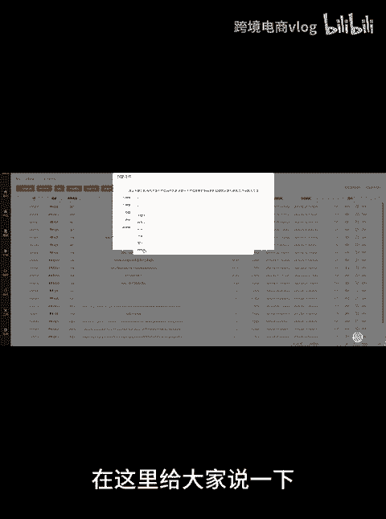
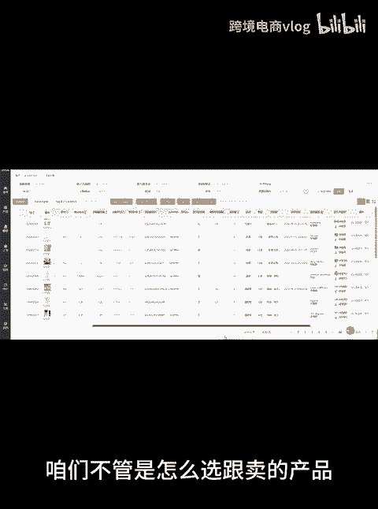
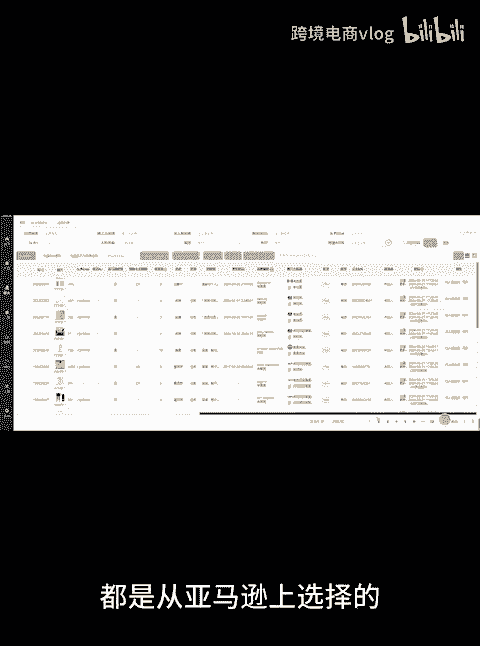
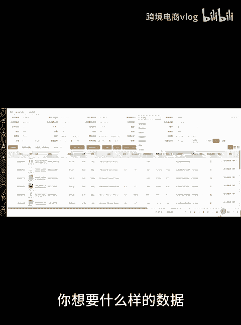
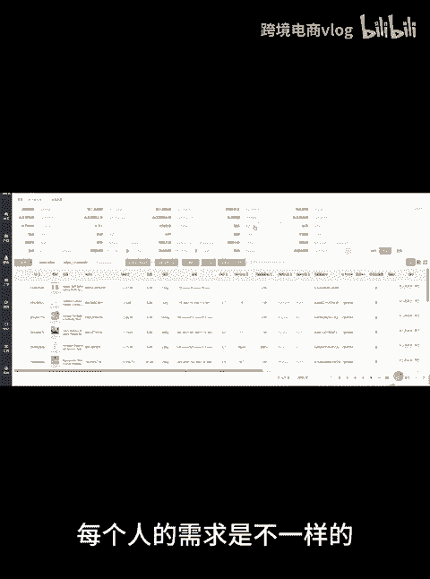
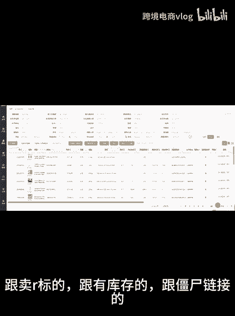

# 亚马逊跟卖软件，不限制于任何形式的跟卖，我们抓取的是亚马逊的实时数据。不要用狭隘的眼光去看任何一个已经成型的运营模式，都有其优势的。加油! - P1 - 跨境电商vlog - BV1hgm5YJE5X

总有客户问你们的软件能不能FBA更卖，或者是能不能选到什么样的产品等。在这里给大家说一下，不管什么样的产品都是可以选到的。

咱们不管是怎么选跟麦的产品，都是从亚马逊上选择的。

我们软件是对接的亚马逊API接口，采集的是亚马逊前台的实时数据。所以咱们采集出来的数据是什么都有的。你想要什么样的数据就输入什么条件进行筛选。

每个人的需求是不一样的。

FBA跟卖的FBM跟卖的跟卖没有品牌备案的，跟卖TM标的，跟卖L标的跟有库存的，跟江身链接的，跟有多个卖家的。

跟不同排名和价格的等等。所以。

不要再问软件可以选到什么品，只要你是做跟卖的，不管什么模式，什么品都可以采集到。详细软件功能使用，点赞关注找我领取。

