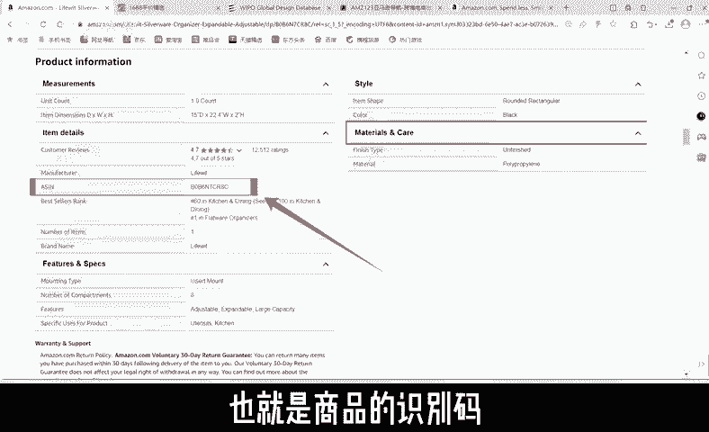
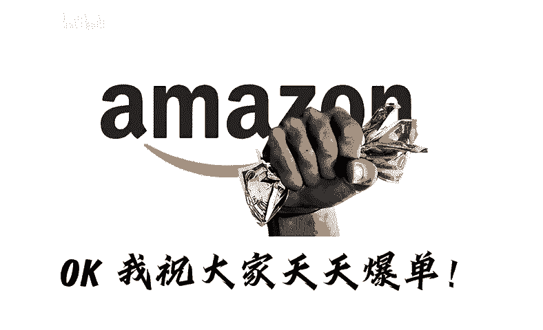

# 亚马逊跨境电商，什么产品适合跟卖？ - P1 - 猎人科技 - BV1je2PYFE3L

如何判断一件商品能否通过跟卖赚钱？首先，我们进入亚马逊产品页面去拿这个产品举例，这是产品的主图，这个是产品标题变体页。这里是产品的5点描述，鼠标下滑，这个是商品的S码，也就是商品的识别码。

这就是一个产品页面的组成，回到上方查看右边这个这边有详细介绍物流方面情况，简称box中文翻译就是购物车。亚马逊的机制是价低者的购物车。所以当我们计算出产品利润后，血压价格就O了。

首先我们查看产品图是否有带品牌logo，再检查产品的5点描述，有没有带品牌名，再登录查询侵权网站查询是否显示侵权，然后打开卖家经营插件，查看产品的销量情况。如果产品不算大卖，销量适中的话。

就等于具备条件了。最后我们打开1688网站，利用这边的搜图功能，寻找同款产品，打开商品详情页查看产品的重量，再逐一计算产品利润运费。如果利润率大于2%0，就代表产品符合上架条件O。😊。

我祝大家天天爆单。😊。