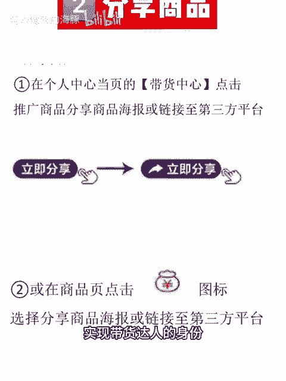

# 亚马逊运营在家一天做什么 - P1 - 努力赚钱的海豚 - BV12H29YnEeE

🎼早上好，大家，我去健身房活动了一下，练了下背，结束回家，随便吃了个饺子，就开始在家办公了。今天主要是告诉大家一个好消息。裸辞不到一个月，我已经找到新工作啦，还是亚马逊运营。既不用打卡也不用坐班哦。

我可以自己安排工作和休息时间，这四休三双休工作日不办公，我都可以除了亚马逊运营的工作，我平时还会做一些小副业。之前有个客户给我介绍了浩利商城做带货达人零成本零投资不需要拿货，就是帮别人推佣金也挺不错的。

可以通过以下这5个步骤实现带货达人的身份。佣金的比例可以参考这个哦。如果你是现在没有找到工作，感到焦虑，也可以自己发展副业。之前的离职笔记，大家都有看。关于要不要找新工作。

我更倾向于一段时间的休息和自我提升，但是居家办公的工作真的很难拒绝。现在我负责的站点，除了欧洲，美国是最主要的。对于这样全新的领域，我的内心是真的很欣喜，做副业真的很开心，看看天空这么难，继续工作啦。

😊。

三？