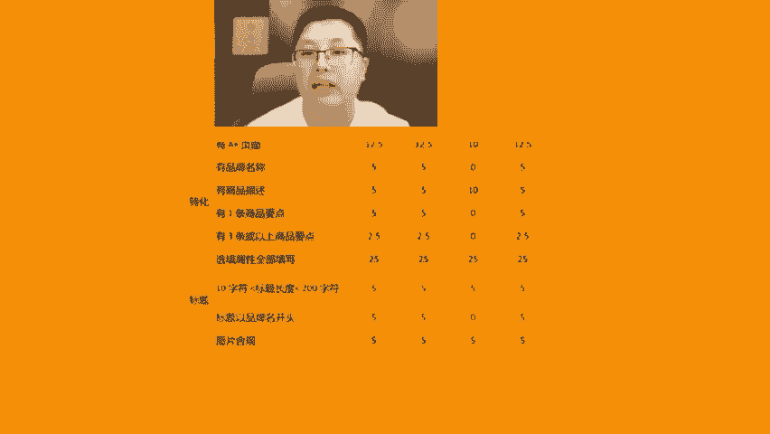
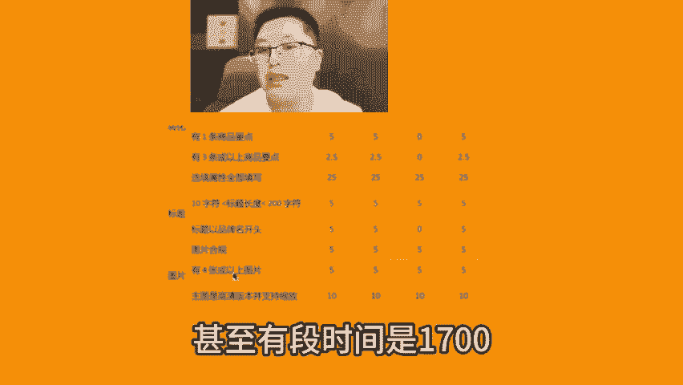
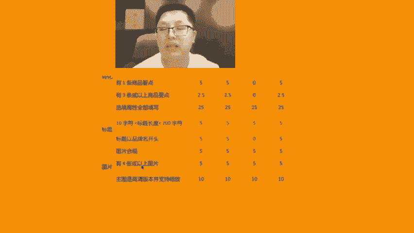
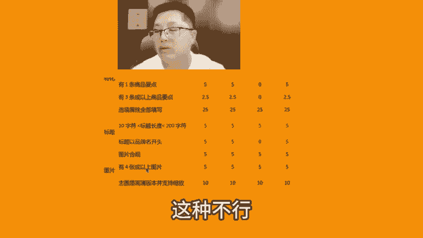
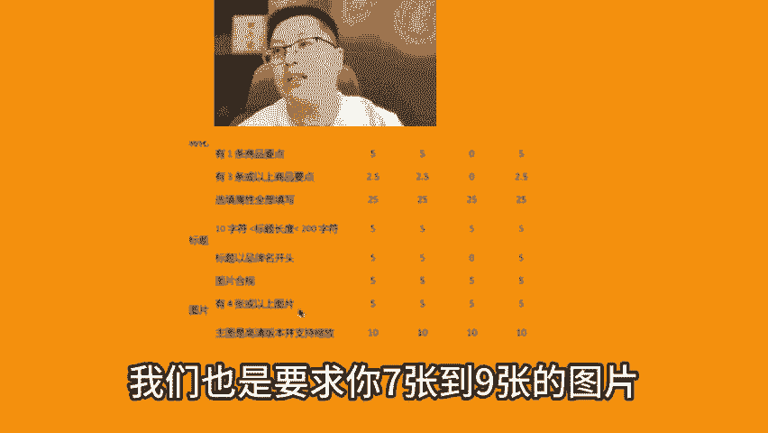
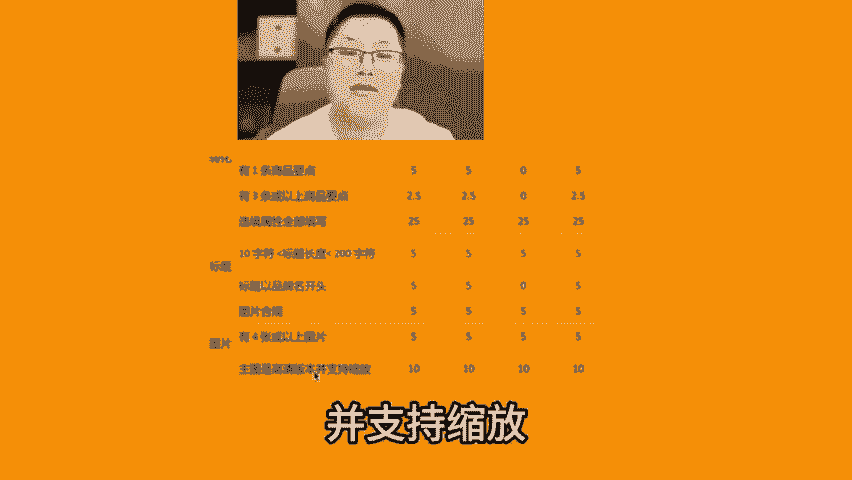

# 亚马逊运营必懂的listing主图的3个细节 - P1 - MoonSees - BV13GsSeLEZU

好图片图片要合规啊，所以这个关于图片合规的话是基础的内容，对吧？要求你白底要求你像素1000乘1000以上，甚至有一段时间是1700乘1700，对不对？图片要合规，你不要等一下又是阴影，又是在上面写的。

自己给自己写大卖啊，或者自己给自己写热热门那种不行啊。然后呢有4张以上的图片，一般来说我们也是要求你7张到9张的图片要写码啊。那么主图高清并支持缩放，这就是1000乘1000以上的这个图片的一个特征啊。

