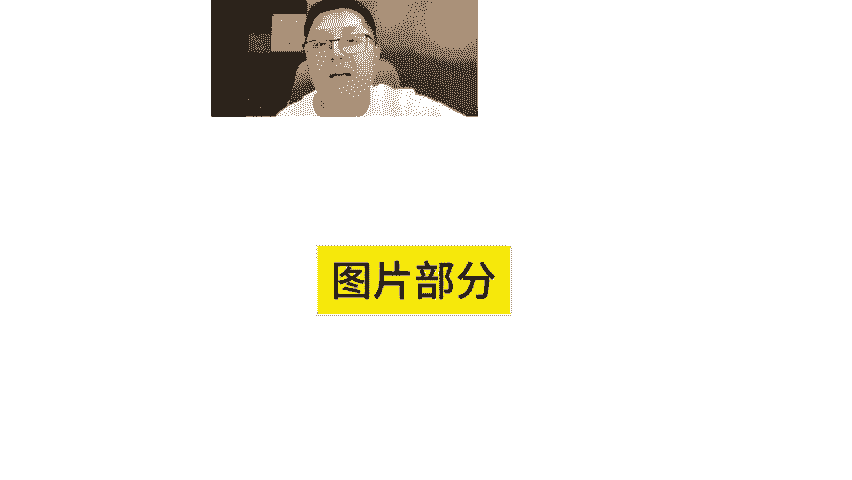
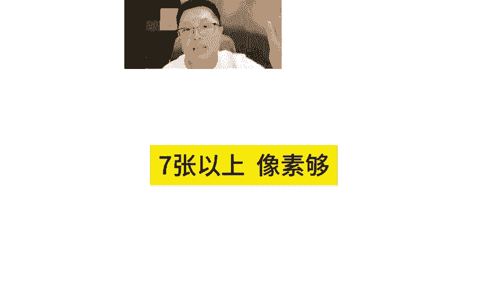
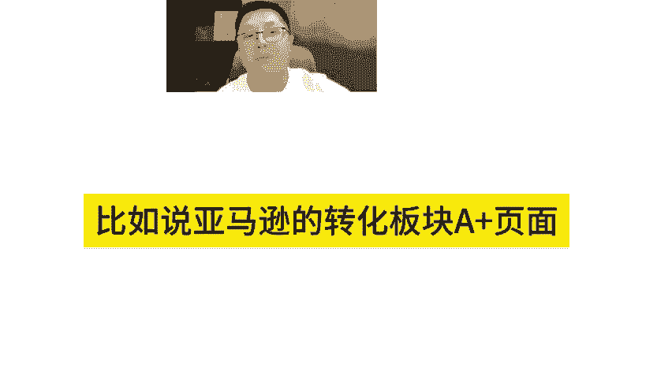
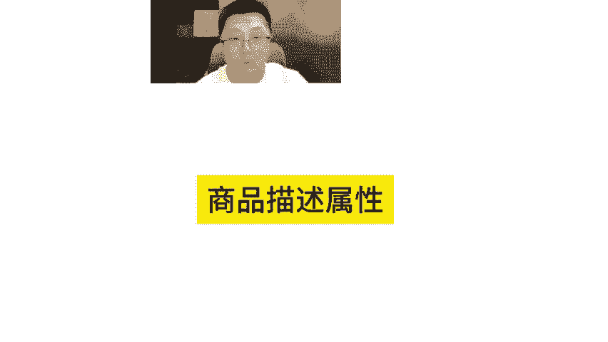
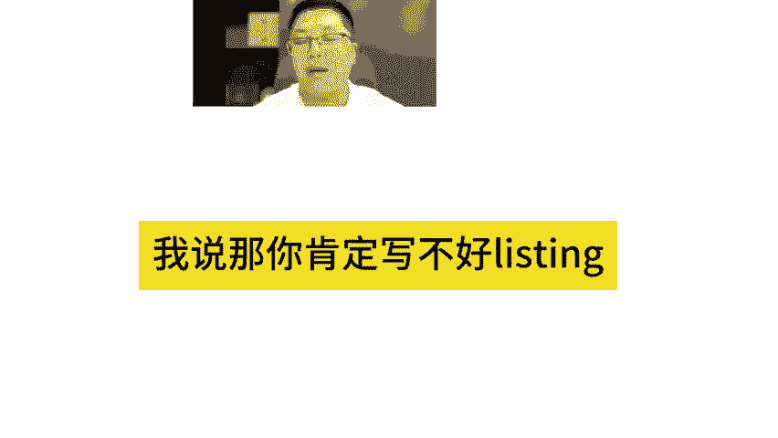
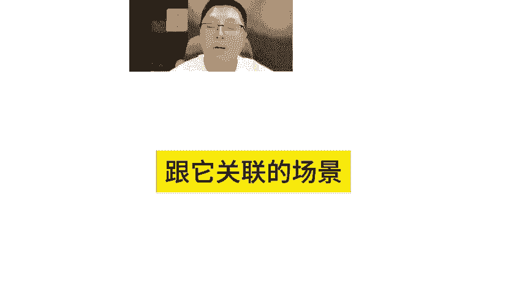
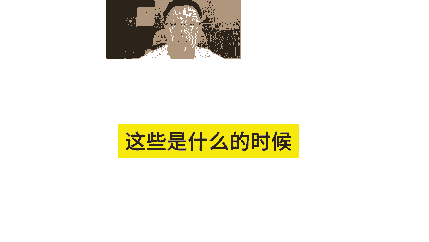

# 亚马逊运营必知！亚马逊listing的完整和关联 - P1 - MoonSees - BV1aGsSeLEhB

完整性包括的文案部分标题5点描述和详情图片部分啊，就图图片的这个三三要素主图白底，然后7张以上啊像素够啊，那么比如review部分review4星以上review最好能够做到10个亿10家以上啊。

并且在转化板块，比如说亚马逊的转化板块A加页面标题5点描述商品描述属性啊，各种属性写写写码啊，这些动作叫listing完整性做好，这是第一条啊，第二条listing关联性这个是看起来容易做起来不容易的。

因为这个涉及到一个东西叫产品定位啊以很多人他其实并不了解自己的产品啊，到底我跟什么样的用户是挂钩的，什么样的使用场景是挂钩的啊，什么样的这种功能是挂钩的竞品是什么？同类商品是什么？这个问题只要问出来。

我我我问过很多老玉你他回答不上来他的产品他现在会跟我说。

的产品没有什么啊，就是长这样子，没有什么亮点。我说那你肯定写不好listing，对不对？因为你并不知道他跟他关联的用户，跟他关联的场景，跟他关联的这种熟悉啊等等。这些是什么的时候，你的脑袋里面没这东西。

你没有办法把它展示出来。

