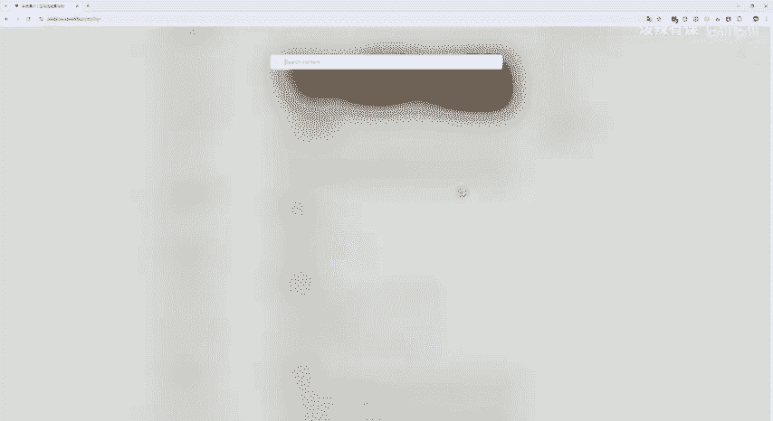
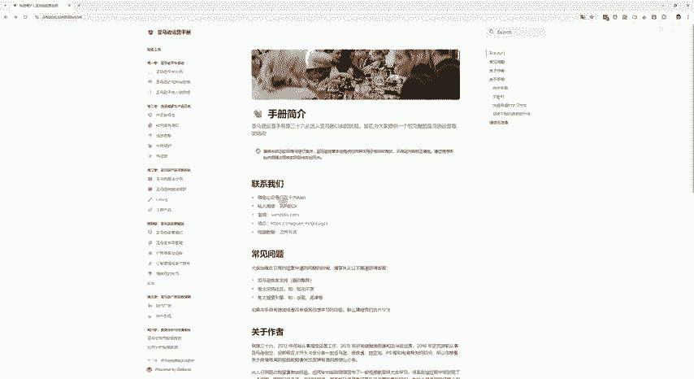
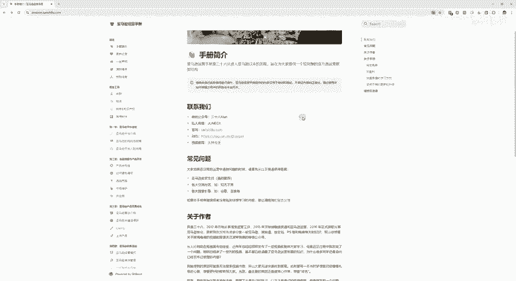
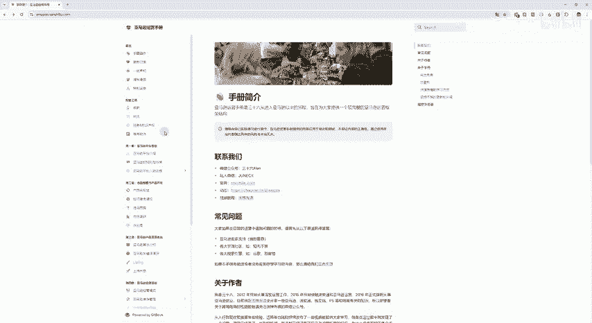

# 亚马逊运营手册 - P1 - 泼辣有课 - BV1bd11YwE1i

hello大家好，我是36。在这个假期，其实我并没有出门，我只是在找到了我之前一个坑没有填完，我把它填上了。那这个就是我们说的亚马逊的运营手册，从20年8月25号做一些整理的那直到呃陆陆续续写了一点。

有时间写一写。那经过4年的2。0的版本上线了，我重新写了一个大纲，然后把一些失效的链接重新补全了一下。那大概的内容现在就是这一些项目了。下面这种还没有这种表情符号的开头的，还没有去写。

那陆续我会慢慢的更新上去。做这一个的初衷，其实就是为了记录我的一些自己的感悟。那还随时记录亚马逊的一些变化，以及最重要的就是帮助一些新手卖家去更快速的了解呃，一些亚马逊该怎么去入手。

或者是一些基础的一些了解。因为我以前在刚入职亚马逊的时候就入行亚马逊的时候，其实也是去网上买各种书籍。但是我会发现书籍其实会有过期一些。政策还是一些玩法都会过期了，那没办法又去及时更新。

所以就萌生了做一个电子书的一个思路，可以快速的去做一些更新。比如说有一些政策改变了，或者是最近一些5点描述的一些东西的变化，给大家再看一下。比如说像历史顶这里有一些打分。

这是最新今年的还有一些对5点描述的一些要求是什么？所以都会及时更新上去，这是最核心的一些初衷。那大家如果说觉得看视频的也可以去我们的普游客看免费的视频教学会比较快，但是视频不好的地方。

就是没办法去快速的搜索，你遇到的一个问题。那我们电子书比较方便，在右上角这里直接可以快速的一些搜索。如果说你在阅读的过程中遇到一些问题，或者是有一些没有说到的地方，也欢迎社区留言给我们写留言。

我们把它给给他加上去。那也可以在我们的官网或者是联系我的私人微信，以及我们的微信公众号去进进一步的交流。那平常我会在这里发布一些一些我们的一个。

动态会在这里发布，大家也可以去关注。那这里是关于一些我们的一些自我介绍，还有一些我们的初衷。那大家如果感兴趣可以来详细的去阅读阅读的过程中遇到问题，欢迎给我们留言反馈。

这就是我们的网址阿重点36拼音点com，这是我们的亚马逊运营手册的一个网址。那接下来我可能会花更多的时间去完善完成之后呢，我会做独立站运营手册，速卖通运营手册。还有让我了解过的一些平台。

我会做的一些平台，可能我都会做一个电子版的些手册上线给大家去学习。其实更想说明的就是大家如果说在用我的过程中，好和不好的地方，都希望大家给我们一个反馈。我们才能更好的去完善我们的一个学习体系。😊。

