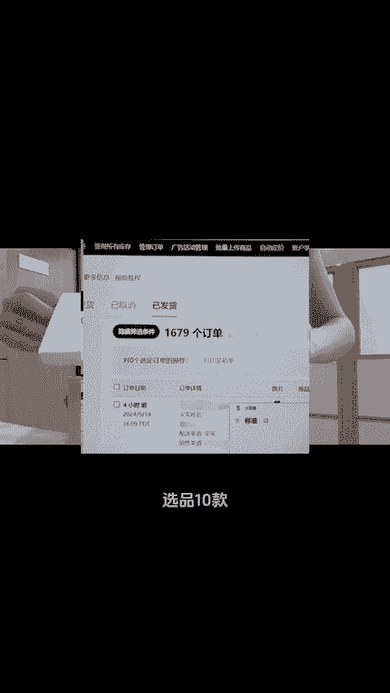
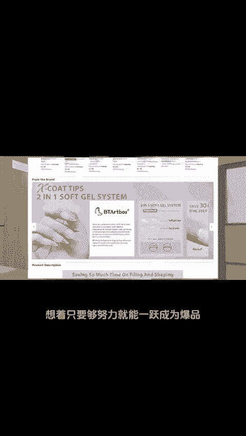
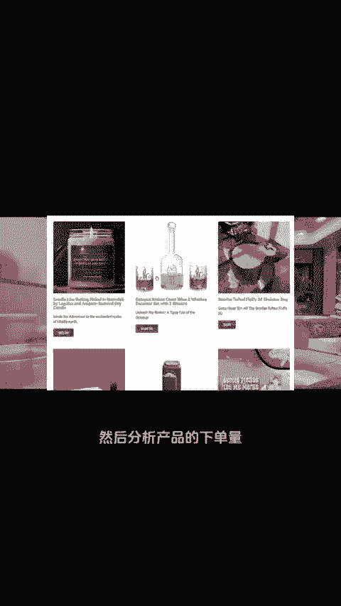
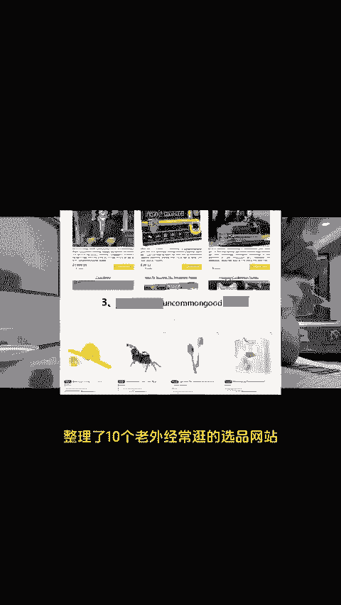
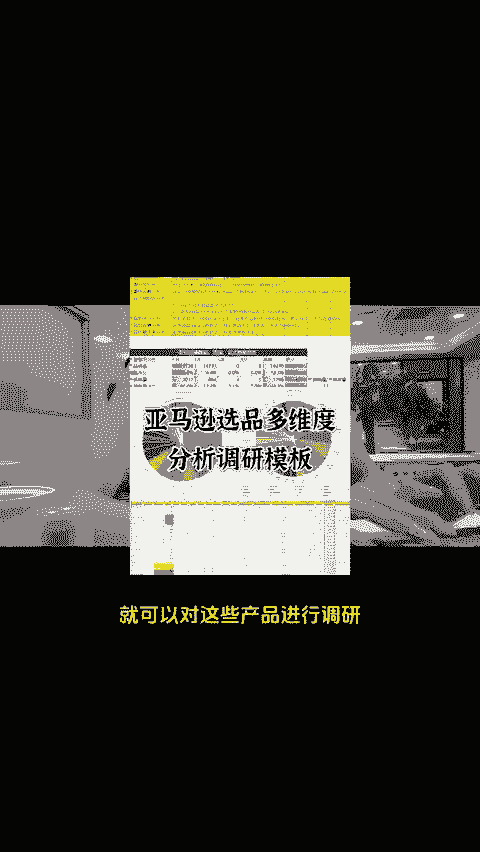
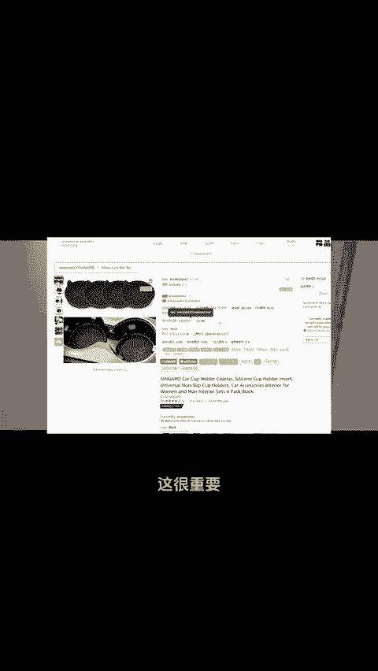
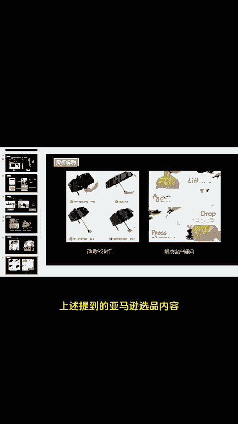

# 亚马逊选品没有捷径，但有很多角度！ - P1 - 小亚跨境研究 - BV1Rq2SY9EfM

刷到这条视频，就是上天告诉你要好好搞钱了，跟大家汇报一下目前的进度，选品10款，单款备货10到15个全部出单，8款断货，经历了5年的跨境电商。我深刻体会到那句老话，七分选品三分运营的道理。

当入门那会也是执着于选热门产品，想着只要够努力就能一跃成为爆品。结果是更有实力的卖家狠狠碾压我们出单都成问题，让我明白，亚马逊选品没有捷径，但有很多角度，我们可以先从老外喜欢逛的网站入手。

然后分析产品的下单量，找到老外感兴趣的产品，这样才能增加出单率，这里整理了10个老外经常逛的选品网站。另外，我们筛选出一批老外感兴趣的品质之后，就可以对这些产品进行调研，对比这些品的利润竞争力等等。

再筛选掉一批，接下来就进行产品专利查询，这很重要，也是必须做的一步，可以用这个方法查全球产品的专利。接下来就是产品上架listing优化。我整理了一份listing文案和图片优化的方案。

并附有产品案例和图例。上述提到的亚马逊选品内容需要的，直接三个酒报走，一起跨境一起报富。😊。

