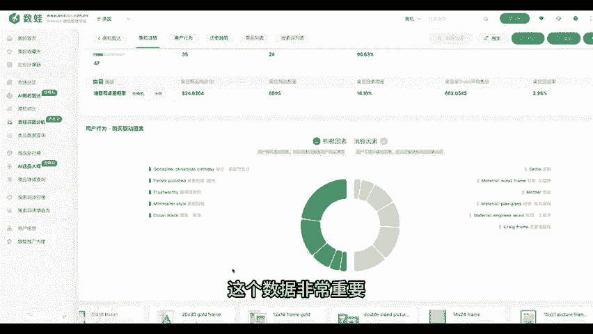
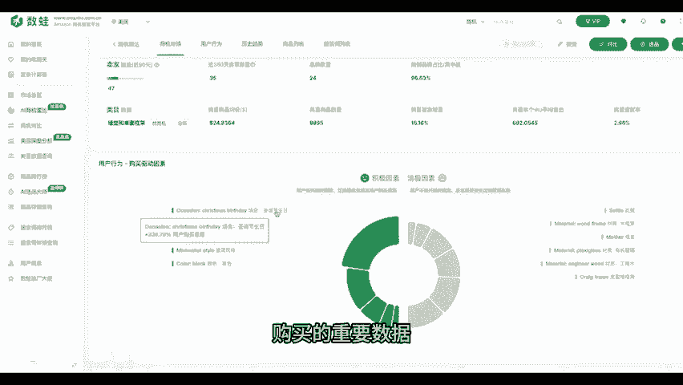
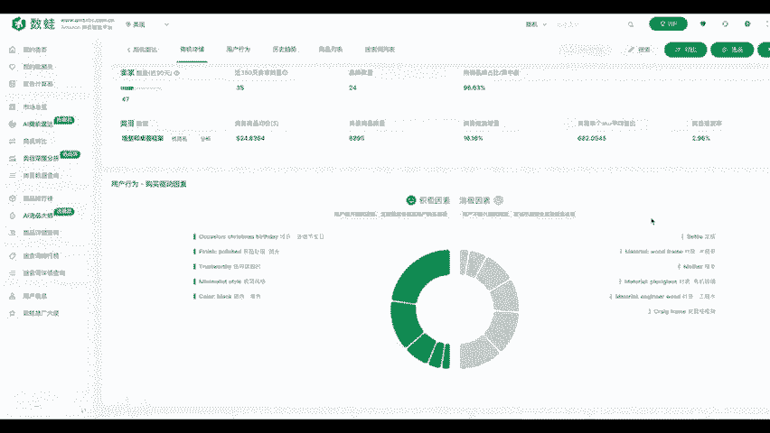

# 亚马逊选品，不卷价格卷选品 - P1 - 金易桥科技 - BV1oMy3YGEAu

。🎼从事亚马逊平台跨境电商的卖家朋友都知道，这几年亚马逊平台非常卷，利润大大压缩。很多卖家朋友特别是刚刚进入平台的新卖家，经常使用跟卖的方法来选品，跟卖这种方法只能是一试说没法带来长期的正向收益。

总是自己需要去寻找一种方法来选品，才能在激烈的市场上百战百胜。传统的亚马逊卖家朋友会使用好几个工具一起比对基础数据来进行选品，使用多个工具选品，需要卖家有一套自己的方法论，对于新手卖家或者中小卖家而言。

这个成本是非常高的，不仅仅需要去试错，还需要大量的时间去学习。其实我们可以使用新方法的来进行选品。这个方法就是使用商机进行选品。🎼不仅仅可以提升效率，而且也不用花太多的时间去关注复杂的计算逻辑。

🎼交给我们来完成。🎼今天我们一起来进行一个实战。🎼先进入到数挖商机自选平台，打开商机雷达这个模块，打开模块以后，这里我们不是用平台推送的品类推荐。因为我们今天我们想自己选一个品类来做选品。

今天我们的目标是相框这个子类。我们先通过类目选择选中相框这个类目，选择完成后点击下方的智能挖掘商机进行运算，稍等一下后，我们可以见到结果列表中出现很多结果。每一个结果代表一个商机。注一这里不是商品。

是商机每一个商机下面会包含当前商机下面的商品。我们改动一下排序的条件。这里我们选择数挖评级，数挖评级是金一桥推出的一种商品，在亚马逊平台上面的量化评级算法，可以帮助卖家快速计算出商机当前的量化级别。

最高是五颗星。我们可以看出，通过这个评级计算。我们可以快速看到每一个商机的总体状态，可以快速决定是否。🎼选择此商机。接下来我们点击第一个商机进入商机的详情，在商机的详情中。

我们会对这个相框的商机进行6个维度的分析。我们可以看到此商机近期的搜索量。销售量均有大幅度上升。这个商机包含了47个商品。从数量上来看，此类型的商品仍然有足够的市场空间。接下来我们继续参考其他数据。

包括退货率、缺货率，这两个数据也反映了这个商机是可以进行选择的。继续往下看用户行为，用户行为描述了此商机的用户评价分析。我们可以看到购买商品的用户关于相关商品的正面评价是哪些，负面评价是哪些。

🎼这个数据非常重要，是影响客户最终是否下单购买的重要数据，值得我们仔细看看。

🎼到了这个阶段，我们也只是确认了这个商机是可以尝试去选择的。

🎼最后一步就是选择商机包含的商品来进行比较。每一个商机均包含众多商品。我们从商机数据可以看到，此商机包括了47个在售商品，我们可以选择评价在前面的商品进行分析。如果你手上已经有与相同品类的商品。

这个时候我们就可以对商品的详情数据进行比较，是不是比以往的选品方式更加快捷以及准确呢。基本你可以看到这个品类在亚马逊美国站上，那些商品是卖的好。这些商品目前整体的趋势，是否还值得进入。你学会了吗？

