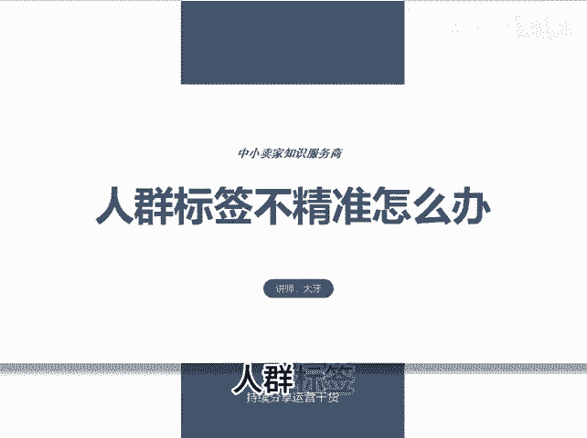
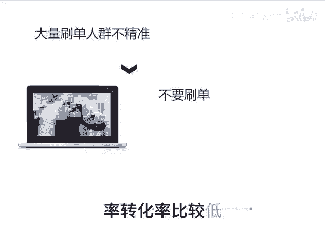

# 人群标签不精准底层原理 - P1 - 千优电商教育 - BV1QusfeMEiX

人群标签不精准怎么办？那很多朋友说吗？说我直通车转化率低，点击率低。其实呢你的标签不精准，简单说就是进来的用户，他不是你的菜，他不是购买你商品的人群，所以呢导致转化率点击率都比较低。

为什么出现这样的情况，大体上是这样的，如下三个原因。第一个就是平台原因，像你开直通车在第一阶段系统呢不了解你的人群，给你推荐的人群比较广泛。所以说你开直通车的第一阶段标签它就是不精准转化率都比较低。

所以在直通车所有的玩法里面都是从第二阶段开始。在第二个就是你链接的原因。我们知道链接呢它是讲究的词图人，它是精准匹配。那很多朋友他做的图有问题。然后呢，标题关键词也有问题，不会写标题直接拿过来抄。

这样呢也会导致你的转化率比较低，可以举一个例子，让大家看一看。比如说你卖的是妈妈装，像第一张图片这是妈妈穿的服装吗？肯定不是。😡。

甚至还有些人把这样的图片在标题里面写上大码女装，这怎么可能？像第二张图，这就是妈毛装，也可以是大码女装，这就是词和图的精准匹配的问题。那么你看一下你的关键词和你的图片是否精准匹配。在第三个呢就是刷单。

很多人现在是开了店之后，他要补单，其实大量的补单也会导致你的人群不精准，特别是在直通车的第一阶段，你千万不要补单，也不要补到直通车里面，因为在第一阶段系统学习你的人群，你补单咔，他学习补单的人群。

到后来呢系统错误的以为你的产品需要补单这波人群，所以你会点击率转化率比较低。我是讲师大牙，欢迎大家扫码添加我的微信，不方便扫码的朋友可以添加我的微信号，80221430。

在这里给大家准备到了一套新手运营入门的大礼包，希望能够帮助大家。😡。

