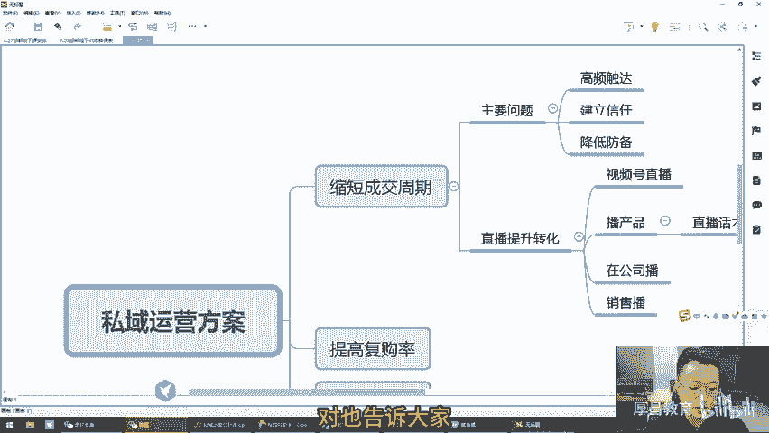
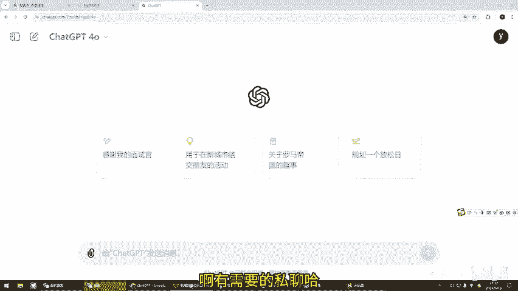
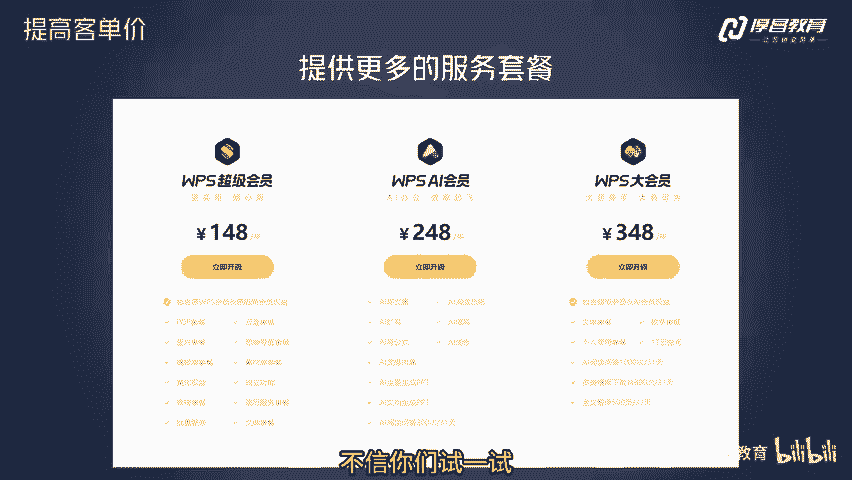

# 从0到1构建私域帝国：掌握用户价值提升的关键路径 - P1 - 厚昌教育 - BV1uE4m1d7ZZ

🎼，こ上。今天这几个公开课呢是关于自运营的一节课程。就是现在大家。能明显能感觉到什么呢？就是我们流量成本越来越高。于是呢就导致什么？就我们现在整体的公司的利润，包括业绩也都不是特别的好。

那很多老板就开始琢磨了，哎，我除了要提高我的投产比以外，提高我流量这个这个效果以外，我怎么可以让我工司变得更好呀，能让我的利润更高呀，能让我成交率更高呀，所以说呢就除了这个私域。

私域就是说你可以简单理解是什么呢？就是你通过比如竞价信息流拿到了客户的联系方式，客户留了表单电话微信，对吧？你就加到你的微信之后的事情。所有的事情都可以叫私域。

今天这节课呢给大家带来一样一节不一样的私域运营课。因为思域这个概念可能很多人都听说过，但是几乎没有一个人可以系统的说我到底是什么是思域。所以说我开始的时候，我先问一下大家。什么是自运营？什么是词语意？

Oh。有人说是什么CRM客户管理系统，什么邀请有奖发朋友圈、转介绍，发布新品，对吧？积分会员资金APP。在屏幕上显示的基本上都是属于私运营的一个部分，或者一个环节或者一个营销的手段，对吧？但是。

出现这么多之后，发现我卡的司语音太乱了。是已经太冷了。那大家想不想通过一节课学会或者要系统的搞懂什么词语运营，想不想想的话把公屏打到。想哎呀把想字打到公屏上哈。😊，想想系统学习是域应用吗？好。

我告诉大家哈。😊，那既然叫营销或者叫运营，那运营它一定有一个叫什么叫目的。就你搞私运，你的目的是啥？比如说你投镜价，你的目的是啥？你说那很简单，我们不就被获客吗？对吧？所以说。😊，记住。

这几个核心的关键点就是一切的营销手段都要先确定目的。一切的营销手段都要决定目的。那私域运营主要呢有四大，注意有四大。运营目的。第一叫缩短成交周期。Okay。你们现在的一个客户拿到你们加加了微信之后。

平均的成交周期又有多长？有的可能是三五天像招商加盟的。对吧有没有一两年的客户？对不对？旅游的一两个星期。对吧门窗的定制的半个月1个月。对不对？那如果说我们可以提高缩短，我们缩短我们长周期。

对吧是不是可以快速的回笼资金，提高现金流的，提高现金流？第二。提高复购率。什么要提高复购率呢？就是有没有。你们的客户是一锤子买卖。买了之后对吧？比如我说产品不行了，或者说产品的使用周期比较长了。

复购周期比较长了。就是没有。后后化了就没有二次销售的，有没有？而且有的产品它其实应该是有服务的。比如说旅游。但是我们的地推或者说我们的地J对吧？交付特别差，带人非得逼着人买东西，明明有明明可以有复购。

但是人家也不会有不会在你这儿买了，对吧？只是说有的时候复购周期比较长，他但是他应该也是有复购的。第三，增加复购的金额就是提高什么呀，提高利润率。有没有？公司的业务，比如说你的第一单是属于低客单引流的。

比如说很多的教育行业，有没有有没有做教育行业的，比如说用了一个小小课，哎，引进来之后，后面哎买大课啊大课完之后买线下课，线下课之后买司董会是吧？就增加复购机构，有没有想这样的？第四，快速裂变和拉新。

就是确实有些行业呢它属于低复购。比如说房产对吧？你说或者装修。对吧我我这这一辈子可能就装修一两套房子，我不可能说没事去装修吧，对吧？确实你的复购这块很难做，但是。那边拉新。如果做起来的话。

它效果是杠杠的杠杠的。这样呢我就不给大家举案例了。这个案例其实有非常多，比如裂片拉新。我知道的一个装修行业，他基本上不怎么去投付费广告，光靠老接老客户介绍就做到了当地的。可以说是最大的一个公司。

把所有的运这个运营全部放到了老客户的运营上。效果非常非常好，想了解的哈，一会会给大家讲案例。那到这儿所有同学。所有同学请注意。所有同学注意，就是第一要结合营销目的。第二和企业结合企业现状。

去确定一下你做思域的目的是啥。你做思语的目的是啥？一。23。4、如果说你现在企业现在哪块做的最差？哪块做的少？就是你觉得你现在工司哪块做的最差，比如成交周期很长，很多客户流失了成交率比较低的这种。

销售不给力，成交率很低。那我要缩短成交周期，提高成交率。是吧。我明明是有有付购，但是客户。没有复购，增加复购平的选择。选择。结合着我们现在公司的实际情况。然后有人说转介绍拉新转介绍差。对。还有。陈经理。

你二你的二一定要选择。你的二一定要选择。打1234就行哈。😊，打1234。很多人都不理解到底什么是私域。私域呢就是你要先确定你的目的是啥。😡，对吧你说我一和三也可以选择二和4也可以选择。

或者说只选个一或者只选个三都可以。你听这堂课之后之前对吧？往后再再往后讲之前，就是你要带着你的。需求。我现要提缩短成长周期，我现在提升批头率。我现在想裂变大新OK。我会给大家带来四个方案。

我们先来说缩短成交周期。我们先现在说算成功西。缩短成交周期呢，其实很多人没有意识到这个交付的时间、成交周期的重要性。可能很多人都没有意识到你你你品一品，你们现在公司每一个销售每天加多少条消息？

每天加几条微信，有的是一条、两条、三条、5条、十条8条。他是不是要加大量的消息，对不对？每天都会加新的新线索。那如果说他的成交周期缩短了，比如这个客户原来需要一个星期才能成交，现在我需要3天。

那是不是意味着他能够接更多的线索？这是不是要意味着他能够接更多的线索？为什么很多公司成交率差？成交成交率差，就是因为你的成交周期太长了，一个客户跟跟跟没跟完，来条新线索，跟跟没没跟完，又条新线索。

他永远跟不完，他永远成交不了。😡，越拖越长越长越拖，最后什么呢？最后你们公司都给被拖垮了。如果说你们公司比如说有没有销售主管或者销售经理，负责业务的，或责业绩，你可以把这个公开课转转发给他。转发给他。

很重要，你品一品他如果成交周期做短了，是不是意味着就可以接更多的线索？他接了更多线索，他是不是可以出更多的业绩？对不对？第一。解决这个问题需要3点，第一叫高频触达。什么叫通过高频就是高频触达。

通过直播、电话、朋友圈等多个渠道，多次去接收用户，触达频次越多，成交越快。成交越快。第二，快速了解。快速了解是双方的双向的。对吧我们要快速了解用户，也需要用用户快速了解我们。对吧第三叫降低防备心理。

因为用户被我们花钱，或者说用其他的内容引来之后呢，他会觉得哎他是不是要卖我产品，他是不是要坑我钱，他是要卖我课，他是不是要干嘛？他是不是要放有很强的防备心理啊？有没有会不会有？好。那通过这三个问题。

大家闭上眼睛想一下。😊，很很关键哈，一定要跟着我的思路去想。😊，如果你想解决这个问题，你能想到最好的渠道。最好的一个营销的渠道或者最好的一种形式是什么形式？想一想。想一想。我们会用什么样的渠道。

就是高频触达，建立信任，降低方备心理，快速了解。哪个渠道？哪个渠道？或者一种什么样的形式？有人说拍个片子给他看一看。有人说陈经理说直播。OK太棒了，还有吗？继续啊。你现在正在做一个什么呢？注意哈。

你现在在做一个帮助公司提高成交率的私域运营方案。帮是帮助公司提高成交率的私域运营方案。如果说一会儿我会带着大家去做这个方案。如果说大家一块儿做出来之后，你拿着这个方案去找到老板老板说，我靠，真棒。

我就这么干，于是你是不是能够多多管点东西呢？😊，高质量的朋友圈轰炸。对吧有人提到了直播，有的提要视频，有人提到了朋友圈。那大家觉得就在直播拍视频和朋友圈这三方面，你会选的哪个？你会选择哪个？

你会选择哪个？你觉得哪个方式，我回头再来看一下，能够高频的触达，快速的了解，降低防备。朋友圈搞视频。Yeah。做直播啊，兄弟兄弟。你想一想，我拿着我拿着我的手机，比如有没有做那有我看我看到有做门窗的。

有做传统机械的，有做旅游，有做。这个这个这个教育的招商加盟的招商加盟，我给你看我的样板间，看我的实体店，看我的加盟店，对吧？那个做门窗的，做传统机械的，我让你看我的工厂，我让你看我的这个这个东西。

这个肯定是啊。对吧那。哪个渠道做直播更能触达你的。死于用户。哪个渠道？啊。Okay。哪个渠道。蝴蝶号没事，这个是小额通。有人说地球号、蝴蝶号、视频号，没事，可以直接说微信号啊，微信视别号。对。

抖音它是一个公益的平台，视频号说说一话都在你的客户都在你的微信里面，对吧？我们肯定是做视频号。所以我来的触达的更直接呀，因为他就在你的微信里。对不对？多什么内容？讲一想。好。我们现在主决定要做直播了。

😊，我们决定要在实市频上做直播。就是说我得我得补点啥吧，对吧？我得补点啥吧。😡，播啥内容。不啥内种。Yeah。Yeah。比如刚才那个李经理。装逼的案例内容汇报这个星期的本座政。导演是吗？你是做做啥的呀？

你是做啥产品？😊，比如说我是做财财税的商，就是比如说这个企业服务的对吧？那我就跟你讲，你现在在企业经营当中遇到的问题，有金税四期的问题，对吧？实实缴的问题。公司注册流程的问题。如果我是个工厂，对吧？

我就播。其实说白了就什么呀？就是介绍产品。成人口才课程。对。介绍产品。嗯。这个不难吧。😡，这个难不难？你们的销售天天给客户打电话介绍产品，不就是那套东西吗？哎欢迎我们是什么什么公司，我们业务是谁啥啥。

我们业务特色又啥，我们比别人家好在哪儿，我们产品怎么怎么样厉害，对吧？我们产品价格是多少多少钱，对吧？😊，你们你们你们现在问题是啥？我这个产品怎么样去解决你的问题的？😊，是不是？客户在销售微信。

销售不会直播，等会我会给你讲这个东西啊。在哪儿播？在那儿播就在公司播呀。就在公司不。就在公司不。想想那个画面，每个人在你公司你们公司有没有边边角角，一个小屋子，对吧？几平米的小屋子会议室。

或者是挂个会议室小的话，可以挂个绿幕厂。如果有厂家的对吧？生产厂厂厂厂房的那就更简单了。有还有一些公司是有展厅的对吧？展示产品的那就更简单了，就在公司部。就在公司。在外面录不行吗？

在外面不怎么介绍产品呢？对不对？比如有做招商加盟的。我我公司大部分都是有展厅的对吧？我们做技术培训，对吧？我就给你讲。谁来补？谁来不？进来不？销售来不。那刚才这个办事疯癫，办事前就说了。

人家销售他要跟进客户，他也不会补。我告诉你，如果说一个销售，他在公司已经很长时间。我有机会啊，我跟你讲，他其实不用真的露脸播。你们有没有见到过一种直播间，用手机拿着照着产品在播，或者照一张纸在播。

或照一个什么这个这个这个这个一个单子在播，他不用真实出出镜，有没有见过见到过打一。比如说他打开一个手机怼着你们的产品手册，对吧？翻开一个产品说，哎，这是我们的产品一产品这个型号。

这个产品是怎么怎么的情况，对吧？他不用露脸，但是但是他会介绍产品，有没有见过？😊，主播他不理心，我告诉你，我们昨我们前两天做了一个直播间。直播间在线人数平均20多个人。

但是呢他的一场直播的业绩做了9万多块钱。一场业绩做了几万多块钱。而且我们做注意我们做思域的直播主要是什么呢？主要是把我们以前成交过或者未成交的客户拉到里里面。然后呢，人数肯定跟我们在抖音直播是不一样的。

能理解什么意思吗？比如他之前在销售者咨询我们产品了，跑到你直播间说，哎，你能不能再优惠一点，要奔着成交来的。因么这种直播呢，它是针对于我们已经在我们微信里边的用户，我们不去拉公寓流量。

所以说直播间人数一般来说是比较少。但是我们直播的时候会让我们的微我们的销售。发视频就是朋友圈，对吧？如果说对产品有需要了解的，就可以过来去问问产品。所以说流量相对来说精准。而且这种直播呢它不需要。

他不需要说像我们说正常的，比如每天一天什么一天8个小时要直播。不是的。你可以135每天播2个小时或者246，每天播3个小时。能理解吗？因为我们是在干嘛？我们是把我们之前就这几这两天拉进来的新用户。

比如给他发一个。表情对吧？你之前介绍过咨询过我们的产品，但是可能对我们的产品了解的不够深入。那我们这儿有一个直播间发给他发一段话术嘛。发一段话术告诉他，哎，弟们，你需要来我直播间。

如果有有对产品的疑问的话，你可以来我直播间去进行解答。然后在解答客户疑问的过程当中，我们就对吧？在这个下了播之后，我们还是会有销售去跟的，就问他哎，你来没来直播间啊，比吧说听的怎么样啊？😊，对吧？

想一想。这是一个很恐怖的事情这是一个很恐怖的事情。那好那好，那我们现在要开始做方案了。😊，Oh。W。哦。啊。刚才讲的是啥？😊，刚才讲的是啥？我们说私域运营。方案我们说私域运营的主要有4个目的。

对吧第一个叫缩短。成交周期。第二个是啥？提高覆购率。啊。提升客单价。第四呢就是提升总介绍。我们说我们做思域的有4个比较重要的目的。那提高成交周期呢，就是我们说的。对。主要。问题我们要解决什么呀？

高频触达的问题。对吧我们要解决高频出达的问题。我们要解决决建立信任的问题。我们要解决。降低。防被。对吧对不对？那具体怎么做呢？我们说直播。直播转化。直播提升的话。视频号直播。对吧视频号直播播产品。

再攻4遍。业务销售。Yeah。那很多同学说。嗯。Oh。我的直播话术。Okay。应该怎么写？对吧他可能大家可能最关心的就是这个问题了。我一直想催着老板开直播的，但是老板问我咋咋播，我不中，对吧？我给大家。

两个模板。第一叫。直播间。介绍。家。用户。痛点。家。使用。场景。じゃあ。产品。来点。家。用后价值。加领导。哦，现在。现在把你们的业务或者把你的产品搞到供应上。Okay。我要开始装逼了啊。

把你的业务或者把你的产品打到公屏上。不。国际物流。嗯，装修。你们这时候可以开始录屏了哈，我们这时候可以开始录屏了。相对来说，国际物流。大家好，我是后昌国际物流的直播间。

我们的主要业务哈就是从日本呃从国内运到国外，从国外运到国内，对吧？如果说您有大件的什么需要有这个运送长途运送或者国际运输的。朋友们哈一定要在我直播间停留一下。那你也知道国际运物流呢，它有很多问题哈。

比如说丢件的问题，价格贵的问题，包括我们是运输时间比较长的问题。对不对？那这些呢可能都是您在选择这个国际物流的一个。考虑的问题对吧？那您比如说我们的有从。公司有没有公司对吧？比如把大件的货物运到国外的。

或者有没有个人的，是叫使用场景哈，比如说把重要的物品运送到国外的对吧？或者有没有一些电商公司，有的话好，OK我告诉你哈，我们公司能够解决你以上的问题，能够解决你以上的问题。😊。

那我们公司呢是有自己的这个这个仓储，我们有自己的这个游轮，对吧？就是合作非常好的游轮。对吧然后呢而且现在比如说比较乱的，像俄罗斯、乌克兰，包括这个这个叙利亚，包括一些这个这个以以色列哈，我们都可以运到。

而且呢我们大概3天5天就能到。那么我们这有详情详细的这个介绍单子。那你用完之后呢，就是你可以省很多的钱，你可以不用再去担心你的。不用再去担心你的这个这个货物的问题，货物安全的问题。

你也不用担心这个运输时间的问题，对吧？那想选择我们一定没有什么太大问题。然后第六呢，如果说您有这样的需求的话，你可以在我们的直播间打个一，然后我可以用我们的联系方式呃。我们我们可以让你我们的客服对吧？

跟您对接，帮助您去自助下单啊，这是。国际物流的。估计能开开播吗？能能可以。建筑材料建筑材料呢，就是你在你的建筑材料，你们建筑材料有没有仓库啊？张张松压路机压路机更好不，公司带的记账。

装修告诉你两双W哈双W你就在你的你们有没有样板间正在装修的，就是你们签了单子，正在装修的，你就在装修的现场直播。😊，拿个手机开播就行了，视频号直接开播，开播还是一样。直播间介绍哎。

有没有因为你是做当地吧，对吧？比如有没有湖北武汉的兄弟们，现在正在装修的。千万千万不要走，对吧？我们都知道装修有各种各样的坑。对吧水电油瓦工对吧？在但凡有一个问题出现问题。

对我对我们的这经济损失、时间浪费等等等等，会有很大很大的问题。那。我们对吧有没有这个老房装修的，二手房装修的，或者是这个这个老老破小改造的对吧？我们这样给你提供什么呢？几个几款。呃。

产品有老破脚改造的打一对吧？有专只这个全屋整装的，打2，有这个这个这个全屋定制的打三等等等等啊，这什么场景。那为什么会选择我们家呢？对不对？我们家呢已经干了15年。

你可以看到我们现在正在装修的户工人师傅都是我们自己的师傅。对吧我们的装修工艺非常非常的好，而且呢就是价格大家肯定都关心价格，就我们是明码标价，绝对没有增项，对吧？然后呢。

我们会免费给你提供两张两套这个设计效果图。如果你现在留下联系方式，我马上给你做。然后呢，因为如果你选择了一个不好的中修公司，我告诉你哈，有没有听说过中修公司跑路的，卷钱跑路的有没有有的听有的打一。

有没有装修装的特别差的，用的很很差的材质的，得了白血病的，有没有听说过？有吧，对吧？所以说你们知找装运公司的，一一定要找后仓中心公司。后仓中心公司呢就是我们在这个这个行业在这个城市可以说是口碑非常好的。

不信你可以来看，对吧？来我们现场来我们工地，来我们样板间来看，只需要留下你的联系方式。而现在你留下联系方式的话，如果说你确实有装修需求。我们马上赠送你一套有300个知识点可以装修B坑的一个干货资料包。

有需要的打一来，有没有？仓库热想赚钱就不要怕热啊，张峰想赚钱，不是你你越热，你越出汗，你越狼狈，你的直播效果越好。晚上送水果大礼包。对，其实你们发现我刚才不管是讲装修也好，讲国际物流也好。

包括我讲护栏护栏。这个这个有录播嘛？有旅游的西北啊，哎，我是西北旅西北旅游甘肃吗？西安。西北甘肃嘛，银银银川好，我们拿西安吧。对吧有没有哎呦我的天啊，我当然我肯定是在西安的一个景点上面去做直播啊。

或者挂一个绿木，挂着挂着你的景点的这个动态效果图。😊，大家好，欢迎来到我们直播间。哎，有没有想要去西安旅游的兄弟姐妹们，大家有没有听说过西安是什么呀？是？六朝古都哈，那西安呢有我们的这个很多美食。

西安有兵马俑，对吧？然后呢。😊，啊，这个就不讲了，就是直播间介绍应用痛点。大家可能都会觉得这个西安对吧？这种旅游呢是不是会有很多什么旅游团要踩坑啊，对吧？有没有听说过这这些。然后呢。

我们给大家提供了这个几个这个三天两夜的3五天六夜的。然后呢产品的买点，为什么买我们选择我们呢，第一，我们的价格合适，我们是自己的地地接，而且是我们自己的线路，包括我们很多合作的这些景点。

包括酒店都是我们自己长期合作的。那选择我们呢。可以让你对吧？省钱开心又省心，对吧？大家旅游出来呢，肯定是为了开心嘛，散散心。所以说选择我们一定没有错。如果现在想旅游的话哈，我们就可以怎么怎么样。😊。

就是一个框架，就是个框架。那这是一个框架。那另外一个框架是什么呢？就是。有些。行业比如说做这个公司注册的才才这个这个一些这个做教育的。对吧像我们的服务啊，就是叫服务行业，它不像比如说我们做机械的。

我怼着我的产品拍，对吧？就很容易介绍清楚。😊，但是还有一些比如做教育的呀，做财税的呀，做一些这个这个这个这一些这个。这些行业哈我们就可以使用什么呀？叫。😊，用户痛点。加知识点。嗯。加。产品卖点。加引导。

转换。那什么是用户痛点？什么是用户痛点？比如说。企业培训。对好对，企业培训。对对对，企业培训是可以的。企业培训和英节英节哈。企业培训现在老板管理的痛点呢实在是太多了。😊，Oh。用老板痛点是很多的。

比如说你现在。找到很容易哈很容易能够找到5个、10个。用户的痛点。比如说管理难，员工不听话，对吧？成本比较高，对吧？成交率比较差等等等等，各种各样的原因，对吧？那组织架构比较混乱，不管啥原因嘛。

你先找出几个，然后每一个痛点。讲出来。对吧在座的直播间哈，我我给你讲举例子哈，用户痛点。在座的房间的宝宝们哈，欢迎来到我们的这个后昌教育的直播间。😊，那你们现在最近推广效果怎么样？有没有成本变高的。

有的打一。对吧有没有现在这个转化率比较差的，转化率差的打2，对吧？有没有现在这个线索不稳定的质量，线索质量非常低的对吧？10个线索里边有8个是打不通的，有没有有这种情况的打3。有没有有没有？哦。

这种痛点是什么呢？就是我们在对推广的时候啊，其实因为你自己在做推广的时候呢，可能你接触的人比较少，你也没有那么多的同行可以交流，你也没有那么多的名师可以指点。其实这些问题呢都是有一定解决方法的。

比如说我们来讲一个知识点，比如说你的。线索成本比较高，那线索成本比较高的话，如果说我们用大家有没有知不知道这个线索的公式是怎么算出来的呢？啊，成分比较高等于什么？等于。用你的。消费等于点击乘以均价。

再除以你的转化，对吧？然后转化转化呢等于转化率乘以转化电子点击量。就是我会给我会如果我讲课的话，你们现在基本上就会有一个。很大的牌子爱跟你讲对吧？这儿该怎么解决，那儿该怎么解决，那儿该怎么解决，对吧？

我会准备1个KT板，一讲老我告诉你听没听懂对吧？老师讲的好不好，对吧？那这些内容呢都在我们的这个课程当中，对吧？就我们这个课程非常便宜，对吧？现在只需要9。9块，就可以我们有一个引流品嘛，对吧？9。

9块，你现在吃吃一吃一顿早餐，对吧？稍微好一点，你对吧？吃饱吃饱点吃好点，你都不不至于。😊，对吧都不止9。9块了，对不对？更别说午餐了，现在没有没有9。9块的午餐了。😊，你随便点个外卖都得二三十，对吧？

那你愿不愿意用一顿你的早餐钱去换这么厉害的一个知识点。而且呢这个知识点只是我们整个课程当中的10分之1。比说还有很多很多知识点是可以你去学习走的对吧？现在想下单的打666。😊，对吧想签单的打666是吧？

就是流通点加知识点加产产品卖点，加应康转化。O。如果说你可以快速的去对吧？在直播间里边去介绍你的产品。你再想一想我们刚才说的三三件事情。首先呢你一周对吧？

135246或者说每天2个小时是不是可以做到高频的触达？对吧所以是不是可以做到高明处的。第二，因为你在展示是展示你的产品，展示你的公司业务，对吧？比如说你拿着相机，对吧？看我们厂房3000多平，对吧？

我们公司这么多人，我们得了什么什么样的奖，对吧？那可以拿出来做展示的那用户是不是可以快速了解你。对吧，然后呢，而且呢直播是什么呢？叫实时互动的，就是他随时有问题他可以问，你可随时可以看到。

就像我们现在讲课做直播一样。对吧就像我们现在讲课做直播一样。你可以随时问，我可以随时答，是不是可以快速了解。就哎这个老师真厉害，对吧？随随随便便给我说一个行业，我马上可以做一个直播花输出来，为啥？

因为我有框架。😊，对吧是不是可以快速了解我赵阳是谁？对啊，第三是降低一方面心理。因为你在讲的过程当中，他会觉得我靠，这这小子还挺实在，他确实在介绍真的眼见为实。所以说呢我推荐大家用直播。

而且呢就是说我们说直播的一个方案。😊，对也告诉大家。

那。除了我们做直播，但是毕竟对吧？毕竟你很难说，我马上就把直播间打做起来。😡，那所以说呢我们再给大家一三个物料，什么呀？叫视频。刚才其实有人猜对了。一个是直播，反而我现在是非常推崇直播。

因为现在现在直播会我告诉你啊。😊，直只有直播，现在这条门道还没有白热化。短视频，现在我你们同行有没有做短视频的，有没有有的打一？😡，或者你们自己有没有开始做短视频，大部分开始做了吧。

现在只有直播还没有进入到。一个白热化的阶段。大家都知道，所有的渠道。什么呀？都是有个红利期叫空窗期。什么是空窗期？就是你做的人少，客户比较多，说句不好听的就白捞钱。比如说零几年的或者一几年的百度竞价。

那是不是闭着眼赚钱呀？😊，对吧19年的短视频是不是闭着眼赚钱？谁你谁在19年20年那时候搞短视频，那时闭着眼赚钱。你那时候什么矩证号随便搞，现在你看看举证号都不行了，对吧？现在直播也是一样的，就是你。

😊，在做就做一些什么呢？做一些别人做的少，你现在进去对吧？别的进去。那如果说你做直播做不了怎么办？对吧？那必须要录什么呀？用视频，毕竟视频还是可以比较相对直观的去展示我们的。产品。

那首先你要准备三个视频。每加到就一加到你的用户，比如加到你的微信之后，很多人说杨哥客户加了我之后不说话，我告诉你，你先先别着急给人发报价单的，你先别着急去推你的产品呢，你先把这三个视频发出去。

哪三个视频。😊，公司介绍视频。你们有没有你们公司有没有介绍视频，没有没有的话，就赶快去做一个。😡，花不了多少钱。对吧多少年成立的主营产品是什么？对吧？然后公司的实力，公司得过哪些奖。

公司的这个赶快去做一个。赶快去做一个对吧？很有必要很有必要。因为你现在的销售怎么去给过给客户介绍产品呢，是不是就发了个报价单或者简单的电话或者微信沟通。或者发一个产品的什么资料。

什么PPDF的什么什么一些资料，我告诉你那些东西还有人看吗？那些东西还有人看吗？你大概率不会看发给你大概率不会认真看。对吧。对吧，但是你发给一个视频，让他。感官一下哇，这公司有实力，对吧？

也花不了多少钱，他是一劳永逸的事情。他跟我们做这种，比如说抖音短视频运营不一样，那运营是需要每天出内容的。像这种对吧？你你这一年做三3两三年做一个可能就够了。然后每一来客户给他发一下。

看让人知道我公司到底什么样子。😊，对不对？第二个成功案例介绍什么是成功案例呢？让客户告诉客户你能得到什么。前两天前两天郝老师在那个百度的总部去讲那个清哥。

我不知道有没有那天在那个直播间看郝老师讲讲讲青哥的，他中间放了一个视频，放了一个什么呀，放放的是那个石家庄石家庄的一个什么一个化化妆化妆学校的，他学校很有实力。然后呢，采访他的校长。

采访他们的这个教导主任，就吹啊，百度特别好，百度怎么怎么样，对吧？对吧如果说我赵阳说后昌很厉害，赵后昌很很牛，讲课特别好，你大概率不信，为啥呢？对吧那商家肯定说自己好，王婆卖瓜嘛，这么自夸，对不对？

但是你身边的人，很多做竞价的，很多做营销的，都说，哎呀侯上的课真不错。😊，那你肯定会相信，所以说你发一个什么，你客户的采访视频，介绍视频。对吧再发一个产品介绍，再发一个产品介绍。

产品介绍呢一定要针对卖点，这个是个核心关键。就产品介绍呢一定要多做几个。因为有的客户呢会关心价格，有的客有的客户呢会关心成交周期，就是你的工期。有的过客户呢会比较关心售后。然后你可以根据客户的需求。

重点有一个视频朝着这个需求多拍几条，拍一条拍两条。比如说当我们跟客户简单沟通的需求之后呢，你可以甩一条视频的。就是产品介绍的视频。而且这个视介绍的视频是针对用户的需求痛点，就是他想要产品什么样的。

那就发哪个。比如说我们之前有一个做那个激光的激光设备切割的。对吧有的他一个大视频以前把它做成了个20分钟介绍，那么各各种的不要那样。你比如说有的客户关心省电的问题啊，你的这个这个这个工作多少小时。

省多少电，对吧？有的人会关心你的切割效果效效果的问题哈，你就把他那个切割效果，你拍个视频。😊，对吧有的是关心价格的问题，你就讲我们用的是什么什么的工艺，用的量特别好。一看哎呀，这么好的料。

它贵一点也是应该的。我告诉你，效果非常非常好。😊，听到这儿之后，你说我靠嘞，现在你你现在我你都你甚至都不能理解是什么？就是哎这是一个私域的课程吗？私域的课程怎么在教我怎么样去完善我的销售素材。😡。

对吧视频公你们有没有公司介绍视频或者有公司介绍视频，你有没有给客户发过，有没有？😡，是不是？这这点做的不好。第二，成功案例的视频，你们有没有客户给你的一些反馈，说你们客户非常好的。

这吧不管是什么聊天截图也好，或者说客户重新呃就拍的视频也好，有没有？有没有你们产品分需求，就或或者叫分卖点去介绍的视频。比如说我们有线下课程，举例子，我们有现在27号有线下课。

那如果说我们说哎老板他关心的问题，我们嘎嘎嘎拍一个视频给他介绍一下。如果一问哦，你是老板好，你发这个。如果说你是运营发运营的，你是竞价发竞价的对吧？那是不是效果就会好很多？😊。

咱们仔细琢磨我们的客户成交率为什么这么差？😡，你能说这都这这他娘的销售的问工作，我告诉你我告诉你，我们这是营销的工作。营销的目的是什么？营销的目的是让公司赚更多的钱。😊，营销不是引流。

我们做经验推广也好，新主广告也好，对吧？那叫引流引流只是营销的一部分。如果你把自己当成一个营销人，营销人是帮助公司提高业绩，帮助公司提高利润。对吧那那你拿着这个方案，比如说你自己脑子里去想，哎。

我们应该拍一个什么样公司介绍的视频，怎么样去介绍我们公司实力，从哪些点写一个简单的方法。哎，老板看那要不要拍个视频，预算也就23000块钱，拍完之后能够提高提高我们的成交率，那老板开心的要死，对吧？

我们能不能把我们之前做过特别大的客户，对吧？你做你公司开了这么多年，有没有那有没有客户关系比较不错的，合作很长时间的，而且呢在行业内有有一定的知名度的，对吧？你让那那个老板给你录个视频。

让让那个老板夸夸你，对吧？你看这个行业都在用我这个这个客户，对吧？能能夸夸你，然后你再根据那那你成交率提高了，老板不开心吗？对不对？那是不是离升职加薪不远了。如果你如果你已经是老板了。😊。

那一定要认真的去把这三点建议给我做上。给大家举个例子。对。🎼有声音吗？🎼坚守与创新。🎼那时候我还很。🎼柯南出道急巅峰。🎼你们有机会听一听老小田老师的线下。🎼年级了。🎼Yeah。う。🎼看我我就想哭了。え？

对吧你如果说你公司对吧？如果介绍你们产品，你发一个类似于这样的视频给客户，至少客户不觉觉得说你们不是个皮包公司。不不会你说一合作就卷卷钱跑路了，对不对？对不对？Yeah。Yeah。87的。呃，晴天。

我是15年开始从老大这块报名的课程，18期的竞价学长。那现在从事医美行业，17年都一直做到现在一直在做医美5年多。通过什么样的渠道，什么样的契机，让你选择了后仓呢，搜请假学习之类搜员的那个课程。

他是看到豆本课感觉特别好之后就是系统的报18期到请假学习完有什么收获，确实收获特别大后面也是对那会最早的时候，我记得好像是六七千块钱业务园，现在基本上呃差不多快1位。

那你对未来有什么规划比如可能就是英合这个趋势，我们也后面要发力做这个短视频这块，这次反正也是过来跟杨哥请教请假短视频这块的一个思路，让给给方向，深度沟通之后肯定提升会更多一些就会大。

那你有什么想对大家说的嘛。就是相信后仓肯定是没有问题，包括课程也好，收获也好，非常满意，非常非常好，非常负责。从你开始有思路到迷茫到你整理思路，包括落地执行啊，包括跟咱们的售后评果啊。

还有现在英客之后他们去对接能力非常大的。祝你这个。接下来发展的越来越好，把，收入再翻一番。我们的老师。对吧就是类似哈就给大家去看一下，就类似比如说你们有一个公司公司的视频，一个产品的视频。

一些客户好反馈的一些视频，对吧？😊，就是是可以快速的让。你的用户对吧？就是我这三个点再再说一遍哈，高频触达，快速了解和降低防备。对不对？那么说除除了这个提直播提升的话，我们说叫什么呀？准备视频素材。

一个是什么呢？一个是我们说的企业。介绍视频。他突出的是什么呀？它突出是我们的实力强。对吧就是我们公司确实有实力。第二个是什么？第二个是。客户。好评。反馈。就让客户去说，哎，我跟这个公司合作，对吧？

刚开始呢可能有一些摩擦，后来就那个谁谁谁特别售后特别好，就帮我提中几些问题了，对吧？叫什么呀？客户数。最后呢。是一个产品的。介绍视频。产品效视频呢一定是什么呢？😊，单产品。多饰品。对吧去满足不同需求。

去满足不同需求的用户，对吧？这是我们说的。叫什么呀？缩短成交周期。这么这么说只能叫缩短成生周期。比如说我再次强调一遍，我们说的这个私运营。就是从用户加到微信的那一刻就已经开始。很多人会理解C运营对吧？

说什么什么朋友圈运营，朋友圈，发朋友圈，什么做做社群，什么做APP做什么用户会员系统。我告诉你我告诉你，我们首先要解决成交率和成交周期的问题。对吧我的方案一个是开直播给大家说了，对吧？在视频号里边开。

然后就讲产品，围绕你的应用场景去去讲就可以了。第二个是准备素材。然后呢，其实朋友圈也是一个很很很重要的一个一个。一个怎么说呢？一种方式对吧有机会哈再给你们详细讲讲朋友圈。因为时间关系啊。

今天朋友圈这块也不讲了。😊，那第二个解决的问题是什么？是不是提高成交率啊？对吧第二个是成压率。成交率呢我给大家。两个方向，第一个是什么呀？叫复购。产品。大家有没有想过。

就是为什么我们的公司的成交率比较低。或者复购了，不要付成交率就复购率比较低。为什么我们的复购率比较低啊？😊，说我们的产品不行，我们这个产大型设备，我们工业设备。对吧。那怎么怎么能有那么高的成交率呢？

就这复购率。我再说错，我就该发钱了啊，怎么怎么没有什么复购，对吧？首先看一下这个图。😊，第一个叫满足用户其他需求。满足用户其他需求。啊。Yeah。什么要满足用户其他需求？企业管理的。财税的。

对公服务的对吧？你们客户的需求很多。你们客户的需求非常非常多。有人事的需求。有管理的需求，有财务的需求。第一个截的图叫什么？叫啄木鸟，这也是我的客户之一。你看。你。他刚开始就是家电维修，家电清理，对吧？

就是生活服务嘛，它是属于生活服务力这个品类里边都是非常强的品牌嘛，它可以修空调，修冰箱，修水修别管，对吧？我修。修了一个对吧？家里总有要坏的东西。对吧。比如说你注你公司注册完，你是不是要办税？

对吧代理记账。戴记账的。那公司呢。是不是要知识产权，要办各种资质。对吧他们公司是不是要有招聘，对吧？他们公司要不要团建？他们公司要不要去做这个培训？他们公司要不要去注销，他们公司你就想吧。

一个公司他需要的需要的实在是太多太多需求了，企业管理不也一样吗？企业管理不也一样吗？你们的客户。你们的客户。难难道只需要你的课程吗？就只需要一个就是你不不管是我们服务。因为我们现在的思维是什么啊？

叫流量思维或者叫叫什么？就是比如因为你有了一个产品，比如说你是一个培训，你是一本书，你是一个课，你是一个服务，你服务有了，你去卖你的，把这个产品卖出去。但是如果说我们站在我们用户的角度去分析。

但用户需要的东西，比如说我们为什么要做线下课？很多人线上课听着不爽，为什么？因为现在你们在我我不知道在座的房间的同学们哈，你们在听课的时候有没有时不时的去看看微信号，甚至有人都跑走神去去刷会抖音。

看点别的东西，为什么呀？因为你们会走神。而线下课呢，谁走神，我立马就让他罚站了，对吧？而且是高密度高强度，三天两夜不吃不不时不喝的就在那学习。😊，你们有多长时间没有把自己逼在一个环境里边。

认真的去学习了？对不对？为为因为我们觉得我们不光要满足线上课程需求，我们要满足线下课程需求。有的人就是喜欢听线下课。这所以终我们推不同的课程。那你再想一想，比如说你做建材的。

你建材在他是为了去解决一个施工的问题。你在施工的过程当中，他还需要什么样的产品？他一定需要别的产品。他一定需要别的产品。那为什么我们不能够提供这些产品？把从原来简单的叫推广思维。

就是我有个产品需要推出去变成什么？变成用户思维。用户除了我这个产品以外，还有什么需求？把其他需求这四个字打到公众上。把其他需求打到公屏上。他的录屏上。其他需求你想一想。

他一定我们的产品一定满足不了用户的所有需求，百分之百的。肯定一定的，对不对？那他还有哪些需求，我们是不是可以罗列出来，他可以作为我们的产品。因为你你推一个产品，你也是推你推5个产品也是推你推完一个产品。

你可以其他四个产品都是我告诉你啄木鸟，他做在哪呢？他都推什么修空调，什么清洗维修，他一直在推。他推出来之后呢，他把它装进私域呀。😊，的专业词域专业词域之后呢，它有其他的产品可以可以让它持续的下单。

有持其他产品可以让我持续下单，为什么不这么做呢？为什么不这么做呢？对吧满足客户其他需求品一品。一定。如果说你你你是做这块的，你一定有启发。一定有起发，不一定非得把产品当成你推广的对象。

你现在推产品不就是为了让用户买单吗？那你再琢磨琢磨，用户还可以为就是你的这波用户还可以为哪些买单？😡，第二个，满足客户用后需求。从产品设计上来说。什么叫用后需求？这边呢一峰搬家也是我的客户。

一年做几个亿的搬家哈，就是最能做几个亿的业绩，非常非常厉害。这个。专家类幕，对他现在基本上已经算是头部了，就常度专家类目第一。他怎么做？他刚开始的时候。他先同城搬家、跨城搬家。

认识这搬家、跨境搬家、钢琴搬家什么什么，这个就是国外搬家等等等等。什么搬企业搬家，对吧？搬完之后，他觉得不行，他开始琢磨他搬完家他干嘛？你们搬完家需不需要保洁，就是开花打扫卫生。比如说你从他是长途搬家。

比如说你从北京搬到了广州租了一个，把你的东西搬过去了，你可能需要你肯定需要收纳整理。你肯定需要收纳整理，他又推出了收纳。整理保洁开荒，后期提出了什么月嫂。服务对吧？因为什搬搬家之后。

这些客户他都有这样的需要。对吧人说做几个亿是有原因的。人家做几个艺术有原因呢，他就开始这个是非常强的私欲的，私欲的，或者叫用户需求的满足了。😊，再往这个你可能有的人会不服气。对吧不服气说什么呢？杨哥。

我是大型机械。大型设备。嗯我我我是卖挖掘机的。对吧。买玩学机。对。他思欲该怎么做的，他做油品。做底盘架，做保养包，做数据。因为你买完这个设备之后，你要不要保养啊，你们要维护呀，要不要损耗件啊？😡。

对吧你不可能说完全不坏吧。😡，对不对？他后边他买完之后有啥需求？叫用后需求。用后需求。比如招商加盟，现在招商加盟他赚的是什么钱？😊，赚的是用户需求的钱。如果说谁的张加盟还是有比较高的什么品牌费。

什么代言费，什么乱七八糟费跟你。我有一个。学生他做招商江盟。他是做餐饮做家盟。啊。最开始什么10万加盟费，后来5万，后来3万，后来2万，后来1万，对吧？后来慢慢就不收加盟费了。

就是简单的基础的费用很就入门门槛很低。但是呢。他提供什么呢？他提供耗材。食品。对吧就类似于什么呢？类似于这种。嗯。叫什么？快餐那叫是半成品，那叫什么那个叫什么那那个前一段特别特别火的那个词叫什么？

预制菜啊，对对对对，就类似预制菜。类似类似于预制菜，就是你拿到微波里嘣。对吧一热，你看又不需要大厨师。对吧而且你一定一定得从我这进货，你不从网尔进货，你味道不一样啊，对吧？也你也没有更好的供应商呀。

对吧？他开始卖一份，然后这时候呢，他开始天天开始琢磨着怎么样帮助用户卖的更多。😊，他一进一进货对吧？就能赚一笔钱，一进货就能赚一笔钱。😊，于是帮用户开始提供远程的指导。

就开始用心的开始用用户解决问题的时候，发现比那时候加盟费的时候真的赚的要多。为什么？因为以前。其实说白了就是割韭菜，对吧？你你你买了跟我没关系，对吧？你死我也跟我没关系。

但是现在他巴不得每每个代理都尽量的活的好。对吧他活的他代理活的越好，他挣的越多。用后需求。用后需求。对吧这是我们说的，从。复购产品上来说，第一个是其他需求。第二是用后需求。带品。

你自己琢磨琢磨你的用户还有有没有其他需求，或者你使用买买完你的产品之后，他自己还要不要去买其他的。如果他还需要买其他的，你为什么你不一气儿的给他给他搞定呢？你肯定会赚的更多呀。

或是持续的他要用的什么东西，你就给他提供啊，你要赚钱呀。😡，你个提供服务啊。对吧。对不对？那这时候很多人就说了，说啥呢？说我的这些客目放到哪儿？杨哥，我确实对你说的有道理，对吧？我我已成交了，对吧？

我让他成交了，我我我我我给他我不能老是放在微信里边，每次激活他，对吧？我微信有几几十万的用户或者几万的用户。😊，每次激活对吧？我都不知道他是是老用，是不是老用户。对吧新粉老粉分不清楚，复购复购过。

没复购过也分不清楚，对吧？那这时候呢，你要考虑什么呀？你的复购产品。第一，自建小程序。这个翟大人也是我们的学员自己做，他是做会展中心的，就帮会展卖票，他又自己做了一个小程序。对吧他自己做的小程序。

现在小程序的制作成本非常非常的低。他跟我们搭建积目你都很像了，现在你需要什么功能，你自己选择你需要什么样的这个这个这个这个内容，你可以自己去选择，就跟我们搭建页面很像。而且呢就是有很多这种服务商。

你不需要再去以前我们做小程序的时候，什么呀？需要你招一个程序，招一个美工，招一个什么东西，然后养几个人要维护这个小程序，现在一年几千块钱就可以做一个非常好的小程序。因为现在小程序的内卷也非常非常的大。

😊，技术门槛呢说句不好听的越来越低。现在是对吧你你想啊，现在你饭店点餐都是小程序，扫码点餐。对吧现在这种功能已经非常非常完善，你需要会员系统呀，你需要积分系统，你需要转发系统呀都可以。都可以资建小程序。

不一定自不一定是自己建啊，就是找服务商。😊，第二个是服务号，就我们现在自己做的服务号，但是服务号也我们自己也会把我们的这个课程系统。😊，服务号是什么呢？就是服务号的它的触达没有那么高。就一周发译。

一条消息对吧？比如每周发一个促销消息，你们有没有关注的服务号？他们每周发消息是不是都是一些什么活动的促销啊，发一些新品的这个推荐呀，对不对？😊，那就其实就不断的想激活。对吧因为服务号呢。

还是可以直接触达到我们的用户的。服务号还是能够直接触达到我们的用户的。还有一个是电商平台。就现在呢如果说因为现在很多企业已经开始尝试去做短视频，做抖音，包括本地生活的，包括做电商的。对吧。

其实电商品台就这个就是我们说的这个我们说。这个抖音。他有一个抖音小店。抖音小店。对吧我们老用户成交对吧？比如说一个月干了20万。我们老用户成交就就能成交10万多。十多万。

对吧老客的这个价值也是非常非常大。对，那你这时候你要考虑了。注意哈，我这是循序渐进的，我在给你做什么呀？在给你做方案。什么方案呢？就是第一，你要先找到是否能够满足用户其他产品，其他需求的产品。

或者满满足用户用户需求的产品。比如我能提供一个什么样的产品。然后你考虑你怎么样用小程序或者用服务号用电商平台，你三选一选一个把你的用户拉进去。😊，把你用户拉进去。然后。你需要干嘛呢？你需要做用户运营。

第一叫积分兑换，他在你这个平台买的越多呢，买只要他买签到对吧？都送积分积分兑换这个功能大家并不陌生。只是很少有人在用。对吧我们都在用这个积分，就是被别人在营销。你们有没有去什么签到拿积分去兑换礼品的。

这样的写式有没有有的打一。有没有在支付宝里边兑换过奖品？好。有没有有的打一。Okay。哦。有吧。Yeah。那如果说我们自建了一个小程序，你想一想啊，想一想你自建了一个小程序。你。比如说举例子比如举例子。

刚才有该开课前有个学员他是卖书的，刚开始卖书，后半是为了卖课。通过这个书上面有个资料。对吧你扫点微信扫码，打开一个小程序，然后然后领取一个免费的课程，包括领取一些这个资料。然后呢。

那时候小程序需要让你绑定你的微信号，对吧？然后呢，马上提出来哎，绑定微信号送10个积分，这10个积分马上就能够再换一个课。然后给他看对吧？积分兑换的一个功能，对吧？你你签到多少次就能换换换一换一套课。

或者说你买一个课之后能送你个什么东西，么就直接能够转的过来。😊，就这接能够转得过来。你不管是用啥引吧，对不对？换纸巾也行，换啥也行。机会兑换。第二，容易分享。你们有没有转发过这个？得道啊、樊登啊。

什么混沌呀这些。转转发过没？比如说有得了个什么荣誉，或者在其他地方得了个荣誉，发过朋友圈没？发的打印。开开大衣。因为什么？因因为这是荣誉，对吧？因为这是容易。第三呢是积分邀请。

这个积分邀分销呢就是很重要很重要很重要的一个功能了。😊，很重要的一个功能。很多很重要的功能是什么呢？就比如说你你有一个产品，比如说你在你的小程序里边有一个产品，如果通过他的链接分享出去之后呢。

他会获得积分或者获得一定的好处。同时呢你的用户也能就是他分享出来那个人也能够获得一定的好处。他就是一个什么呀？他就是一个转介绍呀，就是一个裂变呀。是。比如说装修。比如说建材，比如说啥就那种低频的。

就急需要急需要转介绍的，就急需要提升转介绍的。因为有的时候比如我们转介绍，现在很多转介绍是什么样？通过，比如说哎有没有人需要，我经常转介绍。

很多学员问我说有没有什么这个有没有那个有没有找找各种各样的人个找各种各样的服务。我就以以前呢。😡，我就基本上摔摔名片。说名片，后来呢。我学聪明了对吧？我问他这个有没有分销系统。对吧他说有他给了我一个码。

后来我就开始甩码，他通过甩码。如果他买了之后，我这有积分，也就是说我这榜我不白帮，你知道吧？😊，你知道吧？我甚至有时候主动。😡，比如说有之前之前有人那个什么，就是好多人找我要翻墙，对吧？找那个梯子。😊。

我以前傻不拉几的，我就直接专门片，你去加他买去吧。😊，后来呢我说你有没有这个分销的，就说有。😊，后来现在有人说杨哥有没有好点踢的，我就直接一个码过去你去注册他注册了，他能有好处，我这儿也能有好处。

那么干嘛不不做呢？不要就拉新啊。就拉新啊，你们我现在你们有没有想用chaGTP的？不知道怎么用的，你来找我，我等我这有码。真的不开玩笑。😊，对个。Yeah。不开玩笑。I。你看我用的是啥？😡。

给你看看我用的我用的是44欧，对吧？是最新的。我都不用3。3。5的。啊，有需要的私聊哈，因为这个不能在课上讲，就是分销嘛。😊。

就是分销。Yeah。对吧那我们的现在的分销机制是什么？你们现在是不是偶尔客户也会给你转介绍？😡，对吧。但是如果说你你做一个这样的一个小程序，你给每一个客户做一个码。对吧然后你发给他。

就说你保存有客户介绍的时候，你就给客户推一下。对吧那肯定是有你的积分也好，或者有一个好处，对吧？满多少名给多少名，包括我们小额通，我们有推客观。我们没有推回关，对吧？直接就立马就返现。

所以说我觉得哈你现在需要一个转介绍的工具。😊，我们说很多人转接上不行，对吧？那你现在需要一个转型的工具。而且这个工具呢成本很低，一年就几千块钱。一年就几千块钱。不贵，跟你的推广费用相比，一点儿都不算多。

对吧我们需要有一个会员的系统。我们需要个会员系统。那。我们需要除了会员系统以外呢。我们需要不断的鼓励我们的用户转介绍，或者鼓励我们用户转发。怎么鼓励？第一，活动激发。活动激发什么叫活动激发？

比如说你定期给用户说哎，我新店开业了。对吧比如做招商加盟的祝贺某某某新店开业，对吧？现在加盟立想怎么怎么样的一个优惠，对不吧？我发一个活动，每每新开一个店，我就发一个，每分每新开一个店。

我就发一个别人看着我靠，天天有心开，那我也去我也去开一个，对不对？😊，第二，新品激励。我除了新新的活动。我可以有新的产品发布，还有一个是事件激励，就是我这儿发生了一个，比如我有十周年了。

我要做一个十周年庆。对吧或者说我这又搞了一个活动，对吧？事践几里。核心的在于哪儿？就这一部分啊复购的这一部分。核心在于哪儿？核心在于你的用户都不知道你的产品。你品一品这句话。

比如说用户是通过你某一个产品成交了，他可能。没有触达了，你也不会给他发什么活动激发，你也不会给他爸发什么新品激发，就包括。我们现在出道的不好，比如我们之前说的那个内内刊。

大家知不知道我们后堂出了出了一本内刊，那本内刊真的非常非常非常屌。内容很强，内容很干，但是可能很多人都不知道，包括我们做线下课程。有有谁知道我们线下课程，对吧？具体的内容大概的大纲课程大纲。不知道。

就是很多。企业或者很多老板在琢磨，哎，我怎么把我的产品优化好呀，但是你没有想过你你可以更好的把你的用户触达。😊，此处可以有鲜花。我想我想大家来品一品这句话。我想大家来品一品。😊，是不是你的很多产品。

你用户不知道。😡，或者你的其他产品你不知道，或者你其他产品很多详细的功能，明明它是有需求的，因为他不知道。😡，而选择了别人，没有选择你。陈经理，对不对？陈经理。对吧你想想你的客户。

所以说哪怕我说我不用工具好不好？比如说我不要小程序，我不要什么公众号你。😡，他公司注册下来了。你就开始给他推，哎，我这有财税，哎，我这儿有这个这个商标注册，我这儿有ISO认证。

我有什么什么什么工信部的什么什么什么证书等等等，我天天给你发，天天给你发，天天给你发。😊，发不同的产品。对吧你得你你得让用户知道我们有啥产品吗。😡，灵感爆发是吗？就是。那么我就用最笨最笨私聊。😡。

我就私聊用户，我我每个产品我做一个海报，我每天就给他就给他发海报。😡，把我产品介绍介绍的好好好的，对吧？我或者发个视频。😡，发视频，发朋友圈，发视名号，发海报，对吧？😡，其实思域是什么？

思域并不是一定说我们要做1个APP，我做了一个小程序，我做一个什么。😡，很多公司私意做的好的话，就是靠朋友圈，靠靠表格跟进。靠海报根基，就是靠最原始，但是人家做的很好。

并不是一定说我要做一个高大上的工具。所运营的本质是在帮助用户解决更多问题。😡，对不对？对不对？对吧。这是我们说的提高复购的。那再来说，有没有人客有没有客户想要提高客单价的？想要提高客单价的，有没有？

就是我现在客单价比较低，利润比较低，客户价高了。客户买单有没有？有没有？哦，第一个。第一个。叫相同的产品，不同的服务。什么叫相同的产品不做服务？这个其实。😊，对。适用于非常多的行业。适用于非常多的行业。

比如旅游。招商加盟。教育企业服务。对吧不包括刚才有人做企业管理的对吧？我同样一个服务，我可以提一个基础套餐。标准套餐精级的套餐。对吧你来选。你来选。如果说你真的公司预算很低，或者说我的这个就是没钱。

对吧？那就选标准。你们买手机的时候下单的时候，是不是让你买什么碎屏险？哎，各种各样的增值产品。有没有？比如这个这是一个这个是一个产品，对吧？原价年付289，提供什么呢？基本上啥都不提供。对吧很便宜。

对吧然后多了一年，多了几10块钱。哎，有这个有那个多了很多。对吧然后真的有土豪，我是一个比较高的对吧？哎，我可以设计产品呀，兄弟。比如如果你现在去比如说我我提供一个公司注册，不是比不是公司注销吧。

或者说某一个什么财务的记账。😊，对吧同行都在卷价格。对吧一年1000块钱。对吧好像我给你我再提供个800的好不好？但是我给你发3个，1个800的，1个1200的，1个1800的。😡，为啥呢？

800的就是纯基础的，1200的，带一个什么什么产品。哎，我给你写的亲戚书，1800的是什么质什么2001800还是2600的。😊，对吧可不可以？好英俊，你别管他啥价格，不要不该问的不要问啊。

对吧我课程你报我课，我纯录播的对吧？给你给你一个价格，你有直播的带直播的，给你一个价格，带社群服务的，给你一个价格，带老师一对一指导给你一个价格，那你自己选嘛。😡，可不可以？旅游的。对吧。

我是不是给你提可以给你可以给你提供套餐，对吧？那你想想想吃的好，睡的好，住的好，对吧？你可以选贵呀。😊，你可以选贵的呀。但是我就想穷游，那有便宜的。😡，对吧有便宜的呀。有没有有没有点启发？

设备的也是一样啊，对吧？你光我买我一套设备，比如洒水车。😡，对，洒轮车裸车多少多少钱？哎，我提供一个什么其他的配件，对吧？进机的配件多要多少钱。

我再提供一些什么这这个这个这个这个维修或者售后的服务多要多少钱？😊，他不光可以提高客单价，它还可以提高成交率。你品一品。你品一品。你品一品。是不是叫不同相同的产品，不同的服务，但是我价格不一样。

有不有启发？有没有启发？对吧？如果说你就是一个定价，那可能说我之前没有想到设计产品的问题，那可能不行。但是如果说你是经济级别以上。第二个，从提供方案到呃从提供产品到提供方案。这是1个OEM的就是。

比如化妆品OEM呀，就以前我告诉你哈。😊，不过现在很多也是一样的，就是你提供的是一个产品。你提供的产品不是方案，我们学员非常非常牛的一个学员。😊，他一开始呢是做破碎机的。就是矿山哈打下那大石头。

然后碎成小石子儿。对吧他是卖那种设备的，他就是刚开始就是卖产卖卖产品。后来呢。他发现卖破碎机的他需要干嘛呢？第一，他需要办资质，第二，他需要那个什么智能的什么这个清洁，就是他的矿山他有污染嘛。

他想开的话，他要办各种证书办证，还要卖采买这个各种各样的设备。这哥们很聪明，他说我。后来他赚钱什么破碎机，他赔钱卖。😡，破碎机的赔钱呗，根本同行没法选，因为同行是赚产品的钱。😡，对吧他靠卖破碎机赚钱。

现在是啥呢？现在是摊卖方案。对吧而且他提供ABC3套方案。客去客户跟他的需，他成交率非常高，而且利润率比之前好的多，生意比之前好做的多。因为以前就我们的客户。😊，我们的客户什么呢？就是他的。

并不是特别的专业。呵。并不是特别的专业。我们需要什么呀？我们需要给他提供很多的服务。我们给他提供服务从产品到方案。就是这个现在大家看到的是一个什么OEMOEM以前呢就是说比如说来了之后。

你可以找我去定制产品，或者我给你提供一些线上的产品，然后呢让客户自己选包材，自己去去去做这个这个生产啊，自己就帮他生产包装外贸不管以前OEM就是只只负责配方，只负责产品。😊，设计啊，现在什么是。

包装设计备案生产什么检测发货，对吧？全全一种一整套。对呀。对啊，因为我我之前做过化妆品，特特别烦，我跟很多工厂合作。😊，他说我就是干这个的，别的我不专业，我靠，整的我让我自己去找包材，自己去找设计。

自己去过审，自己去做质检报告。后来我就没再合作了。😡，对你你再品一品你再品一品。我们做招商加盟的不是。😊，再给他提供整套的解决方案吧？你再评评招商加盟在解决什么问题，招商招商加盟解决的你赚钱方案。

就解决客户的赚钱方案，你客户怎么能能赚到钱。我告诉你，现在招商家文思维想要做好的一定是这样的一个思路。以前呢你就靠卖你的品牌，卖你的产品。我告诉你，那个思路早就早就已经过时了。如果说我们的所有的营销。

包括我们所有的客户服务，就想着怎么样去让客户赚到钱。你一定能做，因为你提供的是一个赚钱方案。你提供的是一个赚钱方案。包括做建材的对吧？他买这个建材，你的这个建材以外，他是不是还要买其他的配件啊？

买其他的这个乱七八糟，他不可能说我我做一个工程，我只需要一一款产品嘛。那你能不能把所有产品都给他提供，让他把这个工程做好。是不是此处可以有鲜花？包括可以提供更多的。服务套餐。提供更多的服务套餐。

什么叫提供更多服务套餐呢？就比如说我这儿有超级会员，什么AI会员，什么大会员。对我满足你不同需求。我满足你不同需求。嗯。Oh。对吧包括包括你说陈经理。你以前你以前卖的是什么？你以前卖的叫什么呀？

叫公司注册或者财财税记账或者财财务代理，对吧？你卖以前要卖的产品，我现在卖套餐对吧？无忧无忧记账套餐。对吧包括年审套餐。这个套餐那个套餐你选吧。对吧这个套餐里边是包含了融合其他的产品和服务。

你卖的价格就可以卖的更贵。😡，因为对于用户来说。他要去解决其他的问题，他可能要花更多的时间，更多的成本，浪费更多的资资源或者人脉和精力。我不如找一个人，我不知道你们行业里边有没有这种情况。

为什么很多人装修会找设计师？因为设计师呢可以把你的，比如说用料设计、施工各个细节帮你打包，因为你可以更省心。对不对？对不对？其实我们解决就是这个问题。比如说我们我们企很多企业都是都是有什么。

比如说营销获客的需求。但是你营销获客的需求的话，有的是你要降成本的问题，你要是提提升线索有效率的问题，有的是候你提高用户价值的问题，有的是管理的问题，有有是各种各样的问题，对吧？😊，Oh。

那你还不如说提供一个服务，能够解决客户需求，把把你的产品变成你的套餐，或者变成你的自动服务。我觉得这个是一个未来营销的一个怎么说呢？整体的一个趋势。你你记住我说的这句话，你记住我说的这句话。

就是未来卖卖产品的。😡，都不行了。对吧因为永远有比你更便宜的产品出现，但是你卖的是服务，你卖的是解决用户需求的那个产品或者套餐也好，或者叫解决方案也好，你就能够活得很舒服。不信你们试一试不信你们试一试。

那除了说我们产品的设计。需要改变，需要优化。我们销售人员的思维也需要改变。首先身份要转变，你为什么很多公司把售前和售后分开，我们很多公司是其实没有分开的。你们售前售后分开吗？分开的打一，没分开的打2。

很多。公司比如说这个在这个销售这成交了，后面也就他的客户就一直在维持。这种其实并不是不好，但是对于我们用户运营来说，一定是比较差的。😡，对吧因为对待的方式不同，因为以我是如果我是售前。

我就是卖卖产品的对吧？那我就肯定逼单快速成交，塑造我成交周期，提高我成交率。我是不管你什么用户体验用户感受的对吧？我们目的就是成交。而售后呢，他从一个销售变成一个服务的一个角度，对吧？

我没事就跟你唠两句，没事跟你聊天，对吧？销售不可能说浪费时间在在这些人身上。对吧所以说很多公司呢把售后分开。我们也试过我们也试过，我们之前是有分过分开过售后的，效果真的特别好。就是他啥也不干。

就是跟陪客户聊天，解决客户需求。对吧其实售后的业绩并不差，因为什么？因为售后可以挖掘用户更多需求，但是这个呢也跟分行业哈，也分行业。就如果说你究结犹豫，要不要说这个分开售前售后，你可以回头私信我。

因为大概率都有都都有群。😊，可以加我微信，你把你具体的产品服务公司的现在的情况跟我说一说。我我我根据你的实际情况，再给你再给你再给你出方案。对吧。第二是标准流程。尤其是老板或者是管理级别，他总我靠。

这个销售怎么这么笨，明明你多聊两句就能把用户需求挖掘出来，但是你他就不会聊。😡，有没有这种感受？包括售前也是售后也是感觉怎么教教不会，对吧？对于我们来说，可能沉浸这个行业很多年用户的需求。

我们一把脉就能聊得清楚。但是我们的员工不行。😊，笨死了。对吧你又不可能说一逐字逐句的去教每个问题去再再去问，每个客户再去帮他去跟进，不可能没有那么多时间。所以说呢我们如果做售后是需要有个标准的流程。

就到什么时候该说什么事。对吧该该怎么问问的一些问题，对吧？你给他定一个标准出来。对吧有一个行为和规范。我们之前尝试过去做过一个。标准和规范效果就是执行起来会简单一些。

但是虽然做不到那种销冠就特别厉害的销售的这种能力，但是至少每一个销售他都是平均分以上。😊，就是需要一个标准的流程。第三，解决问题。解决问题。就是在解决用户问题，因为你的价值不管是提高客单价也好。

在解决就是我们解决问题叫什么？叫顾问式营起，就是顾问式销售。😊，什么是顾问式销售？就是我们先问你的需求，你的用户，你的痛点是什么？了解完用户需求之后，我们再去相对应的去给他提供我们的产品选择。

对吧比如我们推课，我先问你啊，你现在是哪方面？企业遇到问题了哈，你适合这个这个这个对吧？把这两个课拍上做一个组合。对吧，就是相当于一个什么？就当于我是你的一个顾问，是你的一个指导。对吧？

这是我们销售人员也需要进行一个转变哈。😊，这是。第3个。这个方案呢。我说第三个叫什么呢？Oh。叫单产品。多。价格。从来。产品到。卖方案。你。提供更多套餐。提升客单价。然后最后呢，我们说叫。其中转接绍。

对吧比就说我们现在现在是什么？就是营销哈，因为我们之前现在大部分都是什么叫叫呃流量端的人，对吧？就是获客的人这波人，但是真正私域运营的，他不是说我单纯的从获客这个角度去解决问题。😊。

而是从产品的设计、销售的流程，包括营销的模式，包括营销的方式、手段，对吧？等于私域运营。私运。最后呢我们说这个裂变。裂变呢我就从我在网上找到了这个鱼，最后我们哎我下往上黑都出来了。小我一大条呢。Yes。

O。朋友圈呢我一开始我讲的是社群裂变，但是很多学员反馈说他们没有社群。所以说我就改成了一个朋友圈的这边，你们大概率会发朋友圈吧。或者想想要通过朋友圈或者激活一些老用户，帮着你们去。去做这个转介绍。

给大家梳理一个流程，第一叫确定目标。确定目标。什么叫确定目标呢？就是先确定裂变的目标人就谁会帮你。转发朋友圈。就你要先选择谁，因为你的用户比较多，比如你可以选择复购3次以上的用户。

去发或者你去选择付购金额，对吧？超过呃5万块钱的去转发。一般来说，我们会选择一批叫什么叫忠生用户，叫铁粉。经常会有互动的，经常会沟通的，对产品比较满意的。对吧。先确定就谁会帮你去转介绍。谁会帮你转介绍？

这是第一步叫选人。选人。所所有助理都在是吧？你们把这段好好听一听啊，就是。😊，因为我们不是所有的用户都可能会被广。你就是你就算你去，比如说你自己发个朋友圈，谁什么一个转发，一个裂变哦，对吧？

也没有人多少人响应。😡，对吧也没有多少人想象，但是我们在设计的时候，你先先琢磨琢磨。给他们加一个标签，不用那个备注哈。备注的时候是不是可以加那个用户的标签？对吧你把这个标签加一个转。有谁。

你先你先扒了啊，先扒拉。😊，听听明白了没？先扒拉，把你这个最近这一年半年的就是给供你好评的。对你的这个这个这个用产品服务比较满意的，效果比较好的。给他备注，假如标签叫转，就转介上的人群。

对吧然后你再给他们做标签的时候，你开始琢磨琢磨，他说么老板多呢，还是什么这个精价源多呢，还是信息流多呢，还是管理多呢，对吧？😊，一标一看我这有10个转，有有可能是有有20个，有30个标管多少个。

我大概有30个是有是我可以帮助我转介绍的。你先做做一件这样的事情。然后给他备注一个转，然后呢。我想让他帮我转介绍嗯。我得给点啥好处。Yes。对吧就开始分析痛点了嘛。😊，哎，我我琢磨琢磨哎。

我我我送他一个课。😮，哎，我我从你这边内看。我送他一个啥？😊，对不对？对不对？我我送了一个什么东西，比如说送送送的一个客户送的一个啥，比如哎，比如我给他做一个什么分销的机制等等等，这个我不再说了。😊。

对吧找到噱头。啥时候血统的？就是我可以告诉他。😊，我送他啥，但是呢他发的那个朋友圈，就是帮我转介绍你发那朋友圈。😊，靠啥吸引那些他的朋友圈里边的人？😡，就被转介上那人。因为我们让他发完朋友圈之后。

我们让他发朋友圈，其实我们是有成本有代价的。我们是希望他发完朋友圈之后，他周围的人能对这个活动或者能对我们的这个裂变的这个礼物感兴趣。😊，对吧然后呢，我们希望他能够成交的。😊。

对吧我们是希望能够能够成交的。比如说举例子，比如我们今天晚上的公开课。正常对吧？正常是不是应该收费？对吧那你谁想明明天是说哎有没有录播，其实明天想小不免费听。😊，对吧？好，你得帮我发一个。

朋友圈你才能够免费听这堂课。对吧？因为我们是直播课嘛，下了课就没了。对吧？好，那发的那个朋友圈里边也是。对吧把今天的课程卖点罗列啊，好评，对吧？你做一个长途。特别好，他也可以。

就是你转发转介绍的那个人也可以免费来听课。是不是就起到了一个什么呀？起到了一个裂变的一个效果。对吧通过扫餐的那个码进来可以免费7天听课，或者有有7天免费的时间，或者有多少免费时间听课。

这个很多功能是可以实现。对吧然后制作一个裂变的海报，包括引导的话术，想免费听公开课的，你你得帮我发朋友圈，对吧？朋友他朋友圈看到哎，有这个思域的课，他可能也会一扫码一进来也能听，对吧？

大家都能听多开心啊，但是必须要扫码，必须要哎完成这样的一个结果。对不对？对不对？那如果说不是卖客的，我是做服务的。😊，对吧你的客户是不是要续费呀？😡，或者说你比如说你到到每年的续费了，续费时候。

你能不能帮我发个朋友圈，你能节半点费用。😡，对吧我设计生意好，对吧？他里边有开公司的或怎么样的，他如果是能通过这个。这个码。能见过到？注意这儿要做什么呢？这要做一个活码，什么是活码呢？

就是你你发给这些人啊，他每个人都是有标签的，就每个每个人都会有一个什么呢？就唯一标识。通过这个码进来，你最后能统一效果。一看张三给我带来5个，李四给我带来两个王五能给我带来10个。

我猜王五这个实力比较强，又是我大大大客户。对吧你要你要监控，对吧？每个人谁能给你带来效果？那那就是老厉害了，对吧？然后呢，引导转发，引导老用户发朋友圈，为老用户准备的监控效果的活码。Yeah。

为监控活码。那这个比如说杨哥怎么去生成活码呢？现在很多裂变的小程序，就是我们说之前做的那个自建的小程序，有会员系统，有积分系统，有什么转这个分销系统。😊，都很容易能够生成。这个转发的这样一个。

就包括你看比如说你现在去转发，我们现在这个课程，我们就能统计到谁帮我们转发了，或者谁引进来多少人，我们就会有一个转发的一个排名，对吧？这个就是基础其实并不难。只要只要你要想到这个功能，你得统计啊。

你得统计效，你别说我找了20个人帮我转发，但是我不知道是谁。😊，谁的效果最好，对吧？那你如果知道了谁的效果最好，那你就下次还找他。😊，哪怕多给你点好处，对不对？😊，多给点好处。然后呢。

这时候呢会要添加好友，添加好友时候二次裂变。对吧你琢磨琢磨琢磨琢磨，这是不是一个朋友圈最基础的。😊，我不想那么复杂，对吧？再去再去我就你就琢磨，我拿出一个目标人群，我我准备比如说这个月要续费的。

或者这个月要要复购的。这个客户我找到他们了，他们都是哪些他们都买的哪些产品。😊，Okay。对吧然后呢，我我我分析问他们现在有哪些痛点，或者他们的朋友圈里边有哪些痛点，我分析分析，我做个海报。😊。

我做一个内容，然后呢，我我给他发，他说哎，张总对吧？我们现在正在做这个66618，就66中年中大促。现在你帮我转发朋友圈呢，我就可以给你减免不多少钱。但是这个朋友圈呢会有一定的要求，比如点赞有多少啊。

或者是多少天不删呀，对吧？只要三天不删就行。能能能有优惠，对吧？你说你不你是老板不想删，你你去让你的这个这个谁。我让你的这个人事去去发。第四呢是引导转化，就这个流程，大家截图吧，这个截图吧。

就是你如果想做，因为我不确定你们要不要去做这个东西。如果你做还是那句话，如果说你说杨哥，我想去裂变，你也可以随时来找我，你也可以随时来找我，就是看看帮你设计一下呀，帮你去出出主意啊，看能不能做的更好。

😊，O。那裂变完成之后呢，必须要完成留存。就是你转介绍的一些人也好，对吧？你要快速的。完成成交。就是你要给被裂变的人好处，你不能说只给那些帮你去裂变的人。就吧他哎。被裂变的人有什么好处？对不对？

然后第二呢，用低价快速成交。对吧你600块钱的话，我马上让你赶快去成交一单，比如刚才有有人是比如说做教育的嘛，对吧？我做了一个转发的活动，进来了，直接让我现再1块钱，现再去让你买个课，对吧？又不贵。

赶快让他买，买完之后他就变成你词语里边的人了。😊，能理解吧？只要他买过产品，就变成你C域里面的人。然后最后呢就是胰道C域持续转化。阴道C域持续转化。这是我们说裂变。那。提到这儿哈，就是因为思域。

我再我再强调一遍，他不是一个。完整的方案，它不像竞价，它有一个比较比较标准的流程，有账户优化流程呀，页面的策划流程啊，思域呢基本上每一个公司如果真正在实践的时候，在落实的时候。

其实每个公司基本上都不一样。因为他的词语的目的不一样，他公司的产品不一样，他用户的需求不一样。所以说呢词语比较难讲。所以比较难讲，那我只能说尽可能给大家一些思路。如果说你真的到了这样的一个阶段。

比如说我确实我的流量的增长已经遇到问题了。而，但是呢我现在公司积累大量的，比如说我我干这个行业干了很多年了。我我这个微信里边有有几万个几十万个客户。都不知道该怎么利用。如果你公司真有这种情况。

一定来找我，对吧？这吧是你你但凡死语能够增加。20%左右的一个业绩。对吧你的利润会增加，那是因为在追追回来的复购的，他没有营销成本，而且产品成本也不高。对吧所以说私域来呢基本上都是利润。

随意来的基本都利润。然后呢，给大家一个完整的矩阵图，大家可以截图啊，给大家可以截图就是。首先呢我们。从广告流量对吧？从内容流量，从其他流量。进来了，包括我们刚才那个小罗达达说，有从什什么节流，对吧？

别管你是节流，是正正当的不正当的，你肯定要进行一个什么呢？载体就是我们说的说要建立一个流量池，而流量池呢，它就分成了两个，一个叫强关系载体。一个是弱关系载体。什么是强关系呢？就是你能直接加到微信。

或者直接有电话或者直接引导到店里，这叫强关系，而弱关系呢，它可能关注你的公众号，对吧？关注你的小程序，或者进了一个粉丝群，对吧？这算是弱关系，不管强弱呢，我们都要进行什么呀，继续的叫内容运营和活动运营。

内容运营，比如说我们刚才说的做直播。对吧。做直播，做种草，做视频，让他建立信任。就是我们说内容运营的是建立信任的一个关系。然后活动运营呢就是快速激活或者快速促进转化。那在运营的过程当中呢。

我们都会形成了一个什么叫用户画像。我们会进行数据化，就用户化向用户分析个性化触达，这个大趋求反馈对吧？这个就是我们说的在做用户的需求分析。那么成交之后呢，我们会有一个什么呢？成交转化。

有的是直接在电商上成交，有的是自有的小程序APP我自己的官方网站或者是线下社群，包括我们自己微信微信打款，对吧？这都是有个成交。成交过程之后呢，我们会进行深度体验。分享促筋裂变。就这一步。

其实很多人很多人做的不好。对吧很多人做的不好，为啥呢？就是成交了。😊，我们做运我们做思域是成交刚开始。但是很多公司觉得成交已结束，不是，哪怕你是传统机械的。对吧哪怕你哪怕你是什么婚纱摄影的。

是我这一辈子结一一次婚混，我卖楼的做装修的都不是。不是啊，你想她结婚，她周围的闺蜜。朋友亲亲戚对吧？有没有？也差不多年龄段的都是有没有可以推荐的。如果说哎问哎，之前你你你那家那个婚纱摄影店怎么样啊。

价格贵不贵啊，服务好不好？拍出全好不好？如我说哎，特别好，强烈推荐。😊，是不是就来了一单呀？对啊，想一想，对吧，那我们没有把用户留。留住啊，我没有实觉因为你我们很多人会觉得反正客户这辈子不会再拍了。

就不管了。不对的，不对的那成交完成之后，你我们可以把它放到什么呀？比如放到小程序里面，我们又有啥活动了，给他建一个积分系统，会员系统。对吧签到了还能领一些这个相框。对吧。比如你做婚纱摄影能做个小程序。

帮我们分享。对吧你可以有积分，而且这个积分可以换底片。之前底片呢都需要花钱买一张多少多少钱。现在就是你你可以用积分换。对吧你给我推进的越多，你拿到的底票越多。我告诉你，他们是愿意这么去做的。对不对？

就是说句不好听的叫利用用户。对吧说句好听呢，其实我们也是在帮助用户呀，你不用花钱，你就可以拿到更多的底标。你不用花钱得到更多的服务，对吧？你给我转介绍了，你能得到好处，你的用户也能得到好处。

那干嘛怎么去做呢？😊，对不对？然后最后呢给大家去梳理一个流程。首先呢，公寓拉新通过付费或免费的流量，从公寓拉到我们的平台，然后用户留存，然后产生购买，然后建立强关系，用户复购。里北拉奇。

那我们在做思域的策略的时候，比较关注的点是什么？比较关注的点就是你现在在哪一个环节的问题比较严重。对吧其实有很多用户留存的问题，你们用户加进来。有多少是直接拉黑了，就没怎么去聊产品，对吧？就直接拉黑了。

有多少人是成交率低。😊，对吧有多少是复购的问题。有多少人是裂变的问题？其实只要你在这个环节或者流程当中，你找到了你的问题。也就找到了目的，找到了目的，也就找到了渠道。就像我们刚才给大家梳理的那个直播。

记不记得？😊，对吧我想要产生复购，我就要高高频触达。那现在直播最合适。那直播在哪个渠道呢？视频号就好了，那怎么播呢？对吧？那我不怎播啥呢？我播产品在哪播呢？在公司播，用谁不能销售播，对吧？

就自然而言然呢，因为你有了一个问题。😊，就能够解决。就能够解决它，而是很多人现在不知道你现在的问题在哪。😡，一品一品这句话。我们每天为什么工作会非常的混乱？😡，感觉没有条理，因为你不知道在解决什么问题。

😡。

