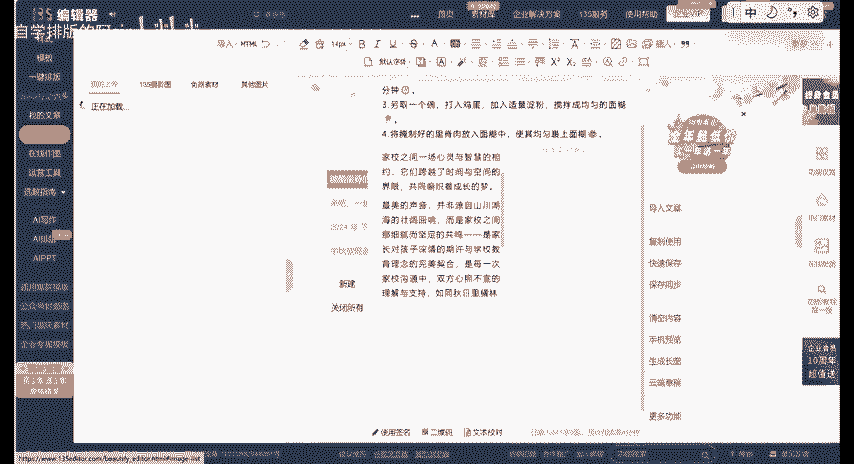

# 从0开始教你做公众号 ｜ 什么是布局功能？ - P1 - 自学排版的阿sir - BV1NfsieiERn

🎼hello，大家好，这里是从零开始教你做公众号的第14期。🎼这一期我们要一起学习的是如何在推文中使用布局功能，让我们推文的自由度更高。首先我们来看一下什么是布局功能。其实很简单。

就是把一整个推文屏幕变成了好几份。🎼大家看一下屏幕左侧，你可以通过自由布局选择，把屏幕分成三份，这三份里都进行操作，就相当于我们手机的分屏功能。🎼我们打开135编辑器，进入编辑界面。

先点击左侧工具栏的样式，接下来点击这个布局，选择基础布局。🎼在编辑器中有8个常用的基础布局效果，大家可以根据自己的需要进行选择。🎼我现在选择这个两个布局给大家演示一下。🎼选择了这个两份的布局。

就会可以在两个小屏幕里进行操作，一边放图片，一边放样式模板。🎼如果不选择布局的话，我们就可以看到还是只可以单个的进行模板操作。这个小图标就在正中间。🎼当然，这个布局也可以全放成样式、模板或图片或者文字。

这样我们就可以看出来布局最大的好处就是自由度很高。🎼我们再来和单个的布局对比一下。🎼当然，这个布局也不仅仅只能一边图片，一边文字这样玩，我们尝试一点更高级的。🎼先选择一个两份布局的，然后再点击布局。

选择一个上下滑动的布局。🎼然后找到这个这么多文字的模板，把它放进一个布局里。🎼这个就相当于咱们以前用的那些样式模板，把文字替换成自己需要的图片或者文字。

🎼我们有了这个滑动的效果之后，就可以在里面放一张长图。我们在推文里想要实现别人展示自己以前推文的时候，就可以把推文生成个长图，然后这样放进来。🎼右边这个直接放长途就没有这种滑动的效果。

所以要记得放进去一个滑动效果的布局。🎼但是需要注意的是，这种方法是一种简单实现滑动效果的方法。🎼更多效果和更正规的方法需要进入FVG编辑器里实现的。好了，这期视频到这里就结束了。

我们下期会一起学习AI排版，大家可以用屏幕上的二维码去兑换135编辑器的AI排版会员，喜欢我的视频，不要忘记点赞哦，拜拜，下期再见。😊。

