# 从0开始教你做公众号 ｜ 公众号标题怎么添加emoji！！后悔没早刷到系列 - P1 - 自学排版的阿sir - BV1SVp2eFEcb

，🎼hello，大家好，这里是丛零开始教你做公众号的第五期。上一期我们学习了如何用AI排版推文。今天我们要一块学习的是如何让公众号的标题更有趣更有创意。我们一起来看一下这几篇推文的标题。

它不同于普通的纯文字标题。这个标题并没有简单的用普通文字。而是结合文章内容加了一些小巧思，这篇也是同样在标题的热热热上增加了这种小符号，这种形式让我们的推文显得更加有趣，更加吸睛。

我们再看一下这篇在标题上出现了表情符号。那么这几种新奇又有趣的小符号，怎样才能增添到标题上，让我们的推文更出彩呢。我们一起来看看吧。我们先在公众号后台里直接在标题上输入表情。

但是当我们点击保存草稿的时候，可以看出来，当标题中出现表情是不可。😊。

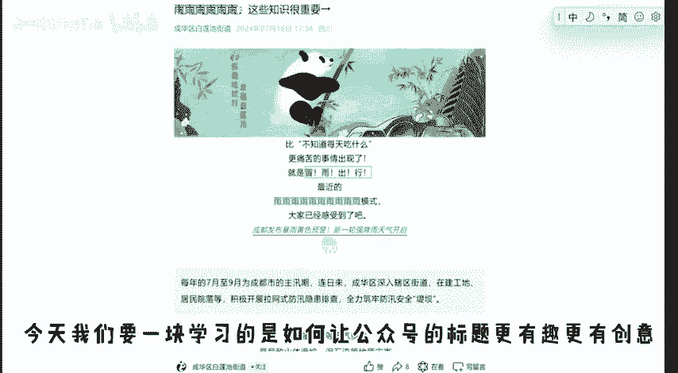

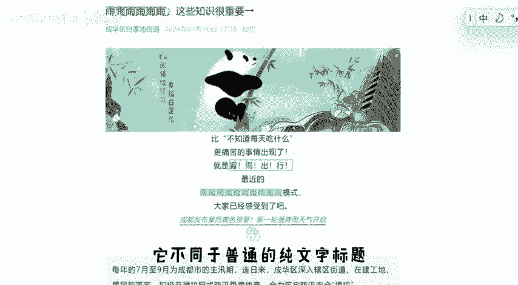

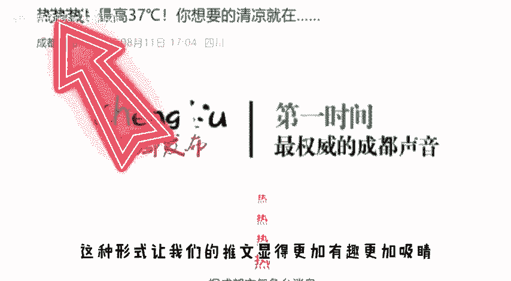

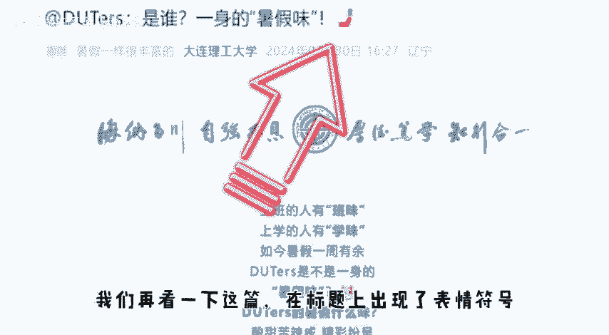

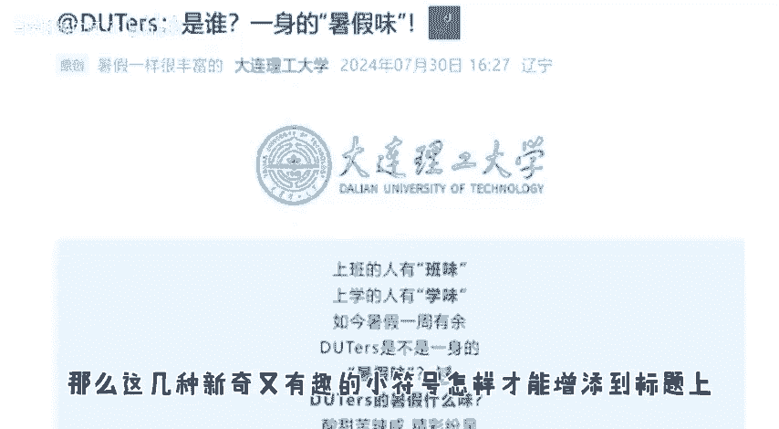

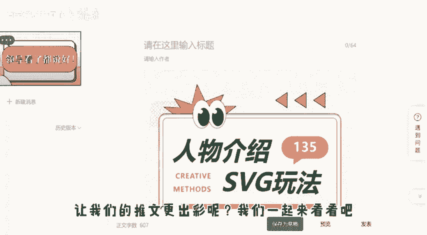

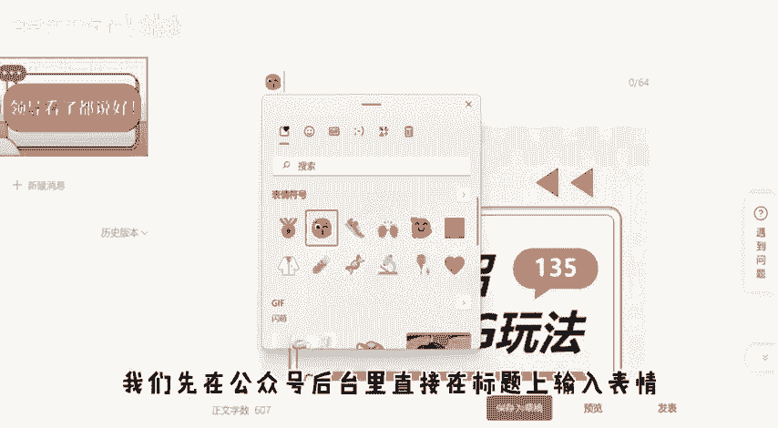

🎼保存下来的更不用说文字上的字符，甚至没有办法在键盘上打出来这样的效果。那我们正确的做法是什么呢？打开135编辑器，对这个编辑器不熟悉的小伙伴可以翻一下往期的视频学习一下。我们点击新建图文进入。

然后再左侧的工具栏里找到运营工具，点击后往下稍微翻一下，就会看到这个字符效果。刚才我们看到的那几种标题都可以在这里实现了。比如我们点击这个MOG标题，就可以拥有表情符号，直接输入文字。

然后挑选自己想要的表情，在点击复制就可以了。这里有非常多的表情可供我们挑选复制过后回到公众号后台，直接用电脑键盘上的粘贴键就可以了。点击保存草稿，也是可以正常保存的。我们再看一下其他的效果。

有字母变成小一号的数字转。

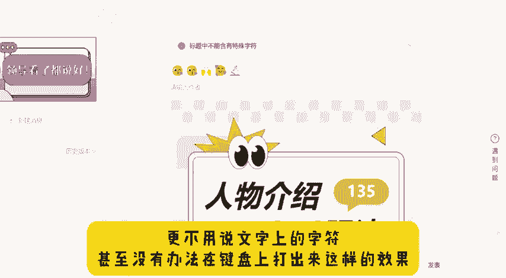

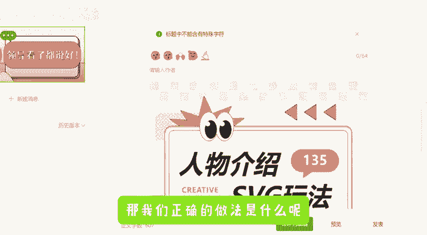

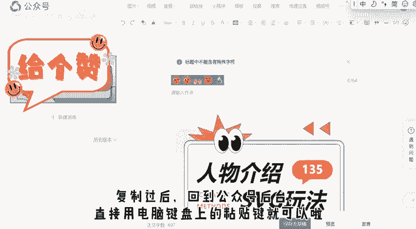

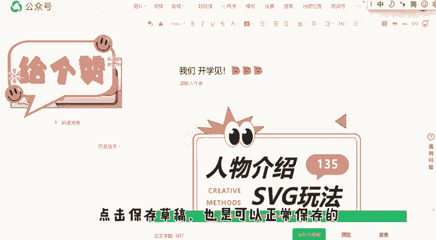

🎼成上标的这边都有效果的呈现。如果要是想要刚才我们看的那两篇热热热语鱼语的效果，就可以用这个文字出大汉来呈现，也是直接点击转换，在复制粘贴就可以了。其他的文字想要平常的那种，直接在后面输入。

也是不影响效果的，还有文字出小汉的效果也可以自己试一下，看看哪个更满意。当然了，工具栏里，其他的效果，比如文字转拼音简体转繁体，标题发芽，有风的效果都可以使标题更有趣。屏幕上也列出来几个样式。

大家可以参考一下，除了标题我们还可以在正文里应用文字颜色渐变，操作也非常简单，感兴趣的小伙伴快去试试吧。这些小细节能让我们的推文更加精彩。好了，这期视频就到这里，我们下期再见。

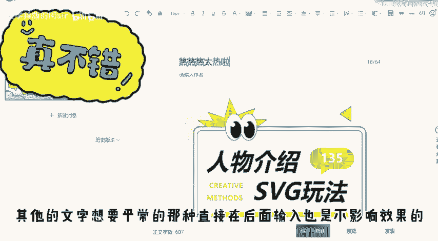