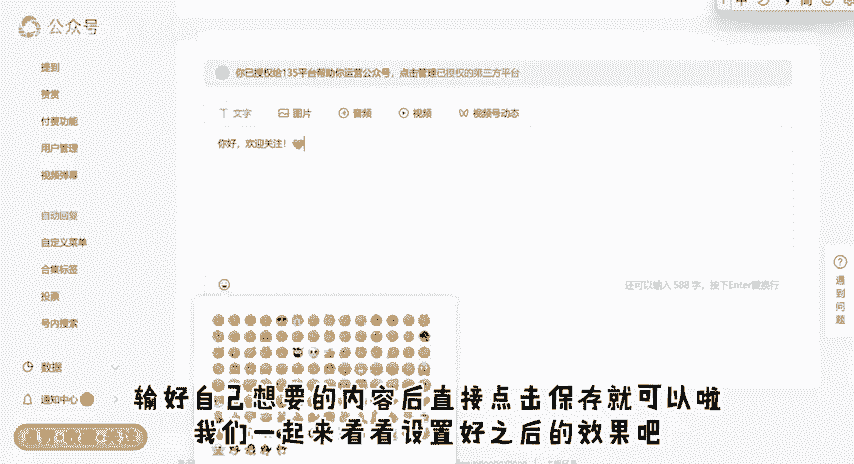
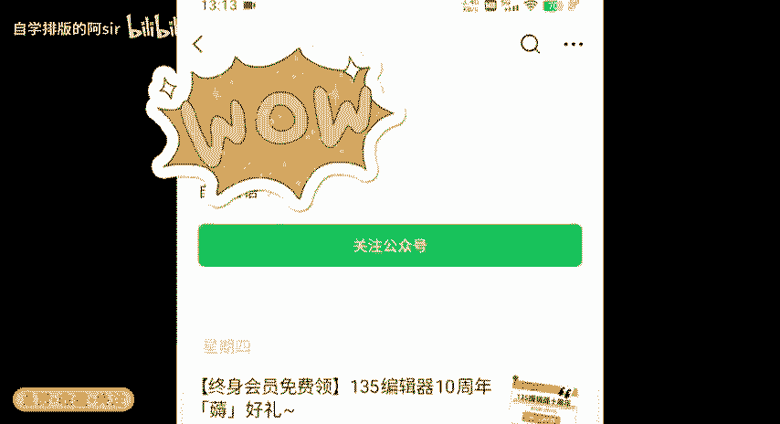
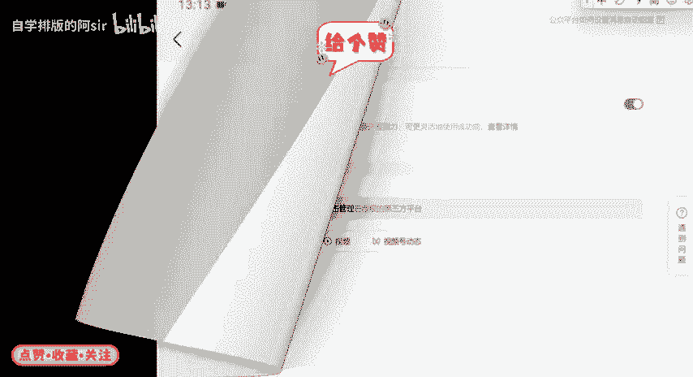
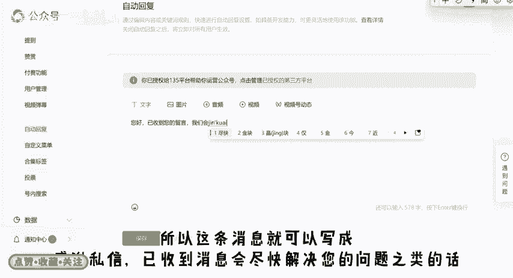
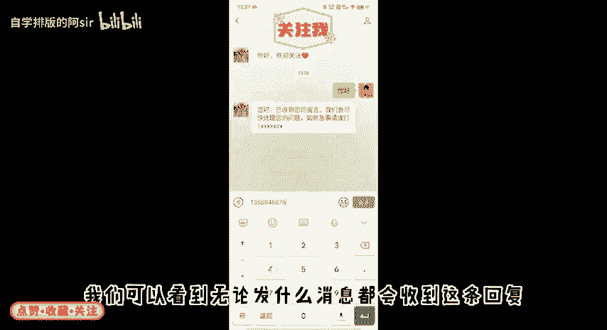
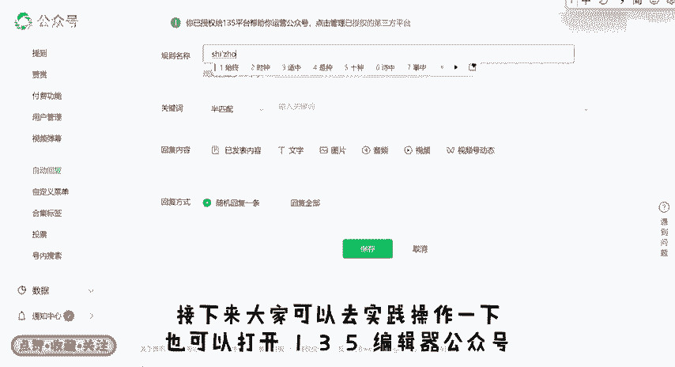
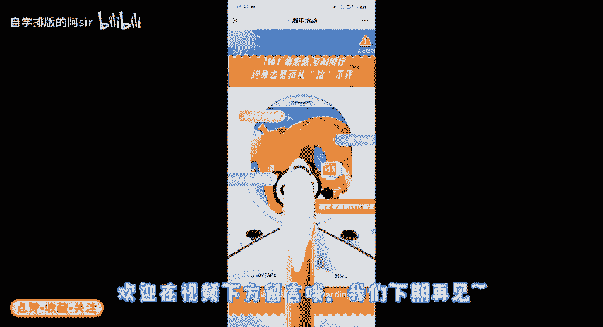
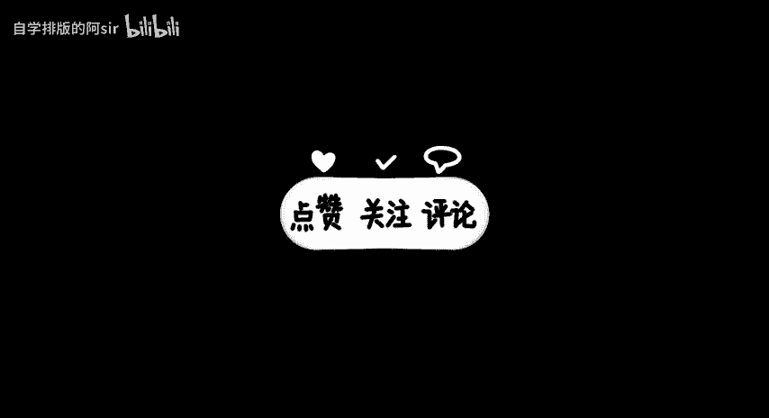

# 从0开始教你做公众号 ｜ 如何设置公众号自动回复 - P1 - 自学排版的阿sir - BV1BwpteRE89

🎼hello，大家好，这里是从零开始教你做公众号的第八期。上一期的评论里有小伙伴询问，自动回复里面的规则名称和半匹配全匹配的问题。那么这一期我们就一起来看看关于公众号后台自动回复的相关内容吧。

我们打开公众号后台之后，在左侧工具栏下滑找到自动回复。自动回复的意思非常好理解。就是当有粉丝在公众号后台私信我们的时候，我们本人可能无法及时回复消息。这个时候可以用自动回复来回复粉丝的留言。

自动回复分为关键词回复，收到消息回复和被关注回复三种。我们先来看看被关注回复，被关注回复就是当有粉丝关注我们公众号的时候，我们自动弹出来的一条消息，可以回复文字。🎼消息图片、消息、音频视频等等。

🎼但是需要注意的是，只可以设置一条消息，不可以同时设置不同的文字、图片等消息。说好自己想要的内容后，直接点击保存就可以啦。我们一起来看看设置好之后的效果吧。

🎼接下来我们看一下收到消息回复，这个就是粉丝在后台私信我们的时候，不论他的私信内容是什么，都会回复的信息。🎼所以这条消息就可以写成感谢私信，已收到消息会尽快解决您的问题之类的话。

当然大家也可以根据自己的需要灵活运用。我们一起来看看这个的效果吧。

🎼我们可以看到，无论发什么消息，都会收到这条回复。

🎼接下来我们看一下关键词回复，点击添加回复，输入规则名称，这个规则名称其实就相当于一个名字代号方便我们了解，分辨不同的关键词回复。因为关键词回复可以设置很多条。根据不同的关键词回复不同的消息。

这个全匹配和半匹配呢，其实就是一个小规则，全匹配是必须要准确的发关键词，不能多字少字错字，半匹配就是粉丝发过来一句话里面包含着这个关键词就可以没有那么严格。

比如我现在设置的这个关键词是135是周年会员免费领设置了全匹配，就是这一句话，必须完整正确的发过来才可以收到回复。这个关键词回复的内容，我们也可以选择文字图片，以前发布的推文等等。这里我给大家示范一。

🎼下回复以发表内容，点击之后选择推文，再点击保存就可以了。自动回复是不是很简单呢？接下来大家可以去实践操作一下，也可以打开135编辑器公众号。

🎼在后台编辑十周年发送领取十周年免费会员，不要打错字哦，一定是十周年。那看到这里的小伙伴，你知道这是半匹配还是全匹配吗？欢迎在视频下方留言哦，我们下期再见。

🎼。