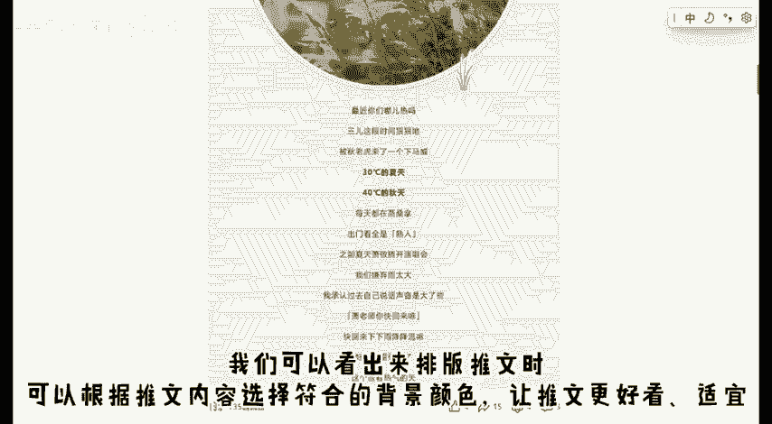

# 从0开始教你做公众号 ｜ 如何设置推文背景 - P1 - 自学排版的阿sir - BV1ZwpteRErk

，🎼hello，大家好，这里是从零开始教你做公众号的第1期。这一期我们要一起学习的是如何设置推文背景颜色。🎼推文背景颜色是什么呢？我们先看看下面这几篇推文对词一下。

🎼这篇推文在文字下面的背景颜色是黄色的，这篇推文的是蓝色的。🎼我们再来看看这篇，又是比较简单的灰白色的推文背景是随着推文内容在不断变化的。🎼这篇比较正式的推文，整体就是以白色为主。🎼这篇是豆绿色。

我们可以看出来台版推文时可以根据推文内容选择符合的背景颜色，让推文更好看适宜。那么具体应该怎么做呢？我们还是打开一35编辑器。

🎼对135编辑器不了解的小伙伴可以查看无往期的视频进行学习。在上方工具栏找到这个背景颜色设置。🎼就可以进行全文背景颜色的挑选，有很多的颜色可供选择。大家可以看出来，这里设置的是全文背景。

所以无论在哪里添加文字，底色都是我们刚才选择的黄色。🎼没有会员的小伙伴们也可以选择很多的免费颜色。免费颜色的选项也有很多，完全不用担心单调。🎼除了选择这些已有的颜色，我们还可以自定义颜色。

点击这个我的上传，就可以把照片上传成为推文背景，自由度更大。🎼我们刚才找背景颜色的地方就是135编辑器的工具栏，基本上大部分的设置都在这上面。所以当我们做推文时，遇到问题。

也可以自己点击上方的工具栏摸索一下解决方法。当然也可以在我的视频下方留言。🎼刚才我们讲的是全文的背景颜色怎么设置？现在我们一起来看看部分的背景颜色吧。🎼我先在这里打几个字，模仿一下我们排版推文的过程。

🎼如果我们只需要给这一部分添加背景颜色的话，只需要点击空白部分，让界面出现这个红框，然后点击右侧工具栏里的背景就可以了。接下来的过程和刚才设置全文背景颜色的一样，是不是很方便呢？

接下来我们再快速的看一遍，选出红框，然后点击背景，最后挑选颜色选择确定。好了，我们这期视频到这里就结束了。屏幕前的小伙伴有哪些不会的排版知识，可以在我的视频下方留言。🎼我们一同进步，拜拜，下期再见。

