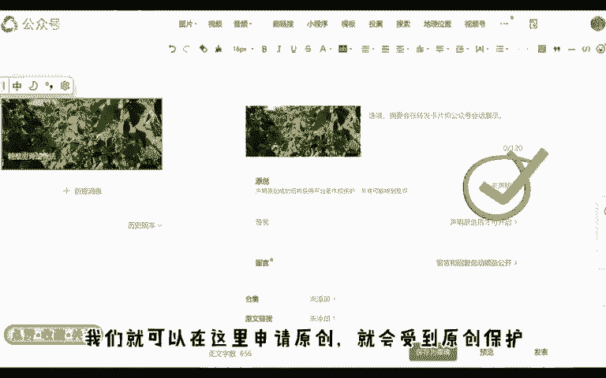
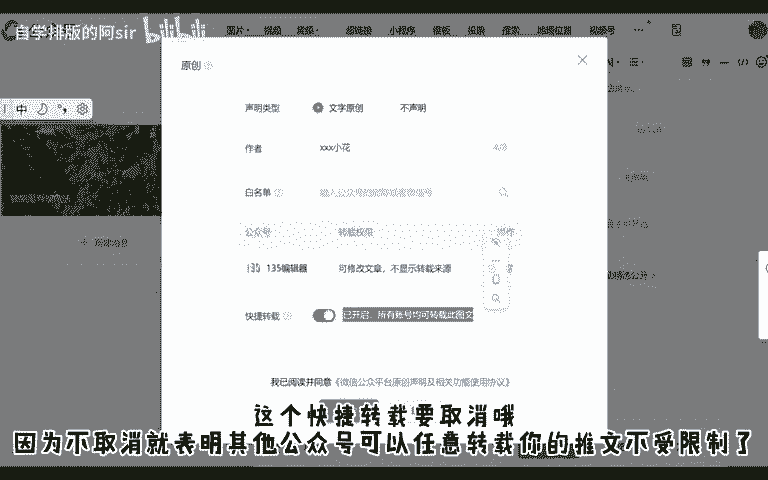
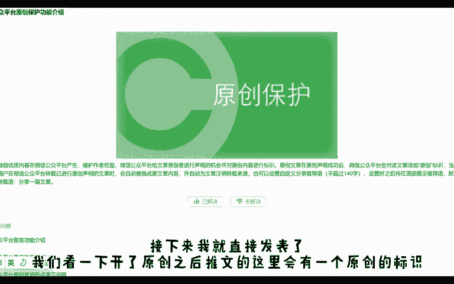
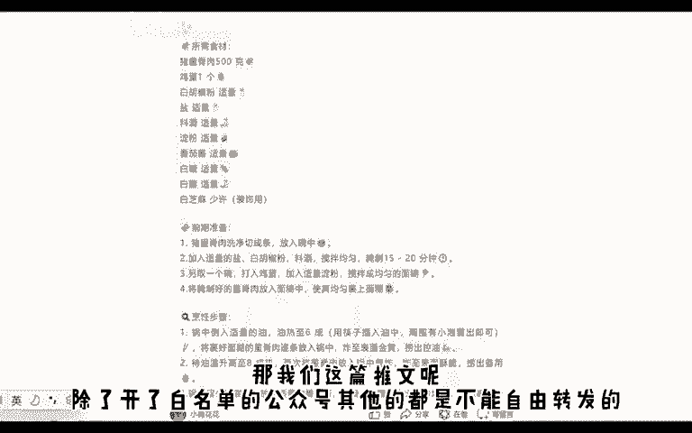
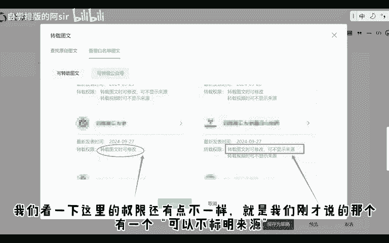
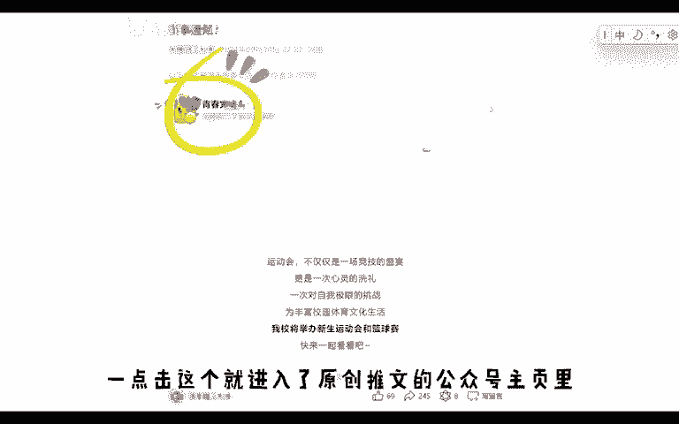
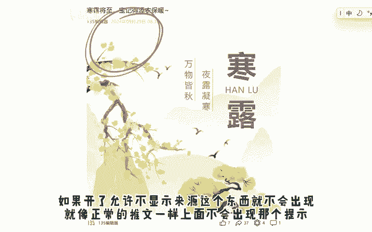
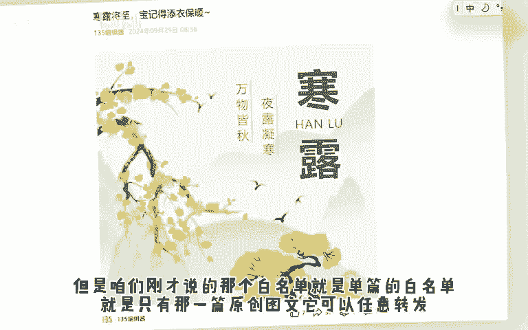
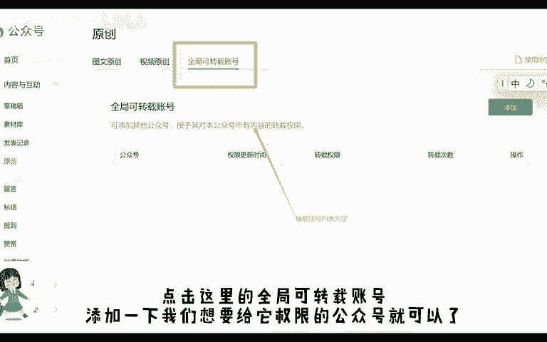
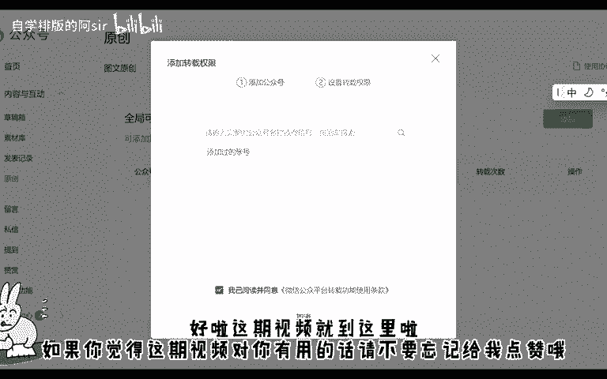

# 从0开始教你做公众号丨一个视频讲清白名单 - P1 - 自学排版的阿sir - BV1ww2tYuENb

🎼大家好，欢迎来到从零开始教你做公众号。我们在上期视频中留下了一个小问题。什么是白名单，怎么转发别人的原创推文。今天我们就来学习一下白名单的功能。首先我们准备一篇推文。这篇推文是我们自己原创的。

我们就可以在这里申请原创就会受到原创保护。所以这就是为什么我们转发别人的原创推文时会出现上期视频里的情况。而且在这里我们会看到申请原创推文的时候，只有文字原创这个选项。

这也就是为什么我们在上期视频里讲到，就算改了排版，也能识别到原创，申请了推文原创之后就要填个作者名字。大家这里可以随意发挥。但是这个有字数限制，只能填8个字。接下来就是白名单了。

在这里输入一个公众号的名字就表明我们允许这个公众号转载推文，而且不是以那种分享的。

🎼形式设置了之后，我们还要有个权限的设置，这个是设置的，可修改文章，就是可以改动。还有一个不显示来源的，这个我们等会直接看一下效果，也是一个权限。这个快捷转载要取消哦。

因为不取消就表明其他公众号可以任意转载你的推文不受限制了。

🎼接下来我就直接发表了。我们看一下开了原创之后，推文的这里会有一个原创的标识。那我们这篇推文呢，除了开了白名单的公众号，其他的都是不能自由转发的。接下来我们回到上个视频的转载界面，更清楚的看一下白名单。

这个里面的公众号，就是可以自由转载，修改我们的原创推文的。我们看一下这里的权限，还有点不一样。就是我们刚才说的那个有一个可以不标明来源。这是一篇转发了别人凯了原创的推文。别人凯的权限撕可以修改。

但是抹开那个可以不限丝来源的权限。所以我们看一下这里就有一个来源，这是公众号自动给你弄的，也没办法修改。一点击这个就进入了原创推文的公众号主页里。如果开了允许不显示来源这个东西就不会出现。

就像正常的推文一样，上面不会出现那个提示。

🎼但是咱们刚才说的那个白名单就是单篇的白名单，就是只有那一篇原创图文，它可以任意转发。如果有一个公众号，我们想让给他一个很大的权限。我们所有的原创推文，他都可以任意转发。

那难道我们要发一篇给他设置一篇的权限吗？这样难道不是很麻烦吗？当然有一个方便的方法。我们点击公众号右侧工具栏的原创，点击这里的全局可转载账号。添加一下我们想要给他权限的公众号就可以了。

这个公众号就可以转发我们所有的原创推文，所以当我们想要转发别人的原创推文时，就要联系人家，在评论区或者私信他们，给我们开一下白名单。好了，这期视频就到这里啦。如果你觉得这期视频对你有用的话。

请不要忘记给我点赞哦？

