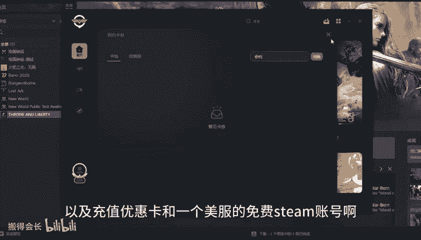
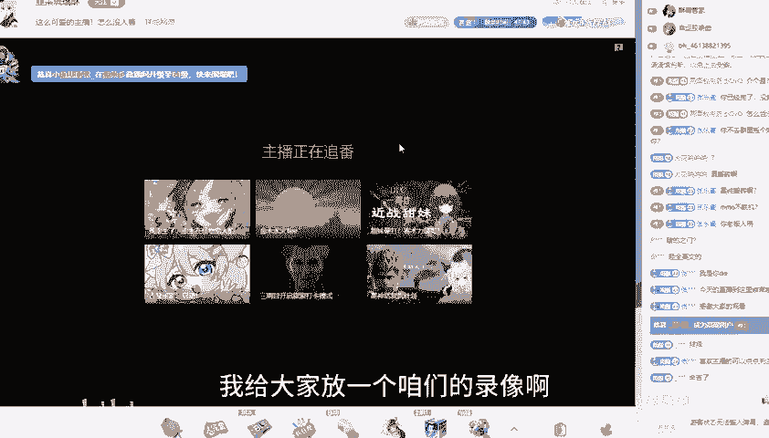

# 从亚马逊历史运营经验探寻《王权与自由国际服》封汉化问题 - P1 - 搬得会长 - BV1wbsfexEMZ

大家好，我是班登会长，王强宇自由国际服已经开服十多个小时了。我看群里边小伙伴升级快的都已经满级了，开始玩第二个角色了。好多小伙伴还在纠结萌新嘛，也没玩过，里边也也没有汉化啊，去哪儿找汉化，汉化会不会封？

今天我就给大家展开说一下啊，首先我使用的是汽油加速器里边的。截屏焊化啊，这个焊化是百分之百安全的。大家可以看到。它有两个功能，一个叫滑并分，一个叫全平分，还可以设置快捷键啊。使用这个功能呢它需要会员。

咱们打开汽油加速器之后，在首页口令卡件兑换输入会找。可以得到3天的免费会员以及充值优惠卡和一个美服的免费steam账号啊，还有一个翻译叫一键翻译啊，这个就是内置汉化啊，大家不敢用这个汉话。

就是因为这是汉话都传播有风险。

因为steam在之前的游戏里边确实啊有过这个风范化的教训。啊，对于咱们来说是教训啊，就是新世界这款游戏。但是在另外一款游戏，lot art这个游戏里边就是没有封过汉化啊，大家怎怎么用汉化。

内置汉化怎么用也没有出现封号的情况。可见，亚马逊封号，它并不是说啊就是百分之百用了汉化就封，它也是分运营团队的这个团队呢可能就是对汉化管控要严一点，你用了啊就可能会封你。那另外一个团队就可能没事儿。

那咱们这个王全也自由这个对应的他们的这个团队到底是什么情况。因为刚开服也不知道，而且现在都先浅伏嘛，花了200多块钱买的，这个就是要小心一点。到10月2号之后啊，你就可以大胆一点了。啊大家懂的都懂啊。

所以说到时候你就可以试试这个一键翻译功能，我给大家放一个咱们的录像啊，就是使用这个呃。

流程啊非常的简单啊，你打开这个提油之后啊，点击这个一键翻译工程。啊，然后再去启动游戏。他里边的。文字啊就会变成。咱们的国语。大家可以看到，这里变成国语了，就是这么简单。那汽油加速器呢？

低延池稳定连机亲热效果不错，加入器。大品牌老品牌在正式服上线之后，还会第一时间支持一键入库啊，还有它的专用界面里面。有ste登录修复功能啊，BD模拟器都非常的实用。所以说。这两天玩这个先遣服啊。

大家要慎重一点。那到10月2号啊，大家懂的都懂啊，可是能不想不想放开啊，就看大家怎么想的。毕竟呢你玩什么游戏可能都投入了时间呢，精力啊，里边是吧？嗯，如果说是某一天给你疯了。

确实是有一定的心理压力在里边啊，谢谢大家。