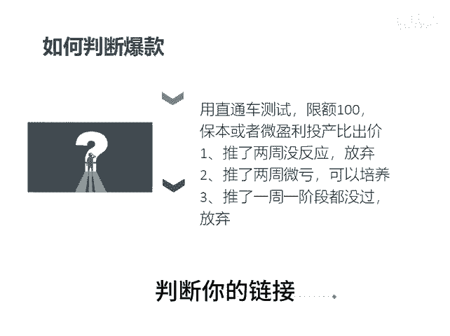

# 付费推广的作用 - P1 - 千优电商教育 - BV1oMxxe9Ev9

就很多人他对直通车有误解误解到哪里呢？他说以为数据不好，都是直通车的问题。其实我们知道直通车它仅仅是一个引流工具，就相当于你到外面去发传单，相当于你到火车站就拉客。那么当你拉来的客人不转化，那什么问题。

大概率是你链接本身的问题。就是你不要把责任都推给直通车，那直通车它有两个作用是什么作用。第一个就是加速打爆爆款。如果你有爆款属性，就你的链接本身不错，它可以加速，在另外它也是照妖镜。

就是你链接它本身有问题，或者你的商品有问题，你一开车数据不好，这时候你要考虑是你的链接的问题。那我们知道这个原理之后，那你一定不要强制培养一个产品成为爆款。因为培养的周期太长，投入比较大。

那我们在培养爆款之前可以用直通车测试一下，你限额100保本或者微盈利的投产比出价。如果一个链接你推了两周他没反应，放弃存两周微亏，这可以观察存了两周。😡。

卖的很好，那可以继续培养吗？还有些链接推了一周，连一阶段都没过，放弃，你不要死磕一个链接。直通车让它作为照妖镜，判断你的链接好还是坏。我是讲师大牙，欢迎大家扫码添加我的微信。

不方便扫码的朋友可以添加我的微信号，80221430。在这里给大家准备到了一套新手运营入门的大礼包，希望能够帮助大家。😡。

