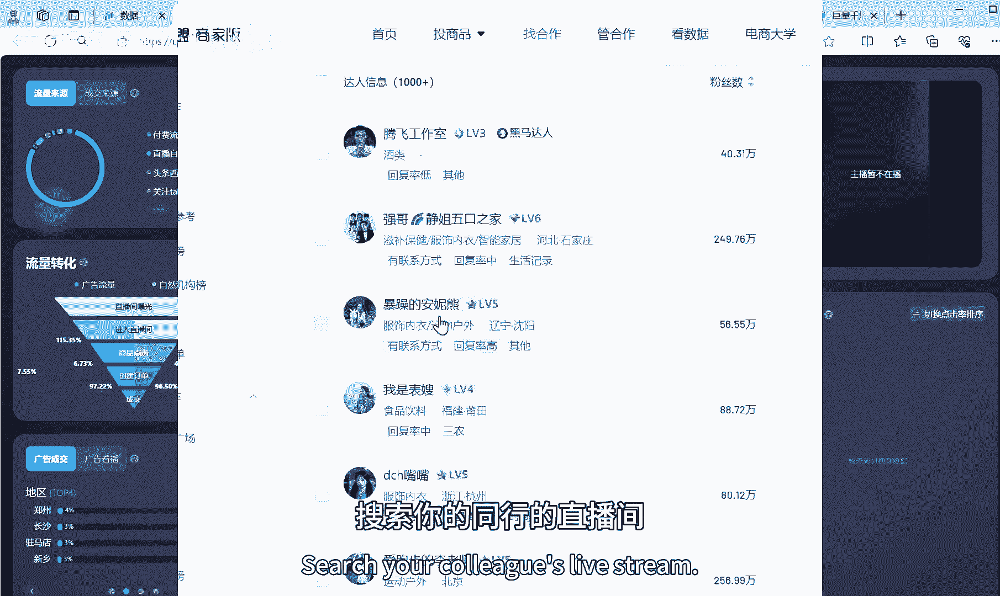
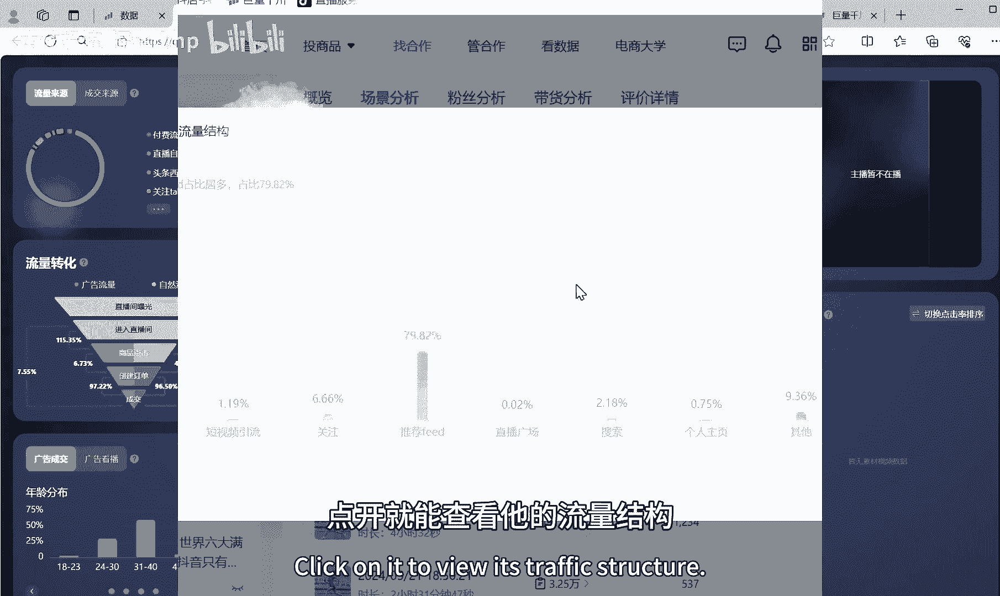
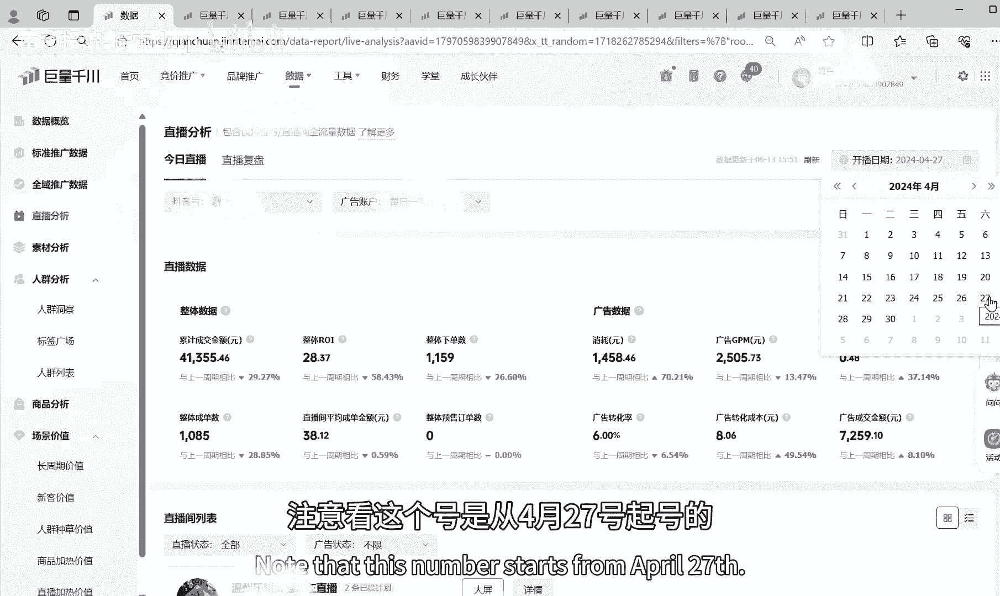

# 付费撬动自然流实操起号 2024年直播带货最快的最有效的起号方法！ - P1 - 南动投流-探索dmp - BV19D421M7A3

全网最真实最有效的千川付费，撬动自然流量打法，今天直接公布，全程劲爆无尿点，听到一句废话算我输，因为我看到今年很多做纯付费的商家，利润无限接近零，很多商家就是直接不挣钱，大多数都是在漂亮的单场GMV。

背后是大量的成本损耗，没有利润呐，然后呢放弃抖音直播不干了，今天我替平台最后挽留你们一次，聪明人听懂照做，今年依然在抖音上能拿到利润，但是这套打法并不是适合所有类目啊，只适合行业有自然流量的品。

我们从零开始讲，所以第一步怎么判断自己的品有没有自然流，打开精选联盟啊，然后呢点开达人广场，搜索你的同行的直播间。

点开场景分析，然后往下滑就能看到这个同行的直播场次，点开就能查看它的流量结构。

你用这个方法，你去查5~10个同行，如果这里的费的占比高，那么你这个行业是有自然流的，可以用这个方法，第二步起新号，我们直接上实战，注意看这个号是从4月27号起号的。

之前是没有开过直播的纯新号，这个是开播的，第一场时间是2024年4月27号，广告消耗3000块，广告RY1。29，整体RRY是1。35，没有自然流，然后到4月28号起号的第二天。

还是千川付费直接烧3000，广告投产1。54，整体投产是1。60，依然没有自然流起号，第三天也就是4月29号，广告消耗3127，广告ROA1。75，还是没有自然流起号，第四天。

4月30号广告消耗4000，广告投产到2。46，整体是2。54，依然没有自然流，起号的第五天，也就是5月1号，广告消耗是9300，广告RY3。33，整体是4。55，有一点自然流能转换了。

但是自然流呢还是会比较泛，在起号的第六天，2024年5月2号广告RY是4。41，整体是6。04，开始有自然流了，起号的第七天，也就是5月3号广告RY5。04，整体到了9。88。

然后正式起爆是在5月13号，广告ROY6。78，整体是55的消耗，这里的话呢是832，自然流量打起来了吧，如果你只看到这个界面的数据，你肯定会想说一句，这个本身有自然流啊，跟你的千川付费没关系啊。

我给你们是从第一场开始看啊，是没有自然流的，大概在半个月的时间，纯付费起号没问题吧，那么我们是怎么做的呢，首先我们可以看到第一场消耗是3000，第二场的消耗是3200哈，6000了，第三场是三千九千了。

第四场是四千九千加4000，1万3，13000+9000，那也就是在2万2左右，2万2左右砸进去的话呢，投产基本上都是亏钱的，整体也是没有多少自然流的，你们可能会以为这2万块钱是不是砸水里了呀。

这个投产这么低对吧，兄弟们，我问你们一个问题啊，直播带货的本质是什么，是流量和承接，对不对，我们再回过头来看到第一场，第一场的话呢他的GPM是808，第二场的GPM是1500，第三场的GPM是1300。

第四场的GPM是1600，你们想一个问题，在人货场没变的情况下，为什么GPM会越来越高啊，人货场没变，GPM越来越高，能证明什么呀，是的没错，流量越来越精准，所以你们会经常看到有一些做的好的直播间。

他们起号的速度特别快，一开始的时候他们就是纯付费，没有自然流，但是在一个礼拜左右的样子，他们的自然流量会越来越高，付费流量的占比会越来越低，但是他总会有6%到10%的付费占比，挂在那里。

这套打法在你新号阶段，讲白一点就是给直播间打上精准的标签，用付费直投计划直接打标签，你们注意看到啊，每一场都是直投，我之前的短视频里面讲过很多次，为了自己翻一下我以前的短视频。

为什么要打直头才能拉自然流，起号起的是什么，起号起的其实就是签字，签字能证明两个事情，一个是你的流量质量，一个是你的转化能力，而流量质量和转化能力是你做直播带货，接下来一切动作的底气所在，因为再讲一遍。

它能代表你的流量质量和人货场的转化能力，兄弟们，所以起号你不用看投产，只要他的签字在递增，你直接烧就可以了，你们忽略了一个问题，抖音是一个倒三角，它是先有承接才有推流，然后你们注意看啊。

4月30号是没有自然流的，真正有自然流的开始是5月1号，5月1号广告RY是3。33，整体是4。55，自然流量有56%，稍微能转化一点，自然流量是怎么出来的，为什么这一场要烧9300，是成交密度呀。

哥哥们，但是你要做成交密度的前提，是不是流量质量和转化能力嘛，下一场也就是2024年5月2号，广告消耗是2100，整体投产是6。04，那很多人就要讲了啊，你这一场的话，整体投产是因为上一场烧了9300。

他的回流还不懂是吧，不懂，我们再看到5月13号，5月13号广告消耗832，整体是55，广告投产是六，我们再看下一场，下一场5月14号，5月14号，整体是68还是回流吗，兄弟们，自然流量有没有打出来。

兄弟们，如果你对这套起号方法有兴趣，那么在我的抖音主页置顶的第三个视频，我讲的非常非常详细，这里我就不讲第二遍了。

