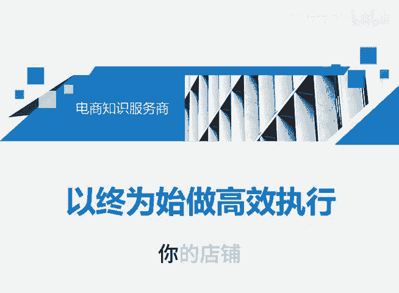
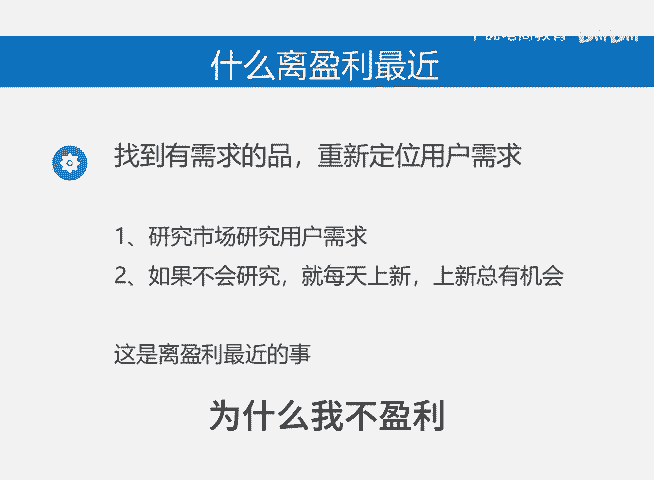

# 以终为始做高效执行 - P1 - 千优电商教育 - BV1mBmPYJE1e

你的店铺为什么不盈利？就是因为你没做接近盈利的事情。如果你的电商要盈利，那就做和盈利有关的事，多余的动作一个都不做。那什么样的事情和盈利有关呢？举三个例子。第一个就是大家做的评价和销量有意义吗？

大部分是没意义的。为什么你这个链接它能不能盈利，投产比如何，你都不知道，然后呢你先做了一些销量，这个动作就是多余正确的做法是先做链接测试，放到直通车或者报上活动，把接近盈利的链接爱做销量。

这样呢你省去了很多步骤，而且做销量还有可能让你全店的链接都关小黑屋。那第二个就是对于链接实现盈利，大部分人做的更没意义。我们知道直通车是单量越多，它的扣费越低。很多人开车就设置日线，因为多了。

才觉得亏吗？而且做了他觉得投入比较大。所以当你做了每天100或者200这样的日线，你的单量不能提升，不能提升呢？那么系统的扣费就不能降低。所以你接近盈利是越来越远。😡。

正确的方式是前期做日线额的递增，随着单量不断的提高，你的单笔成交花费会降低。然后呢，随着单量的提升，你也有更多的托价空间。那第三个就是很多朋友他找到的产品，或者说他对产品的理解本身就不能够盈利。

别人做什么，你做什么？其是你需要找到一个他有爆款属性的商品，或者你要做重新的用户定位，你要研究市场用户的需求。那很多朋友他不会做呢，不会做，我就建议你每天上新，因为上新总有机会，这才是接近盈利的事情。

每天做销量，然后出评价，开车持续开车持续亏，然后还嗷嗷叫说为什么我不盈利，那些都没用，我是讲师大牙，欢迎大家扫码添加我的微信，不方便扫码的朋友可以添加我的微信号，80221430。

在这里给大家准备到了一套新手运营入门的大礼包，希望能够帮助大家。😊。

