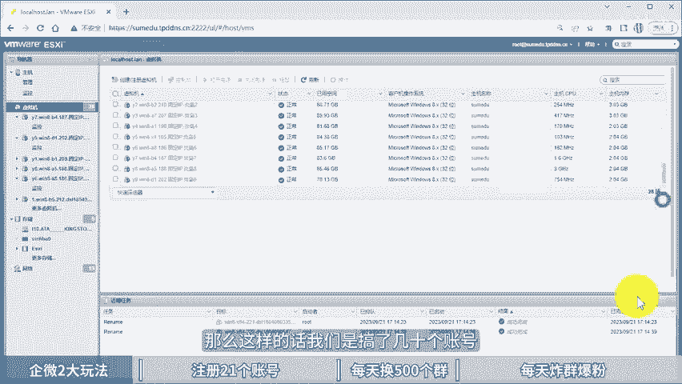

# 企业微信营销获客系统，1个人玩20个号，每天加6000人！ 企微私域运营，企微如何去做私域，企业微信使用教程零基础，企业微信使用教程，企业微信营销管理系统，企业 - P1 - 黄一恒矩阵推广引流 - BV1Yw4m1Y7G3

🎼一个人能玩20个企业微信，每天能加6000人，我们公司合伙人只做企业微信打粉，一做就四年。现在每天能家6000人，真不可思议。具体怎么做的，季节废话，一个视频教会你企业微信营销获购系统。

一个人玩20个号，每天加6000人，视频有点长，记得先收藏，一起来看我告诉你起微的两大玩法，如何注册201个账号，每天换500个群进行炸情爆粉推广。首先来看起微的两大玩法，我们可以做炸群推广。

20个号加上4万个群，每天在群里面轰炸两次广告，或者做爆粉，每个号每天能够发送300个好友请求，我们准备20个账号，每天就能够发送6000个好友请求。这里面咱们在做的时候，是以量起升，量变才能自变。

如果你的号比较少，群比较少，好友请求比较少，效果呢也会大打折扣。如果咱们单独做。

这个炸群推广，它是不占好友位，也就是我们不需要单独买好友的坑位费也可以玩。一起来看一下我们是如何操作的。这是我们目前正在操作的企业微信集成推广。我们是自己架购的服务器开设了20多台VPS。

也就是虚拟机来进行操作，节省电脑资源。我们打开来看一下啊，比如这一台我们打开之后可以看到，目前正在通过软件进行一个诈群推广。目前这个企业微信里面一共有1900多个群。我们配置好之后。

只需要在软件里面就可以实现一个自动的进行诈群推广。每个VPS里面我们会挂2到3个企业微信。20个VPS就可以挂40到50个企业微信来进行推广和宣传。好，比如这一个里面目前就是挂了两个企业微信。

然后来配合软件，正在进行一个自动的啊诈群推广。好，这个也是目前正在发送到84个群。这些我们都设置到定时，每天只需要那么维护一下软件，它就会自动的去进行一个诈群推广。

那么这样的话我们是搞了几十个账号加起来有上万个群。那如何注册21个账号。首先我们需要准备一个注册的主体，可以是个体户营业执照，也可以是企业的营业执照。个体户大家可以直接在某宝上面花200块钱就找人办理。

也可以到当地直接出点工本费，自己跑腿，也是可以办理的。当我们有了注册主体。接下来我们需要去注册企业微信。第一个账号默认就是管理员账号，管理员账号它是用来创建和添加员工账号，建议大家不要做任何营销操作。

管理员账号一旦出现异常。你这个主体直接就封掉了，相当于就没办法。

再往下进行操作啊，员工号出现问题，我们换一个员工号继续可以操作。那么第三个，我们需要准备20个操作的员工账号，需要去购买20张林业主注册卡，这个大家也可以直接在平台上面进行搜索。

差不多价格在5块钱左右一张，买20张呢需要接近花100块钱，一个人可以使用5个账号，如果你搞20个账号需要找4个人进行实名，正的实名，它和个位是不冲突的，各位和起微，我们各可以什么使用5个账号。

同时我们在操作的时候，需要准备至少是其他手机，那么手机呢目前我们用的比较多的是这个红米note8或者pro。那么350到400之间，红米 noteote9或者pro。

那么价格呢在这个450到500之间配置都建议大家购买这个6加64G的配置以上，配置太低的话，操作起来会比较卡顿。那么你也可以直接购买这个像比如说摩托罗拉有一些手机，可以直接开6个，但是价格呢也比这个。

要稍微贵一些，为什么推荐红米手机给大家？因为他一台手机至少可以登三个账号，不接入任何软件。我们给大家投屏演示一下。比如说我们打开手机在手机上面设置，找到应用设置，往下方滑动，点击应用分身。

在这里面我们直接勾选企业微信就可以开两个出来。接下第三个怎么开呢？我们找到隐私安全，往下方滑动，点击这个叫做手机分身就可以创建一个手机子系统，在系统里面又能够单独安装起微，又能什么多开一个一台手机呢。

可以登3个。刚好我们这个配置呢，基本上能够满足我们的基本需求。当我们有了账号之后，接下来还需要养一下常用IP和设备，至少要养两周以上，如果你直接拿过来操作，基本上都会异常，甚至直接就挂掉了。

那么起微呢它是不需要换IP的。不管你搞多少个账号都可以直接连接一个wifi，因为我们需要养常用IP所以这个点的话还算是比较友好的。不像各位需要把它分开，否则呢容易被关联。当我们有了账号。

接下来需要每天切换500个群，怎么换群，分为三个步骤。第一步，我们需要去买这个种子群。种子群，如果你加了群里面有很多人都提供这个服务，一般价格在200块钱，200到500个群。

实在找不到的同学也可以找我。不过呢是有偿的。另外当我们有了种子群之后，接下来在群里面就会有大量的人，他们都在换群，你找他们换就可以了。群里面有N多换群的，一般群换群的都是500个群换500个为单位。

也就是说你找一个人换，立马就能够裂变出500个群出来。每个号建大家放什么1000到3000个群。也就是说每个号你需要找2到6个人进行更换。那么在换的时候，如果号手动操作的比较麻烦。因为我们在换群的时候。

首先如果别人找你换，你需要去什么，拉别人进群，别人拉你这个你需要自己同意500个，说实话，点击起来还是比较费时间。所以这里面一般我们会配合一个软件，他自动的有人拉你，他就会自动的进群。如果你需要拉别人。

可以直接通过软件一键就能够发送500个请求过去。不过呢这个是有时间间隔的，大概你等个半个小时，一个小时哎，就发完了。发完之后，那么我们就搞定了，就不需要纯手动去点。因为纯手动点的话。

说实话这个工作量呢其实还是比较大的软件呢，大家可以单独找一下。这种软件一般价格在300到600左右，实在找不到呢，也可以来找我，我还能给大家一个优惠啊。好来正常不是卖软件，只是给大家分享方法。

当我们有了群之后，接下来就可以每天做这个炸情爆粉推广。首先每天可以炸4万个群，那4万个群怎么不要炸？比如说每天上午和下午可以在群里面轰炸一波广告。那么手动群发比较慢，这里面呢咱们还得配个另外一个软件。

这个软件呢叫商旗入手，跟刚才换群的不是一个软件，它能够实现一键挂机群发，我们只需要选择群发的成员，比如说勾选500个群，1000个群，然后呢添加上内容点击开始之后，软件自动就帮我们进行发送。

那在发的时候，有的伙伴说，那么被踢了怎么办？好，被踢了之后呢，我们可以。不用管，因为每天都会被踢，我们只要每天换500个群，哪怕你一天被踢了300个，你还得到了200个群。

所以换群的速度永远是比别人提群要快。毕竟我们一次换就可以是以500为单位的。那么第二个呢，每天要报6000个人，6000个人怎么报，他比较适合做一些比如说你加了行业群地方群或者说是什么宝吧群交友群。

车友群，这种是细分的群可以直接报。另外如果你做的是受众比较广的产品，范围的转换，那什么群都能加。反正有群咱们就进进了之后直接开报。每个号每天能发送300个左右的好友请求，20个员工号。

每天合计就能发6000个好友请求。那这里面咱们在发的时候来，说实话，如果你靠手动操作起来，其实也是比较辛苦的。最好是能够配合上软件。就刚才给大家讲这个商情助手，这个软件呢，他只需要勾选上。

比如说我们勾选上这三个群，然后呢，点击开始之后，那么这三个群加起来又有000多人，他就直接报了什么。给00多个人，不过咱们一个账号来报不了这么多，一般购一个群就可以了。每天购一个群换着来就行了。

这个软件大家可以找找啊，价格呢一般都在几百块钱，实在找不到的也找我，我把我的软件分享给大家。只不过呢是有长的，提前讲清楚。那当我们学会了这个企微大概的框架，一些细节东西啊。

因为咱们没有办法在这里面给大家演示视频做太长，大家也看不了，也看不完，也没有耐心。所以呢我们有单独的2到3个小时的一个系统课。😊，教大家如何玩好起飞。比如说起微的流量属性。

推广流程、养号流程、软件配置以及怎么做群页变，这些课程都是免费的，可以直接通过主页来找我领取。当你通过免费课程做好之后，你想升级打法，那我们也给大家准备的这个付费的课程。那付费的课程呢。

同样的也是2到3个小时。然后呢，他有打卡作业，有打卡视频，有老师指导，还有前套资源实战演示，也可以通过主页找我来来获取这样的课程来进行学习。好的同学，我是黄一涵只做落地推广方法。

刚才咱们学习的企业微信营销获个系统。如果咱们想做好实意，做好起微，还得让更多人来加你怎么做呢？这里面我给大家准备的是8个平台的详细打法，教大家如何布局多流量管道。这些呢都是原创的。

可以通过主页来领接进行学习。如果觉得今天视频比较不错的，请大家一键三连，感谢大家支持。咱们下个视频呢再会。

