# 住宅IP，怎么买最划算？性价比最优方案，不到1美金每月｜批量搭建20个高质量住宅IP环境｜高质量原生住宅IP购买与筛选｜⭕️跨境电商／海外社媒运营必备！ - P1 - 红孩儿Redman - BV14RxMebEBi

OK这样我们就成功打开这个代理IP了，一个双SP的，而且是非常优质的住宅IP6美金1个月，然后可以有20个。这个这里就是我们导入的10个环境。

这个适合于外3撸毛自媒体的矩阵和多店铺的运营免费的住宅IP很多人共享根本没法用。平台购买的住宅IP软件一侧，风险值太高，担心被封纯净独享的IP1个月299起也太贵了吧。

如果你想以最实惠的价格搭建高质量的网络环境。住宅IP的清洗和筛选就是必不可少的。

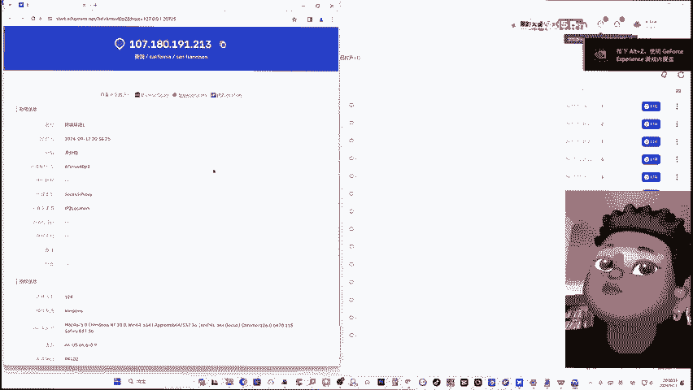

🎼分享知识网络造富，我是readdman，这是一个专注数字科技的频道，每周更新最硬核的网络技术，最新的跨境电商技巧以及最赚钱的网络创业项。如果你也想透过零成本网络创业，为自己每月带来上千美金的被动收入。

请一定订阅redman的频道，并打开小铃铛。本期视频redman将呈现全网购买住宅IP性价比最高的方，如何在不到1美金一个的价格配合指纹浏览器，批量搭建十几个高质量的住宅IP环境。

TK自媒体矩阵亚马逊多店铺运营we3撸毛仿女巫必备。主要是用于多账号，无论是自媒体还是亚马逊店铺里营，还是we3，你批量账号的注册和交付。单账号运营的购买和配置呢可以开man这一期视频。

另外几种网络环境，刚才也说了场资源节点都无法适合于这种权限要求和风控要求比较高的场景。IT呢如果你批量账号像自媒体也好，亚马逊店铺也好，web3也好，都需要10个以上的这种账号。你用呃质量这么高的。

200块钱一个月的产品就很不划算。平台类购买的问题呢就是单一节点的这种平台呢，它30都是一个，但是呢不一定适合，而且你的质量也不一定高。而且你这个价格即使是买10个20个的，你也成本其实挺高的。

那么还有一类平台呢就man之前讲境外IP的这种零售商，其实除了像IP word这种单一IP供售卖的。还有像今天我们主要介绍的sha这种批量的，可以购买境外静态住宅IP的。厂商。

那么这种厂商的IP呢它是随机分配给你，可能是20个起订。那么我们今天要做的教程呢，就是如何将这20个里面质量并不好的IP全部的清洗和替换成质量好。如果你花6美金买到20个里面有一个或者两个质量可以的。

如果我们经过这样的清洗和筛选，提高到十四五个，那你的单价就可以在一美金以下。进行清洗，然后就要知道什么样的IP是我们能够进行使用。针对风控比较严格的，比如说tktok的运营或者亚马逊运营。

我这里呢推荐这个IP评分工具，叫IP检测，这是我们国内的一个网络工程师开发的专门针对TK电商还有境外的自媒体运营开发的。那和其他的像我们之前介绍的IP付相比呢，它会根据这个IP的纯净度。

以及原生网络用户特征来进行分析。最重要的一个呢就是它可以检测出这个IP是否在TK或者是facebook的黑名单里。好，我们只需要复制这边获得的IP节点，它就会进行检测，然后给我们一个报告。好。

这里一看是显示的是不建议而且是多用户共用IP机上IP容易被关联。

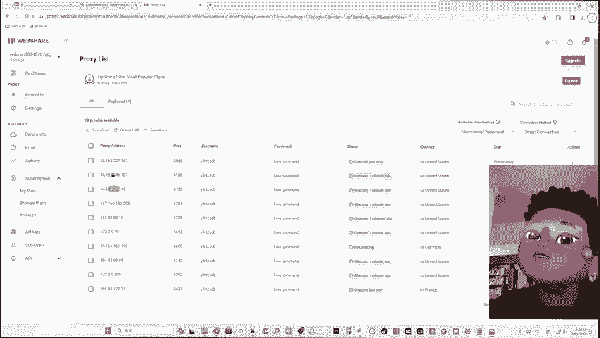

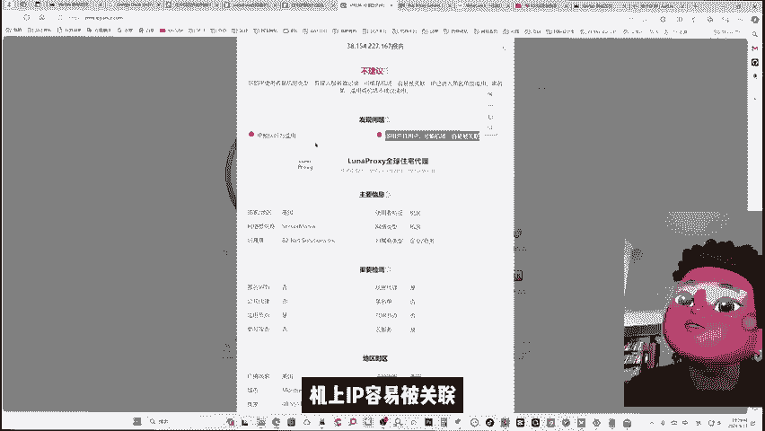

首先来到我们网站来进行一个IP的购买。我限量网站就是这个样子的啊，注册登录呢，我们直接用谷歌的邮箱账号就可以登进来了。登进来之后的话，我们可以看到它的dboard。然后我们点击这个代理列表。

它会免费的赠送我们10个，这都是静态住宅的IP可以直接使用它进行测试。但是呢这个因为都是多人使用，所以说它的呃质量要求以及风险评分应该就不是那么好。嗯，我们可以试一下，这所有10个里面。

大概率其实是不太行的所以说我们还是要考虑付费购买。因为这种免费的也有可能会有合适的。但是呢如果你找到的话，你也可以先免费的用一下。但是因为它不是一个独享的状态，所以说很多人共用的时候。

这个IP也会被污染。你现在觉得这个IP质量还行，后面你运营账号做起来了之后，你发现这个不行了，被封控了，这个也很麻烦。就是我们要来到这个它的付费产品，以击这个浏览它的计划。

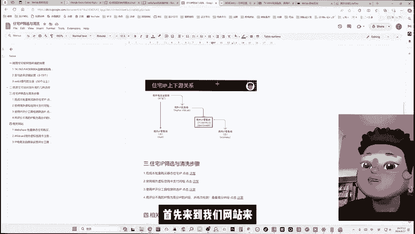

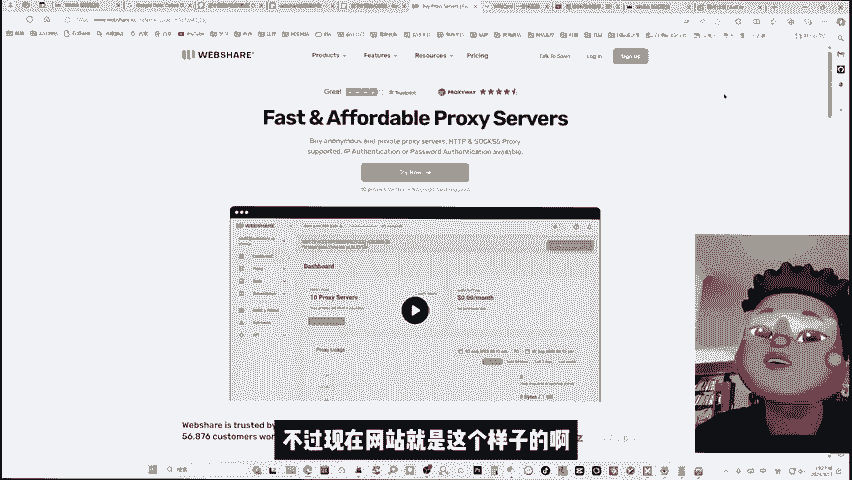

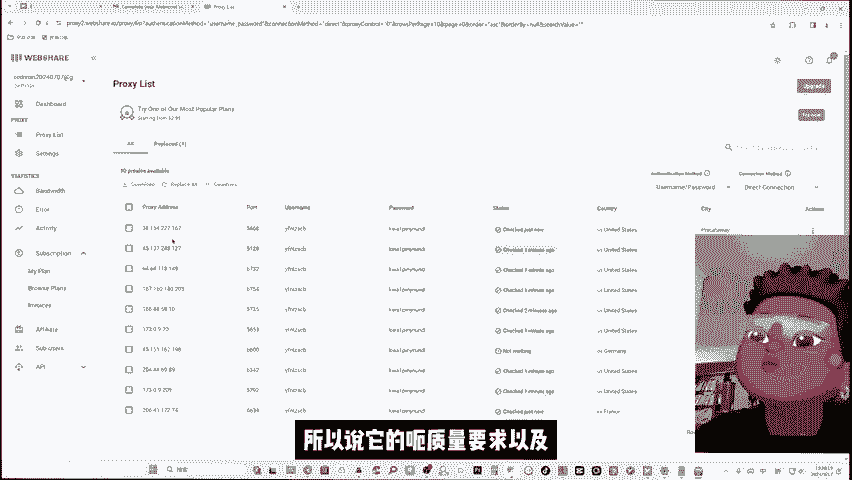

然后他提供4个产品啊，我们这里呢考虑到最佳性价比的选择，我们就使用这个静态住宅。静态住宅呢我们往下滑。我们首先100个其实有点多了。如果你是k的矩阵或者是亚马逊的话，20个就够用了，除非你是3的录空头。

你可能需要50个以上我这里就演示20个。然后这里过境流量，我们选择250G，然后就可以看到它的一个费用就是6美金，相当于呃40块钱人民币。

这个就和你在ip to word或者是c里面购买一个单一的静态住宅IP的价格差不多，它都是也是一个月。但是呢它会给你20，我们大部分的美国Tk电商都是用到美国，所以我们就选美后我们这里点击继续。

然后另外要注意的就是我们要把这个inid replacement这里选择一个比较大的基数。这个意思呢就是来更换它给我们的IP因为给了20个IP都是随机的。

所以你这20个里面大概率会有1到2个是可以直接拿来使用。但是呢为了提高我们的性价比，让我们这个6美金花的更值。所以说我们要一个两倍于我们购买IP数的替代次数。

这样的话就可以让我们这个计划能够更提高我们的价比，我们50次大概率能够换成当然也看一点点运气啊，50到100次。我觉得大家如果是觉得自己呃连比较黑啊，那我们就选100次也O的。

然后这个替代的费用其实并不是很高，50次的话，它只加了0。6美金。如果是100次的话，就又加0。6美金左右我们先试一下这个50次的。然后这里点击继续。然后这三个呢我们不是用的是很上。

因为呃云店铺本身你的流量不像做直播。如果你做直播的话，你可能需要一个高流通的高带宽的一个网。然后如果是不做直播，只是做运营的话，就没必要了。我们点击这个继续。然后就来到它的付款页面，付款页面这里说一下。

它是需要境外的这个信用卡ma卡visa卡。然后如果你没有的话。

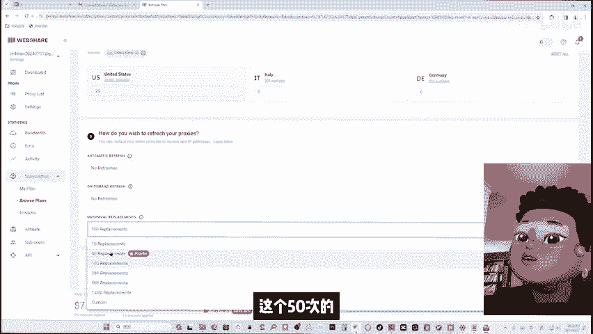

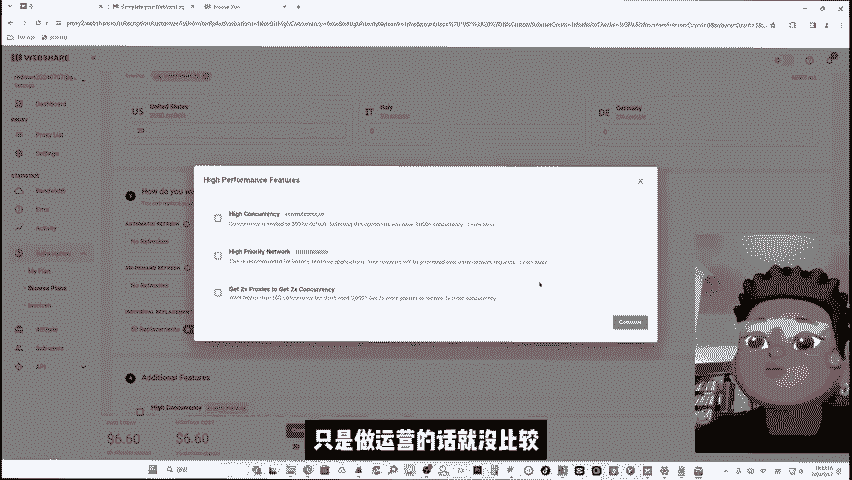

就推荐用这个虚拟信用卡来支付。这个也是我们国内的一个厂商的产品。然后像虚拟的这种美国的信用卡有挺多的，它用来开通各种境外服务都比较方便。然后我们只需要用支付宝充钱到他的账户余额里。

然后他会给我们一个美国的虚拟信用卡的信息填到那个网站里就行了。这类似的产品其实挺多 carno派，还有这个封面 pay都有。然后runman这里使用下来的话。

就还是觉得这个wel card的产品还是不错，费率的话也是相对比较低，推荐大家使用啊，点击这里的登录，先切换一下这个中文显示，它这个网站用国内的手机号就可以直接登录。好，我们登录之后呢。

我们可以直接点击去使用啊，这里会来到我的卡片这里啊，我们首先要把这个服务费付掉。它会才会给你开卡。然后这个服务费是两年的。

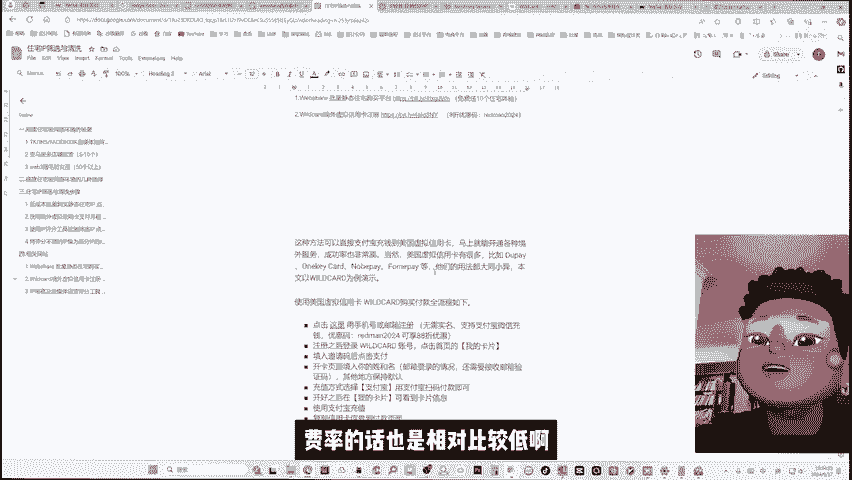

智里。输入redman的。优惠码。然后这里看到可以少2美金的一个服务费啊，点击支付，嗯，它就是一个支付宝的支付方式。

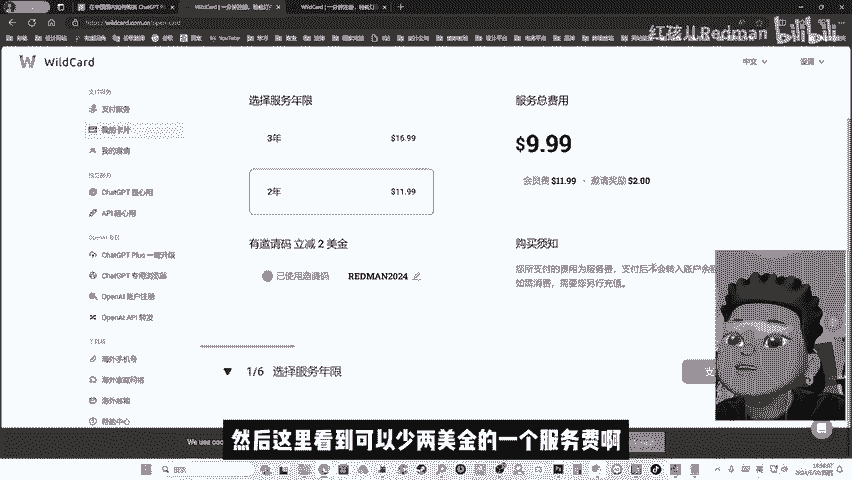

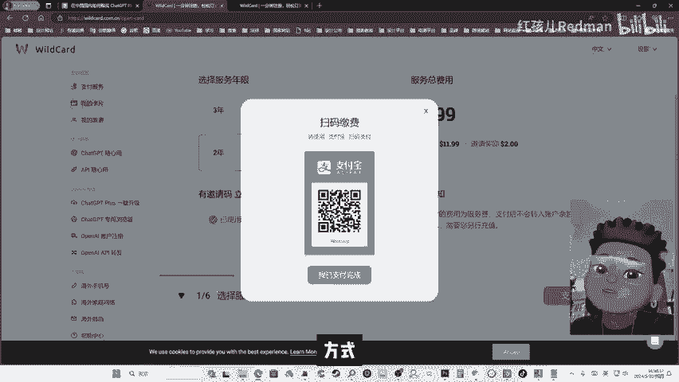

OK我们支付完成之后呢，他会让你去填写姓名。O我们看到他每个月如果不使用人脸认证的话，它限额呢是100美金一个月啊，其实应该也够了。O很快它就开通了。

然后它右边会帮我们直接生成一组这个美国的免税周的地址，然后左边这些呢就是我们可能需要用到的虚拟银行卡的信息，包括卡号有效期。我们的CVC以及姓名。我们充好值之后呢，来到这个我的卡片。

这里就可以显示我们这个卡片的信息了，然我们把这里的卡号有效期姓名，还有我们的CVC安全码都复制到我们刚才的这个we share里就可以点击这个订阅了。O我们支付完成之后，点击订阅。

它就会从我们这个卡片里进行一个扣费完成之后呢，我们需要等待一会它来进行这个配置。然后配置完成之后，就点击这个查看我们的代理列表，这里就。

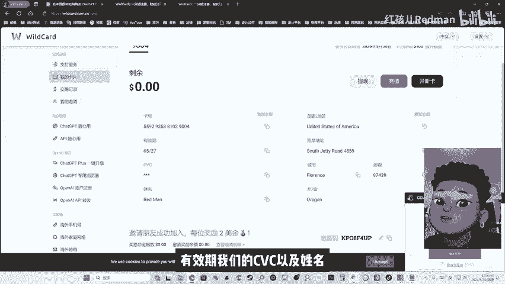

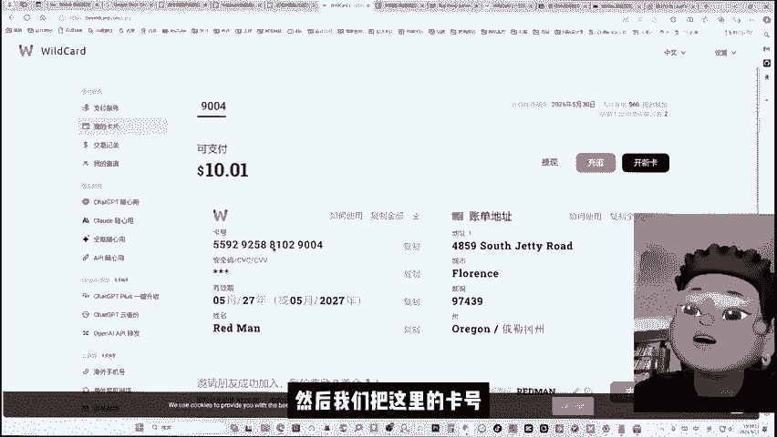

就是他已经给我们分配了的20个不同的IP。好，我们现在要做的呢就是依次的把这些IP带入到我们刚才那个IP检测的工具里，检测哪一些是可以使用，哪些是不可以使用。我们就先把这第一个啊把它复制过去。啊。

这个就不是很行。然后我们在那试第二个同样号段的大概率其实就看IP的前两个数字。如果是呃一个不行，可能多个就不行。所以我们所谓的IP号段呢就是整个IP的前两位数，然后我们可以跳着去进行检测。

OK我们这里又找到了一个非常适合的一个双SP的，而且是非常优质的主宅IP这有90分。那么这个其实你光这一个6美金，你差不多就回本，然后一定要把它给标记住，这是一个非常不错的IP。

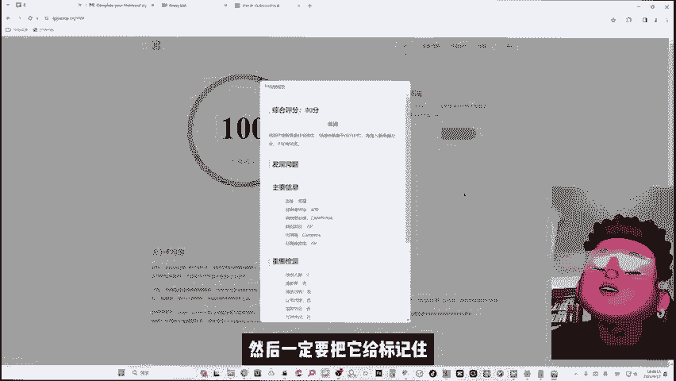

可以把它先放在一个记事本里。那么前面这两个号段，其实就是这个web share里面，非常适合tktok的一个优质号段。一会我们呢就需要把一些这些我们检测的不需要的号段都换成我们优质的号段。

那我们检测下来的话，最后也就只有刚才的这1个IP号段是OK的。不过呢我们因为之前也使了几次这个产品了，所以会总结一些优质的号段放到我们优质号段的这个文档里啊，大家可以在更换的时候呢。

尽量选择我们已经试验出来的优质号段来进行更换。这些呢都是之前在使用过程中验证过的一些可能大概率会出高质量IP都是我们的IP段。我们现在来演示如何更换不行的IP。

首先我们要记得刚才我们挑出的这个质量高的IP是这个107180这个我们就选择全选，然后把我们需要保留的IP把它勾掉，然后选择replace，然后我们选择下一步，嗯，这里有4个我们可以选择的更换方式。

第一种呢就是更换随机的，这个肯定是我们不要的，我们需要的是最后一项，选择IP段。比如说我们刚才呃试验过的这个IP段是107180。我们我们这里呢就选择刚刚我们验证过了是高质量IP的这个号段。

然后我们点击这个，然后点击这个conformO然后我们点击查看新的IP好，这里我们看到这样的话，我们的IP都已经变成了这个刚刚试验过的ok的这个号段了，我们随意的检测一个。

OK这里显示这就是一个高分的IP。因为都处在相似的号段，所以说这里所有的IP其实都是会是质量不错的。好，我们可以看到。嗯，如果大家比较在意这个IP是否过于相近，那我们也可以在更换的时候呢。

选择更宽泛的这个号段。不过这样的话可能你就需要更多轮的进行筛选。因为这个极高性价比的套餐呢，它是多人使用就超过2人可能是10个人20个人都在用这个IP所以你现在检测运营是没问题的。

可能你要过一段时间再来进行检测，差不多一个月时间吧。然后这样的话才对你稳定运营有帮助。如果你发现某些IP是不行的，你就把它提除。然后如果大家对于这个成本不是那么敏感，我们也可以升级这个套餐。

这里有一个share with one two user更接近独享的一种状态。如果你需要业务真正做到独享，那么就选择这个这是完全你自己使用的。

完全没有被污染的可能使用这个他第二档的这个只和1到2个用户共享的这这个的话差不多就是20美金20个左右啊，25个。然后它的费用就是23美金啊，其实这个也是比较划算。这样我们对于长期稳定的运营。

那就是相对比较有帮助了啊re man认为如果你是做暴利需要大量账号的话，你可以用这个便宜的方式。如果是号数并不多，然后你希望能够非常稳定独享的使用的话，那就用这个完全独享给你的。

或者是中间这个1到2个用户私有的价格也并不是很贵。然后这个呢就是30美金左右，基本上就和你自己去购买re man之前介绍的AIT这个一个的成本差多。我们优化完这个IP的清洗和筛选之后呢。

我们选择这个download的这浏览器呢，runman这里推荐这个ADSpower的这个封闭性，还有防流巫的功能是最好的。点击这个链接到它的这个注册和登录页面。

然后它可以用谷歌邮箱也可以用境内的手机号来注册，都可以登录进来之后呢，我们在左下角可以找到这个免费试用的一个套餐，然后可以试用3天，它是有15个环境，开通之后呢，我们点击左上角的这个批量创建。

然后它这里提供批量创建的一个模板，把它下载下来。打开这个上传的模板，我们只需要把刚刚下载的我们的IP信息复制到像这个代理信息，我们把它都粘到这里代理的类型和。然后在环境名称这里。

我们可以起个比如说跨境或者是。

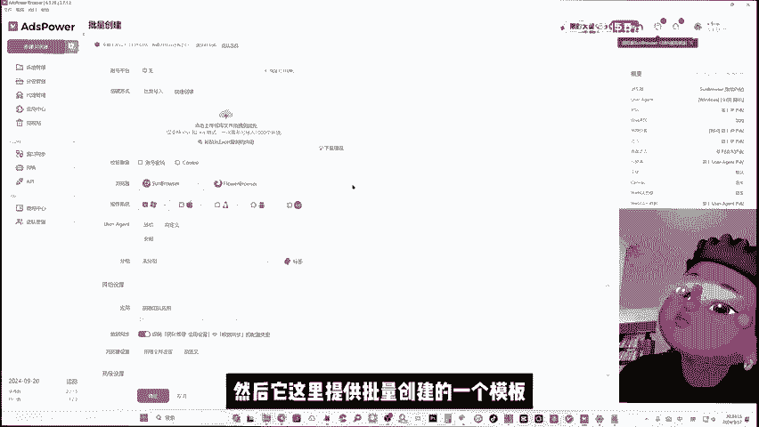

m3，我们先试着导入这10个环境，然后我们保存这个模板的信息，上传的时候，把中间第二行的模板文件里的这个信息删掉。然后这里就是我们导入的10个环境。我们现在再试一下，打开其中一个环境。

然后这里要确保我们的特动模式和全局代理是打开状态。OK这样我们就成功打开这个代理IP了。然后我们检测一下这个IP的三方状态。对，三方状态都是没问题的。然后看一下IP衣的信息。是美国的住宅IP。

然后是ATP的一个服务。OK这样我们就完成了一个以不到亿美金一个的高质量的住宅IP的搭建，然后并且导入了10个这样的环境。然后我们来看一下web share上的核心优势啊。

就是它可以手动的替换这些质量不高带。几个不同的产品呢进到它的页面里，我这里也标注了一些share档的就是6美金一个月，然后可以有20吧，0。3美金一个的，这个适合于we3撸毛。

然后中间这个proed的就是25美金一个了，然后差不多就是合7到15人民币。

一个美金差不多一个那我们这个质量相对于比较高，因为它是1到2个人共享的嘛。即系。早期的我们的自媒体的矩阵和多店铺运营都是没问题的。然后如果是长期使用，你觉得你的收入覆盖的了这个成本。

那我们再去选择这个dicated的这个产品。就是你自己独享的金态皮，然后有差不多起令是20个每个月，35美金，差不多就是1。75元的美金。所以说web share的厂商它的特点是它20个起令。

然后可以手动替换。这样的话就比我们市面上购买其他产品都要便宜非常多，非常适合web3撸盟自媒体的矩阵和多店铺的运营。OK以上就是本期视频的全部内容了。

下期视频rund man将详细讲解如何利用这些网络环境进行web3的套利。如果对你有帮助，请一并订阅red man频道，并打开小铃铛，全网最前沿最实用、最赚钱的数字科技，你将尽收眼底。

