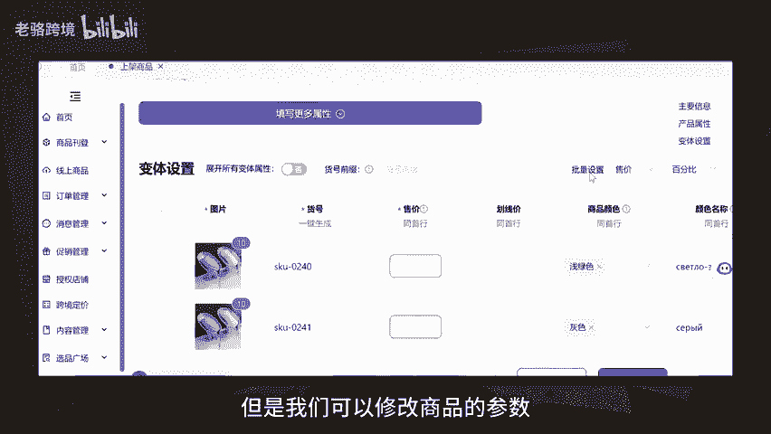

# 你的ozon店铺为什么做不起来？因为你的上新数量不够 - P1 - 老骆跨境 - BV1Gg1mYrEUT

你的欧众店铺为什么做不起来？最主要的原因还是在于每天的上新数量太少了，这就导致你的店铺很难做起来。今天给大家分享一个工具，直接将你上架产品的速度拉满。它有三种上架模式，第一种，一键上架。

可以直接将别人欧众店铺里的商品一键上架到自己店铺。你只需要修改一下商品的售价就可以了。第二种编辑上架，也是将别人欧众店铺的商品上架到自己的店铺。但是我们可以修改商品的参数属性等信息。第三种手动上架。

将其他平台的商品上架到自己的欧众店铺，比如1688上的多多上的，总之，有了这一个上架工具，一天上架100个商品都是轻轻松松的。最主要的是它还是免费的。如果你要是找不到这个工具，也可以按号工具。

我给你安排。

