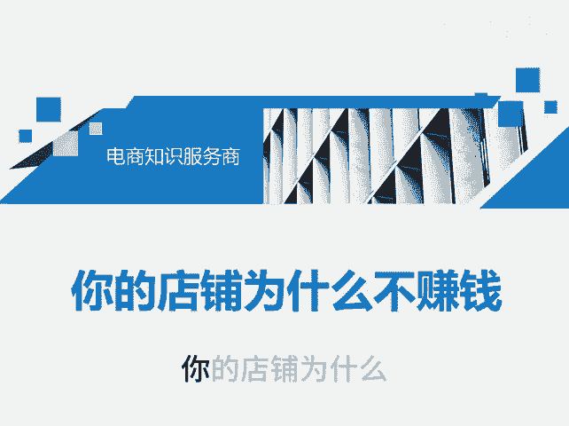
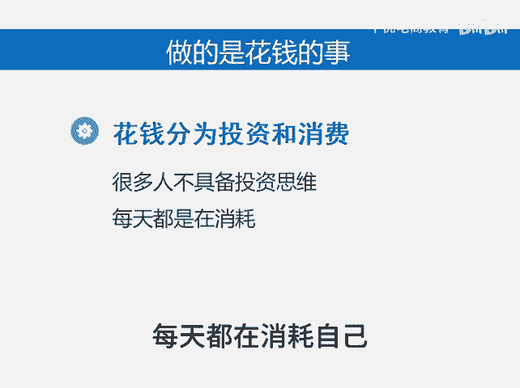
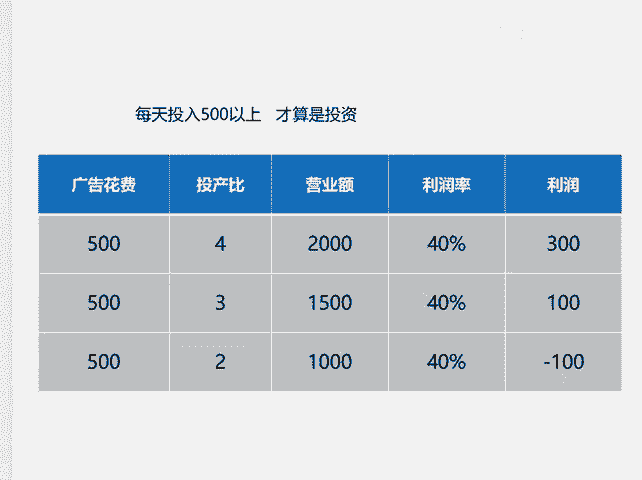

# 你的店铺为什么不赚钱 - P1 - 千优电商教育 - BV1A3szeKEeV

你的店铺为什么他不盈利？其实很简单，就在于你根本没干赚钱这件事。我把不赚钱的商家总结为两点。第一个就是他明明没有价格优势，他还要做低客单。低客单这个产品适合谁做，适合供应链商家低价跑量。

现在的问题是很多新手入行，那他也做低客单，结果价格是低了，但是量没上去，那么他很难实现盈利。在第二个就是你一定要做赚钱的事，可是很多人呢他在做花钱的事，我们知道花钱分为投资和消费，就是很多商家朋友呢。

他不具备这个投资思维，每天都在消耗自己什么意思？很多人直通车每天开100块，开200块。其实我们知道每天100块的直通车，200块的直通车必亏什么意思？假如说你每天消耗100块的直通车。

你的投产品能够做到4的话，那么你的营业额400。如果你的利润率能够达到40%。然后你的利润是160减去100的直通车，你还剩60去掉退款率，其实你基本赚不什么钱。所以。😡。

如何把消耗变成一种投资行为呢？那么你每天的直通车要消耗500以上，那么你每天的利润大约有300块。如果你消耗更多，那么你的利润会更高。所以说你一定要改变你原来的思维，你要奔着赚钱去干这件事儿。

我是讲师大牙，欢迎大家扫码添加我的微信，不方便扫码的朋友可以添加我的微信号，80221430。在这里给大家准备到了一套新手运营入门的大礼包，希望能够帮助大家。😡。

