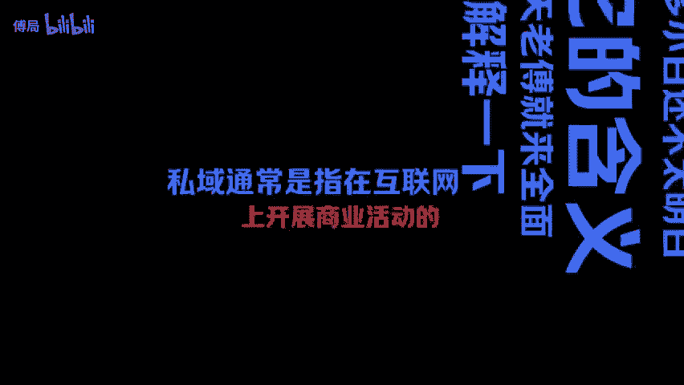
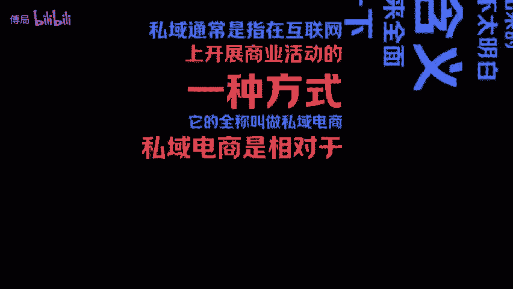
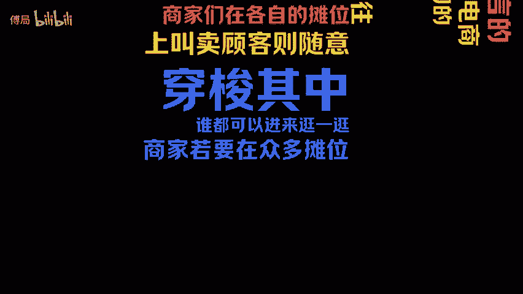
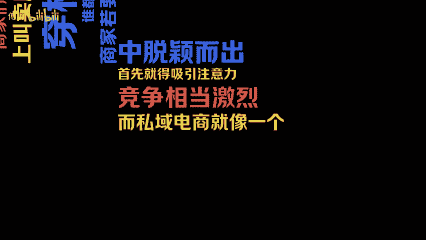
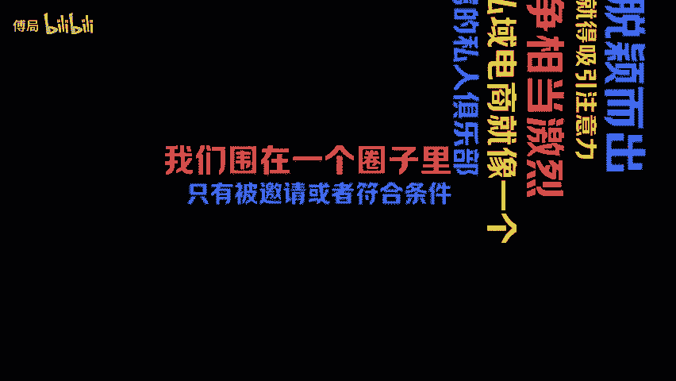
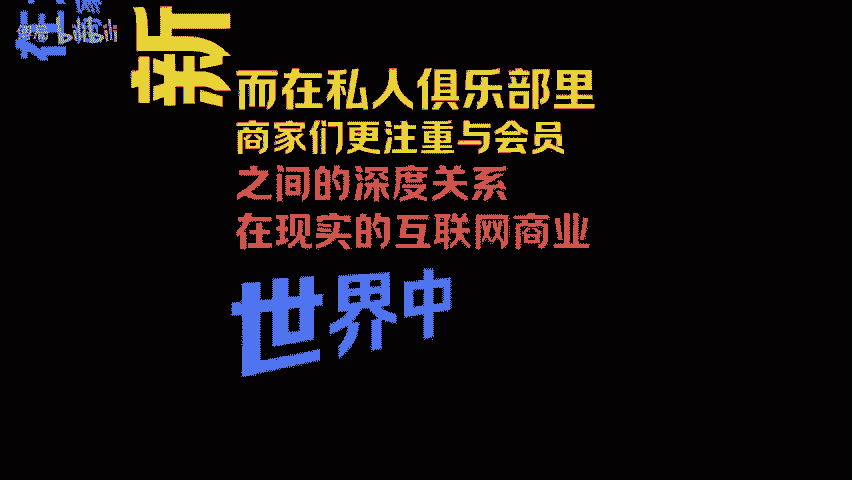
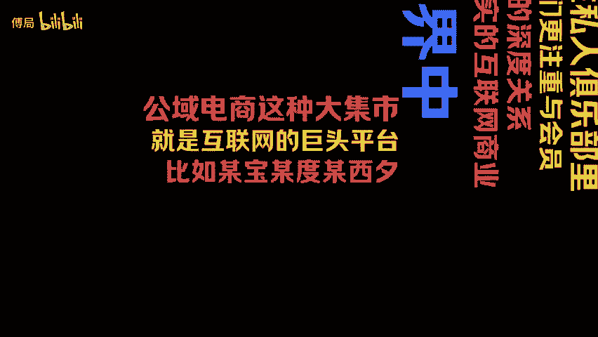
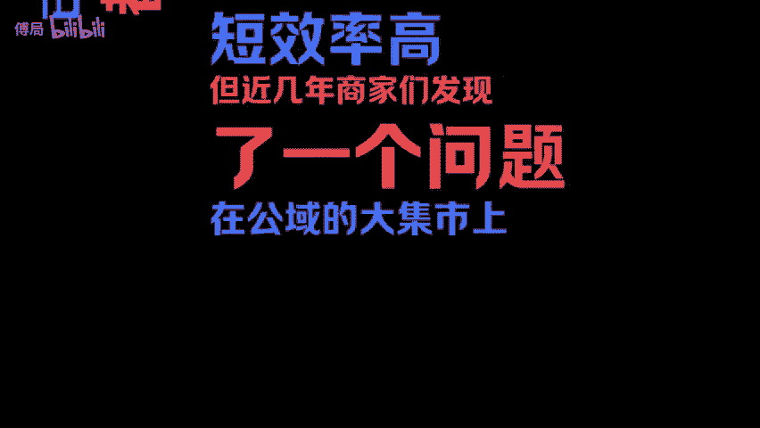
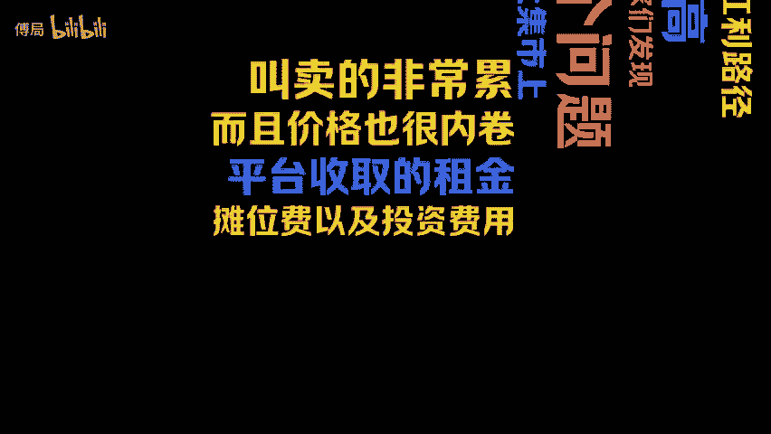
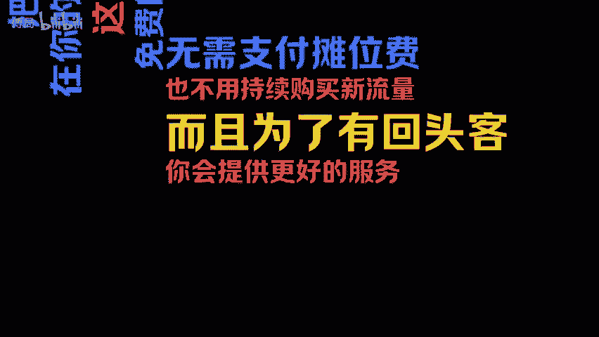

# 你真的了解私域的底层逻辑吗 - P1 - 傅局 - BV1ZKWPeZEep

什么是私欲？私欲这个词是近几年在互联网商业圈中涌现出来的。许多小白还不太明白他的含义。今天老傅就来全面的解释一下，私域通常是指在互联网上开展商业活动的一种方式，他的全称叫做私域电商。

私域电商是相对于公寓电商而言的。你可以把公寓电商想象成一个热闹的大集市，集市里人来人往，商家们在各自的摊位上叫卖。顾客则随意穿梭其中，谁都可以进来逛一逛。商家若要在众多摊位中脱颖而出。

首先就得吸引注意力，竞争相当激烈。而私域电商就像一个专属的私人俱乐部。我们围在一个圈子里只有被邀请或者符合条件的会员才能进步俱乐部的主人也就是商家对会员的喜好和需求了如指掌。

能够为他们提供个性化的服务和专属的优惠，会员们在这里能感受到特别的关怀和重视，忠诚度也会更高。在大集市里，商家们需要不断吸引新顾客，而在私人俱乐部里，商家们更注重与会员之间的深度关系。

在现实的互联网商业世界中，公寓电商这种大集市就是互联网的巨头平台，比如某宝某部。😊。

某西西、某东、今日、头条、抖音等等，公寓电商一直发展迅速，很多人也在上面赚到了钱。在红利期只要一开店流量就纷纷涌来，顾客在平台上完成成交，发货合收后，平台一把整个基础设施都搭建好了。

在早期公寓电商确实有巨大的红利路径短效率高。但近几年，商家们发现了一个问题，在公寓的大气市上叫卖的非常累，而且价格也很累卷，平台收取的租金，摊位费以及投流费用都很高。最重要的是，一旦不小心违规。

平台就会进行封景，摊位也就没了，令人欲哭无泪，既没有沉淀也没有积累。那私域的俱乐部模式是怎样的呢？就是让公寓的客户下在你的软件进入你的CS星球，某新群，某公众里。当然，最常见的就是进入你的地球朋友圈。

作为商家把这些钱在客户圈在你的微信私域生态中，这样你就可以长期免费的与他们建立联系，无需支付摊位费，也不用持续购买新流量。而且为了有回头客，你会提供更好的服务。当然你也会有更高的利润空间。

当你和客户的关系运营的好时，还可以。

让这些客户为你进行裂变，转介绍深度绑定后，甚至可以让客户成为你的代理商，这就是私域的玩法。关注老付，一名有着7年私域运营经验的互联网老炮，每日分享私域运营干货。

