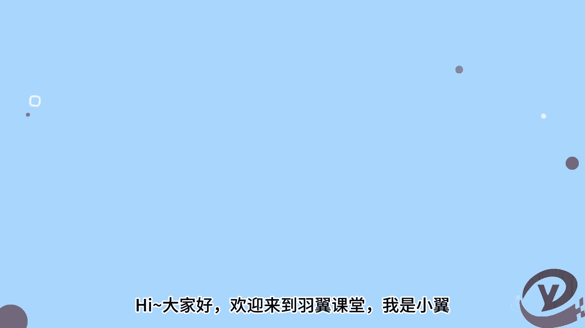
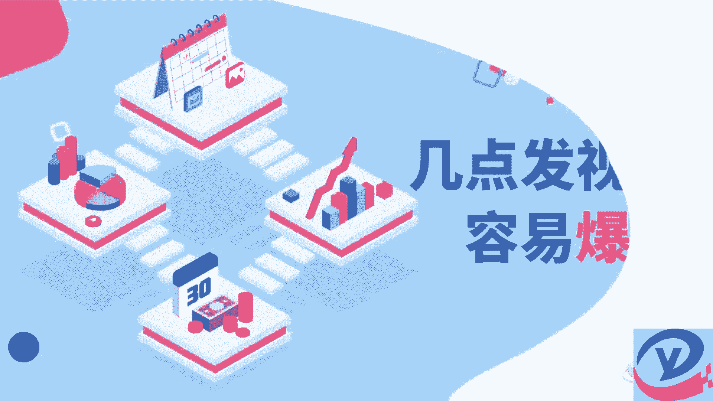
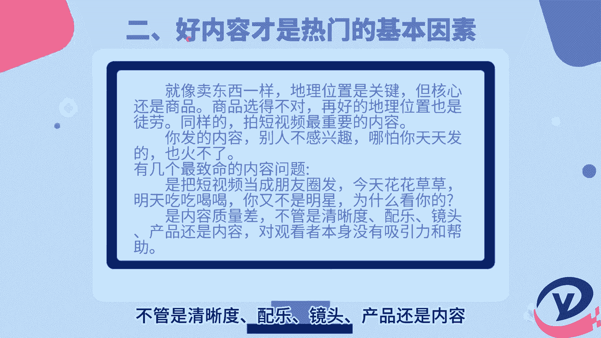
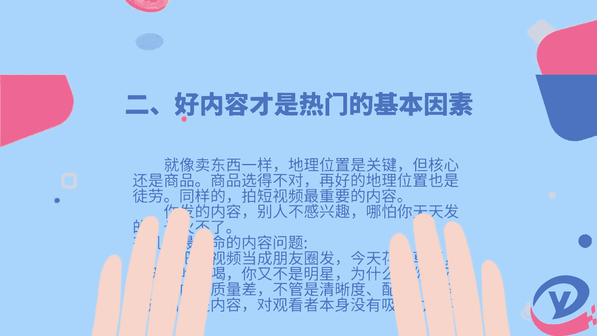
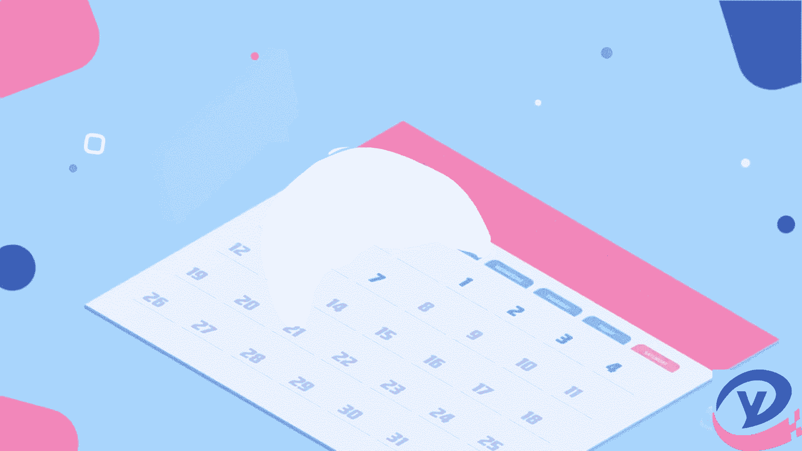

# 你知道什么时间段发抖音、小红书等的短视频容易火吗？ - P1 - 羽翼课堂 - BV1JL411Y7Nt

嗨大家好，欢迎来到语音课堂，我是小易，今天给大家分享几点发视频容易出爆款，一起来看看吧。

首先要知道大家的时间是一致的，先要了解绝大多数人的一天是怎么度过的，尤其是刷手机娱乐购物的时间，早上7~9点，中午12比14点，下午五比七点，晚上九比12，这四个核心时间段，大家其实都一样。

所以说你上班的时候，别人也在上班，你娱乐的时候别人也在娱乐，这只是一个普遍情况，但大家再想一想，在这些时间段外，难道你就不刷短视频了吗，或者再问一下自己，如果每一个内容创作者。

都按照刚才那四个时间去发布作品，那其他时间段呢难道就没人发了，因此在很大程度上，发布作品和在几点中并无直接关系，其次要知道好内容才是热门的基本因素，就像卖东西一样，地理位置是关键，但核心还是商品。

商品选的不对，再好的地理位置也是徒劳，你又不是明星，为什么看你的是内容质量差，不管是清晰度，配乐镜头产品还是内容。

对观看者本身没有吸引力和帮助。

权重决定内容是否被放大，先了解新号权重，新号有没有权重，当然有权重，就像所有平台送新人福利一样的，一个新号来发布作品，平台想把你留下来，或者平台本身也想测试你，那么一个新号，一个新作品。

在一开始获得内容推荐的权重是比较高的，但如果给了你多次机会，内容都是劣质的搬运，抄袭的，重复的等等，意味着平台放弃了，你还要看标签权重，看起来某音似乎是在去中心化，如果是真正意义上的去中心化。

所有平台都应该把粉丝数去除掉，不显示，这才叫去中心化，试问一个粉丝千万的账号，和一个粉丝100的账号发布同样的内容，大概率上谁的内容曝光量更大。

最后要知道你的粉丝习惯养成，当你的账号有了一定的粉丝基础的，你要做的事情就是培养用户的阅读观看习惯，就像许多热播剧综艺节目，每周播一集或者两集一样，当你的粉丝对你的内容形成忠诚，那么你以后更新的时候。

就有了基础的播放和互动，从平台的角度，当你做内容更新，也会帮你用心向你的用户做推荐，所以在某音上发内容，想要火起来，核心还是要从内容本身出发，你定位什么样的人群，拍什么样的故事，激发什么的情绪。

提供什么知识福利，和其内容有什么差异，这才是我们要花时间来思考的，否则你天天准时准点，按照所谓的时间表来发都是徒劳，好了这期的分享就到这里了。

我们下期再见，拜拜。