# 保姆级教程笔记视频AI批量克隆原创，日产1000条高质视频，卷不动的来看看 - P1：2024年9月AI克隆9.0系统，保姆级教程笔记视频随意批量克隆原创，卷不动的来看看 - 渡鸦科技-新星 - BV1CgpBeFEGz

然后点击发货。这里底下是一个默认大小，不要拉长，也不要拉短，拉短了肯定会报错。可以看到标签和这个全部都是正常发布。好，这就就发出去了啊。那么今天我们来正式更新克隆9。

0的这个最新的教程啊说起来这个克隆9。0真的是非常曲折啊。出来本来是两天时间更新完毕啊，让大家等了整整将近4天时间。因为昨天的话小红书官方临时要更新，我们的功能本来已经做好了啊，结果小红书官方一更新。

那我们的这个发布的标签啊等等的，又得全部从头更新一遍啊，也能让大家用到那现在已经更新完毕了。那么最新的克隆系统，大家注意你是需要自己去注册一个账号啊。

然后账号密码你一定要记住你的账号密码发送验证码登录啊，然后注册完账号密码之后，你就用你的账号密码啊，登录，我先给大家登录一下，看一下。

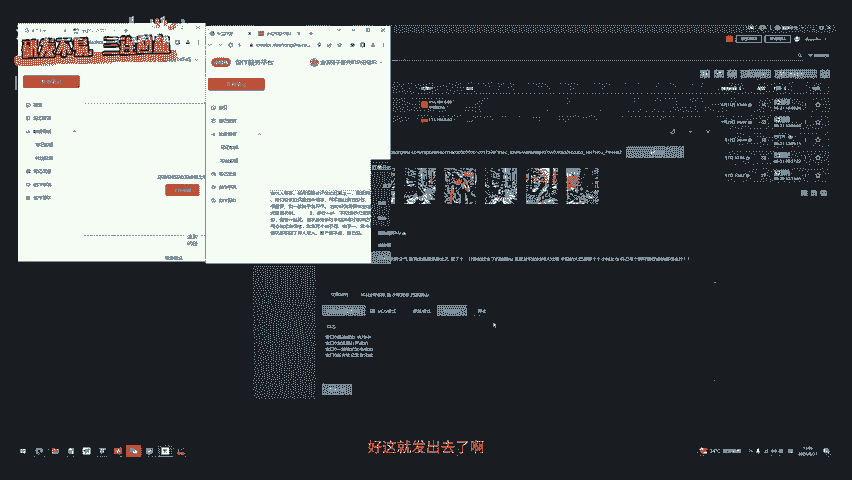

好，那么登录进去之后，是这样子的页面。那大家一定要注意，就是你用本软件啊，一定要遵守以下的这个规章制度啊，规矩，一定要遵守，不遵守的话，就没办法继续使用啊，没办法继续使用。

那大家去发笔机啊或者什么的时候，一定要注意不要频繁的发一些这种呃违规内容啊，也不要去发这种侵犯人家人脸的这种素材啊。就比如说人家露脸了，你直接去这个侵犯，那所造成的。如果人家追究了，那说你搬搬运的话啊。

那跟本软件没有关系，大家一定要规范使用啊。好，那么最新版它的这个功能更新的非常多，也更新了很多的这个bug啊，我一个个说。首先。咱们的这个这边是变成输入卡密了，也就是说你进来之后不需要输入卡密。

你进来之后你要继续使用无限使用，你才需要输入卡密，把卡密设在这然后点开到会员，这里就会显示你会员到期时间。那么杜源科技社群的会员是免费满一年的这个矩阵自热系统酒店里免费使，毕竟现在功能是非常强大的啊。

那首先咱们克隆图片的这个功能就不多说了，因为大家都会用非常的丝滑。比如说咱们选个旅游赛道啊，专抄这个图片多的。我们的这个克隆系统，它从这个4。0一直更新到现在的这个9。0。啊。

大家其实可以看到不断的bug和这个功能都在优化。原先这里还要填个CK，那么越往后才越简洁啊，然后响应速度也更快。那么还是老样子，你发的时候把这里的标签。给它删掉啊，只留这里的标签。

然后模式选择MD5窗口在这里点更新。这就是你比特浏览器的窗口啊，那么大家会发现区别在哪里？就是我们。账号管理那边消失了，然后IP配置这边消失了，对不对？那如果我们需要管理账号或者配置IP怎么配置呢？

咱们直接在这个比特浏览器这边啊，然后直接新建这这边新建窗口，这里你可以自定义你的名称啊，然后你再往下。

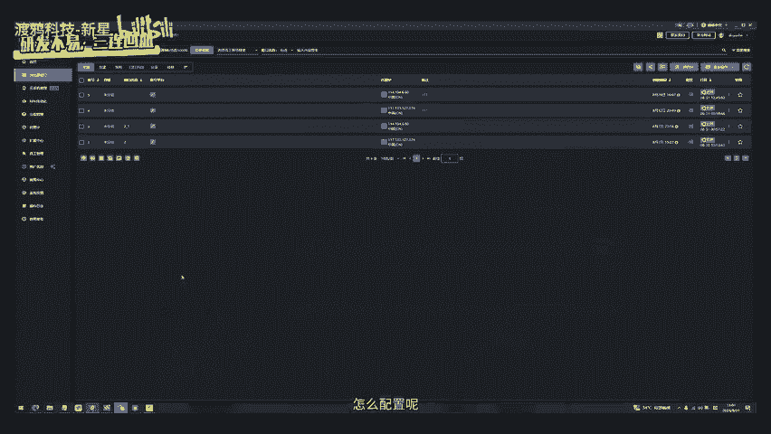

这边有个这个IP。自定义的IP渠道啊代理方式。咱们先点别呃，咱们先等一下，我们直接点这个SK5s5的这个代理IP，然后你把这个IP。端口账号密码填进去啊，检测是否能用能用的话。

OK你这个IP这个窗口IP就算配置完成了。大家要注意啊，这里有浏览器的内核版本等等的这些东西啊，你可以点击这个每次启动浏览器是均随机指纹啊，这样子的啊指纹随机啊，你开始之前也可以随机一下指纹。

那这个就是指纹浏览器和别的浏览器的区别啊，它的一些地址它是可以换的，更容易这个让官方觉得这个浏览器它是干净的。如果咱们用普通的这种浏览器，它很容易被检测啊因为它的特性一下子就被看到了。

那你这边搞好了之后啊，点击这个确定咱们先不配置来演示一下。好，然后我们点开这个窗口。那咱们要做的是把这个网址小红书网址复制过来输入它就能直接访问到的。这是因为谷歌浏览器，它是属于这种英文的浏览器啊。

你如果说直接的去访问中文，它是搜不到的，你直接在这里找好网址啊，A级浏览找好网址把网址输输入进去，它直接的。

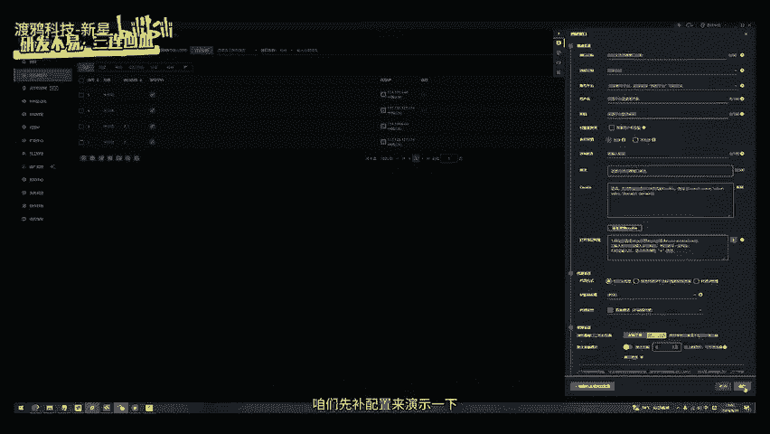

返问到了，然后这里你正常的扫码登录，或者你直接接验证码都行好，这就不多说了好。

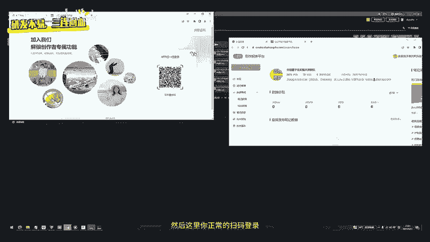

然后大家配置完了之后啊，就是你登录的网址和你发布的网址现在是完全一致了啊，有些兄弟之前还是玩不明白啊，说想要这个登录的IP和这个发布的IP完全一样。那我们直接就把账号管理这个板块给你删掉。

你自己去比特浏览器里面去配置IP那这样就能保证你每个窗口登录地址是你自己选啊，然后你自己的去配置。那一个账号登上去，基本上可以用很多天都不调一周两周这样子都不会掉掉了，你自己再补登一下就可以了。好吧。

然后这个的话国内外的这个都可以啊，大家自己去这个研究IP的话推荐老K的IP啊。好，咱们继续回来这个地方好，选择湾浏览器，我们这边选择一个4号浏览器，点确定，然后点击发布。这里底下是日志啊。

大家的话不要去乱动这个窗口的大小。如果说他发不出来或者是出问题了，你再把它放大。正常的话，你就不要动这个默认大小，不要拉长了，也不要拉短，拉短了肯定就会报错。可以看到标签和这个全部都是正常发布。好。

这些就发出去了啊，已经发布完成了。你在笔记管理这边就可以看到这篇笔记已经发布完成了。好那，我们把这个窗口停止。

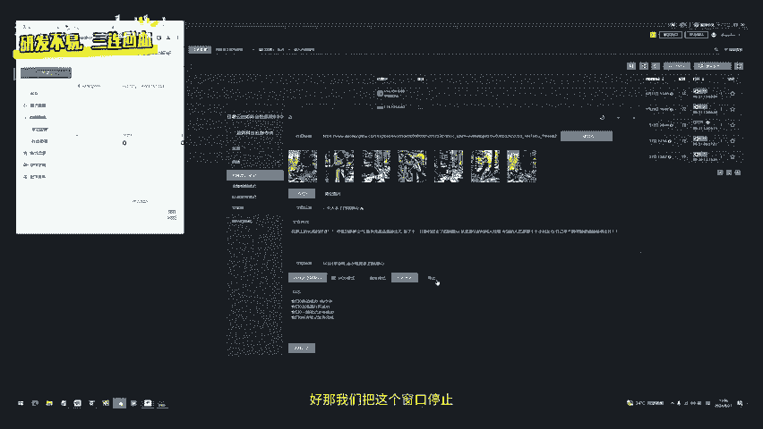

这个克隆图片很简单，大家都知道。那么大家非常期待的一个功能也是全网啊，这个其他的这个想搞克隆或者搞的这个技础壁垒啊，很多兄弟是。一直想要这个克隆视频功能啊，那他今天就已经出来了。所以大家。

我们是便选择一个这个视频啊，比如说这个咱们专业赛道。选一个视频。这种人设的可以搬，但是呢他搬的话，他容易被原作者举报，像那种豪奢的那种的，哎，他就不容易被举报。还有没有。这都是人设的。

我们随便随便拍一个给它复制下来啊，然后呢把这个作品链接输入进去，一键获取。响应速度非常快，一下就把这个图片的这个下载下来，并且是驱从MD5的。那么它的视频路径在这个底下，大家可以去搜一下。搜一下。

你可以看到这个视频路径在哪啊，哪个是你的这个视频，这个视频在哪啊？然后文章的这个标题。大家可以看一下文章的这个标题，它就是这个简单的。那么你自己去做的时候，哎。

那你就要去这个把文案和这个标题稍微去重一下。比如说我把这个标题放过来。然后呢，我把这个这个某个内容啊等一下。某个内容换过来有没有内容的，他们发这种的都不发内容啊，直接就是一个标题直接就干就行了啊。

那那你就可以加点标签。比如说这个。这个这个指标。行业等等你自己去加标签啊，我这边就随便举个例，然后你随便选一个浏览器。你刚设置好的，然后点击开始发布。他就会自动帮你把这个东西给处理。

这个响应速度是非常快的下载作品，就哪怕大家是用于调研的目的，你把这些视频选到你想要的视频了，你放上去克隆下来也是一个非常好的一个这个工具。为什么？因为这个。我们想去下载小红书视平啊等等的。

还得去这个小程序啊或者什么的下载，那就比较麻烦。用咱们的克隆系统，就在电脑上操作很快，就点一下一篇一篇这个发发出来呃，一篇捞出来了。点一下一个这个视频就提取出来了。

那你可以把这些视频你再去这个做二创之类的。那目目前的话是没有加这个这个另外的那你可能可以把这个路径改成别的视频的，然后让他去发布当然这个还没试。如果不行的话，回头9。19。2版本。

咱们再更新上传视频发布的功能，好吧。那这个是这个浏览器，没什么毛病啊，可以看到，直接就直接就发出去了啊，直接就发出去了。视频的流量还是很好的，刚发出去就十几个这个观看啊，视频流量还是OK的。

我这个号属于测试号，它没有任何权重的啊，大家如果用有权重号打，他是比较容易报的啊，那这边也是这个大家尽量不要去搬人脸的，搬人脸的话，它容易把你的这个账号权重给降低啊，人脸方面，大家尽量自己去原创。

如果那种混剪的啊，这种可以办。或者是你自己搬完再做个阿创，然后再往这个这个克隆里面发，那这样效果可能会更好。启动多个窗口也是一样的。但是克隆的话，你启动这个窗口就相当于你一个视频发多个号啊。

一个视频发多个号也是可以的。这边就不罗列了。咱们讲一下自动发笔机功能，文案库这边还有老样子，你添加标签，就是12345，你几个标签往这里面添加图片也是这样子啊，内容，然后这个标签也是一样的啊。

你自己去添加排列组合。那这边我们发布的时候随机选取选取这个标签啊，随随随机选取标签。然后图片。内容。标钱。然后这个选择右览期窗口，比如说我们选的434窗口，协机支后然后开始发布。

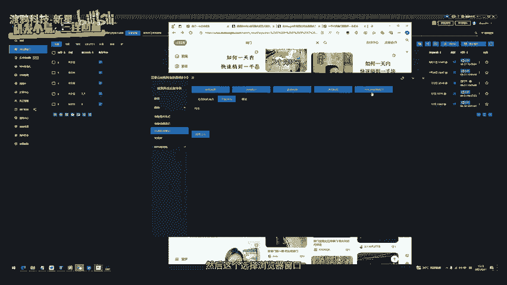

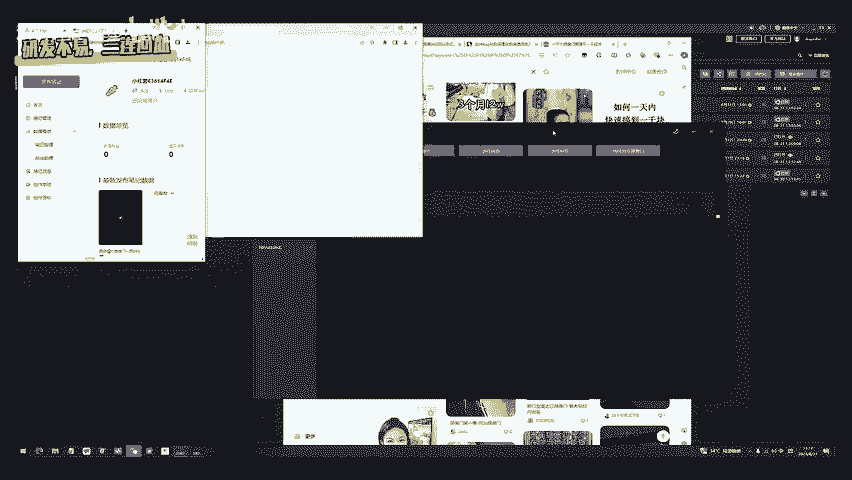

啊，它就会启了两装。如果你这个窗口默认大小在这啊，大家尽量给它动一下啊，这这个是我没登录小控之号的，那他就启动不了。

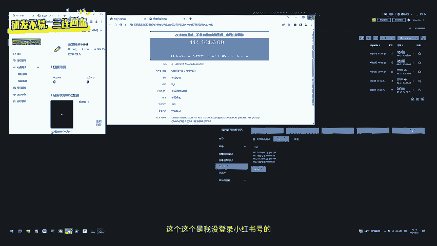

目前就只能提到一个啊。等我换一下，应该是一窗口是有账号的。哎，一窗口的笔记看一下。差不多。

启动一下啊，它重新演示一下。稍等一下，我暂停下，我登个账号啊。

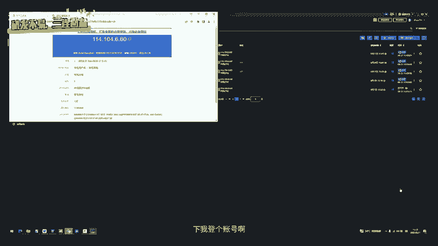

好，那咱们就使用这个重新选择。使用这个56窗口。

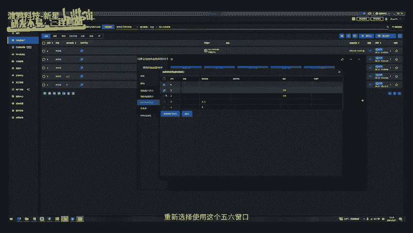

然后开始发布。

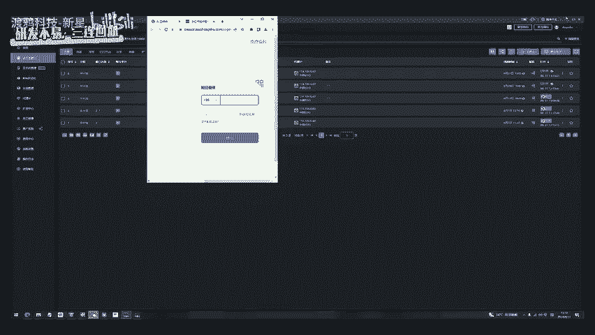

那他就会随机选取一个标题文案和这个图片的列表啊，然后往里面去填去发布。啊，但是你内容不要过长啊，我这边的话这个内容这块这个内容太长了，它随机选去的太长了。🎼这个太长了啊。

大家自己去做内容的时候要注意你这边的话，电脑端不能超过1000字，超过1000才就会出问题啊，就会出问题。大家自己去调整一下。那么后面的话9。0他还会更新一下这边的发布逻辑。

目前的话它是从这些随机选取一个之后，他账号发布内容可能是一样的。那后面会实现这个每个账号他发的都是一次随机。那这样子多个账号随机的也不一样。后面会小更新小更新的话会动态更新，就是大家登录克隆之后。

你往后拖，它会不会出现一个登录的呃更新的一个这个提示，你如果有更新提示，你直接点确定更新，它就会帮你重新安装，重新更新上去啊。

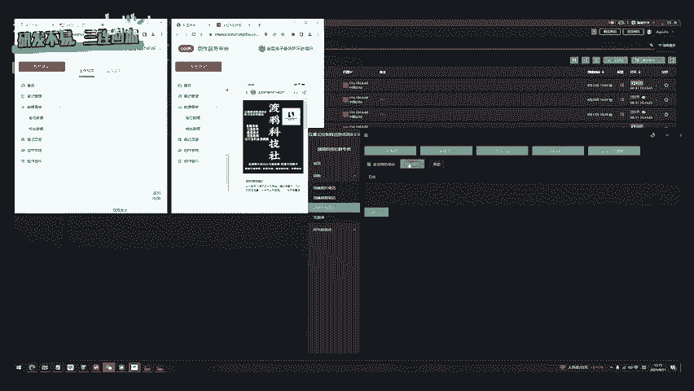

RP自动化采集这边。功能也是升级了不少。比如说咱们的采集的这个评论，很多兄弟要的啊，采集评论时间这里就可以采集一天内的这个评论啊。当然的话，我们这些都是公开的数据，大家拿公开数据。

千万不要做一些这种违规行为，仅供你自己内部的这个降样本增效测试使用。那么我们的这个创业的这个关键词，比如说我们是这个创业关键词，然后我们开始采集笔记。

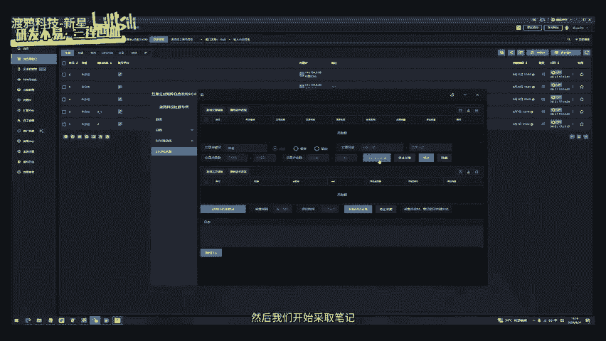

啊，等一下账浩。如果说大家在这个社群里面发现有人做的后端。是明显的这个很黑的这种灰黑后端，大家一定要过来给陈哥举报一下啊，只要提供有用的这个信息，那么奖励直接是88的红包。

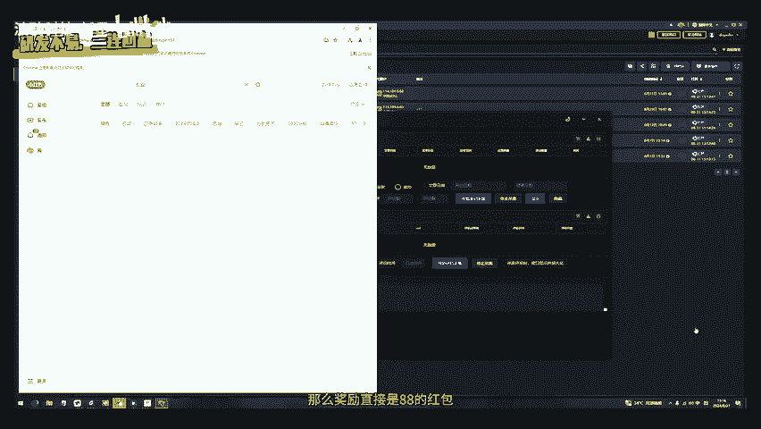

上不封顶啊，你举报几个就有几个那如果是在社群里面做这种违规的灰黑的这种东西的话，那被抓住了，肯定是提出社权的。因为咱们社群的全部都是做这种正规后端的，只服务正规后后端的这个客户。如果你是想做这种违规的。

想用工具，如果被官方知道的，那肯定会这个限制你的使用啊。包括我们这个软件都是记录这个IP地址的啊，所以大家千万不要做违法违规的东西啊，一定要是做正经的后端。好，这采集文章速度还是非常快。

一下采集30多个了。我可以说咱们这个采集速度吊打市面上的这个其他的这个采集软件啊，你就不要再去研究什么别的杂七杂八的。咱们这个啊说实话颜值又帅，采集的速度又快。别人会赶过来用咱们的东西。

并且我们还有一个调研的功能啊，我就把这个教程当做一个新教程啊，很多兄弟不知道什么叫调研的功能。就是我们这边图片你采集过程中，连图片也是扒了下来，并且是去重过的。大家可以在这里导出图片。

如果你是个小红猪运营，或者你是你们公司的运营，那么这工具。

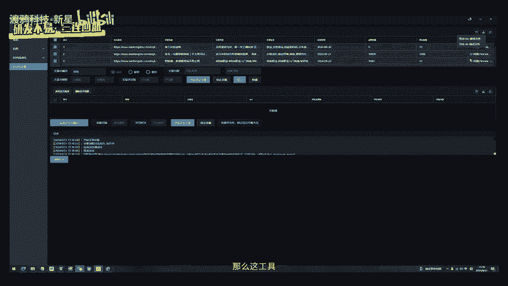

会大大节省你的这个人力成本。

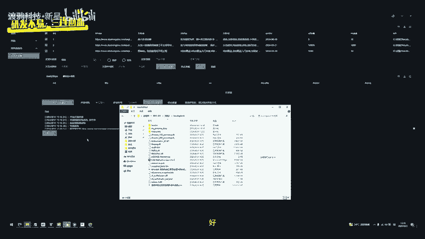

我们在这个下载这边可以看到信息表。那么在信息表这边，大家可以看到作品链接采集下来了，作品标题也采集下来了啊，包括作品的这个内容，标签全部采集下来了。啊，然后这个图片也都采集下来了啊。

那大家就可以把这个做成自己的爆款SOP库去去重啊，包括内容也可以去去重，然后重复去发布啊。当然什么赛道适合重放，不什么赛道不适合大家去看一下飞书导航的这个爆款SOP库搭建教程啊。

是在圆桌会议的一个往期回放。但是啊正常视群也可以看这些回放。这个图片的话，大家可以去查一下这个图片路径，你就知道图片是在哪了。比如说咱们打开这个路径。可以看到啊，每个这个图片都帮你保存下来。

在这边就不需要你去下载了啊，可能有些兄弟不知道这个一1这个降本增效的速度有多猛。懂行的兄弟应该知道你平常小红书调研，你要去搞这些素材，你是不是得一个个手动的去截或者用工具把这个链接复制上去。

然后才能把它下载下来。但现在咱们用工具一秒下载几十个上百个这种原创的这种图片出来啊，当然这只是你调研的目的去做的啊。如果你要去利用的话，你的赛道不一定是这个可以直接发的。你可能需要二创。

可能需要根据这个模板再创新出自己新的东西。啊，昨天有兄弟给我反馈，我还没发朋友圈，就是他看完原桌之后。根据自己的这个他是做心理学培训的。他根据自己的这个赛道去研究了爆款，听完底层逻辑课程。

研究了一个爆款笔及原创的甚至就直接打到了10多万的播放，直接就把流量打爆了99家。啊，也是刚进群的兄弟啊，是28群的，人家就花了五六天时间就研究出来了。

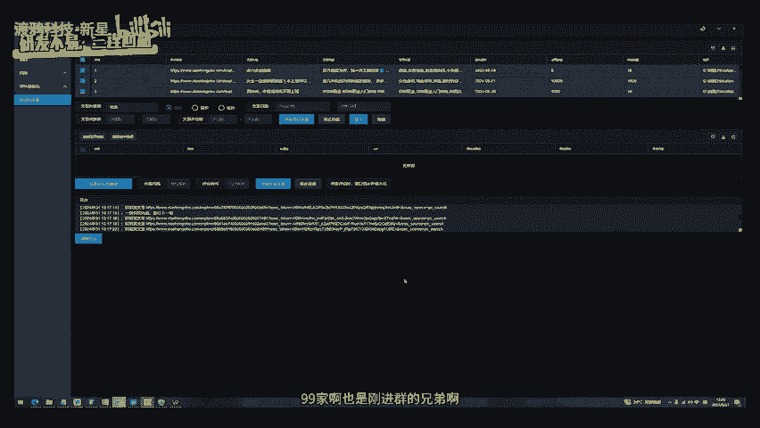

好，那这边的话设置关键词，比如说咱们的球带怎么做？然后这个666好吧，就这三个值。然后一天的时间是这个144分钟，两天就你乘2三天就乘3评论时间间隔设置1000就是一秒。好，然后你直接选择开始采机。

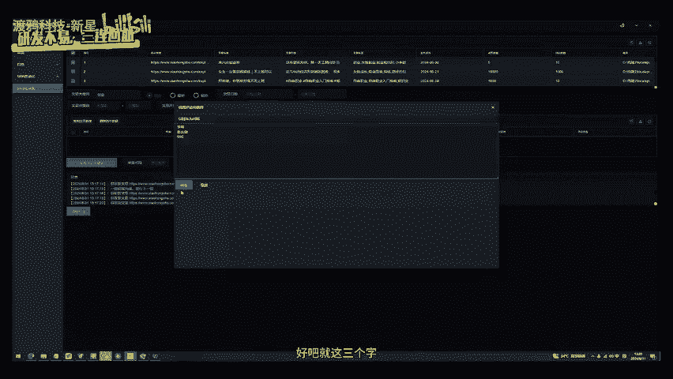

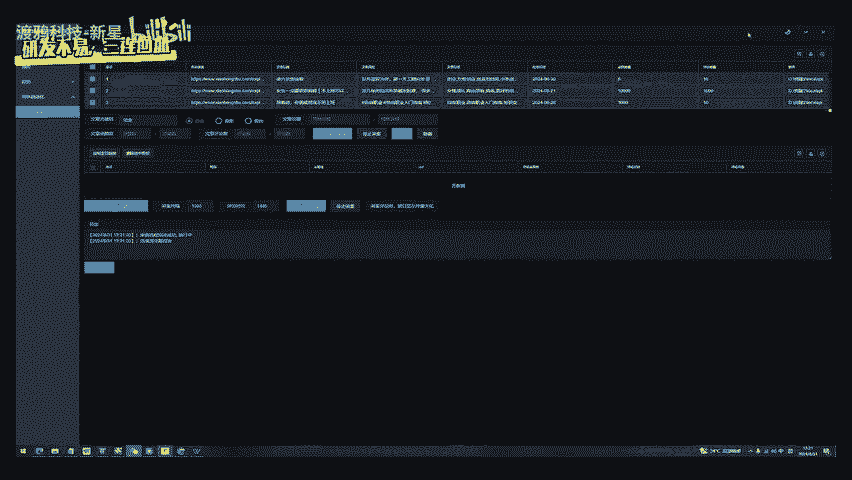

啊，然后呢。把这个拿出来。看一下咱们的这个采集速度啊。

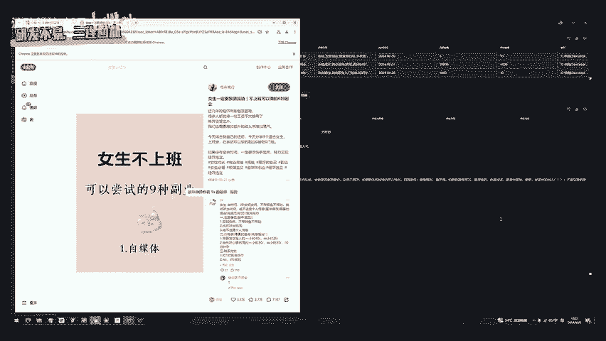

这采集速度实实际上是非常快的。并且它不会被限制，它比较稳定。那么采集1000呃几百条评论之后，出现白屏的这个bug也修复了，大家可以自己去实操试试。

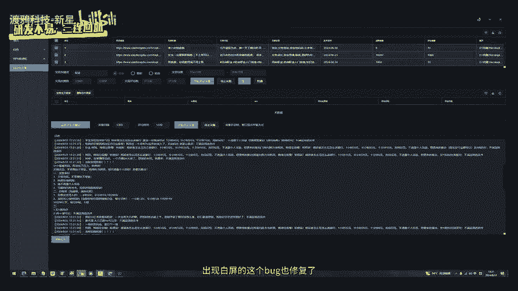

这个可以去试操试试啊。速度是非常快。先议大家去研究一下自热的打法，怎么去打。把基础的课程补充一下，看完啊，采集功能的话呢就在这里就简单说一下吧啊。他这里的话嗯很多人他评论的不是球带啊，后面有不少球带的。

只要有球带都采集出来，可以看到全是今天。或者是昨天凭证的这些用户啊，都是最新的。

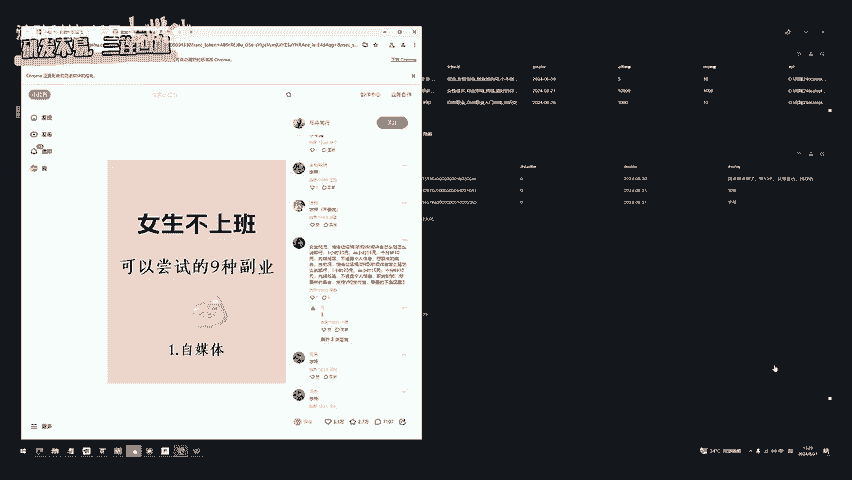

好，我们暂停一下。就是现在的话采克隆软件免费版也可以用，就是这个积分每天的话有个几十积分，可以让你采集评论采集这个文章。但是如果是想要无限使用，那必须得是咱们的社群会员啊社群。

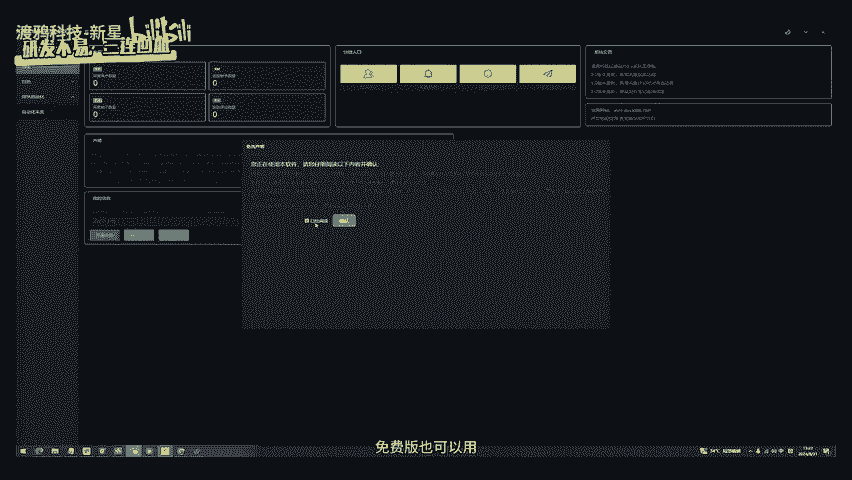

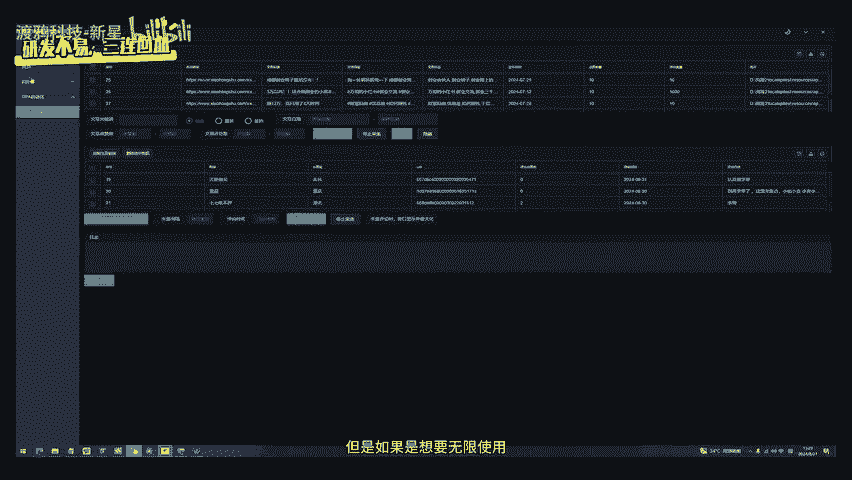