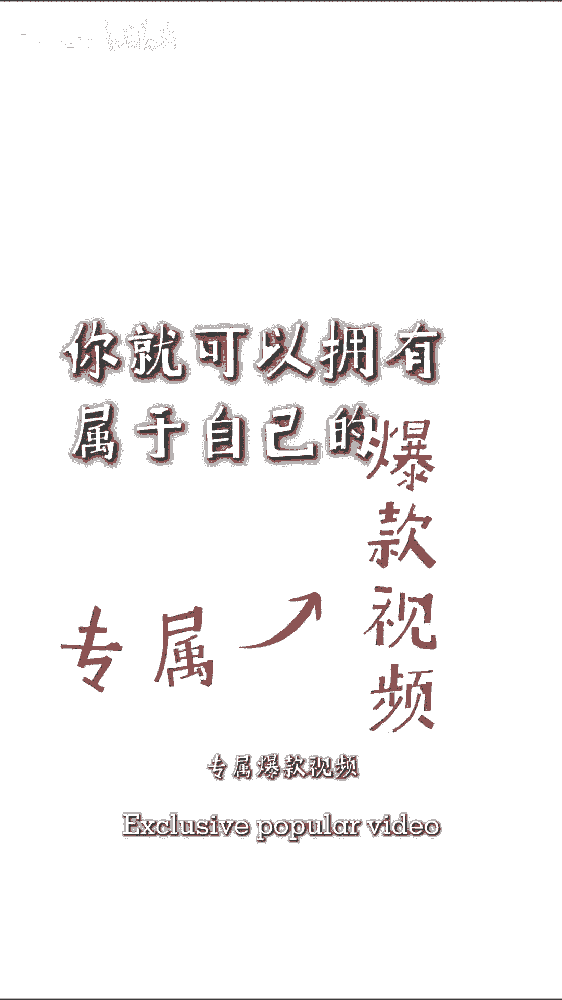

# 保姆级短视频起号方式 - P1 - 二晨笔记 - BV1Dn4y1X79B

这职业保姆级运营起号方法，自从做了自媒体，见了上述几位不同行业的老板，发现大家做不起账号，原因竟然是内容太差，但是内容是个定义，太抽象了，不会拍不会剪，不会剪，都只是小问题，我运营过多个账号。

能把冷门赛道就直接做出了爆款，也能让不认识的老板后台咨询爆单，就是因为我懂搞流，也懂怎么将顾客的人设融入产品中，先根据自己的人设经历和行业类目，总结十个人设关键词和十个产品卖点。

比如这个IP人设关键词，这十个产品卖点，这十个再通过过关键词。

做出三种内容配比和六个选题，通过选题把最近爆火的视频拿下来翻拍六条，根据数据进行小额投放，你就可以拥有属于自己的专属爆款视频。

这个方式适合个人IP和实体门店老板，如果还是不会留下你的行业和问题。