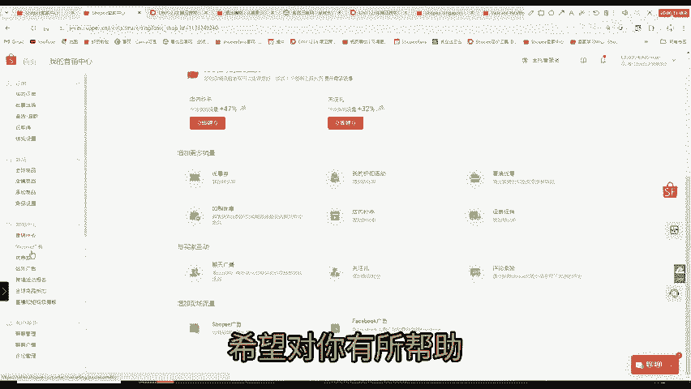

# 假如你10月份开始做跨境电商，建议你这样低成本去做跨境电商！ - P1 - 大强聊跨境 - BV1zn2mYoESK

🎼这么。

🎼做跨境起来后，和身边在做的对比，一算发现自己花了好些没必要的钱。做跨境真的就是再比信息差。下面这些一定要马住能省去不少时间和钱。

知无不言跨境论坛中国首家跨境知识问答社区于果王跨境电商行业的第一大门户网站，用了两年多电商经验，制作天加微信gax6505OMZ123亚马逊必不可少网站有很多不同的实用工具。

亚马逊卖家大学官方网站可以看到最新资讯小破站也有不少优秀跨境博主费热跨境日记，分享跨境实操经验产品选择市场分析等。ex跨境随想主要关注跨境的产品选品供应链管理物流等。

徐从植讲解跨境的产品选择外贸运营技巧，国际营销策略等小白新区除了关注跨境外，还涉及全。😊，🎼商业和市场动态。如果你也对跨境感兴趣，想要了解更多关于选品运营推广等方面知识。

那么我为你准备了精心整理的跨境电商经验笔记。笔记包含了我做的过程中遇到的各种问题和和解决办法，希望对你有所帮助。😊。

花费500小时制作的经验，视频添加Vt6505。

