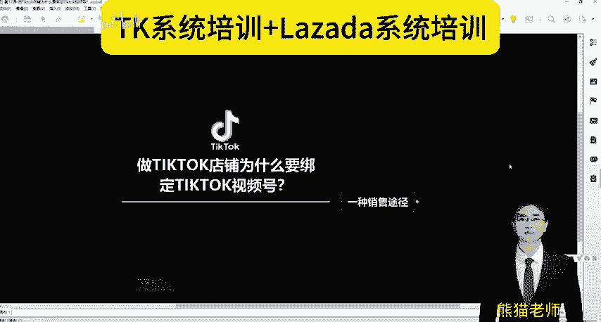
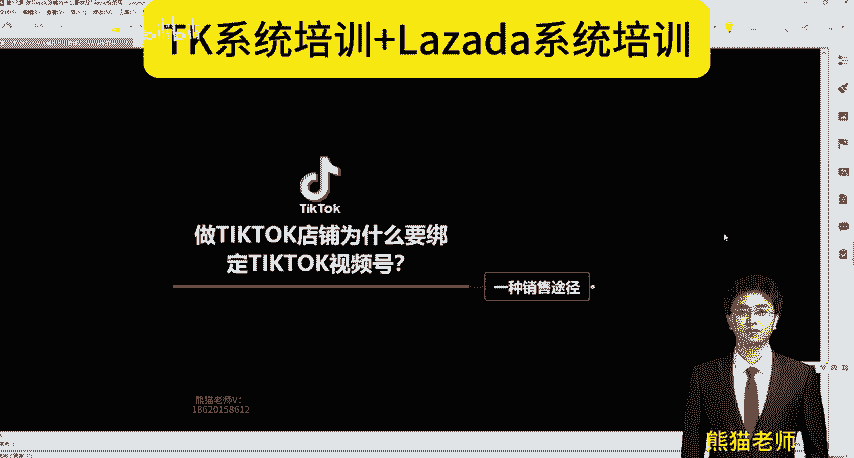
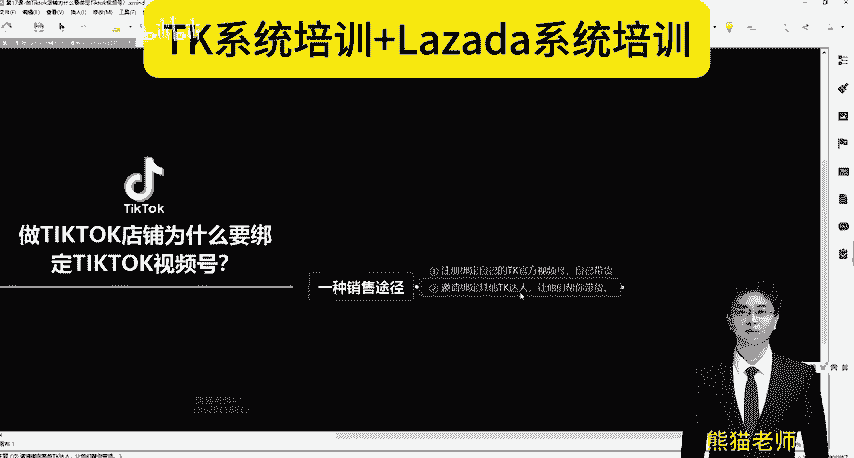
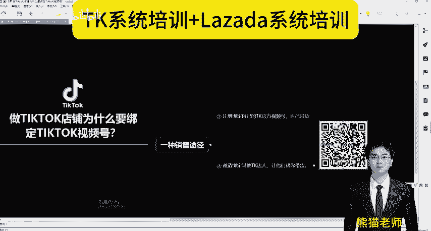
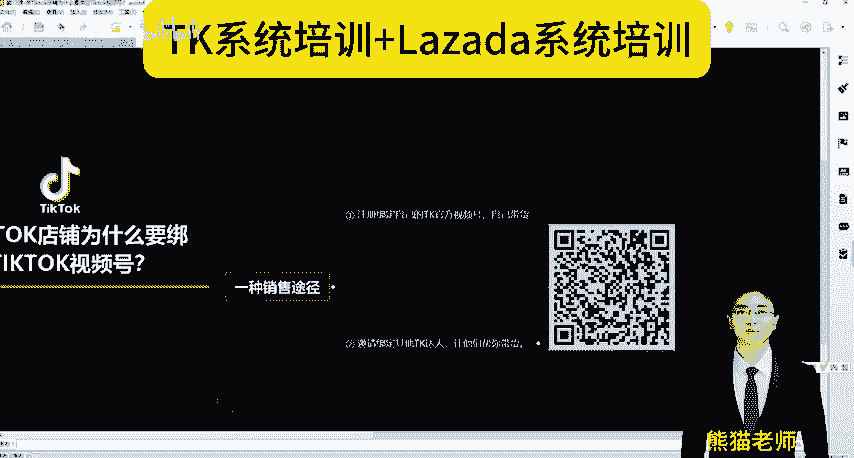
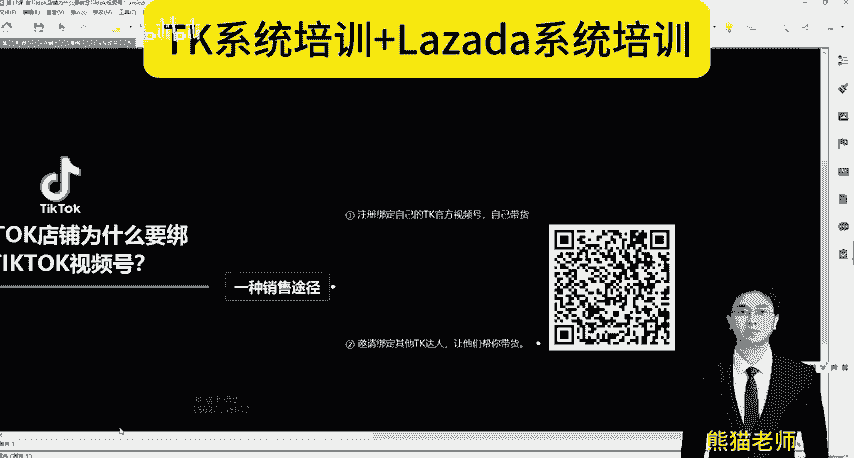

# 做Tiktok店铺为什么要绑定Tiktok视频号？(Tiktok跨境电商之Tiktok运营教程） - P1 - Lazada熊猫老师 - BV1aTaLeKEHy

各位摄友朋友大家好，我是熊猫。我们一直在做TK和兰za拉的系统培训。当然我们也在做什么独立战给大运营。好，这个视频呢跟大家就讲的是做TK店铺，为什么要绑定TK视频号？

因为你绑定了TK视频号，TK视频号它是什么？它也是一种销售的途径，销售的入口，销售的端口。

怎么说？第一个。你自己的TK店铺可以绑定自己的TK视频号，就称为什么TK官方视频号，你自己带货，这第一种。第二种我们邀请是吧？其他达人啊，我们就比如说呃邀请达人张三或者李四好吧。

我们张三这个我们是一个做TK店铺，我们卖这个产品的，我想。

邀请你帮我们。带货是吧，那这个时候需要干嘛需要进行一个绑定，就这么个意思。好吧，那么这个呢是一个批量达人邀约。就刚才说的是吧？我批量是吧？你可能一天一个人一个人点一个人点一个点，那点的老慢了是吧？

那这个时候呢，如果说我直接干嘛？

用一个软件一天邀请两三百四五百甚至上千的效率是不是高了，非常高。好，大家直接扫描注册就好了。好，还没有关注的朋友先点一波关注，谢谢大家。

