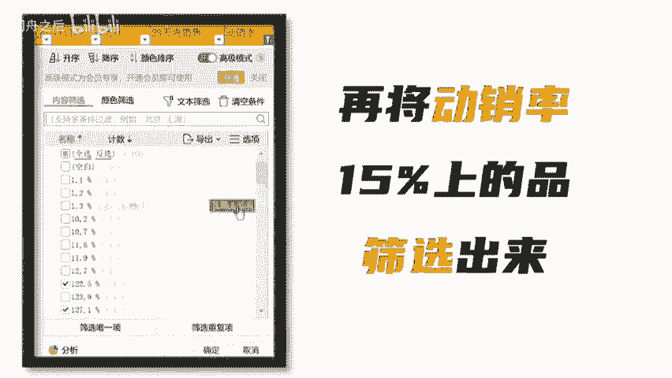

# 做ozon如何选到爆款产品？ozon跨境电商选品运营教程 - P1 - 老骆跨境 - BV1KMbFezEvG

🎼做欧众如何选到爆款产品？很简单，我们打开欧众的后台选择热门商品。我们以宠物用品这个类目为例，我们通过这个工具将宠物用品这个类目的热门商品全部采集下来，然后呢我们就得到了这样一个表格。

我们再通过这个表格的筛选功能，先将加购率7%以上的产品筛选出来，然后再将动销率15%以上的产品筛选出来。这样最后留下的都是具备爆款潜力的产品了。第二这个采集工具的可以回复选品，我直接发你。

