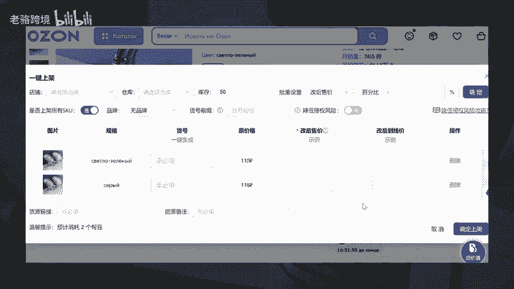

# 做ozon跨境电商运营，如何三秒钟上架一个产品？ozon上架教程 - P1 - 老骆跨境 - BV1qAC2YzEJw

🎼做欧众如何3秒钟上架一个产品，很多人店铺不出单，主要的原因还是在于上新数量太少，所以导致无法获得更多的曝光量。来点个赞，我告诉你一个3秒钟上架一个产品的方法。第一步，在欧众上找到我们要上架的产品。

第二步，通过这个工具的一键上架功能，直接将别人欧众店铺的商品，一键上架到我们自己店铺。第三步，修改一下产品的售价就可以了。这种上架方式呢不是跟卖，而是直接把别人店铺的商品采集上架到我们自己店铺。

通过这种方式一天上架100个品都不是问题。怎么样？你学会了吗？这个工具我也放到了我的跨境工具箱里，有需要的可以按号工具，都给你安排。

