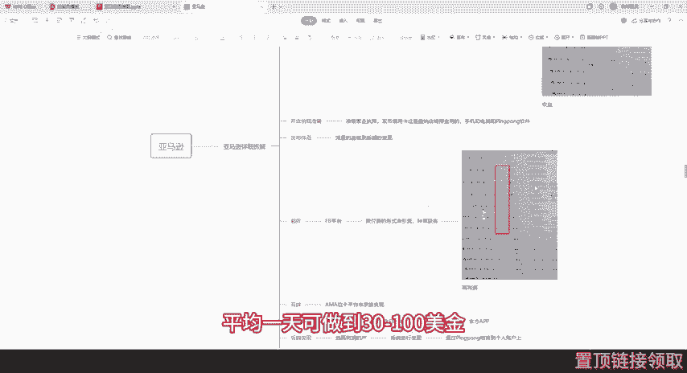
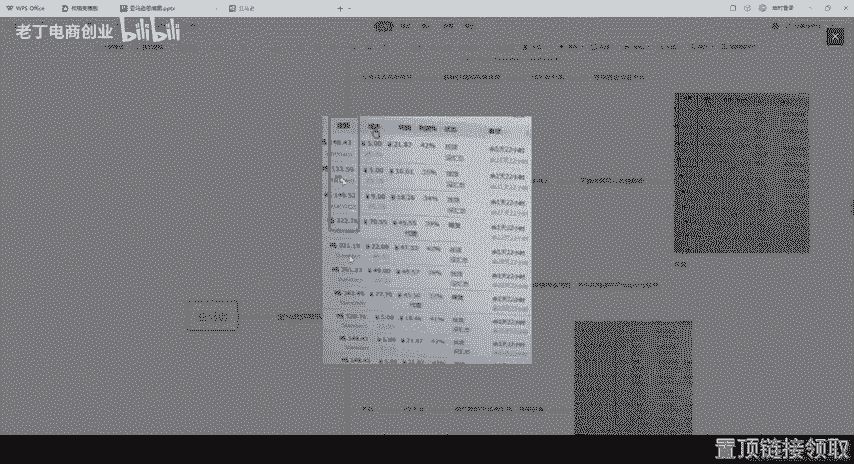
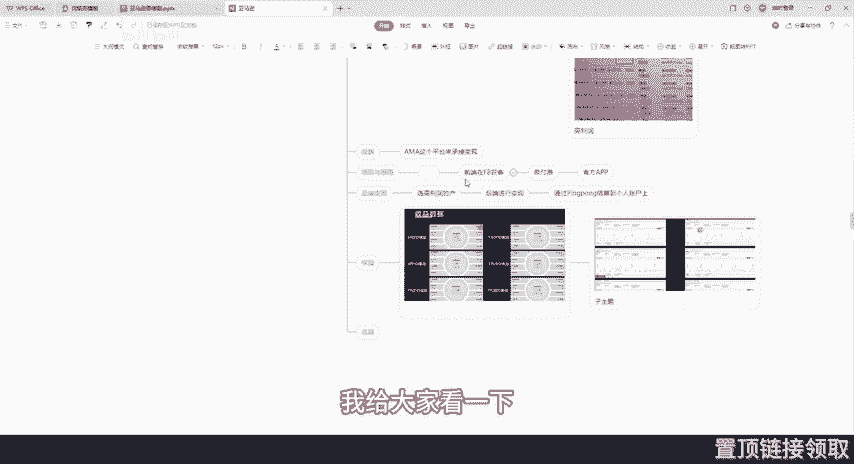
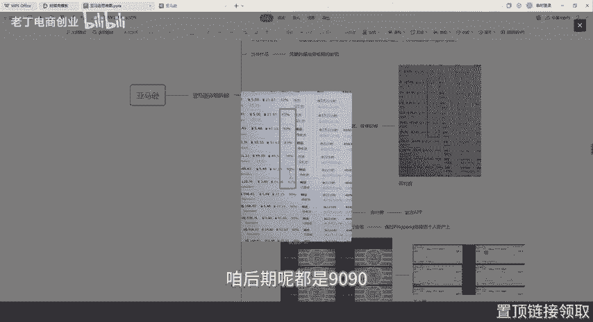
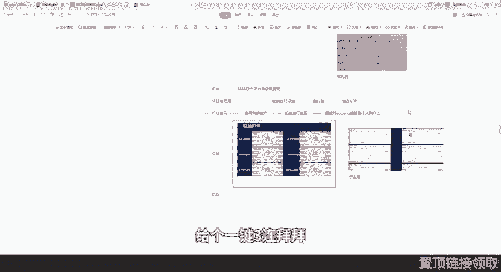
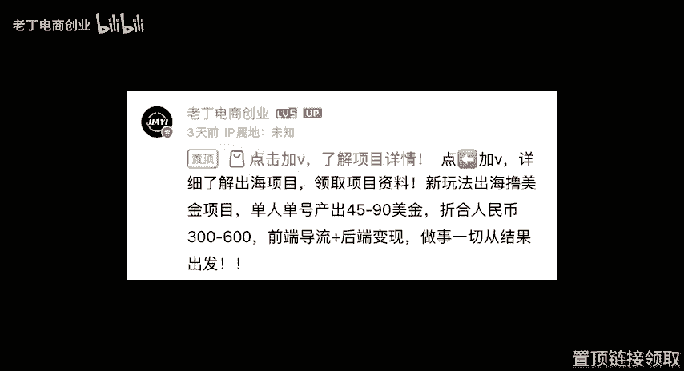

# 做亚马逊一年到底能赚多少 - P1 - 老丁电商创业 - BV19G1QYREnA

相信有很多小伙伴呢都不是很了解出海亚马逊怎么做。今天我想说的是，不要让自知束缚自己，不要觉得这个做不了了，认为很难做，就推倒这个项目。我们不做呢井底之蛙，咱要放开思维看清市场。没有任何一件事是想出来的。

看准了，咱就去尝试。而且呢我们都是通过实际操作总结出来的一个可行性。同时呢也有了一个客观的收益。有很多小伙伴他也私信问我说，有什么项目比较好做，不捐。我想说的是，那必须是提到蓝海赛道。为什么这样说呢？

就近期一年时间可以说整个互联网创业圈子当中都在讨论出海这个各种玩法。包括平时跟我们玩的比较好的团队，就像广州还有北京等这些呢也都在陆续的去做出海赛道。为什么呢？呃，由此呢，我总结出了三个原因。

首先就是咱国内环境太卷了。门槛太低，做的人也比较多。其次呢就是利润相对来说比较低。同样的一个项目，国内的一套流程下来，比如说一万的一个人效换成国外，有可能就是一美金的一个人效了。同样的活。

同样的项目利润却大大不同。🎼但是国外的风控却很松懈呀，毕竟是出黎名的自由嘛。所以说有很多东西在国内上不了的，在国外都可以上。而且呢也没有说有封号这一说，这是没有的。第一个就是国外不那么卷。

国内的赛道呢都是人满为患了，我做了三年的互联网项目，碰过的项目大大小小有十几个了。大部分项目都是做到6到10个月，就彻底更新迭代了，就得换了，不换是不行的，非常的卷。第二个呢就是同工不同酬。

单位时间付出的劳动是一样的，但是结果不一样，因为有汇率问题，美金呢都是1比7，就是同样一件事儿。你可能在国内。做完之后，收益能达到200。但是呢你要出海之后，这个收益就可能达到200美金了，这就是区别。

就是也可以大大增加我们的单人产出。如果说你想了解更多出海项目的玩法，我把它整理成了一个入门资料，放在评论区，你可以找我直接领取哈。么它这个简单的概括是什么呢？首先呢就是前端引流加后端变现。

其实跟国内的一些玩法很类似。就比如说微博小红书都有一种种草的属性，找到一些大主播帮你打广告，然后把这些用户啊导流到电商平台，就比如说淘宝拼多多京东来进行变现，但这个玩法呢也是一样。

就是咱们做的是FB平台引流，然后导流到亚马逊平台，这个流量的来源呢不再是说那些高粉丝的一些大主播，而是呢用微付费投流，投的都。是私信，为啥说投私信呢？因为私信的用户吧比较精准。

一个人如果对你这个产品感兴趣，他才会给你发私信。再者就是后端边现，不是说让你一个一个去聊，而是自动化，用固定的话术脚本去筛选人，这样的话可以提高这个效率。即使你不懂英文啊，也可以很好的实现导流这个效果。

因为平台都有一键翻译这个功能，不用担心沟通上出现什么障碍啊啊，这是我们账号的一个收益，这是一天的给大家看一下啊，平均可以达到就是一几乎都是100多好的时候都是300多。看到没？

这个而且都是美元。这个是148133、149、32230，这都是多，都是美金。所以说他这个收益是比较不错的。😡。

然后如果你作为新手小白，想要想知道具体的一个实操方案，我把它放在评论区里面。点击就可以加我领取啊。当然了，这里也劝退一波。如果你没有时间精力，而且没有这个执行能力，没有那么简单。最后呢。

希望大家在2024下半年的最后4个月能够冲刺一波，乘风破浪。目前呢我们一个账号平均一天可做到30到100美金。给大家看一下啊，简单的看一下啊，不对，是这个。

他这个金额看148，这个是133、149、322、321、361。我说的这些都是美金哈，都是美金，这是一天的时效，一天的。😊。

那接下来呢给大家再分享一下亚马逊从开店啊，前期需要准备什么东西，或者是到后期都变现都需要怎么做。前期呢一定要是准备一个营业执照，这是必须的。然后双闭信用卡，这是缴纳店铺保证金用的手机和电脑就不用说了。

还有一个是乒乓的软件。然后呢，开店之后就是发布作品了，这也是。必要的一个环节。为什么呢？就是你不发作品，它就不会有流量，没有流量，你怎么去编现呢？对吧？然后前端呢，我们就是用这个FB这个平台。

就是引流获客和种草的一个获客软件。我们发布作品是以微付费的形式来引流的这种获客都是投的私信。刚才在上面我已经说过了，所以说咱就简单的再说一下，投的是私信比较精准用户导流到我们后端。

也就是AMA这个平台来承接变现。整个项目的原理也非常简单，就是前端在FB这个平台上或者是其他平台，以微付费这个形式获取咱这个精准流量精准客户导流到第三平台，导流到第三平台来承接变现。然后总结一句啊。

就是前端获客导流，然后到后端自动变现。从而实现呢无人值守的一个方式来赚取美金赚取收益，都是通过乒乓平台来结算的。它会打到咱们国内的个人账户上。然后前端引流的原理呢就是比较简单了。模式呢也是通俗易懂。

就获客的方式呢，我们要做的就是一个合理的一个比例，一个好的投产比，一个好的转化率就可以了。那后端变现卖什么产品呢？呃，包括货源问题，这个也不用担心哈，就比如说咱那个奢侈美妆大人玩具啊等等这类项目呢。

当然我们可以选择那些利润比较高的类目，差不多利润在40%到80%，我给大家看一下哈。

这个就是利率，看一下这个利率呢达到42%，这个42%，这是90，这个83啊，这个相对来说是少一点呃，39，但是没关系，咱后期呢都是9090都是很多的，平均答下来得是40到80之间，这是保守啊，估计。

那这里呢也我我们也会对大家就是一对一的交给大家。平台呢也是非常正规的一个第三方平台。然后大家可以直接拿拿来直接就可以用了。不用说你自己从0到1啊去探路，去摸索。然后走了很多弯路是不需要的。

然后有需要的呢，可以加我领取一个后端的一个资源库。点击评论置顶链接加我就可以了。然后最后呢讲一下后端的一个变现。可能有很多人对变现吧不是很特别理解。变现呢分别为两种，一种是官方平台变现。

另外一种呢是第三方平台变现。后端变现的话，只要你把固定的产品啊，后台都搭建好了，流量来了，客户自己会下单。看到他自己喜欢的产品，他下单之后，咱直接就后台变现了。这个大家可以理解。

有很多人都是互联网的一些小白，然后呢，我们都会去呃亲自去带他们，大部分人呢都属于是比较基础比较薄弱的人。刚出社会的一些大学生还有一些辞职来找工作的，或者是一些先找副业的。再者呢就是先转型的。

目前工作都是目前工作室都是手把手一对一的，支持实地包交，提供场地和地址包落地，咱就是有这个底气。当然了，有需要入门资料的，也可以加我领取，然后给大家看一下我们公司一个。的一个收益啊。

他是7月份、8月份的，就得几天呢。可以看一下，就是成交13单，13单他就达到100啊1100。然后这六单呢可能少一点，就是达到600多。但是我说的都是美金，像这种20200多单呢就达到1700多了。

这个都是我们。8月份这个是8月2号的，这个是呢。8月1号的，然后再往前推就是7月30号，7月30号这个出的是非常多。那天爆单了，还有呢，这两天都是比较爆单的，我们卖的都是美金啊。

大家一定要记住卖的都是美金，它那个转化力度是1比7的，这个大家也都知道。然后目前呢，我们提现呢，也都是这个通通过平乓国际这个收款账户来提现的啊，非常的简单。给大家说一下怎么去。提升执行力哈。

把这个陆美金项目落地，并且呢能赚到钱跟跟大家说一个题外话啊。我有一个很要好很要好的一个。大佬可以说他是把我引进这个行业的。他曾经跟我说过这样一句话，他说用体力赚钱的时候，咱就老实一点。用头脑赚钱的时候。

咱就机灵一点，钱，用钱赚钱，咱就狠一点。用资源赚钱的时候，咱就圆滑一点，用人赚钱的时候，咱可以豁达一点。当时我也在考虑他说的是什么意思。然后这个大哥他又说了一句话。他说富人的核心思维呢，对于普通人来说。

我手里头有十分的资源，我才敢去做十分的事儿。而富人的思维呢恰恰是相反的。富人。会先定目标，然后再去配资源。只要依托于这种思维，几乎没有做不了的事，没有成不了的事儿。没有人咱可以去找资金不够，咱去筹。

像这种思维之下，仇人都可以合作。对手呢都可以双赢。而且富人的思维特别擅长于去拆分目标。富人定好目标之后呢。将大目标分成很多个小目标，或者是说行动点，把这些行动点呢在分析出来之后。

就会当成很多个目标再去拆分，越拆越细。最后你会发现无论什么目标到最后都会非常容易。同时呢富人也会把这些拆分出来，这个行动点去进行匹配这个相应的一些资源。在这种情况下，他的执行力是非常高的。

我把这句话呢送给大家，主要是帮助大家提升自己的执行力，做好做项目也好，做人也好，做事也好，只要把成功先整理出来，一步一步的过程缺什么，咱补什么把短的补上去，拿到结果，这个概率会很大很大。

然后今天呢就分享到这里，不懂的，或者是想加入的朋友点击视频下方链接找我就可以了。最后再说一句，评论区有很多接流打广告了，大家不要去相信啊，我也不过多解释了。然后今天呢就先说到这里，感谢大家的观看。

希望大家能支持一下。一个一键三连。拜拜。

