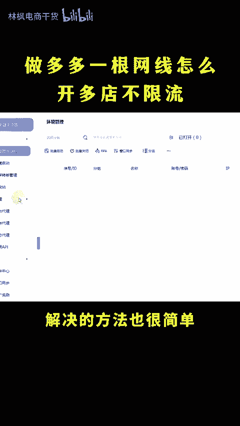
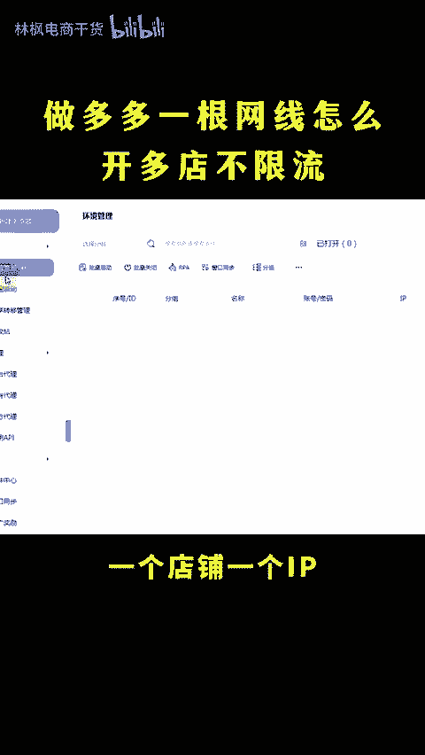
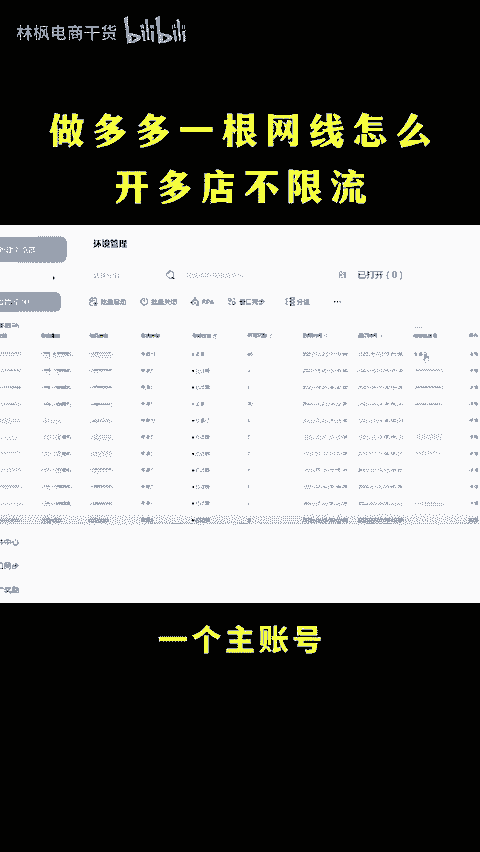
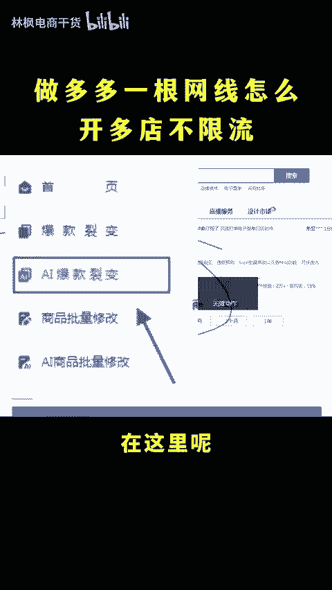
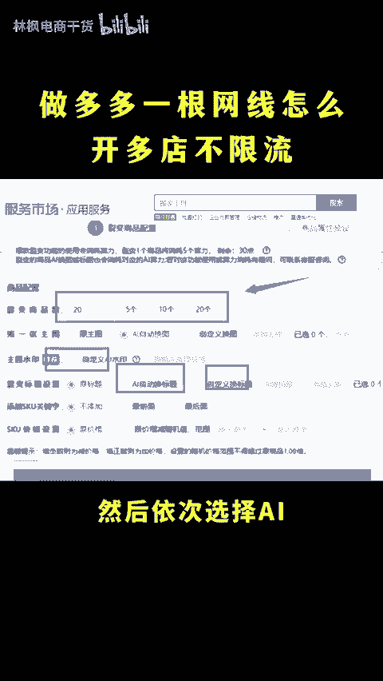
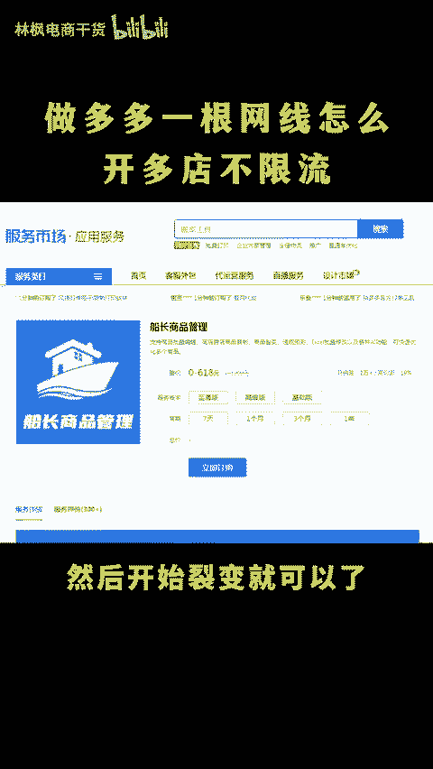
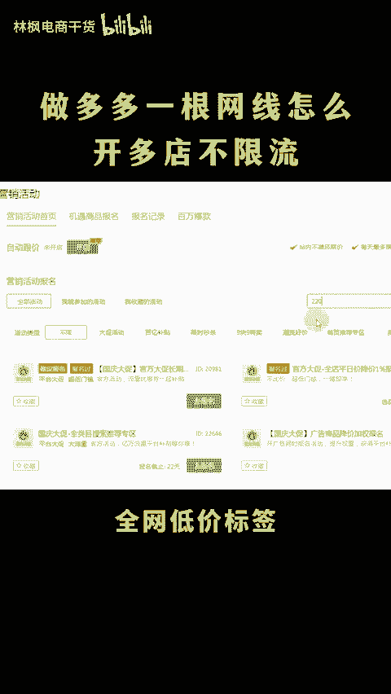

# 做多多一台电脑怎么开多家店铺？ - P1 - 林枫电商干货 - BV12osoetEKD

做多多一台电脑怎么开多家店铺呢？只要手机号过多就能开多店呢，这还用我教。我的天哪，一根网线怎么开多个店不被限流呢？开多电限流啊，多半就是因为你的IP关念了，所以一个店铺出现问题，其他的也会受关联。

今天呢就教你一招，轻松解决啊，大家可以点个关注，点个赞，直接上实操。😊，🎼解决的方法也很简单，不需要拉很多的网线，只需要用这个浏览器，一个店铺，一个IP开多店账号不够用的，也可以直接用这个云号码工具。

一个主账号就能开上百个小号，轻松开多店，开多店三链接嫌麻烦的，也可以用这个软件后台打开服务市场，速度传长，它是可以直接7天免费试用的。在这里呢找到AI爆款裂变勾选想要裂变的链接，选择裂变多少条。

然后依次选择AI自动换图换标题，自动加水印，可以标注上自己店铺相关的文字，然后开始裂变就可以了。上架好之后再打上这几个标签，流量订单蹭蹭起飞，全网低价标签搜索2084全网热销标签，搜索22052。

首先冲刺活动。20303限时优惠22196，打上这些标签啊，转化直接翻倍，还有不会的左下角。😊。

