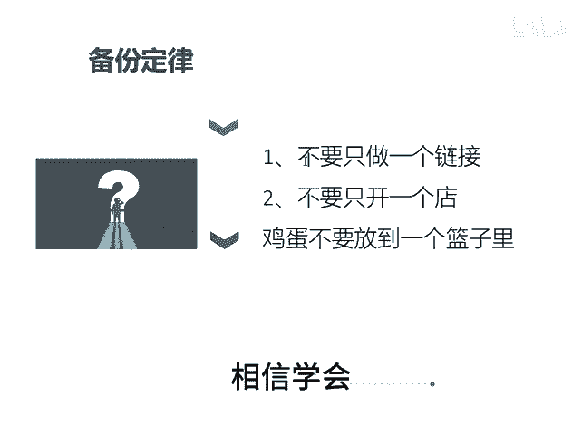

# 做好电商的三个定律 - P1 - 千优电商教育 - BV1EaxQePEZV

我们发现电商做的好的朋友啊，一般都在遵循下面的这样的三个定律。这三个定律呢，如果你能够遵守的话，特别是最后一个，相信呢你的店铺也差不到哪里去。第一个叫2分钟定律，所谓二分钟定律就是执行力。

很多人呢他是思想的巨人行动的他不做事只想我怎么做，可是呢并没有行动，就说呢如果你想到一个问题，请你2分钟之内马上执行。你说我上个链接，你说我下午上晚上上不行，你现在就马上把它解决，这叫二分钟定律。

第二个叫方圆定律，所以方圆定律的方是你要对平台的规则有敬畏感。我们知道呢拼多多这平台的规则又多，你像服务书记下滑你就降权。所以你对服务书记也要有敬畏感。你像各种罚款，各种违规什么受假处罚。

描述不服处罚等等等等这些建议呢你对规则都有敬畏之心，没有敬畏之心，那一不小心触碰了规则，可能就会影响到你的流量。所以语言就是在规则之外在拓展。你做事呢遵循。😡。

规则之后呢，就不要畏首畏尾，然后大胆的往前冲。第三个就是备份定律。什么叫备份定律呢？就是你不要只做一个链接，靠一个链接打天下时代过了。另外呢你也不要只开一个店，多上链接，多开店。这个链接出问题。

还有那个链接，这个店铺完蛋，还有那个店铺，不要把鸡蛋放到一个篮子里边，相信学会以上的三个定律可能对你的店铺运营是有一定的帮助。我是讲师大牙，欢迎大家扫码添加我的微信，不方便扫码的朋友可以添加我的微信号。

80221430。在这里给大家准备到了一套新手运营入门的大礼包，希望能够帮助大家。😡。

