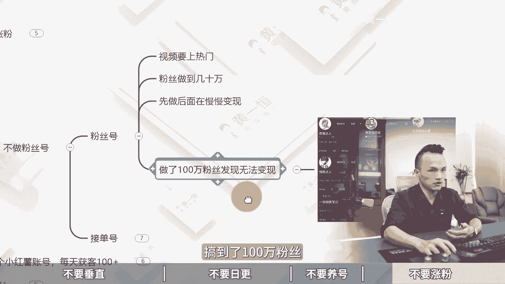

# 做小红书运营的4大坑，踩到一个就白做，小红书矩阵打法！2024版小红书运营教程，小红书起号教程，小红书运营课程，小红书矩阵推广，小红书引流加微技巧，小红书引流技 - P1 - 黄一恒矩阵推广引流 - BV1PfxMedEok

做小红书不要垂直，不要日，更不要养号，更不要只关注粉丝量，如果你踩中一点，没流量，踩中两点等于白做，踩中三点可能账号报废，这点钱不踩中，那你一定做不起来啊，哦吼只讲一遍，大家做好笔记。

一个视频给你分享做小红书运营的四大坑，踩到一个等于白做落地教程有点长。

记得先收藏一起来看，会给你分享，做账号不要锤子，不要日，更不要养号，不要涨粉，为什么嘞，咱们来一探究竟，现在看第一个为什么不要垂直，这里讲的不要垂直啊，是指的不要太垂直，太垂直啊。

等于没流量出爆款呢非常非常难，有的伙伴的赛道本身就非常细分，发布之外流量也就300~500已经是极限了，如果你想拉高流量怎么办，我们就可以稍微做一点偏泛垂直的内容，在小红书的推流机制里面。

我们来看一下这个推流权重，它是由账号近30天的互动数据决定的，比如说用户的点赞评论，收藏转发之类的来决定我们的这个初始推流，那不同账号呢也是不一样的，如果你最近30天整体的数据拉的比较高。

你发布一个细分的笔记，他也是可以获得比较不错的流量，所有的账号呀可能是50个小眼睛，有的可能是100个，有的可能300个，有的可能1000个，那怎么拉高1000个呢，你可以稍微做一些泛垂直内容。

来拉高你整个账号的基础推流，你再发垂直的这个流量绝对是什么不会太差的，所以咱们在做的时候，那么泛的选题，它更加具有流量，所以知识写得再好，也不如范选体力量大，产品拍的再好，也不如什么饭，选题流量大。

具体咱们来看一些实际的案例啊，比如说咱们现在如果是做韩语的，那么韩语学的干货发出去之后啊，只有一个人点赞，非常的惨淡，那怎么办呢，我们稍微做一下饭随吃，比如说我们给他结合上这个明星。

杨紫说韩语就是拼音好，这时候他跟这个什么电影明星结合在了一起，流量你可以看一下十几万的点赞量，流量非常恐怖好，再比如说看多了后，韩语的口头禅好流量也获得一点几万的点赞助，流量也是什么百万级别的。

这种就是稍微泛一点，但是呢也和我们的行业有一定的相关性，并不是完全不相关，具体在做的时候，我们可以用一个策略叫做先犯后垂，外浅内深，什么意思，那么先安范和外潜呢，主要的目的就是为了受众范围来啊。

更加重要，让我们的受众范围更广，流量更大，吸引潜在顾客，有的行业本身就特别的垂直，这个在行业里面有一个打法，叫做叫做不打产品来打人群，哎基本说有个伙伴他做的是宝妈人群，那什么是宝妈呢。

我们就可以做那种什么K12学科，或者说是幼小衔接类的这种就是打宝嘛，打人群也是一种玩法，再来看一下后垂和内伸，他的目的是为了转换目标客户，吸引那种非常精准的流量，来一个咱们就是一个订单。

那么具体我们在操作的时候，相当于潜就是触达我们的潜在用户，触达你想要去的客户，就比如说现在我们做这个旅游赛道的，那为了获得这个旅游的顾客，我就专门发这个西藏美食攻略，西藏拍照知识教学啊。

这些都吸引那些对西藏感兴趣的，想去西藏游玩的人，那么才会什么看到咱们的笔记，毕竟这里面我们加的关键词就是西藏，来做了定位，那深的话是转换目标顾客，我们可以比如说发九篇西藏旅游相关的。

再发一篇我们的这个营销内容，国庆定制胡杨林小报团，高奢纯玩绝美好，这个其实就是我们的一个产品信息了，只转换那些已经决定弃的客户，无法触达一些详细的，因为详细的他是不会看这个的，他只会看一些啊。

跟西藏相关的内容好，这第一个不要垂直，那么第二个呢就是不要日更，那么不要每天都去更新新的选题和内容，这会出现什么情况，最开始我做小红书也是这样玩的啊，每天我都在做新的东西，每天都得创新，全部做新选题。

内容太费时间和精力，有时候啊我们花一天时间做的原创内容，还顶不上，我们花30分钟去抄着别人爆款，真的是这么残忍，这么恐怖的，所以呢如果你全部都做新的内容，很快就会让你江郎才尽更新一两个月之后啊。

就撑不下去了，很快就放弃，觉得做小红书太难了太难了，为什么，就是因为咱们没学会这个方法，你要记住火锅内容，他在小红书的话是还会什么还会再火的，所以我们做小红书的时候啊，选题高于一切，选题权重大于80%。

谁做了报，我们也拷贝过来做，所以做小股税公式叫70%的相似，爆款乘以足够多的尝试次数，那么会看数据呢，就等于什么开卷考试，谁信号发啊，等于盲人摸象，很多伙伴把自己会的，自己想着自己有的发出去发。

像发朋友圈一样，效果非常差，所以咱们在做的时候，所有发布的笔记都要建立在别人的什么数据，技术指标之上，哎这个什么原因，什么意思，就相当于我们可以做一个爆款选题表格。

然后嘞从爆款选题表格里面挑选别人测试下来，数据反馈比较好再做，这绝对不太差，就像你跟朋友聊天一样，聊什么话题，他喜欢听，聊什么话题，他不感兴趣，所以咱们得聊他想听的，而不是你想讲的，哎这个点得搞清楚。

那我从选题表格里面挑选这种收藏比评论比，分享比比较高的，拿过来进行操作，哎就可以了，这个方法呢我们也称之为叫做重复爆款，新瓶装老酒，也就是把老的内容拿过来，放在新的这个什么模板里面套一下就可以了。

比如说封面相似的爆款内容，咱们来参考一下啊，考公的爆款方面三次考攻击力，骂醒一个是一个，然后呢放到这个夹击赛道集成灶，骂醒一个算一个，你看这就脱不了，你放到你的车道行不行，净水器骂醒一个算一个。

哎然后嘞做这个什么医美赛道的医美行业，那么骂醒一个算一个干货，相似的报考内容，咱们来看一下啊，比如装修干货，原来我们去年2月份发的爆款，那么装修一定在场的七个时间，无论再忙，装修一定要在场的七个时间好。

换个方面，装修一定在场的七个时间，你看把背景换一下，结果他又火了，又获得了1万多的点赞，这种就是什么新瓶装老酒的打法，好来看第三个，不要养号，不要养号，讲的是不要无效的去养号，很多老板天天给同行点赞。

给同行评论，拿来刷同的笔记，这个其实没什么太大作用，最多的就是让你去早点对标，那无效养的结果就是什么，没有办法打上精准标签，你这些刷的是用户标签，它跟我们的创作者标签没有任何关系，没有办法增加账号权重。

也没有办法提升笔记流量，那然后的本质你要知道是干嘛，他是为了让平台判定你是一个正常的用户，那么而不是那种机器号度过评价的观察期，模拟正常的用户来去使用小红书啊，比如说最开始我们注册完账号之后，哎。

可以完善一下资料，把资料选项卡里面的信息能填写的，尽量填写一下，接下来我们正常回一账号，每天呀点赞一些作品，浏览一些信息，评论一下，关注一下就完事了，同时在我们前期发布笔记的时候啊。

有一个建议尽量发布一些脱敏内容，快速的度过观察期，因为小红书他在起号的这个流程，就是你的账号他会先过观察期，然后呢再过一个识别期，最后才是精准推流，那前些年观察期都没过，你一上来就干这种比较敏感的内容。

那肯定容易啊，账号违规限流，我们要发布一些利他的干货，发布行业里面呢比较泛的一些什么互动选题，避免被系统判定为营销号，比如什么机器号呀，什么解6号水晶号，这种账号发布完之后，小眼睛都不破100。

甚至有的就是零播放量，零流量很惨淡，好来看第四个，不要涨粉，那不要涨粉指的是不要只关注涨粉，记住做互联网并不是粉丝多才能变现，原来我就陷入误区，觉得粉丝啊一定要做到几10万，一定要做到百万粉丝。

我在研究变现，结果越跑越偏，记住内容来越做越篇，你的流量越做越泛，越做越大，粉丝也越做越多，最后发现变现是什么，越来越困难，而咱们现在操作，我们只做接单号，不做粉丝号，这个啥意思。

粉丝号呢就是让他视频要上热门，粉丝要做到几10万，然后呢先做后面再慢慢研究变现，结果哎我搞了一两年，搞到了100万粉丝。

什么赛道火，我就搞什么赛道，这一两百万粉丝，最后我犯了一个难题啊，就是不知道怎么变现，加快的人呢没办法变现啊，非常困难，所以后面呢我彻底的放弃了，我这几百万粉丝账号，专门做这个接单号，结账号呀。

就是导流到11卖货，变成我们的通讯录好友，只做精准流量，有播放就能加粉，而且我们在这个接账号里面呢还配得上钩子，打法更加的猛，几十个粉丝就开始变现，像比如说我做了一个新号，这个新号嘞啊。

做了大概几天时间涨了200多个粉丝，这200多个粉丝里面就加了100个人，到我的10亿里面来，这100个人里面就已经有很多同学，购买了我的产品服务，所以这298个粉丝，对我来说已经变现了几万块钱。

好这种方法就这就接单号，所以咱们在做的时候，不要只关注粉丝，关注粉丝会让你越跑越偏好了，各位同学，如果咱们想真真正正的去玩好小红书啊，获得大量的流量和订单，其实呢最好的办法还是玩几站，一个人玩十个账号。

每个账号每天加十个人，那么十个账号一天就能够搞100个客户，这里面呢我给大家准备了这个集镇的前导资料，比如小红书的入门硬干货，让大家充分的了解小红书的内容，收录机制，运营工具，企业号的运营，KY的投放。

还有店铺管理，最重要的是，还有前面给大家分享的这个小红书的爆款，选题表格，咱们做笔记啊，千万不要看一条就拷贝一条，而是要整理一个选题表格，从选题表格里面挑选这个收藏。

比评论比分享比比较高的优先操作更加容易爆，这就是什么开卷考试，这就是学会什么看书记，还有给大家准备了三个小时的小红书系统课，里面有讲到小红书的前流程，钩子设计，保留方法，常见问题以及便利项目。

这些呢通通都已经整理好了，打包好了，通过主页就可以领取进行学习好各位同学，我是黄一恒，只做落地推广方法，刚才给大家分享了做熊出的几个坑，如果咱们想在互联网里面，搞到更多的流量和订单。

我们得学会打造多流量管道，这里面呢，我给大家准备了18个频率的详细打法，重点是这些都是我原创的小红书，就是其中一个流量管道，这些都可以通过主页来领取进行学习，如果觉得今天视频比较不错的，请大家一键三连。

感谢大家支持。