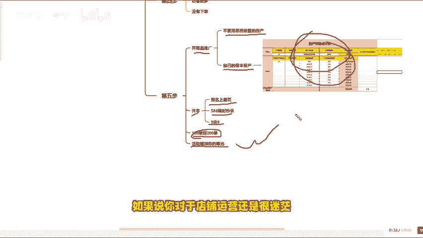

# 做拼多多店铺每天日销100单-200单是非常简单的，新手可以直接模仿这个视频来，拼多多运营，拼多多运营思路，拼多多运营实操教程，拼多多开店，拼多多起链接全流程 - P1 - 小苏电商-分享干货 - BV1jBxMegEaS

做拼多多店铺每天100单到200单，其实是非常简单的。你只要套用我这个方法，就算你是新手小白也可以做到。现在还有很多商家还在用老方法去起链接，上来就是改销量，做评价，然后直接把链接丢到推广里面。

这样去做链接根本没有任何效果。拍摄头档极低，钱就算花出去了也没得赚。今天来分享一下最适合新品打造的方法，你也可以点赞收藏起来反复观看，想起新店的商家可以直接模仿这条视频来。

如果说你看完这个视频还是不太懂的话，我也准备了各个类目的实操文档，评论区自取，你也可以根据实操文档来操作。首先第一步产品上架前，你一定要去做好链接的反比价，那什么是反比价呢？

他的意思就是让你的商品不被同行低价抢走流量。拼多多会根据三个点确定你的同行图片描述和规格。如果你这三个点做的跟你的同行差不多。那么同行价格比你低，你就很难获取流量。因为系统会把同款产品拿来比价。

如果你的基础差价格还没有优势，那肯定是比不过老店铺的图片这一块自己要加上一些营销词规格也要加上一些其他的字体。图片的话，比如说开业特。

新客帝景工厂直销，今日特惠冲量加大加量等等描述规格。比如说报填超停，这样的话，平台就不会认为你是同款产品，从而卖的贵也会有流量。第二步，新品报名活动，活动千千万。

但我建议大家前期报名20981这个长期大促活动。这个活动是没有什么门槛的，主要是为了确定你的链接有没有被比价。如果你的价格压的很低，说明你的链接被比价了，最好重新做，一直到链接做好为止，磨刀不误砍才工。

前期花点时间把链接做好，可能比你后期各种操作都要使用。那么第三步，你可以上传几个同款产品，这一步非常关键，我们可以多做几个链接，在里面去找主推款，很多人报完活动之后效果不好，就不知道该怎么做了。

其实做新链接是最好的选择。第四步，报名活动之后，找到流量表现比较好的链接，然后我们去做销量评价，1万左右的销量100左右的评价就可以了。让产品有一个基础的转化率，不然的话就会出现反客很多。

但是没有下单的一个情况。最后第五步就是活动加开车了，开车我们开商品推广，不要用系统设置的投场。自己去算一下自己的保本投产，不知道怎么计算的，可以拿这个表格去计算一下自己的保本投产比。

通过开车把你的链接能报名上首页，58是限氏秒杀9。9块等等这些活动。一旦报名上活动，加上开车，你就会发现每天100单到200单，真的不要太简单。因为活动可以增加你的曝光，这两个是相辅相成的。看到这里。

如果说你对于店铺运营还是很迷茫，可以拿一个我整理的运营文档。

