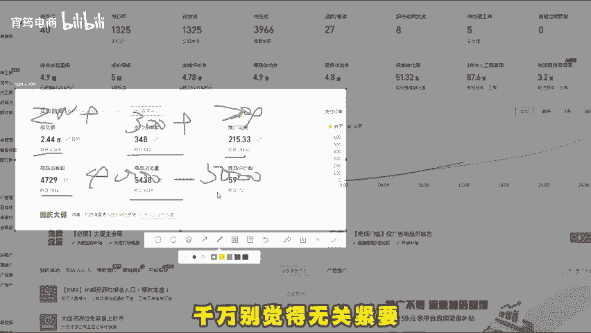
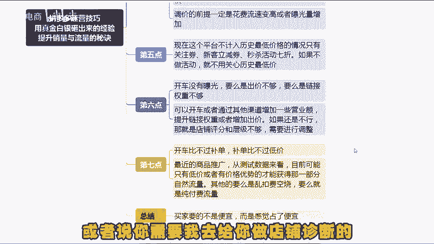

# 做拼多多真的不难，我用真金白银砸出来的经验，教你如何提升销量和流量（拼多多新手｜拼多多运营｜拼多多开店｜拼多多实操） - P1 - 宵筠电商 - BV1HZxLe6EDy

在拼多多平台上，同样的操作方式，为何自己就是不出单，没有流量呢？今天就要聊聊这个平台上一些容易被大家忽视的小细节，这些可都是用真金白银换来的经验。在这个平台上有很多容易被忽略的小细节。

千万别觉得无关紧要，否则就亏大了。老规矩，大家听我慢慢道来，记得收藏起来，多看一看。首先，这个平台的商品链接只要涨价，点击率和转化率必定下降。接着流量就会减少，订单也会变少，权重自然就跟着降低。

所以前期把价格定高一些，然后慢慢降低，找到合适的区间价一定不要有链接改高价的行为，哪怕新增一个商品规格也可以。其次，当产品的规格种类超过两个时，卖的最好的往往不是最低价或者是最高价的规格。

而是中间价格的规格。所以一般利润款要设置在中间价格。再者这个平台的大促活动，没有额外的流量。它就是一场比价活动。还有一个要点是产品定价。凡是尾数带。

九的会比整数卖的好，而尾数带七的又比带九的卖的更好。一个原因是美观。另一个是避免视觉疲劳。带久的，大家看多了，带期的也很不错。第四，很多朋友没事就喜欢改图片动规格，调价格要明白的是，每改动一次链接。

权重都会受到影响。而且一次性调价格时，降价可以随意调整，但涉及涨价一定要格外谨慎，为什么常说涨价容易出问题呢？调价不符合要求或者过多的问题，很多店铺都有，大家一定要记住。

调价的前提一定是花费流速变高或者是曝光量增加，不要随便调整直通车，不然很容易断流，调价过多，不管是投产还是出价低，价格低，投产在0。3以内的话，一天调价一次就好了，不要太多。很多朋友动不动就调一两个点。

不断流才怪呢。第五个，现在平台不计入历史最低价格的情况，只有关注券，新客立减券，秒杀活动7折。如果不做活动就不用关心。最低价。第六，开车没有曝光，要么是出价不够，要么是链接权重不够。

可以开车或者通过其他渠道增加一些营业额，提升链接权重或者增加出价。如果还是不行，那就是店铺评分和层级不够，需要进行调整。第七，开车比不过补单，补单比不过低价，最近的商品推广，从测试数据来看。

目前可能只有低价或者是有价格优势的，才能获得那一部分自然流量。其他的要么是乱扣费空烧，要么就是纯付费流量。最后大家应该知道买家要的不是便宜，而是感觉占了便宜。为什么现在买家都去这个平台呢？

因为同样的产品相比其他平台。在这里能让买家感觉占了便宜。好了，今天就分享到这。如果说看完视频还是不太懂的话，可以找我领取实测文档也可以提问。或者说你需要我去给你做店铺诊断的，也可以来找我。

最后就祝各位早日爆单。

