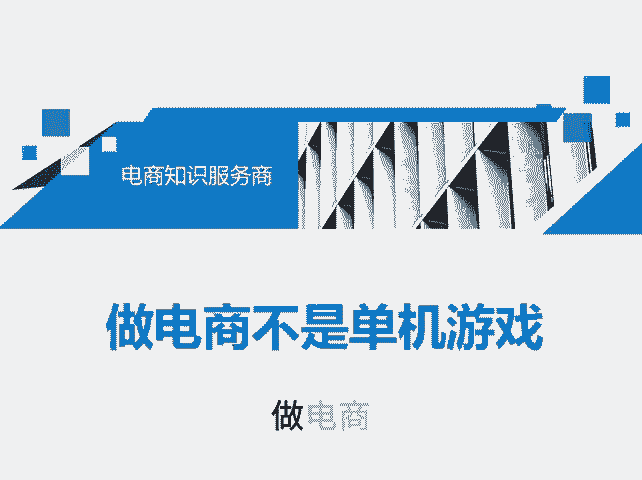
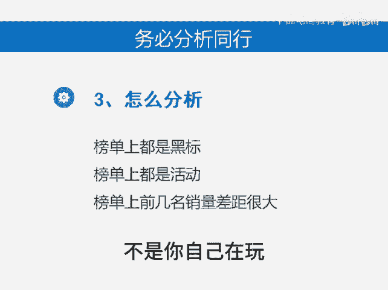

# 做电商不是单机游戏 - P1 - 千优电商教育 - BV1qExreAE3o

做电商呢，它不是你玩单机游戏，做电商的是网络游戏。但是呢很多商家他活在自己的世界里。当店铺出问题的时候，他首先想到是自己的问题，其实不见得。因为做电商是多人游戏吗？这时候呢你要考虑什么？

考虑同行对你的影响。同行会影响你什么？首先是流量的分配。如果你的行业同行太多，那分配流量就比较难吗？再一个系统分配流量都是根据你同行的数据，你说我权重高，你说我权重低，那都是和同行比较吗？

那比较哪些数据呢？你可以打开流量数据看一下这里像成交转化率这里有三条线吗？黄色的这条线是同行同层平均优秀，绿色这一条是同行同层的平均，蓝色的是我们如果你的店铺的转化率长期低于你同行的平均。

那么你的流量一定会出现瓶颈，并且会一直下滑。所以说呢你要优化的是转化率。再一个服务数据像服务数据呢过低都会影响流量。服务数据怎么样。😊。

算低呢也是和你的同行比较。比如说综合行业排名70%50%，这都是和同行比较吗？当你的服务数据低于同行的50%，那么你的流量就会影响。所以说做电商它一定不是你自己一个人的事。

再一个同行会影响你什么影响直通车的排名。有些朋友说那我为什么今天我的直通车流量少了一些呢？那就有可能是你的同行出价高了。还有一种情况，你说我出价很高了，为什么还没曝光呢？除了权重的原因。

再一个就是你同行出价都比较高，你这行业比较卷。所以说当你做店铺之前在做店铺的时候，你要务必分析你的同行怎么分析呢？如果你的行业上都是黑标，那么我建议你放弃这行业换个行业是吧？因为都是黑标。

你竞争不过他们。还有一个情况，就如果你的行业榜单上都是在活动上秒杀管联团。😡，这时候呢你会知道你的行业很卷，大家都通过活动获得流量，利润都不高。还有一个。

如果你的行业榜单上第123名销量明显比456差距过大，就前进名明显比后边的销量高，那么这行业有可能垄断，后面的都不好做。所以说呢你一定要了解你的同行，做电商，不是你自己在玩，而是和别人一同赛跑。

我是讲师大牙，欢迎大家扫码添加我的微信，不方便扫码的朋友可以添加我的微信号，80221430。在这里给大家准备到了一套新手运营入门的大礼包，希望能够帮助大家。😊。

