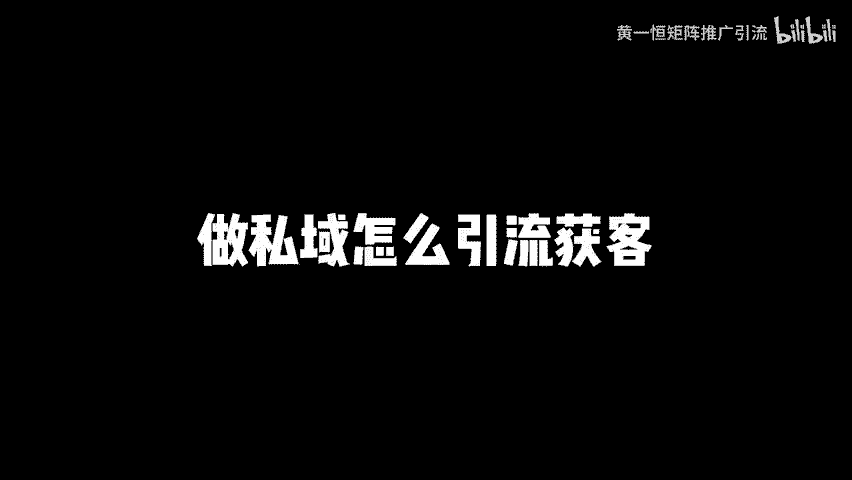

# 做私域怎么引流获客，布局21个私域引流渠道！做私域哪个平台，私域引流怎么做，私域引流教程，私域引流工具，获客引流渠道平台有哪些，私域流量运营，私域流量搭建与运营 - P1 - 黄一恒矩阵推广引流 - BV1aE421N7yq

🎼私引流又加满了几个账号，我们公司刚来实习生，我叫他去做失引流获客，他做了一个验又加满了几个账号，我们一起来看看他怎么做的。同时操作21个引流渠道，真是个人才。

nice这个方法不错，一天能加几百个好友，批量帮操作还节时间，季节废话，一个视频教会你做失意怎么引流获客，不及21个失意引流渠道。详细教程在这里机械下市场一起来看，我会告诉你如何设计钩子一般线索。

不及21个平台，批量进流量时，批量卡关键词获取流量。首先来看设计钩子，很多伙伴在互联网里面生产内容或者大量的曝光，却很少有人添加到自己失意，什么原因就是没有放钩子。通过今天的视频学习。

大家学会一个钩子思维。不管做哪个平台都要放上钩子。比如现在我们去写文章，在文章里面放上钩子。当有人看文章，对钩子感兴趣，自然就会加我们做图文也得放上钩子。当我们的图文获者大量流量之后。

对钩子感兴趣的人就会进入到我们的流量词里面来。拍视频也一样放上钩子。当我们的视频获得流量词推荐之后。

就可以筛选很多人进入到我们的私有量池，搞直播也得放上钩子。当我们获得直播推流之后，对钩子感兴趣的人自然就会来找你。那钩子到底有哪些类型，很多伙伴一头雾水。其实啊我们可以这样来做，可以是一个问题解决。

比如说像律师心理学出轨留学。这种行业就可以给用户解决问题，还可以是一个积极的解决方案，也可以是文件也可以是手册，这一块呢比较灵活，在我们提供钩子的时候，需要找准用户的痛点和需求。

只有找准的用户的痛点和需求，感兴趣人比较多，家里人呢就会比较猛。有的伙伴做了钩子之后发现没什么太大效果，可能就是你没有找准这个内容所对应的需求和痛点到底是什么。有了钩子之后。

接下来我们进入到第二步应援线索。记住，公益生产内容，它不仅仅是为了提高曝光，更多的是让用户通过线索来找到你。所以咱们去写文章做图文，拍视频搞直播，你就要思考一下，在哪个环节里面可以把钩子一埋到里面。

是需要一买一次，还是需要一买两次，一买之后，怎样用用户来找到你怎么去领取这钩子，这些我们都需要进行思考。只有我们把钩子一买好了，第一个平台也不会违规。第二个呢，用户也能接受。第三个还能有大量的人添加你。

这就是一买线索的重要性，否则啊很多伙伴在互联网里面去生产内容，曝光是非常多，一看流量几万，甚至有个夸张的几十万，但真正的找你的人去寥寥无几啊，七指可数，最主要的原因，就是没有这个预埋线索。

那有多伙伴呢这个线索一埋的太夸张的，结果导致啊平台违规，这种情况呢也会出现。所以这里面要找准一个点，每个平台我们在一买线索的时呢，方法都不太。需要以致调整。那当我们学会了硬盘线索。

接下来我们就需要去布局21个平台。在互联网里面，目前流量比较多的到底分布在哪些渠道，我们把它拆分为了10个板块。文章流量、图文流量、视频流量以及什么直播流量。现在看文章流量。

那文章流量就比如说我们可以去撰写文章，然后呢将文章发布到公众号、头条号、百家号、企业号、15号、网易号、知乎专栏、B站专栏这些平台本身就是有比较不错流量，毕竟他们都是背靠了很多互联网的头部平台。

写文章也是整个互联网里面相对来说比较简单的啊，而且在现在的时代里面有了AI可以通过AI我们去改写，然后来手动认射就可以搞定文章，这里面也是有方法的，弄好的话，流量整体还是不错。

但是现在整个互联网文章板块的流量，对于前几年来说啊大打折扣。所以大家如果做流量，那么除非是你这个行业对文章依赖性非常强。如果依赖性不是很强。我建议大家可以搞搞第二个图文流量，用文章流量整体在下滑。

但是图文流量在整个互联网的平台里面，它是呈现一个什么增长的趋势。比如小红书，它的用户规模已经达到了3。12亿。抖音的话它有9。6亿的用户，整体的图文呢做起来比较简单，它不像拍视频，要写脚本。

拍摄还得剪辑发布，整个比较麻烦。图文，我们要简单的学会制作，原来发不上去，流量啊它是远远不输于什么视频的。所以目前整个互联网其实从操作难度、流量大小以及可操作性来评估的话。

其图文流量是我个人觉得可操作性最强的平台。大家可以从这个入手。那如果没有能力，除了布及图文之外，也可以把这个视频布解。因为现在我们在手机上面啊，大部分人都在刷视频，吃饭刷、睡觉刷、走路刷。

基本上整个的时间段只要空下来就会刷视频。那视频这一块，比如说抖音、快手视频号，西瓜B站小红书，这些都有视频。那我们如果有能力去做视频或者有时间去做视频，视频这一块呢其实非常不错啊。

虽然视频做起来难度大一些，但是视频它的流量上限啊会更高一些，能够达到。比如说如果咱们上的热门，可能是几百万甚至几千万的流量，而且视频呢它给教育用户筛选过的流量啊其实精准度会比图片要高一些。

因为图文过的人，它的流量精准度是小于这个视频的那除了图文视频之外，整个互联网目前比较热门的这样直播，每个直播就像一个电视台一样。咱们开直播之后，平台给你推牛。

所以咱们如果会搞直播的伙伴还可以尝试一下直播。比如说我们做做抖音直播，视频号直播。还可以在1亿里面做成交直播，这些都是可以的。直播它就像一个流量杠杆。你开播开播之后平台给你进行推流推牛。

如果我们流量词比较大，一场直播啊，也可以加到几百甚至上千个1亿流量。那么这就是21个平台。所以现在大家思考一下，到底哪些平台四个自己，前期的话不用做太多，因为一个人根本做不过来啊。

一个人可能只能做这四大平台里面两个。比如说我们搞图文和视频或者搞视频加直播，或者从这里面选择，除非咱们是老手时间比较多，有可能做三个，四个都一起做，这个实在太困难了。

那具体我们这21个平台到底是怎么去拿流量的。第一个我们要学会进流量池。流量池就是你在做内容的时候，到底什么样的内容平台会给你推牛，能够撬动到平台的流量，所以我们要学会怎么去撬动平台的公益流量。

找出自己的行业流量密码，否则的伙伴机器流量啊基本上都是个位数，甚至有些啊什么1位数或者说百位数都非常小。那怎样可以获得几千上万甚至几十万的流量记住选题高于一些选题的前重啊可以说是大于80%。

这一块选题大家学会看数据啊，比如通过一些下拉词，通过指数分析工具，或者通过一些竞品的爆款选题把它整理出来。所以会看数据等于什么开卷考试，随性要发等于盲人摸像，咱们做的所有的这些啊笔记啊。

包括图文呀以及视频，所有的内容它都需要建立在别人的数据基础指标之上。这句话非常重要。如果你把这句话理解到位了，基本上你。做内容可以说是不缺流量的。那这个选题啊也并不是说每个选题它都能报。

其实我们做互联网，不管是每个行业，每个平台，它都有个测试的阶段，测试的阶段成本最大的。所以前期啊我们可能会整50个，甚至100个需选题，然后去测试，花1到2个月的时间去输出档案的内容。输出完之后啊。

这时候你可以对比一下，我们找出10到30个流量大的这10到30个，我们就把它称之为流量密码。那接下来怎么做呢？就非常简单的，我们只需要去循环这个流量密码就可以了。这就是互联网做流量逻辑。

包括目前我们自己啊也是在这样操作，就是前期测试这一块，很多伙伴可能不知道怎么测整个的成本会大一些。那除了进流量池之外，因为流量池它是靠系统的推荐。但是现在整个互联网里面有很多用户啊，他们是提前有问题。

想解决问题，想找答案。这种用户他不会去刷内容，而是会去搜内容，他打开这个平台，比如打开小红书，打开抖音打开视频号，打开B站，打开西瓜，通过右上角搜有框搜索。那。这的时候，咱们如果学会把一些搜索量比较大。

比较热门的关键词布及到自己的标题或者内容里面。那这样的话就可以拿到平台的搜索流量。而且搜索流量它的精准度是更高的。因为用户搜索代表是有需求，它是在沙漠里面卖水，而不是沙漠里面卖沙子。

所以咱们可以通过堆叠技术，比如说每个视频。那么堆叠5到10个关键词，这样的话就可以实现什么批量的卡关键词排名，让用户搜索关键词的时候，哎，可以找到咱们。具体比如说我给大家简单的示范一下。

比如说我们以这个投屏手机啊、抖音为例，我们把屏幕调大一点，然后呢在右上角的搜索框里面比如说在这里面我们搜索这个小红书挤赞啊，这是我们布局关键词，搜索完之后没发现好，我们的视频呢直接排到了前面啊。

获得1000多个载，这些就是搜索流量，包括我们在这里面搜索其他的关键词啊，比如说。好，我们在这里面搜索关键词公众号挤站，我们来搜索一下。好，搜索完成之后，我们往下滑滑动。

这里面它也会有我们的视频排名在前面。我们可以再搜索。比如说这个企业微信集站。好，搜索完之后，你往下方滑动，也能够找到我们自己做的视频。这些什么就是我们在做的一个关键词排名。所以大家在生产内容的时候。

除了进流量词，还要学会什么卡关键词排品，这两个流量非常重要。好，各位同学，我是黄一恒，只做落地推广方法，刚才给大家分享了私应引流获格的框架。那如果我们想细具体的操作这21个平台该如何去做呢？

去打造我们的多流量感道，这些我给大家准备了长达2到3个小时的详细落地视频，可以通过主页来领取进行学习。如果觉得今天视频比较不错的，请大家一键三连，感谢大家支持。咱们下个视频呢再会。

