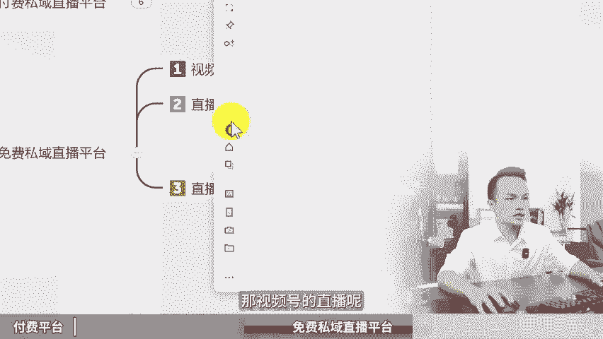

# 做私域直播哪个平台好，如何不花1分钱如何搞私域直播！私域直播平台推荐，私域直播用什么软件，私域直播搭建，私域直播间，私域流量搭建与运营，私域打粉实操，私域引流怎 - P1 - 黄一恒矩阵推广引流 - BV1nn4y1X7dR

🎼6800又白花了，我们公司刚来学生，我叫他去做CE直播，他自己花6800，买了1个CE直播平台。真是有钱人呢，我自己做C意直播十几年一分钱没花，如何做到一个视频教会你C意直播哪个平台好，不花一分钱。

如何搞C意直播详细教程在这里记下收藏，一起来看，我要告诉你付费的实意直播平台有哪些？我们一直在免费使用的C意直播平台又是什么？现在看付费C意直播平台。我们做C意直播搞了十几年。

市面上大大小小的直播平台都做了测试，甚至我们自己还购买了服务器搭建的直播系统，一年就要花几万块钱。但是发现人数过多之后啊，非常卡顿，整体呢也不是特别好操作。所以后面呀我们尤其找了很多的付费直播平台。

比如说大家熟悉的这个小童直播，很多伙伴都可能考虑过，还有微站直播，录营直播，有音直播保利为直播，这些平台呢它都属于付费平台，比要说合企业，毕竟他们每年都需要花几千块钱。如果买贵一点的套餐。

一年得花好几万。对个人来说，前期。

想搞C意直播一下投入几千上万，开支太大，毕竟还没赚钱，又得一大笔投资。那怎么办？这时来大家可以选择我们在用的免费C直播平台，其实就是视频号直播，在没有使用视频号直播之前，我们用哪些平台呢？

比如说最早在十几年前，我们做的是YY语音直播，后面升级为YY视频，再到后面升级为的腾讯课堂。现在我们在用的是视频号直播。那为什么我们会选择并且持续一直用视频号直播，它有什么特点呢？首先第一个完全免费。

而且视频号直播，你不用担心什么卡顿延迟流量不够用。多少人都可以毕竟微信的生态，微信的平台，腾讯的实力，在整个行业里面还是顶尖的。而且它能够打通整个微信的生态，视频号直播间可以直接分享到朋友圈。

分享到微信群，分享到企业微信还可以绑定公众号直接无缝衔接。直接打通，我们可以把朋友圈微信群企业微信公众里面粉丝全部给他对接到我们的寺庙直播间里面来。还可以当我们直播完之后，自动生成录播。

点个按钮就可以生成，都不需要单独去搞这个录播，非常间时间。像我们以前做这个啊腾讯课堂，包括以前搞其他平台测试的时候，都得自己单独搞个电脑，开个录像软件，有时候咱们异常直播3个小时。

一个录像文件就好几个机啊，真的是电脑非常卡。而且呢主要是费时间，费精力。最主要是视频号直播，它是可以导游失意的，不像其他平台。为什么现在像抖音直播，还有其他直播咱们不推荐的？因为在其他直播间里面。

你根本就没办法放二维码。视频号直播呢，你放二维码，它是被出现违规的，可以直接让别人去加你的失业。你放微信号呢，他也是不会出现违规的这就是微信生态的强大魅力之处。最主要的是如果咱们设置为开放直播。

我们在直播的时候呢，还能够分发到系统流量池里面的一个流量。比如说我们这场直播，那么直播推荐就是除了我们自己导的，比如说我们通过呃我们的群包括公众号还有预约之类的啊，那么导的一些客户之外。

剩下的751个人，就是通过直播推荐带来的。所以大家如果你在视频号搞直播，你可以额外的获得接近40多的流量。这个期节行业，如果咱们搞直播能力比较强，甚至你能够达到更高的比例带来什么更多的流量，这就是什么？

4秒直播也是目前我们一直在用的那4秒直播的方式啊，可以通过手机播，也可以通过电脑播。它的直播方式呢有很多种，哎，可以公开，所有人都可以看到，也可以部分还可以单独付费。甚至咱们刚开始可以练习自己的直播。

比如说先彩开一下都是可以的。接下来我来给大家试图演示一下啊。首先我们以手机直播为例。那么咱们打开自己的微信，找到发现，然后在这里面我们选择上视频号。然后呢，在这里面找到右上角。

我们进入到视频号的个人中心。然后接下来我们点击这个啊发起直播。这时候我们选择这个直播按钮，就可以进行一个手机直播。我们通过视频号直播的时候啊，它有几个非常强的功能，什么强的功能来。

我们一起来带大家啊演示一下。首先我们在做直播的时候，他在这里面是可以切换，可以做横屏也可以做这个什么竖屏，最主要的是它是可以关联我们的群的啊，比如说我们勾选的这个群之后，一共最多可以关联20个群。

也就是我们一旦发起直播。我们的直播入口立马就会同步到这20个群里面。而且你在直播间里面发红包。记住啊，在直播间里面发红包，它的红包会直接跑到粉丝群里面，也就是用户在粉丝群里面它需要领红包，必须。

要跳到直播间内面的力，这也是目前啊微信它主推的一个什么？那么直播辅助功能这个功能呢我个人觉得是非常不错的。直接把群无缝衔接到咱们直播间里面来。那么其次啊我们在直播的时候。

他还可以选择我们的一些直播的方式。比如说咱们如果想撬动平台的流量，就选择公开直播。如果我们想让不几个人单独给他们直播，我们可以选择什么部分可见，部分可见，也就是我们单独的选择这个群。啊。

比如说我们勾建这个群，那只有这个群里面的人才可以看咱们直播，其他人呢是根本进不来的啊，这叫部分可见。那么其他的还有一些，比如说我们给它切换一下啊，这里面还有这个付费直播，彩开直播。

这些通通都是可以的那4频的直播呢，目前整体的功能呀还是非常强大的还可以做语音直播，也可以做游戏直播。那么画面呢在这里面还可以做各种各样的设置，这些大家在播的时候呢，可以稍微熟悉一下，也就了解了。

那像我们自己啊做这些干货呀，包括教学类直播，我们就通过电脑的，要投屏电脑，那投屏电脑，这个是怎么做的，我们也给大家演示一下，咱们打开电脑版，然后在右下角这里找到三条杠，选择视秒直播工具。

如果是第一次打开我们是下载这个工具啊，它可能大概会卡个几分钟，那么下载完成之后呢，这时候他就会打开我们的一个呃那么直播的窗口。这个直播窗口啊，它就可以在这里面进行一个设置，可以添加画面啊。

画面的话可以加很多可以加摄像头可以加窗口。

可以加屏幕，可以加手机画面，可以加进程，可以加图片，可以加文本。它跟我们的抖音直播办理啊，功能非常相似。但是没有抖音直播办理这么强大。另外，当我们点击这个啊开始直播的时候。

他就可以在这里面选择我们直播的类目，包括谁可以看公开部分还是付费，你看这里面就可以选择，而且他可以关联群，当我们做直播的时候，我们的这个什么直播可以直接同步到群里面，像前面讲到的。

我们在直播间里面发红包，那么群里面的人他会看到一个红包，他要领红包必须要跑到直播间里面来。这就是那么视频号直播的强大之处。各位伙伴，所以大家如果想搞实直播的来，那么这也是目前视频号直播的一个。啊特点。

那私样直播也有缺点啊，C频样直播如果你在里面演示非视频号生态的平台，它是会违规扣分的。比如说不能演示小红书，不能演示抖音，如果你不涉及到这两个平台的关键词啊。

目前像我们这一波暂时还没有说出现啊其他的一些违规，都可以正常的进进直播。好，各位同学，我是黄一恒只做落地推广方法，当我学会了搞C意直播。接下来更重要的我们得学会建立自己的摄营量词。

至于我们拥有了大量的摄饮量词。这是你做C意直播，才会有更多的人进到咱们直播间里面来。C直播最大特点就在一对多，不管来多少客户，我们都可以在直播间里面进成交进行卖货，而且他可以卖一些高客单价的产品。

那如何去搞更多流量，建立自己的摄饮量词。这里面我给大家准备的是8个平台的详细打法，教大家如何打造，多管到流量。这些呢都是我原创的，可以通过主页来领取进行学习。如果觉得这个视频比较不错的。一键三连。

感谢大家支持。咱们下个视频呢再会。😊。