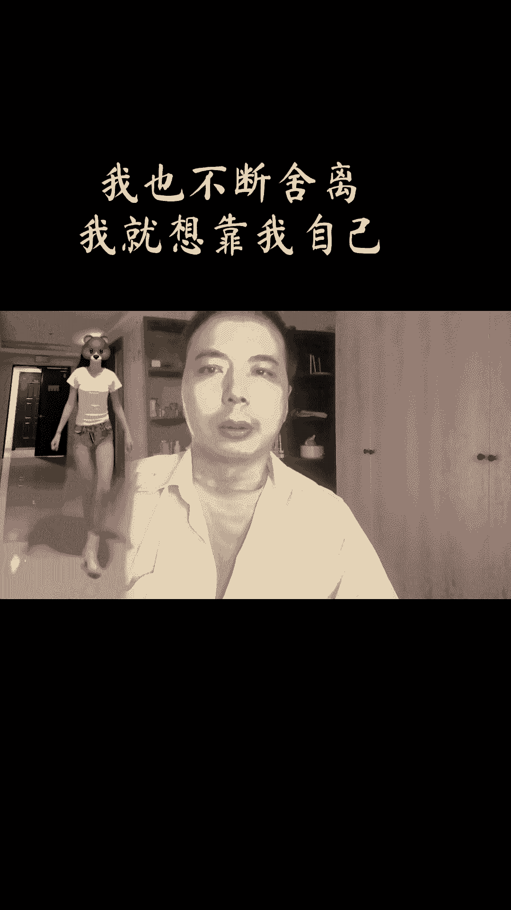
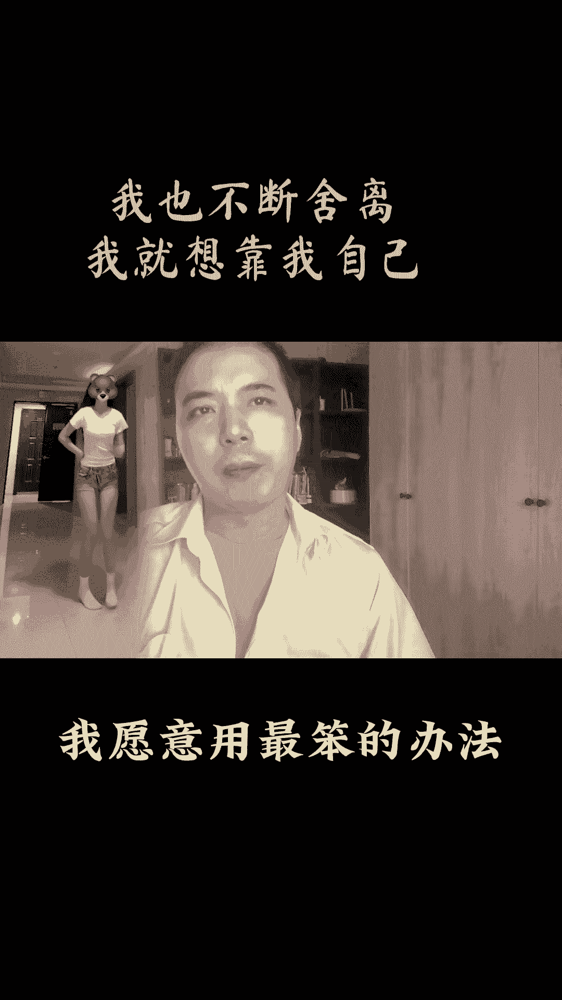
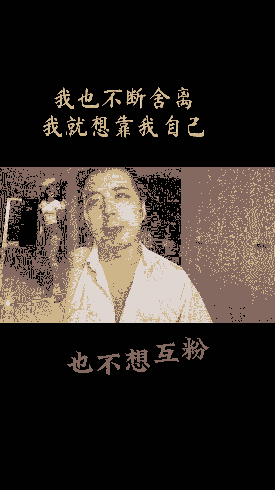
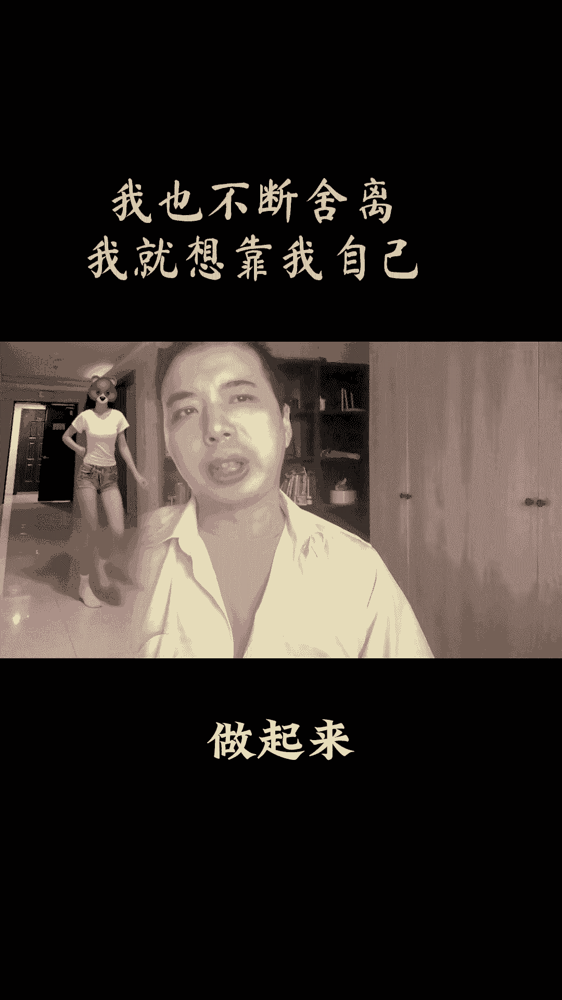
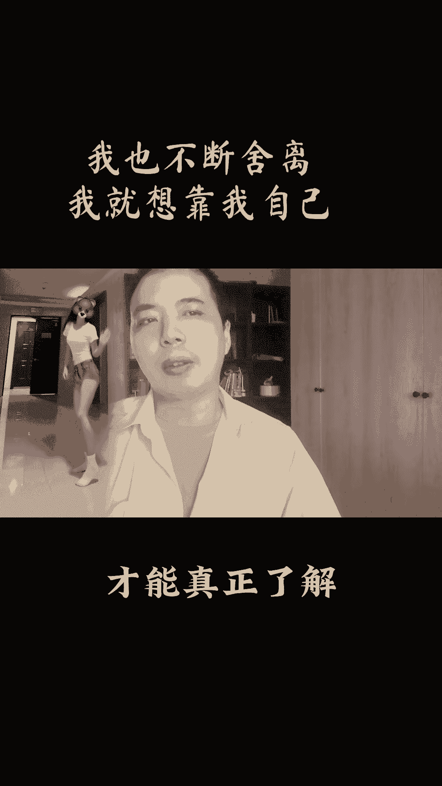
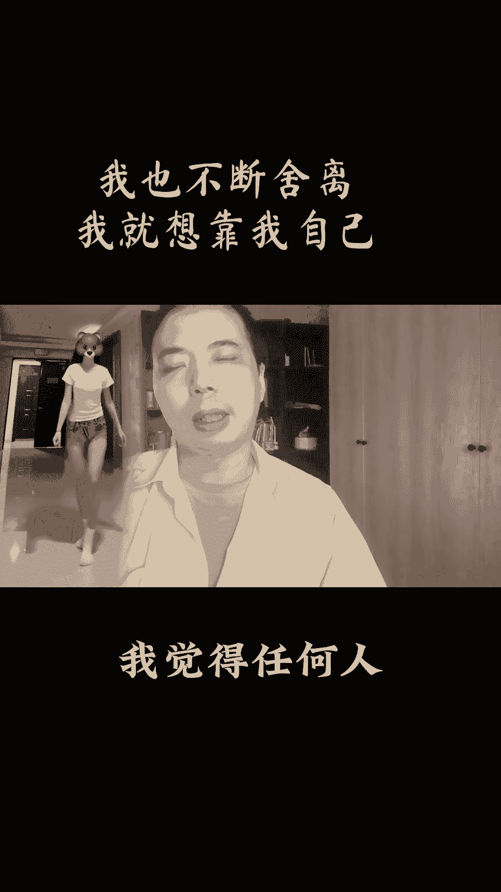

# 做自媒体只有做最真实的自己才最简单也最真实，才能有更好的松弛感和表现力。你们觉得呢？# 新人如何做抖音 # 新人账号如何快速起号 # 干货分享 # 自媒体 - P1 - 孙掌柜的工具箱1 - BV1HgVWehEXY

从做自媒体的第一天起，我愿意用最笨的办法来起跳。

我也不想买榴莲，也不嫌富风化。

不显出原始股东，我也不会断手笔。

我就想靠我自己能不能把这个账号做起来。

因为通过实习的新鲜时尚，才能真正的了解并创作出有价值的内容。

我觉得任何人都能起号成功。

