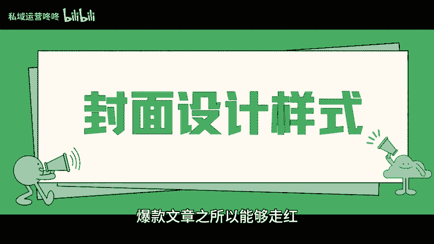
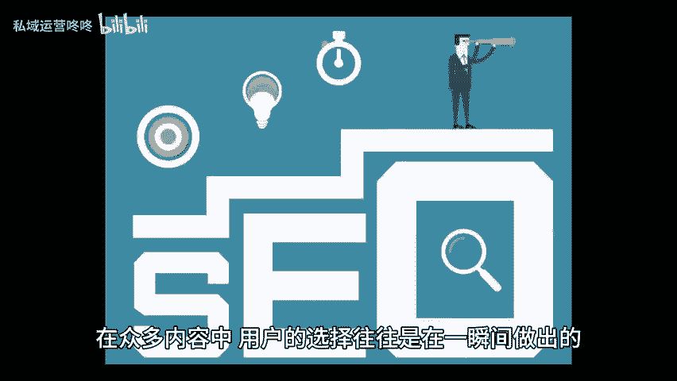
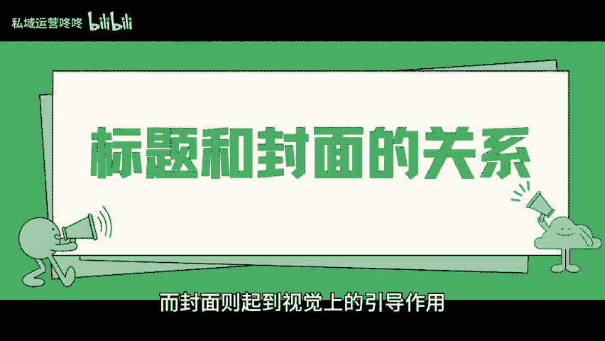
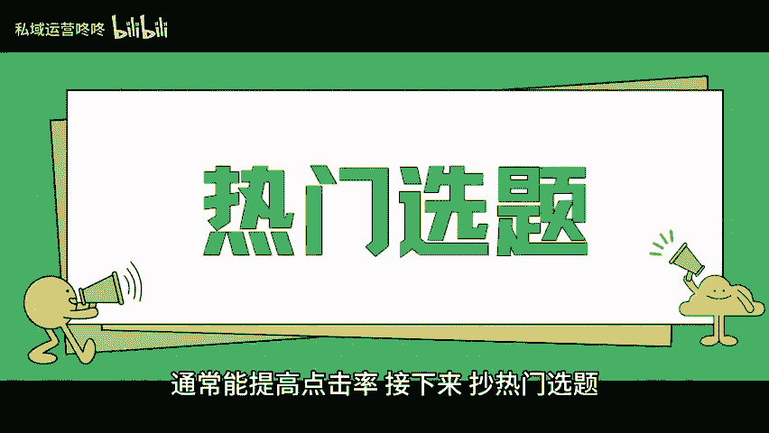

# 做运营真的不要太老实！要学会“抄”！ - P1 - 私域运营咚咚 - BV1A142187BQ

🎼无论是新手还是老手，在进行运营工作时，都要学会通过抄来提升自己的创作水准。这里的抄并不是简单的模仿，而是要有技巧与选择性。那么怎样才能有效的抄呢？首先，抄封面设计样式，爆款文章之所以能够走红。

很大程度上是因为他们的封面设计引人注目。在众多内容中，用户的选择往往是在一瞬间做出的，因此，封面的吸引力至关重要。我们可以寻找平台的爆款内容，分析他们的封面设计风格，是否运用了对比色。

有没有使用具体的图案或元素来传达主题。同时，别忘了在封面设计中融入一些个人的特色。其次，抄标题和封面的关系。好的标题能够激发用户的点击欲望，而封面则起到视觉上的引导作用，二者必须相互呼应。

共同传达出内容的核心信息，在撰写标题时仔细观察爆款是如何运用关键词和情感化的措辞来吸引用户，例如使用一些疑问句或者数字开头的标题，通常能提高点击率。😊。

🎼接下来超热门选题运营工作的一个重要方面就是紧跟潮流，关注用户的需求，根据自己的账号定位，选择一些用户关注度高的热门话题，能够显著提升你内容的曝光率。当然，内容的质量不容忽视，选择热门话题的同时。

也要确保所提供的内容具有专业性和深度，这样才能在流量的基础上，建立起长久的信任。最后一点，尽管学会抄是提升运营能力的重要手段，但在抄的过程中，一定要保持自己的独立思考和创造力。

不能完全复制粘贴具体内容哦。😊。