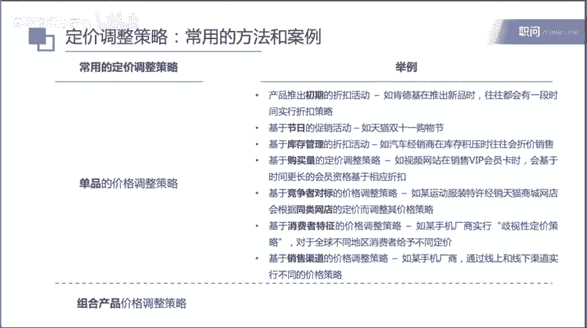

# 像咨询顾问一样解决企业内部问题 - P4：4-1：如何像咨询顾问一样解决企业内部的问题（1） - 清晖知识分享官 - BV1LW42197bm

各位同学大家好，今天呢进入到我们的商业分析技能课新一期的学习。那我们今天讲的课程的内容呢是如何像咨询顾问一样解决企业内部的问题。其实咨询顾问呢，其实就像企业的外部的一个医生一样。

他经常呢会帮助各类的商业企业去解决各种问题。那这一页呢是我自己的一个介绍，我叫russell，之前给大家也讲过一些课程，所以大家应该对我比较熟悉哈，这里我就不赘述。那今天呢我们讲的企业的内部问题呢。

主要是挑了两个比较常见，也是咨询公司经常会帮助企业解决的问题。一个呢就是说在一个企业推出新产品的时候，如何针对一个新产品进行定价。另外一个呢就是如何解决这个盈利率下降的问题。

那其实呢企业还会面临很多其他的问题。比如说我如何建立自己的销售团队，然后销售管理如何更加有效。比如说我是否做出要推出一个新的产品，或者是一个进入到一个新的市场。的一个决定。

比如说我是否要进行一些收并购的决定等等等等啊，那企业呢会面临不同种类的各种各样的一些问题。那么咨询师呢其实在很多时候就是有相当于企业外脑的一个作用，帮助企业运用自己的整个的逻辑思维的能力。

包括一些外部的一些数据啊，外部的一些专家的资源的支持，结合企业内部的情况，去针对这些问题提出相应的解决方案。那今天呢我们主要围绕这两个问题来进行一个讲解。OK那我们进入到我们的第一个环节。

就是说如何对一个新的产品进行定价。那这里呢我在讲这部分内容的时候，我们先从一个案例出发。比如说呢有一个电动汽车的厂商，他现在呢研制推出了一款新的电动汽车。那么在推出以后呢。

他需要在销售之前需要呢对这个产品落地进行一系列的动作。其中很重要的一个环节，就是说对新款的电动汽车进行定价。那应该怎么定，用什么样的方法，有什么样的思路，那这个是一个比较典型的一个问题。

那么在讨论对一个产品定价的时候呢，通常呢其实我们会关注两个方面的内容。第一个方面呢就是说我如何设定一个基准的定价。就所谓我们这里说的pricing baseline我如何设置一个基准的定价。

那另外一个方面呢，就是说当我有了这个基准的定价以后，我如何去进行所谓的一些定价调整。也就是我们这里所看到的这个pricing adjustmentjust。

那进行这些定价调整来去更好的帮助这个产品的销售，提升这个产品的销售量。那么这个是我们关注的两个方面。那么我们第一个方面呢关于如何设定这个价格基准啊，那通常呢有两种不同的方法。

第一种方法呢叫做基于成本的定价。那大家可以看到这个英文其实就基本上是b在它的cost，以及对于cost margin。这两方面的要求来进行一个定价。那第二个呢就基于竞争和需求的定价方法。

那么呢这个呢更多是从竞品出发来进行这么一个定价。所以。comp demand is the pricing strategy那具体怎么做？它的思维是什么样？这个我们会在后面的课程中去进行介绍。

O那另外一个呢，就是当我们设定了这个基准定价以后呢，为了促进销售，我们会经常要进行很多的定价的调整策略，等会也会给大家举一些例子，大家听到这个例子的时候，也会觉得比较熟悉，比如说在产品推出的初期。

我们会有一些推出的折扣活动，我遇到一些节日啊，我们推出了一些促销活动，然后为了进行库存管理，比如说库存的积压的情况下，我们推出了一些折扣活动。比如说还有购买量，对吧？

其实大家去菜市场自己买菜也有这种感觉，对吧？买一根萝卜是多少钱，买一筐萝卜是多少钱，对吧？你购买量不同，然后呢有不同的折扣和定价。那还有呢就基于竞争者对标的价格调整策略。

当你有一个priing baseline以后，你需要经常去观察你的竞争者现在在做什么样的动作，他们的价格如何调整，从而来调整你自己的定价。那还有就是基于消费者特征的价格调整策略。

这个等会我们也会举大例子。其实大家买机票有时候也会感受到，这个其实是有所谓的价格歧视的这么一个策略，对吧？那机票在不同的时段的时候，它的价格是不一样的那可能针对于不同消费者，比如说头等仓，对吧？

那比较有钱的人和比较一般的人或者针对会员或者非会员，那都有一些价格调整的策略。那还有说基于销售渠道的价格调整策略，这个等会我们也会举例，那这个呢都是一些基于单品的一些价格调整策略。

那还有一些我们会看到很多的组合产品啊，比如说你打包销售，大家这个应该比较熟悉，比如说去吃肯德基麦当劳，如果你购买的是一个套餐的话，它整个的这个定价策略也是不一样的。所以呢这些不同的定价调整策略。

等会我们也会一一来举例给大家说明。好，那我们接下来呢讲一下第一个部分，就是说如何设定priing的 baseline。那第一个方法呢是基于成本的定价方法。那么基于成本定价方法呢，基本上呢是这么5个步骤。

第一个步骤呢就是我要确定单品的成本。那可能就要建立一个excel模型来考虑单品，比如说固定成本的部分可变成本的部分，来确定呢每生产，比如说一辆电动汽车，它需要多少钱，这个成本是多少。然后呢。

第二个呢是跟管理层共同确定一个所谓利润率的一个目标。那这个利润率的目标呢，有可能不同年限可能还不一样。比如说刚开始的时候，你产品刚推出，你为了最快程度的去抢占市场去提高市场份额。

可能我要求的这个利润率目标是低一点的。那但是在比如说这个产品是一个成熟产品，或者是就是说它已经快退出市场的时候，那这个时候呢，我的目标应该是尽可能的多赚取一些利润那这个时候呢。

可能我的margin利润率目标就会高一些。那这是。第一个利润率啊，这是第一个要考虑的那有些时候呢我们也会考虑说达到盈亏平衡点，我的年限的目标。比如说我推出这个产品。因为我前面有很多的一次性的投资。

比如说建立这个厂房啊，设置生产线啊等等等等。那包括一些RMD就所谓的研发。那这些的成本one off的成本都很高。那么我们来定一个目标，比如说通过三年或5年的时间，我可以达到一个盈亏平衡点。

那后面我就开始赚钱。那根据这个盈亏平衡点的这个年限的目标来算出说每年我需要盈利多少才可以去，比如说在三年到5年的时候覆盖我前期所有的成本的投入，那根据盈利的目标来确定一个定价。

那结合考虑利润率和达到盈亏平衡点的年限目标，我们就可以去确定产品的一个初始的定价。那么确定初始定价以后呢，因为只是一个测算的结果。所以我们需要在比如说某个地区进行一个小规模的投放，以这个价格来进行销售。

来验证这个产品的一个性价比。是不是能够被消费者所能接受？那么这个是一个试错的过程来避免说你后续大规模的进行价格的调整。当这个试错以后，我们看到了这个消费者的一个接受程度。如果消费者说不比较能接受的话。

那么我们再把这个价格进行一些调整和优化。那么验证之后，我们就可以确定产品在各个地区最终的一个定价，从而再进一步的大规模的去投向市场。所以呢这个是基于成本的这么一个定价方法。

那另外一个呢就是基于竞争和需求的一个定价方法。那这种方法下呢，我不是从成本方面考虑，而是从竞争品这个角度来考虑。那么大概呢有这么六步的过程。第一步呢就是我们会先进行一个市场调研。

比如说我推出一个电动汽车，那我就要看一看其他的电动汽车厂商，它们的同类的产品，或者有的时候如果你推出的这个新的产品，它是一个比较创新性的哈，市面上比如说举个例子吧。

比如说第一个推出电动蚊香液的这么一个产品。那原来可能都是这种需要燃烧的这种蚊香，需要固体的蚊香。那如果你是第一个做出这种产品的人，那你可能就要看一下这个市场上替代品，它的产品的定价是怎么样子。

所以呢第一个部分叫做市场的调研。第二个部分呢就是说我定义自身的产品，相比于竞争产品的优势和劣势。比如说电动汽车，对吧？大家知道电动汽车的话，你可以从比如说它的外观的设计啊，内饰的设计啊，它整个持续的需。

行的里程啊，或者是说它自动操作系统啊等等等等一系列的方面。我可以与刚才我们选定的一些竞争品进行对比，来看一下我们的优势和劣势。那包括刚才说的，比如说这个电动蚊香液，那相比于传统的固体的蚊香。

比如说它有很多的好处。比如说不容易引起火灾，没有很多的燃烧后所产生的一些灰烬一些垃圾等等等等啊。那我们会定义自身的产品，相比于竞争品或者是替代产品的优势和劣势。那第三步呢就是说基于上述的这些优势和劣势。

进行消费者的调研，来看看这些优势和劣势，对于消费者来讲，是不是真的有吸引力，或者说吸引力有多大。那消费者愿意为了这些性能的提升来付出多少的议价。所以呢我们需要进行消费者的调研来定义上述的这些优势和劣势。

对于整个价格的影响。OK那第四步呢就是说我们会综合上述谈到的一些影响，对价格的影响去制定最终的一个价格。那这个。价格呢作为这个产品的初始定价推向市场。那同样呢第五步和第六步跟上面一样。

我们需要在某个地区来进行小规模的投放。因为你前期呢只是一些消费者的一些口头的调研。那么在真正以这个价格投放的时候，到底有多少消费者接受消费者到底是否认可这个性价比，这个都是需要小规模的投放的一个验证。

那最终呢我们去确定这个产品在各个地区的最终的定价。所以呢这个就是基于竞争和需求，所谓竞争就是竞争品，它现在一个价格的基数，那需求就是消费者对于这些产品性能提升的认可以及愿意付出的溢价的程度。

那基于这两个方面的一个定价方法。OK那接下来呢我们看一下，刚给大家介绍了两种priing baseline啊，所谓的基准定价的策略。那么各自适用于哪个行业。基于成本的定价方法呢，更加适用于竞争较为激烈。

并且竞争相对同事化的市场，比如说餐饮市场就是一个竞争。相对非常激烈的一个市场。特别是一些中低端的餐饮市场。那高端的话可能还是我们有一个品牌的溢价。但对于中低端来讲，它基本上就是基于我的成本。然后呢。

再算一个我的盈利率的目标，然后给出一个价格。那包括目前的手机行业，大家都知道，其实最开始等会我们也会介绍啊，基于竞争和需求。那最开始的苹果公司，它是一个比如说它的苹果手机是一个非常非常跨时代的一个产品。

比当时的一些三星啊，诺基亚的一些产品，要领先非常的多。所以那个时候呢它可以卖出很高的溢价，基本上它是一个主导性的，或者是一个一枝独秀的产品。但是呢当整个的智能手机所有的厂商，包括三星，包括华为。

包括小米等等等等，都在介入智能手机这个市场的时候，那竞争也越来越激烈。所以呢有一些汽车厂商，比如说小米它都会更加的去追求性价比。比如说他就会说，哎那我去基于我的成本，大家都知道的雷军在发布会上也。

公开的讲过，整个的小米的手机最终的综合的利润率不超过5%。所以呢这个就是一个基于成本的这么一个定价的方法来在竞争的这么激烈的市场中，通过降低价格提升性价比来更好的获取更多的市场份额。

那这个是基于成本的定价方法。那另外呢基于这个竞争和需求的定价方法。一般来讲呢就是说适用于竞争激烈程度相对较低，并且有自己超出其他竞争者独特优势的市场。比如说奢侈品行业，我们说比如说路易威登LV啊。

推出一个新的包，那么推出一个新包的时候，它的定价绝对不会去享受，哎，我这个包的成本是多少。我这个包的原材料是多少，制造运输的关税等等等等啊，它不会从成本的角度来出发。

而更多呢是看当地市场上其他的一些竞争者，尤其也是一些高端的奢侈品品牌，他们皮包售价是多少。然后呢来看一下啊自己的这个设计啊等等等等。包括这个实用性啊等等。那相比于其他的。同等竞争者的同类型的皮包。

整个的这个售价啊，他再去确定一个自己的新款皮包的一个售价的价格。所以呢这个就是一个典型的基于竞争和需求的一个定价方法。那么当然刚才说的是一些比较极端的情况，小米和路易威登但很多的公司啊它在定价的时候。

其实这两种方法也是综合去使用的。比如说他先参照这个市场上的竞争品，或者是替代品和客户的需求来制定一个价格。然后呢，再把这个价格拿回来做一个内部的测算，看这个价格是不是能覆盖自己的成本。

如果不能覆盖的话呢，再去进行一些涨价的一些调整。如果能够覆盖的话，看一看哎有没有更进一步降价的可能来初期呢最大程度的去争取到更多的市场份额。所以呢这两种方法呢。

其实在很多的产品推出定价的时候也会交叉使用，也会去做一个相互的验证。啊，那刚才给同学们讲述了两种pricing baselineline的两种方法。那么这一页呢我。

会对基于成本的定价方法给大家举一个用刚才电动汽车的这个实践案例也来展示一下如何去使用。那按照我们刚才给大家介绍的方法论几个不同的步骤。第一步呢，我们首先是确定单品的成本。

所谓的这个cos per unit。那我们可以看到说那生产一辆汽车。那我们需要涉及到很多的成本，项包括这个固定的成本和可变的成本。其中的固定成本。

包括比如说研发工厂的租金、生产线的depreciation，所有的折旧，生产工人的工资运输储存销售人的固定薪酬等等等等marketing啊，管理层的成本，这些呢都是属于生产一辆电动汽车的一个固定成本。

那么可变成本呢，就包括比如说原材料的成本，比如说采购轮胎啊、发动机啊，它的整个的内部的操作系统啊等等等等。还有就是销售的成本，销售一台汽车，销售人员整个的提缴和奖金，包括税产生一定收入，你要向国家缴税。

那就是税金的成本。那所以呢最终生产一台汽车的这个成本，其实就等于固定成本在单台汽车上的分摊。所以大家在计算的时候，可以说比如说我预测一年整个的固定成本大概有多少，那我一年做一个销售量的预计啊。

销售多少辆汽车或者生产多少辆汽车。那么我做一个成本的分摊。那就是平均到每辆汽车上的分摊到的固定成本。再加上生产每辆汽车它的一个可变成本。那所以呢这个就等于整个生产一台电动汽车的整体的成本。

那第二步呢就是说根据利润率的目标或者是达到盈亏平衡点的年限的目标来去确定这个产品的出始定价。比如说如果我们的利润率目标是定在20%，那么呢我们的成本上应该再加上20%，就等于我们的整个的产品的一个定价。

那如果我们的比如说设定的这个breakeven point，就所谓的盈亏平衡点，我们是要确定5年达到相应的盈亏平衡。那么我们可以估算一下5年累计的一个销售量。然后呢再估算一下5年的销售量。

我们比如说基于某一个定价。我们的净利润的一个总额，那这个的净利润总额在5年的时候，应该就达到或者是超过我们的one of cost，就所谓的初始的投资。比如说RMD啊生产线的建设。

达到我们初始投资的这么一个金额。那么我们在5年之内就可以实现一个盈亏平衡，从而去确定这么一个产品的定价。OK那么有了一个产品的初始定价以后呢，我们就会在某一个地区进行一个小规模的投放。

比如说我们说该车型仅在华北区的这些门店中进行销售，来看一下消费者对于这个定价。对于这个产品的一个认可。因为消费者来购买这些产品的时候，肯定他会综合考虑这个产品的性价比。

特别是对比市面上的一些相应的竞争品有什么样的提升，这个提升我是不是能接受。所以呢我们会去交叉验证一下，通过小规模投放的方式来验证一下消费者的接受程度。那也有可能比如说这个车型我们不在线下店销售。

我们仅在网上渠道进行销售。比如说现在的很多电动汽车品牌，像小鹏啊，像未来啊，他在推出的时候，其实都会去进行一个网上预售这么一个动作。

通过他们的网站或者是APP来去验证一下消费者对于这个产品的认可程度以及他的线上预定的这么一个热情程度。所以呢这个都是一个属于测试性的投放。这么一个策略。那基于上面的验证呢。

再去对整个的定价进行最终的一个调整，并确定一个最终的定价，并且实现一个大规模的投放。所以呢这个是我们利用电动汽车这么一个案例来给大家讲一下基于成本定价的方法。

那这里呢我们也去搭建了一个小的excel模型，大家其实可以看到，那我们把所有的所谓的fi cost就是说每个月所有的to fixed cost所谓的固定成本列出来。

其中有一些像factory rental cost像lament depreciation，然后还有manmentmarket salaryND等等等等的一些固定的成本。我们列出来。

那么我们预测比如说每个月啊我们销售400辆汽车，那么分摊到每一个汽车上，基本上是17万人民币这么一个固定成本的分摊。那么这是固定成本那able cost的所谓的可变成本的部分呢，比如说生产一辆汽车。

它所需要的原材料的成本。这个 bonus就是给到销售人员的。然后还有tax啊，所谓的税，包括一些有 cost，就是说的生产一辆汽车。因为你会要用到很多的水啊、电啊，一些能源，那它的成本大概是多少？

最终我们可以算出那 variableable cost可变成本，对于生产每一辆汽车来讲，可能是35万元。所以呢整个的total cost，就是生产一辆车的total cost这么两个加总啊。

基本上就是52万。那么比如说我们设定一个margin的所谓利润率的一个目标，20%的利润率目标来去计算出ok那我整个的定价只要是62万，这样子才能满足我对于margin的一个要求。

OK这里给大家展示的就是说如何通过一个excel表来去使用这个基于成本的一个定价方法。那我们也给大家讲一下，刚刚提到的基于竞争和需求的定价方法的使用。刚才呢给大家介绍的方法论。

那结合电动汽车的这个案例啊，我们来给大家介绍一下这个方法论如何去使用。那第一步呢就是刚才我们提到调研同类竞争对手的定价。那我们可以去首先我们要确定一下对标产品的一个范围。比如说我们推出的新款的电动车。

那这个市场上我们会看到有一些什么样比较热销或者是知名度比较高或者比较成熟的一些电动车的产品。比如说小鹏汽车，比如说比亚迪。比如说未来特斯拉、宝马等等的一些电动汽车。那我们在确定了对标产品的范围以后呢。

我们就可以去调查一下我们的对标产品相应的定价。那这个呢是我们的刚开始的一个市场调查。第二步呢就是我们要定义我们自身的产品啊，相比于竞争产品的一个优势和劣势。那我们可以去列一个所谓的对标的一个矩阵。

比如说我们生产的新款的这个电动车相比于我们上述提到的这些公司的电动车产品有什么样的优势和劣势。那我们比较的维度呢有很多。其实刚才我也大概提到过，比如说这个电池续航的里程，比如说内饰的舒适的程度。

比如说操作系统的先进性，有没有自动泊车啊，自动驾驶啊，音乐啊等等的一些导航，对吧？操作系统怎么样，启动的加速度啊，我们的汽车的一个硬实力怎么样外观的设计怎么样，品牌的价值，品牌的认可度怎么样等等等等。

那这些呢都是同学们也可以想一下，是不是还有一些其他的比较的维度，那这些维度呢，我形成一个比较的一个维度的矩阵来去把我自己的新生产电动车的产品，与刚才的这些对标产品去进行一个逐一的对标。那第三步呢就是。

说那我们会基于刚才的我们的一个对标的一个维度或者对标的一个矩阵。我们定义出了我们的产品与其他竞争品的优势和劣势。那这些优势和劣势到底会对于消费者在选择这个汽车的时候有什么样的影响？

他们愿意付出多少的溢价，或者是愿意付出多少的价格的下调。这个影响如何？那后续呢我们就会进行一个所谓的啊我们说消费者的调研。那我们可以去采访一些已经购买的电动汽车产品。

或者是即将购买电动汽车产品的这些消费者，我们不管是通过有很多的调研方法。因为之前的课程人员也来介绍过，对吧？比如说focus group啊，这个交点小组，比如说一些问卷的调研，比如说一些靠啊。

陌生的拜访等等等等。那通过这些消费者的调研呢，我们去了解到消费者对于这些优势和劣势的溢价折扣的一个观点。我们这里也举一个例子，比如说我们可以去询问一个潜在的消费者说，我们的汽车续航里程比。

目前市场的电动车要长100公里。那么你是不是愿意为了产品的升级或者性能的升级，去付出一定的溢价，你愿意付出多少钱的溢价或者是百分之多少的溢价。那这个呢都是我们可以跟消费者去调研的时候聊的一个问题。

OK那在跟消费者调研以后呢，我们就可以去综合上述的一些优势和劣势的影响，以及消费者的观点，去确定这个产品的初始定价。那么我们会将所有的优势劣势带来的溢价折价进行一个综合，制定产品的初始定价。

这个等会儿我们也会举一个实际的一个一个案例，拿一个excel表来给大家去讲一下具体是如何去进行一个溢价和折价的综合。那第五个呢和第六个呢就跟我们刚才步骤一样了。在某个地区进行小规模的投放。

有可能比如说是在华北地区，有可能是在我们说现在网上进行一个预售等等等等。然后我们去看一下消费者在线上预定的热情和预定量，来看看在线下门店中，消费者对这个价格是不是接受。

那最终呢我们再确定一个我们说我们的电动汽车，在各个地区的最终的一个定价。所以呢这两个步骤跟刚才就是一样了。那这里呢我们也举了一个真实的就如何给大家去搭建这个excel表的这么一个案例。

那具体的实际操作呢，大家其实可以看到，其实我们把三个公司ABC假如说这三个公司是我们调研的重点的公司，是我们主要的竞争对手，或者是比较类似的竞品。然后呢，我们把这个ABC3个公司的电动汽车产品列出来。

比如说A公司的目前的售价是75万，B公司呢是目前的售价是48万。C公司呢目前的售价呢是60万。举个例子，然后呢，那我们再把我们的新生产，新研发出来的电动汽车与ABC3家公司的这么一个产品进行一个对比。

我们这里呢就列出来了一个这都是所谓的对标矩阵。我们来去衡量一下这个price increase或者是decrebased on the product，基于这个产品性能的一些提升或者是折价。

比如说我们会看battery condition。所谓的电池的性能braing electronic system。ce就所谓的加速度outlook design外观的设计，内饰的设计。

还有afters的就属谓你售后服务的一个质量等等等等。那我们去定义说呢比较不同的这些维度，对于定价的一个影响，对于消费者决定购买的影响，我们就可以做出一些价格上浮。比如说我们说要举个例子。

比如说相比A公司，我觉得我们的电池的性能或者是续航的里程是要比A公司更好的。所以呢可能比如说对于它的定价我们可以上浮120%。但是呢我再举个例子，比如说这个加速度。

那我们的车的这个启动速度啊是要比金争对是要差。所以呢我给我们的价格打一个8折。所以呢基于这些影响因素呢，我们来最终确定一下，是比于A公司的汽车，我们的定价是怎么样才是合理的。比如说这里确定下来。

对于A公司我们进行的比较，我们认为我们的价格应该是58万。那对于B公司的话，可能我们是63万，与C公司对标完，我们可能是62万。那最终。

那我们可以把这三个价格去进行一个平均取一个平均值作为我们电动汽车产品的初始定价。那在这个案例中呢，可能我认为我们初始的定价可以定在61万，对吧？

然后我们经过一个小氛围的投放来看一看整个市场接受的程度和效果。所以呢这个呢就是整个一个基于竞争和需求的一个定价方法，在excel中，如何通过一个excel模型搭建，来完成这么一个测算。

那刚才我们讲的呢其实都是所谓的基准价格，就pricing baseline的一个置顶啊，有两种不同的方法，基于成本和基于竞争。那么还有此外呢。

就是大家其实可以看到的市场上每一个公司对于自己的产品都有非常丰富的一个定价调整策略。定价调整策略总结来讲呢，其实可以归于两个方面，一个呢就是基于单品的价格调整策略。

另外呢就是我们说组合产品的这个价格调整策略。那基于单品的话呢，其实有很多种给大家举例说明一下，比如说第一种是我们叫做产品推出初期的一个折扣活动。比如说肯德基在推出一个新的口味的汉堡的时候，啊。

往往都会有一段时间，比如说两个月或者三个月，那实施这个折扣策略。让大家先来尝个鲜，对吧？看看大家对于这个口味是不是认可。第二个呢就是基于这个节日的促销活动。比如说最有名的就是天猫的双十一购物节。

基于节日呢，我们会去有一些产品的折扣。第三个呢就是基于库。存的折扣活动。比如说汽车经销商，他在进货进太多库存积压的时候，为了降低自己的库存成本，包括为了说使资金快速的回流。

他们就会采取一些折价的一些销售的一些策略，去把自己的库存尽快卖出去。第四个呢就是说基于购买量的一个定价策略，举个例子，比如说大家现在在很多的视频网站或者是一些游戏的一些网站。

他在销售这种VIP会员卡的时候，比如说对于一个月他可能是我随便说啊，对于一个月，比如说30块钱，对于两个月可能就是50块钱，他会有一个折价，对于一年的话，他可能有一个更低的，比如说100块钱。

你就能买一年。所以呢在你购买量更大的时候，或者时间更长的时候，他会给予你相应的这些折扣。第五个呢就是说基于竞争者的对标。比如说某运动品牌的特许经销商，他在天猫的商城网店，他会去根据同类网店，呀。

因为可能不是他一家在买耐克的鞋或者是优衣库的。衣服。那么他可能会根据其他的销售渠道或者其他的竞争者同类的网店，它的一个售价来调整自己的这个价格策略。其实呢现在在这种购物网站上，比如天猫啊、淘宝啊。

甚至有专门的这种软件或者是这种服务提供给线上的这些商家们。这种服务就是说我可以通过一个软件或者是一个系统。我来实时的监测到同类的竞争网店。他们的售价。只要他们的售价一上调或者是一下调。

我自己的系统自己的模型，就会跑一个最终的价格调整的方案，直接你就可以应用在你自己的价格调整，所以呢已经实现了对这种竞争网店的价格的实时的监测，以及自己的产品的售价，实时的一个调整。

所以呢是非常的自动化非常的智能化。这个就是所谓的基于竞争者对标的价格调整策略。那还有呢就是说比如说基于消费者特征的这个价格调整策略。举个例子，比如说苹果公司在不同的地区，它可能都会有不同的竞价策略。

在全球的不同地区的消费者，它其实成本都是基本上差不多的。但在不同地区给予消费者不同的定价，那这个他可能更多考虑是当地的，我是不是要今年要在发力，对吧？你赢取更多的市场。如果我要在这里发力的话。

而不是赚取更多利润的话，我可以定价低一点。那也有会考虑说这个地方的消费者，那它相对来说富裕程度比较高，比较有钱。所以我可以定价稍微高一点来争取更多利润等等等等。这些都是基于这个消费者特征的价格调整策略。

还有比如说大家如果比较熟悉银行业的话，如果你在一个银行，你是属于金卡或者是白金卡的客户。那么很多的比如说转账呢或者是一些有一些增值服务吧。比如上门服务啊等等等等，对你都是免费的。

但是如果你是一个普通用户，可能你为了享受这些服务，你就要去交一定的费用。那这些呢。

都是基于这个客户的价值。这个客户对于银行的重要性，其实本身也是消费者特征的一种。基于这个消费者的特征去进行一些价格的调整策略。那最后呢就是基于销售渠道的价格调整策略。这个也经常的常见。

比如说手机厂商啊或者是服装厂商等等等等啊，他在线上店和线下店卖的是不一样的价格。因为在线上销售的话，相对来说它的成本相对来说也更低，对吧？没有很昂贵的线下店面的租金啊，人力啊等等的一些很重的一些成本。

所以呢在线上线下不同的销售渠道，我会执行不同的销售价格。那刚才我们讲到这些呢都是单品的销售策略。然后此外呢，我们还有组合的产品销售策略。比如说肯德基针对套餐，它的整个的售价就比你买单品要来的更便宜。

当然这个例子也非常非常多了啊，所以呢我们说还有一种叫做组合产品的价格调整策略。OK刚才呢我们是给大家讲了一些定价调整的策略。那在这一页呢，其实我们会结合刚才的案例啊，我们的新型电动车汽车生产出来以后。

我们的一些定价调整策略。其实大家可以看到说比如说大家自己看一下就好啊，这也比较简单，比如说前100辆出售的新车，我们可以给一个九折折扣的机会，比如说在双十一或者是节能宣传周。因为我们是电动汽车。

我们可以基于这个节日来推出相应的折扣的活动。比如说我们在库存加的地区推出相应的促销。比如说出租车公司，它在进行集中采购的时候啊，因为它采购量比较大嘛。

那么我们去提供相应的价格的折扣与零售价不一样的折扣策略。那另外呢基于竞争者的对标，比如说我们去每个月或者是每个季度去研究竞争对手，他们的电动汽车的定价的变化，来进行价格的调整。

比如说我们的电动汽车也可以说基于消费者的特征，比如说一二三线城市，那么它的购买。利啊，人均的收入水平不同，我们可以设置不同的价格。比如说针对线上线下。刚才我们说不同的销售渠道来制定相应的价格调整策略。

这些呢都是我们所谓的定价调整策略。当然呢在打包的方面，我们可以说新车销售和后期的比如说汽车的保养套餐。比如如果你单分开购买的话，大概是多少。如果你是合并起来购买的话，比如说后期的保养套餐。

我可以去免费送你几次啊，或者是说进行一个折扣啊等等等等啊。那这都是一个为了促进整个的销售量的一些定价调整的一些策略和折扣的一些策略。OK那这个呢就是结合我们的案例的一些定价调整策略的一些讲解。

那总体来讲呢，我们回顾一下第一个部分。其实我们讲的是两个部分，在涉及到给新推出的产品定价的时候，我们不仅仅要考虑最开始的这个pricing baseline基准定价如何去设计。

也要去考虑后续有什么样的一些定价的一些调整。或者是一些折扣的一些策略。那整体来说，如何帮一个的新的产品定价，这就是我们全部的内容。啊，谢谢同学们的时间，我们下节课再见。

