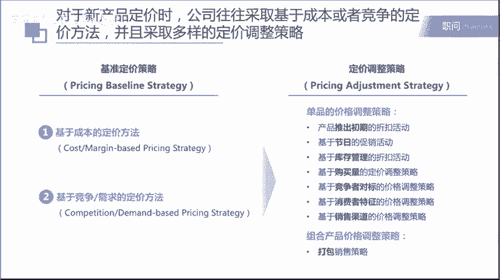

# 像咨询顾问一样解决企业内部问题 - P5：4-1：如何像咨询顾问一样解决企业内部的问题（2） - 清晖知识分享官 - BV1LW42197bm

同学们，大家好，现在就开始我们今天课程的内容。第二个问题呢，在企业中经常会遇到的就是所谓的如何解决一个企业产品盈利率下降的问题。这个是今天我们的课程要回答的第二个问题。那这里我们也是通过一个案例来入手。

比如说还是这家生产电动汽车厂商。那么在这个产品推出5年后，它的净利润率呢从15%下降到了5%，就所谓的这个net margin。那么我们需要帮助这个企业去找到净利润下降的一个原因，以及如何去进行解决。

那么解决一个企业或者一个产品利润率下降，我们应该怎么做呢？通常来讲，我们可以沿着这个四步啊去解决这个问题。第一个呢就是我们去做很多定量的分析。所谓的定量去寻找原因。第二个呢就是说你们去明确分析的重点。

第三个呢就是定性刨根问底。第四个呢是提出改善建议。那在每一步中具体怎么做呢？那第一步呢定向寻找原因，因为盈利嘛，整个这个profitability或者叫做这个net margin。

它是由收入和成本两部分去构成。所以呢我们从收入和成本两个层面去寻找净利润下降的一个量化的原因。那么在寻找这个原因的时候呢，通常我们也会采取一些比较一些对标。我们可以是与过去比，看看过去我们的收入。

比如说是不是大幅的下降了，我们的定价是不是大幅的下降了，我们的销量是不是大幅的下降了，或者是说我的成本是不是大幅的上升了。某一项比如说原材料的成本或者是。样的成本，它与过去几年相比，是不是有大幅的上升。

那第二个呢就是说与竞争对手比。那现在比如说我们的这个成本结构是不是有一些不合理性，导致我们的盈利水平比较低。那竞争对手它的盈利水平是多少。那为什么它的盈利水平要比我们高。

它是哪一个成本项比我们控制的更好。所以等等等等，这些都是所谓的与竞争对手比。那么第二步呢就是所谓明确分析的重点。在第一步呢，你是进行一个相当于是一个全身检查，一个利用数据定量的一个全身检查。

但是呢在明确分析重点的时候呢，我们要去所谓的抓大放小啊，我们不可能帮一个产品或者是一个企业解决所有的问题。那么在我们说明确分析重点的时候，我们就需要去考虑比如说该成本项在整个成本结构中占比，那比较大的？

其实就是我们所谓关心的这个方向。另外呢就是该收入成本项，在过去几年变化的情况。如果它是快速的增长的话呢，那说明的是不是我们出了一些什么样的问题。

那这个问题应该是可以解决的那第三个呢就是相比于竞争对手的劣势的程度。如果呢有一些收入和成本项，相比于竞争对手劣势非常大，那么至少我们可以去学习竞争对手的一些有效的一些最佳实践。然后我们来解决。

所以呢我们不可能一次性解决所有的问题。那我们更重要的是说看看哪个问题更加的严重，包括哪个问题理论上来讲更存在一些解决的方式方法，可能有一些问题呢比较严重，但是呢我们无法解决。

那这种问题呢其实也没有什么办法。所以呢要从这个可行性和重要性两个角度来去思考在这个盈利率下降的问题中，我们的分析重点是什么。那这个是第二步。那第三步呢就是所谓的定性的抛根问题。

那前面呢我们只是看到了一些数据的一些表象一些数据的一些表面上的一些成因。那具体来讲，到底为什么造成了比如说我们某一个数据项，相比于竞争对手很差，我们某一个成本项相比于过去几年增长很快。

那这些呢都需要我们做很多定性的一些研究。那么在定性研究的过程中呢，就可以用到很多的工具。其实之前我们在之前的数据挖掘的课程中也去给大家介绍过，比如说像管理层的访谈啊，员工的访谈啊，专家访谈啊。

内部制度的一些研究啊等等等等。那这些呢都是所谓的我们说一些常用的方法。那第四步呢就是针对我们刨根问底找出来的一些原因。我们去提供一些相应的管理层的一些改善建议。O那这个是盈利率下降问题的。我们说四步曲。

那接下来呢我们会通过一个案例来去给大家去展示一下具体如何使用。O那第一步呢就是所谓的定量的寻找原因。定量旋转原因的话呢，一般也有四个小的步骤。第一个呢就是我们去确定这个分析框架以及问题的拆分方法。

那我们首先框架和思路的确定，对吧？我们才能去做相应的数据研究。第二个呢就是沿着这个分析框架和思路，我们去列出2018年的数据。然后呢。我们再去列出2014年到18年各项数据的一些变化。

这就是所谓的与过去比。那最后一步呢就是我们去列出2018年，如果比较2018年当年的话，我们的各项数据与主要的竞争对手。比如说我们的市面上有3家主要的竞争对手分别是ABC3家公司。

那么我们去比较一下我们的数据与ABC对比的一个情况。那这个就是第一步定量寻找原因的四个小的步骤。那当然这里也跟大家强调一下，就是说这些数据都是一些虚拟的数据。

主要给大家还是为了给大家去演示一下这个方法论如何去使用。O那我们的第一步呢就是这个确定啊分析框架啊，那啊比如说在这个案例中。

其实这也是一个比较经典比较 typicalp的一个关于net margin profitability来分析的一个框架。就是把整个的盈利水平啊，net margin拆成了两个部分。

第一个我看看 revenue对吧？我的net margin下，是不是因为我的收入在过去几年中有大幅的下。那第二个呢就是看我的成本，我是不是有哪些成本项在过去的5年中有快速的上升。

那把它拆分为收入和成本两个部分。那收入呢又等于我销售每年销售汽车的数量和它的average price这个所谓的平均的价格。

那成本里面呢又可以分成两个部分第一个部分呢就是我们这里说这个cost along value chain。另外一个就是cost beyond value chain，就是说在整个价值链上生产价值链上啊。

它的这个这个成本以及超出这个价值链的部分的成本。那大家可以去想到你在价值链上，我们先说这个al along value chain啊，大家可以想到就是说生产一个汽车，它整个的过程。

最开始呢需要有研发的过程，所以呢一个企业它一定会付出很多RND的co。那研发完了以后呢，你就要进入到这个汽车的真实的生产中。那在生产的环节呢就会有很多的成本。

比如说这个ro materials原材料的成本。我们要在厂理生产。所以。我们有这个fy的ment cost工厂的租金，然后我们有生产设备，那么生产设备生产线都是我们购置的。那么它在每年中都有一定的折旧。

所以我们有depreciation，就所谓的生产设备折旧的成本。那在生产的过程中呢，我们还需要有这个label啊，就所谓生产线上的一些组装的工人啊等等等等。那这些工人呢也是有一定的成本。然后呢。

还有就是说这个Uility，就是所谓你在生产过程中用到了一些能源，比如说水啊，用到的电呢等等等等的一些能源，那也是要有一些成本。所以呢在生产制造过程中，基本上的成本呢，就是有这么5项。

那么在生产出来一辆汽车以后，你就是要把它去运输到不同的省份，不同的地区的经销商的手中。那你在运输的过程中，你就有这个logs，所谓的运输的成本，包括有一些库存，你要储存。那你有一些库存的成本。

就是这个logs and inventory。那么你在运输到不同的经销商的4S店的时候，下一步呢就。所谓的销售的动作。那么可能我们需要有s cost，我们需要有销售团队来维护跟各地的经销商的关系。

同时呢不断的去开拓新的经销商关系，对吧？那这个是我们有se的人员销售人员。同时呢我们还有marketing cost。那么我们需要打广告啊，对吧？推出一个新车，我们需要去做一些promotion的。

比如说一些promotion的活动，就是促销的活动，我们需要在电视台啊网站啊，地铁啊等等，去投放很多的广告，所以呢会有很多的marketing cost，所以呢大家可以去想到。

在一个汽车从最开始的研发到最终销售出去allong the value chain在这个价值链上其实就涉及到非常非常多的一些成本项。另外呢就是我们说co beyond the value chain。

就是说在价值链以外的部分。比如说我们有管理层的成本，总部有相应的管理层，总部有相应的HR财务等等一些管理职能。那这些呢都是有一定的成本。那另外呢就是tex就所谓的。

那我们销售出汽车肯定需要付出相应的税金。那这个也是n margin以前的一个成本。那再有呢就是financial cost。这个项目呢其实经常被很多同学所忽略。特别是对于这种重资产的公司。

比如说汽车生产制造这种重资产的公司，它其实它的财务成本往往还是比较高的，因为它有固定资产，所以呢它可以去获得很多的银行的贷款呢，包括在公开市场上去发行一些债券，所以呢会有很多的财务成本。

包括如果它是一个上市公司，比如说未来它是一个装市公司，那么它每年还要去付出dividends，就所谓的分红。那这些呢对于这个公司来讲都是一些财务上的成本。

所以呢整个的成本项对于一个公司来讲还是非常非常的多的。O所以第一步呢我们是从收入和成本的两个方面去确定了整个的这个分析框架。那第二步呢在量化分析的时候呢，我们就会把这些2018年的数据列出来。

我随便举几个。比如说这个net margin2018年是5%，然后呢，它整个的销售汽车的数量是6900辆averagepri，比如说是55万这个平均的价格。然后呢，同时不同的成本项。

大家其实也可以看到不同的成本项占整个S percentage of revenue，就是说占这个整个的收入的比例是多少。我们把2018年的数据呢全部都列出来。

okK第三步呢就是我们会进行一个历年数据的对比。所谓的与过去比。那么大家可以看到，就是说我们这里也搭建了一个很简单的excel的模型。然后呢，在这个excel模型中呢，我们其实从14年开始到18年。

我们沿着上述的分析框架。我们来进行一个excel表的一个罗列。我们把它的reevenue的像把它的cos项全部都列在这边，然后看看17年的18年这些数据的变化的情况。搭建完excel以后呢。

我们就可以做出下面的这些的图表。比如说从收入方面，我们汽车生产的数量，从14年的不到6000辆到16年6000多辆，将近7000辆的一个水平。那价格呢是如何变化的。所以呢这是收入方面啊，那在成本方面的。

同时我们也可以看到，从14年到18年不同的成本的一个变化的一个情况。大家可以看到，比如说在这个里面原材料的成本，它在过去的几年中一直是在上升的。从14年的占整个的收入的占比差不多在18%吧。

一直到2018年超过了20%，接近了25%的水平。大家所以可以看到这些数据的一个与过去比的一个变化的情况。那这一页呢我们其实也可以看到还有其他的一些成本像我们也列在这里。比如说s。

比如说我们的销售的成本等等的成本哈，那这些我们都会列。比如说这里也可以看到市场的成本，在过去的几年中其实增长也比较快速啊。但其实大家可以看到市场的成本占比非常的小。

只有在整个的比例不到6%5点几O那这个呢是我们说与过去历年纵向对比的一个情况。那么第四步呢就是我们这里提到的横向的一个对比。

我们要把我们的收入和成本这些数据与主要的三家竞争对说ABC3家公司去进行一个对比。那在这里呢我们是把2018年的数据列出来，然后呢我们跟大家可以看到这个excel表格哈ingABC作为三列。

我们把每一个收入项和一个成本项与这三家公司进行一个横向的一个对比。OK那在建立这个excel model以后呢，我们就可以去画出这样子的图。比如说生产汽车的数量，本公司和ABC的一个对比。

生产电动汽车平均的一个售价与ABC3家公司的对比。包括我们也可以看到说整个的成本方面，不同的成本项，我们与竞争对手ABC之间的一个对比。所以呢在第一步呢，我们其实是对整个不管是纵向还是横向的数据。

我们进行了一个非常详细的一个挖掘哈。那么第二步呢，我们就是要明确分析的重点。那在明确分析重点的时候呢，其实我们有几个原则是需要考虑的。其实可能在退后一步讲，大家其实看到刚才这个案例里面啊。

大家可以看到说我们的收入其实在过去的几年中是在不断的增长的。大家可以看到说我们的生产汽车的这个数量，在过去几年中在不断增长。而在销售的价格方面呢，其实也没有太大的波动。大家看这个图呃。

虽然看起来差的比较多啊，但基本上是从51万到56万这个区间内，那么整个的这个价格呢其实没有太大的变动。甚至来讲，我们整体的这个价格的变动是处于在一个上升的趋势中，所以呢这个数量乘以价格。

大家其实可以想到，我们整个在收入方面，其实整个公司的收入是在往上走的。所以呢净利润率这个n margin的下降并不是因为我的。收入大规模的下降，而更多呢是这个成本端的问题。

大家其实也可以看到说很多的成本端，你其实可以大概整体看一个趋势，在过去的5年中都是处在一个快速上涨的一个过程。当你收入的增长赶不上你成本的增长的速度的时候。

你整个的net margin所谓的净利润率就会下降。那么在第二步，我们在明确分析重点的时候，我们应该把握什么样的原则呢？主要来说呢有三条原则。第一项原则呢就是说我们要看一下在这些成本项目中。

哪个成本项目是最大的占比项目。那为什么我们看这个呢？它的原因呢？就是说我们要学会抓大放小。那抓大放小呢往往会采取事半功倍的效果。举个例子，比如说某一个成本项，它在整个的这个成本结构中只占1%啊。

我觉得比较极端。你再怎么去努力压缩这一部分的成本，对于整个net margin的上升，其实的作用都不是很大，对吧？但如果它占到了50%，举个例子，某一个成本项占到50%，那么你对这个成本项稍微做改变。

对于整个企业的盈利的这么一个优化，就非常的大。所以呢我们要学会抓大放小。那第二个呢就是我们要看一下哪些成本项目，相比于过去的几年在飞速的增长。

那么为什么要看这个或者是为什么要把这一项列为一个比较重点要分析的一个cost item这个成本项目，是因为如果它在快速增长的时候，那一定是我们企业的内部管理出一些问题。

那当然呢这个也有可能是个市场的原因。比如说人力成本的上升。目前全中国所有的企。也都在面临人力成本的上升。那么这个呢更多是一个市场的原因。因为人们的生活水平提升了啊，本身中国的人力成本也在提升。

但是呢很有可能也是因为管理适当的原因。比如说我的人力成本快速提升，可能是因为我过去几年招聘非常的激进。但这些招聘进来的新人并没有把它能力或者是他的生产力充分的释放出来，转化成公司的整个的收入。

那么有可能是我们管理适当的问题。那第三个呢，其实我觉得甚至比第二个更加重要啊，就是说这个相比于主要的竞争对手，哪些成本项的占比相比于竞争对手高很多。因为呢我们都处于同一个行业中。

如果有一些比如说这个指标，我们比其他的竞争对手差很多。那么呢其实在这个时候我们是比较容易去找到问题的解决方法的，我们可以直接去对于竞争对手进行一些深入细化的研究和分析。

来看看他们是如何更好的控制这个成本项。然后我们直接去学习他们的有效的做法。他们的。最大的实践来去有效降低个成本项的支出就可以了。所以呢我们在明确分析重点的时候。

第三条原则是我们应该去把握和考虑的那也回到这个案例哈，那我们从成本项抓大放小的原则来看，我们其实可以看到说在成本项里面有很多小的成本项是我们不用关心的。

比如说这个logs和 inventoryventory啊，这种运输的成本，它的整个的比例只占到1。8%，对吧？所以呢它的优化空间其实是不大的，但是呢有一些成本项它占比是比较高的。

比如说一个原材料的成本ro material，比如说laor cost所谓的生产线人力的成本，s cost销售的成本，还有t这个所谓的税的成本。当然税这个东西呢，从后面的分析我们也可以看到啊。

它整个的变化其实是不大的。所以这个是一个刚性的。其实你很难去解决或者很难去降低。一个企业它也不能偷税漏税，对吧？所以呢在这个方面可能改善性不大。同时呢你相对于竞争对手的对标，你也会发现说tax。

这东西其实与金融手对标其实大家都一样，对吧？所以这个也不是一个 key factor。但基本上从抓大放小的原则来看呢，我们可以重点关注一下，占比10%以上的这些项目。

其实还有一个就是这个financi cost，所谓的财务成本，它的占比呢占到了整个收入的8。7%也比较接近十哈，也是一个比较主要的一个成本项。所以根据抓大放小的原则呢。

我们有这些需要观察的一个成本的项目。第二个方面呢就是我们去看一下历年的增长。在对标刚才的这些图里面我们可以摘出来三个啊，一个是roment原材料的成本。

第二个呢是劳动的成本就所谓laor cost这个生产项量的工人。第三个呢就是marketing。我所谓的做低市场的营销活动啊，促销活动啊等等等等广告啊等等啊。那这个marketing的费用。

那这个三个方面呢，在过去的几年中是在快速增长的那其实我们如果结合第一点抓大放小的话，这个marketing cost正如我们刚才所说的，它整个的占比其实非常的低。有5%点几对吧？所以呢在这个方面。

其实整个优化的空间。虽然在过去几年中，我们的marketing cost在急速的上升，但是呢可能呢我们继续对它做一些优化，继续对它做一些解决，对于整体的盈利提升的作用可能不是很大。

第三个维度呢就是刚才我们提到的个横向对比啊，与竞争对手的对比。那这个呢其实相比于过去对比来讲更有借鉴意义。比如说刚才我们提到的labor cost生产线上的工人，他在过去几年中提升。

但如果我们看到说对于我们的销售的竞争对手哈，对于我们的主要的一些竞争者来讲，他们也面临同样的问题，整个laor cost在过去几年中快速提升，并且占比也越来越高。

那这个呢更有可能说明它是一个全市场的问题，整个市场人力成本上升的一个问题。那对于这种整个社会，整个国家，整个市场都在面临的这种问题。其实你优化或者是解决的空间或者是可能性是不大的。

但是呢反倒是一些比如说我们相比于竞争对手，我们。一些明显偏高的成本项，我们可以去更好的去学习竞争对手如何去进行控制。那在这个里面呢，我们其实看到有三项，一个是原材料的成本。

大家可以看到我们灰色的这个柱子，灰色的柱子呢是我们这家客户，或者我们这家公司，我们的原材料成本在整个reevenue中的占比大概已经快接近了25%。但是呢对于主要的一些竞争者来讲，他们的占比非常的低。

他们的原材料成本只占整个收入的15%左右，刚刚超过151点。那在这个方面呢，我们ro material的成本比它明显更高。那还有比如说像这个销售成本，大家看到灰色这根柱子也比其他三根呃蓝色的柱子。

那三根蓝色的柱子就是ABC，他们的成本的一个表现比它高很多。还有财务成本，那财务成本刚才我们也提到financial cost它的占比呢其实也不低。这个在我们公司呢整个financial cost。

它的占比大概是在将近9%8点几，也是一个比较显著的一个成本项。但是如果我们对。标我们的竞争对手可以发现ABC3家公司，他们的financial cost都基本稳定在4%上下。所以呢在这一项。

如果我们的成本可以有效控制，达到跟竞争对手一致的水平，我们一下子整个的margin就可以提升接近4%左右。所以呢也是一个非常非常值得去研究的一个领域啊，O所以这个呢就是我们明确分析重点。

从刚才的三个原则里面呢，我们基本上可以想到原材料销售成本，还有财务成本。这三个呢是我们在第三步中就所谓的定性刨根问底中，我们需要去着重解决的一些问题。那么我们就进入到第三步哈，所谓的定性的刨根问底。

比如说对于原材料成本，在过去5年中，我们会看到说首先一它对比于我们自己公司内部的情况，它是快速的在增长的第二那相比于外部的竞争对手，我们对标了18年的数据。

我们的ro material的成本也远远的高于竞争对手的这么一个占比。那所以呢这就是我们。心在研究的问题。那么我们有什么方法去研究这个问题呢？我们有一些潜在的调查方法。

比如说我们跟呃采购部门在过去几年中采购的办法，我们去看一下他们制定的采购管理办法。在过去几年中有什么变化。那也对标一下我们那个采购管理办法的合理性。那相比于竞争对手来讲，它的合理性怎么样。

另外呢就是我们可以去查看一下采购部门在过去几年中，他到底采购了一些什么东西，对吧？啊采购了哪些具体的原材料。那么它的花销是什么样子的。在这个过程中呢，其实我们也可以进一步的去抓大放小。

我们去关注一些他在这个采购的时候更大的一些成本项。那并且我们去了解说那这些采购是从哪个供应商那里去获得的那第三个呢可能是我们可以去了解一下竞争对手，通过一些我们的内部专家的关系。

或者是外部专家的一些访谈，我们去了解到我们的主要竞争对手，他们的采购管理办法是不是比我们的更加优化，更加的合理他。供应商情况是什么样子的？是不是有一些比如说更便宜或者是性价比更好的一些供应商。

那这些呢都是一些潜在的调研方法。当然大家可以有更多的一些方法，比如说去进行一些市场上的一些专家访谈，去了解到就个原材料采购控制如何去做等等的一些方法哈。那这些都是可能会被用到。

假设说我们最终的发现是说ok一方面看了我们的采购管理办法，然后也跟我们采购部门的同事负责人去沟通过，我们发现说相比于竞争对手，我们对于采购部门缺乏有效的预算的管理机制，以及呢我们对于采购的成本。

他花出去的每一分钱最终能转化成多少的企业的效益，或者是产品性能的提升。就所谓的采购成本，相比于有效利用比率有没有一个合理的后评价机制来约束的采购部门的一些采购的行为和一些大手大脚的习惯。那这个是一方面。

那另外一方面呢，就是我们可能会看到说我司选取的供应。过于分散，缺乏集中的管控。每个地方的工厂呢都会有自己的供应商的渠道。那么大家的供应商非常的分散。这个可能是我们对于采购成本非常高。

最终刨根问底得到了一些最终的发现。那刚才我们讲到的是关于原材料的问题。那对于销售成本的问题，我们要去研究为什么我司的销售成本远远要高于竞争对手的水平。那么销售成本呢，其实包括两个部分。

一个呢是销售人员的工资，还有一个就对于销售人员，因为他卖出车嘛，对吧？啊，那他有相应的奖金或者相应的提奖。那么对于这个问题呢，我们在定性这个调查的时候，也有一些潜在的调查方法。

比如说我们会先去看一些明面上的数字，比如说我们研究每一个销售人员所产生的平均收入，以及每个销售人员的平均的成本，并且与竞争对手进行比较。那这个时候我们可能发现说别人这个销售人员他创造100块钱的收入。

而我们的销售人员只能创造50块钱的收入，我们的销售的效率其实是要比我们的。竞争对手要更低。另外呢就是说我们看一下单个销售人员平均成本中固定薪资与浮动提奖奖金的比例，并且与竞争对手进行比较。

大家对销售管理如果有基本认识的话啊，那么一个好的销售管理体系呢，其实应该是说它的基本工资应该是比较低的那大部分的销售人员所获得的高额的奖金都是通过这个销售啊来获得的那你卖的越多，你对公司创造的收入越多。

你自己相应的自己的提奖和自己的奖金应该也越高，对吧？那这个应该是一个非常的直接或者是正相关的一个关系。那所以在这个维度上呢，对于打造销售人员的狼性啊，打造整个销售团队的活力啊等等等等。

所谓的雇负比固定薪资比浮动工资的比例，这个是一个非常重要的一个指标。那么可能还有一些调查方法就是我们可以去研究一下我司的销售管理办法啊，与竞争对手进行比较。比如说我们在设置销售人员的提奖啊。

或者是说对于销售人员的活动量管理啊等等方面。我们的销售管理办法是不是有一些优化的空间。那同时呢我们也可以去与我们的客户，就所谓的我们的经销商进行这个访谈，来了解经销商对于我司销售人员的评价。

以及他们对于我司的销售人员，比如说他们的销售效率比较低。那么这个经销商对于我们的销售人员销售效率比较低。这个问题的一些看法和一些原因的一些见解。那么还有的潜在的调查方法。

就包括说与一线的销售人员进行访谈。那么他们常年是在一线与客户接触，同时他们也对其他公司的这些销售人员也比较熟悉。那么他们是怎么认为这个我司的销售效率比较低，到底是因为什么样的原因，有没有一些难言之隐。

那这些呢都是我们一些潜在的调查方法。那比如说在这个案例里面呢，我们就能发现说有两个部分就造成了我们的销售人员的成本很高，销售的效率很低。

第一个部分呢就是我司销售人员在销售技巧和产品专业度方面有来进一步的提升。所以我们的销售效率比别人低，我们需要养很。多很多的销售人员才可以去完成我们的收入的指标。那这样子的话，我们的这么多人。

我们的销售的成本就会很高。第二个呢就是我司的销售制度过于大锅饭，不利于激励整个销售团队的积极性和良性。所以呢我们的销售的效率比较低。我们的年均产能也比较低。所以我们的销售人员人数很多。

所以我们的这个整个的销售成本很高。所以呢假如说这个是我们通过电信刨根问底来了解到的，对于销售成本比较高的两个方面的一个我们说本质上的原因。那第三个呢就是关于我司的财务成本啊。

这个我们要去解决为什么我司的财务成本远远高于竞争对手的水平。那这个时候呢我们啊也有一些潜在的一些调查方法。第一个呢就是我们去拉出来一些财务报表，我们看一下我司的财务成本到底是由什么构成呢？

比如说这个银行的贷款呢，这个我们在市场上发的一些公开债券呢，还是如果我是上市公司的话，我的股息的分配，红利的一个分配。等等。我们去看一下我司的财务成本的组成和具体的金额，并且与整个竞争对手。

他的这个财务成本的一些具体细项进行对比。那当然我们也可以与这个财务部的负责人去交谈，了解他的对于我司财务成本比较高级的看法。比如说是不是我们借了很多的外债。比如说银行贷款。然后我们去进行大规模的扩张。

而竞争对手呢没有进行这些扩张，所以他整个的这个财务成本相对来说比较低。那第三个呢就是与竞争对手的这个财务部相关的同事。当然这个呢从实际操作来讲，就比较难啊。那外部的咨询公司来讲呢。

经常会用一些我们第一节课也会介绍到，对吧？就是利用一些专家库的资源，然后去找一些其他竞争对手里面呢比较熟悉财务工作的这个专家啊，来了解到他们是如何去进行外部的一些融资或者是外部的一些财务的一些操作。

来很好的控制自己的财务成本的一个水平。那假如说在这个案例里面呢，我们最终发现是说我司的对外呃融资的金。相比于竞争对手来说是相对来说比较合理的，不存在这个过度融资，就是说融资规模过大。

导致我司财务成本很高的这么一个原因。但是呢我司可能对外采取的融资方式是比较单一的。比如说都是采取一个银行贷款啊，大家知道银行贷款的话，相对来说是比较贵的。即使是一些大企业等等等等。

也要在基准利率左右4%5%。但是呢如果你是一个很好的企业，你通过发行股票或者是发行一些债券，那通过这些方式来讲呢，其实它的这个财务成本会更低一些啊，那这个呢就是我们在定性刨根问底这个阶段。

大家可以用到的一些调查的方法和一些比如说对于这个案例，我们潜在发现的一些问题。那么再下一步呢，其实就比较理所当然，我们就可以去针对刚才我们定性发现的问题去提出有效的改善建议。

比如说对于将近原材料成本来讲，我们可以说针对刚才的问题啊，我们有效的提出说我们去建立相应的KPI的考核机制。那我们的采购。部门我们的采购的成本要与最终实际你采购的这些原材料所发挥的价值。

不管是产生的收入，还是说产品性能的提升，需要挂钩，那么你就不能去这个大手大脚去不顾后续的一些这个效益，而去大规模进行一些非常昂贵的一些采购的动作啊另外呢就比如说实行一个集中的采购机制。

我们将这个采购权收归于总部，不再让各个的分子公司或者各个的工厂去进行采购。那么我们可以去减少这个供应商的数量来集中向几家供应商进行采购。那在集中采购我们的这个采购的规模提升的时候，相比于供应商来讲。

我们的这个议价能力就更加高了。我们就可以要求更低的价格啊，我们就可以实现一个所谓的这个econ of啊，就所谓的这个规模效益啊。

那第二个部分呢就是说如何去有效降低这个销售成本的部分啊那对于销售成本的话呢，针对于刚才我们这个发现的问题，我们针对两个方面提出建议。第一个。就是说去提升我们的整个培训体系的建设，去提升比如说培训的质量。

培训的频率，包括引入一些考试的机制，还有呢提升一些销售工具的一些专业的支持。比如说培训的PPT啊，销售的宣传业啊，一些电子化的一个宣传工具哈来去使我们的销售人员更加的专业。

在介绍我们公司的新的产品或者新的车型的时候，能够更加的容易去上手，去像我们的经销商的客户，感觉我们的专业性程度更高。那第二个呢就是说进一步的去优化，修改我司的销售管理的制度。

从两个方面提升销售人员的狼性。完了第一个方面呢，我们去降低基本薪酬去提升提奖的比例，并且将提奖规则进一步简单化透明化。其实大家如果做过一些销售管理的话，其实知道很多公司呢他并不是整个的销售激励不够。

而是呢比如说他的销售的激励的规则太复杂，或者是对于下面的透明性不够。所以呢很多的销售人员并不知道比如说很。自己去为公司创造了，比如说100万的收入，自己其中能够去获得多少的提奖。那这些简单性透明性。

整个的提奖制度或销售管理制度都是不足的那第二个方面呢，其实我们可以去考虑去采取这个末位淘汰制，每年呢去淘汰业绩最差的10%的销售人员，使我们的销售团队呢越来越精英化，人数呢越来越少。

这样子可以进一步的去降低我们整个的销售的成本，降低销售人员的数量。同时呢我们已有的销售人员就是精英的销售人员可以保留下来，我们的这个整个的销售文化啊，整个销售的狼性啊，包括销售的效率就会大幅的提升。

那第三部分呢就是说我们如何去更加有效的去降低我们的财务成本。那根据刚才我们发现的问题呢，我们就可以去建议我们的管理层采取更加多元化的融资的方式，比如说去降低高成本的银行贷款融资的比例。

转而采用财务成本更低的这种发行股票或者发行债券的方式进行一个融资，这样子来有效降低。我们的整个的财务成本。所以呢大家其实可以看到说整个的一个过程呢，其实都是从一些定量的数据来入手。然后呢。

我们选取一些关键的要点去分析一些重点的或者是关键的一些定量的数据。然后呢，再通过一些定性的，比如说调研啊，查看管理制度啊，销售管理办法啊，一些的方式啊，包括一些专家访谈，不管是内部的访谈还是外部的访谈。

一些专家访谈的方式，去找到我们问题，真正的症结。然后呢，针对这些症解去给出相应的建议。所以呢很多时候为什么大家把咨询公司叫做一些商业公司的一些外脑，或者是一些外科的医生啊，其实呢就是很重要的一个职责。

就是帮助我们这些公司去诊断他们现在内部的问题，一起给出一些药方，给出未来的一些解决和提升的建议。所以呢这个就是我们今天课程的内容。那么我们也总结一下。

今天呢其实我们更多讲述的是说如何运用我们的逻辑思维的能力，运用咨询管理顾问一些方法，比如说一些研。问券啊或者是访谈啊一些方法去解决企业内部的一些问题。

那么这些逻辑思维这些方法其实并不仅仅是咨询公司所能使用的。大家我知道有很多同学也是在企业的内部啊，那么也可以使用这些方法来解决自己的公司或者是自己的部门的一些问题。那今天呢我们重点讲了两个部分。

第一个部分呢是如何对一个新产品上市，如何对它进行定价。那这里呢我们讲述到说对于新产品的定价，我们有t baseline所谓的基准的定价策略。还有呢在这个上市以后。

我们很多的一些定价的调整或者是一些折扣的一些策略。那在基准定价策略里面呢，我们有两种，一个呢是基于成本。我们计算我们的成本。

并且呢去制定一个相应的比较合理的一个margin和立的一个盈利的水平去确定这个定价方法，这是一个方面。那另外一个呢就是基于第二种方法，就是基于这个竞争和需求的定价方法。我们先看竞争品的定价。

然后再看我们的产品，相比于竞争对手他们的产品的一些优劣势。来确定我们的一个定价。那么也通过一个电动汽车的案例来讲述了这两种方法的使用。同时也告诉大家这两种方法在哪种情景下比较合适啊，那这是第一个问题。

解决一个新产品定价的问题。那第二个问题呢，我们也是给大家讲述了如何去围绕一个公司盈利性下降的时候，我们是如何解决这个问题。我们的一个方法论尽量的去寻找原因。

从收入和成本两个方面去看它整个的净利润下降到底是什么原因。那明确分析重点，抓大放小去与过去比与同业比来寻找这个可能来完善或者可能来解决的这么一个方向。

然后呢定性的抛根问底来去真正调研我们的背后的一些深层次的原因，提出相应的改善建议，根据很多的内外部的一些访谈，内外部的一些对标。

那我们去提出针对我们所发现的问题来提供更好的一些解决的方法和一些改善的建议。所以呢对于盈利性问题，我们通常围绕这四步法解决。O那么这个呢就是我们今天全。

课程的内容。那么相信大家呢在企业的内部通常也会像我们刚开始课程提到的，也会有更多的问题。比如说如何解决市场金入的问题，是不是应该研发一个新的产品，是不是应该重新对我们的课群进行定义。

是不是应该去进行一些兼并收购。那大家呢都可以去自己去尝试啊，利用这种逻辑思维和这种定量加定性分析的一种方式来对这些问题找到一个更加合适的解决方案。好吧，那谢谢大家今天的时间啊。

希望今天的课程对大家有所帮助，再见。