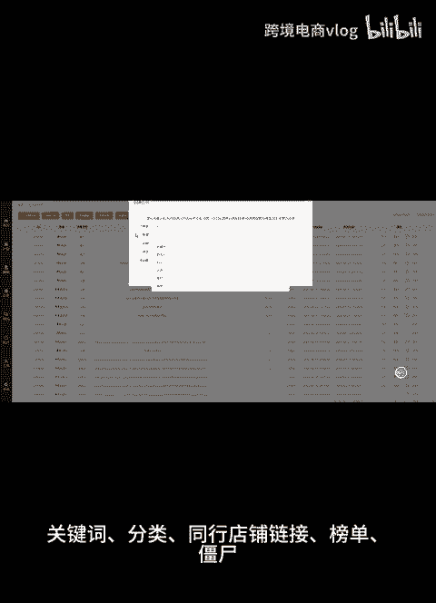
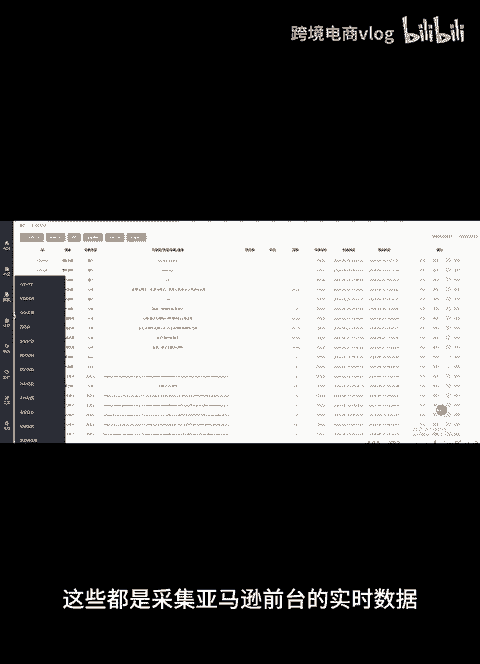
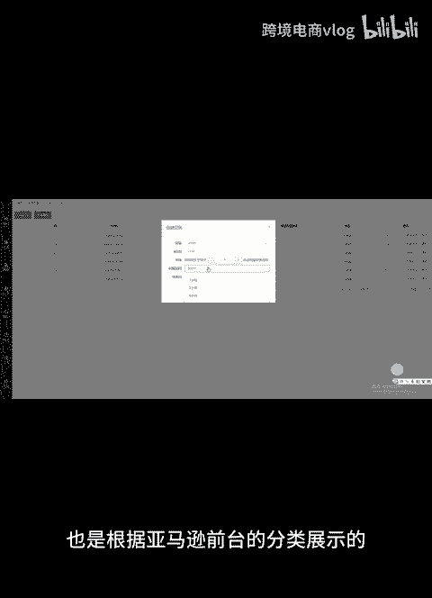
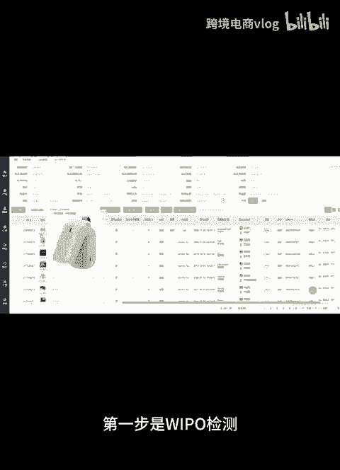
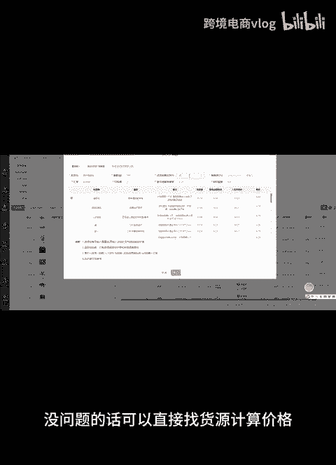
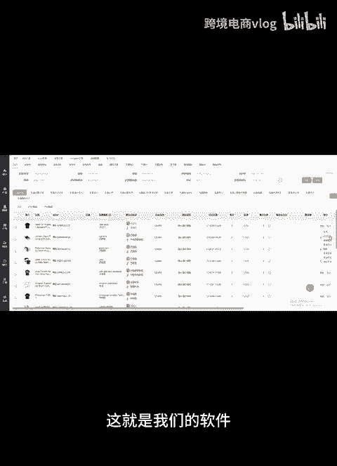
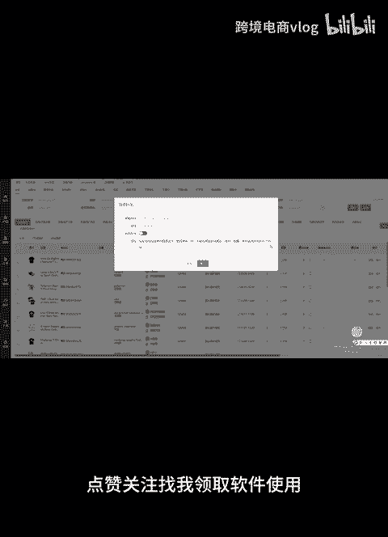

# 全功能一体化跟卖软件，让你更好的去操作店铺。旺季来临，加油，跨境人！ - P1 - 跨境电商vlog - BV1KptpevEEV

🎼hello，大家好，今天给大家介绍一下跟麦软件的功能。我们跟麦软件是一体化的系统。采集选品的话有多种方式，关键词分类、同行店铺链接、榜单、僵尸，这些都是采集亚马逊前台的实时数据。

类目也是根据亚马逊前台的分类展示的。

🎼这些功能都容易理解。🎼还有一个是A森挖掘功能，这个是直接采集其他跟麦者的店户里的数据。🎼这个也是最简单的选品方法。🎼采集过来的数据，不管是想做FBA还是FBM吗，想更卖有品牌备案的。

还是没有品牌备案的，都可以满足品牌检测这块。第一步是WIPO检测，第二步是本地站点商标局检测，双重检测更安全。

🎼没问题的话，可以直接找货源计算价格，最后设置好上下架时间和调价规则就可以跟卖了。

🎼出单以后，软件有物流系统，可以直接同步订单采购发货。还有一些小的功能，比如查a的变体信息更脉，监控A森变化，设置书单上线，避免销量激增，自动补库存等。这就是我们的软件。

🎼点赞关注找我领取软件使用。

