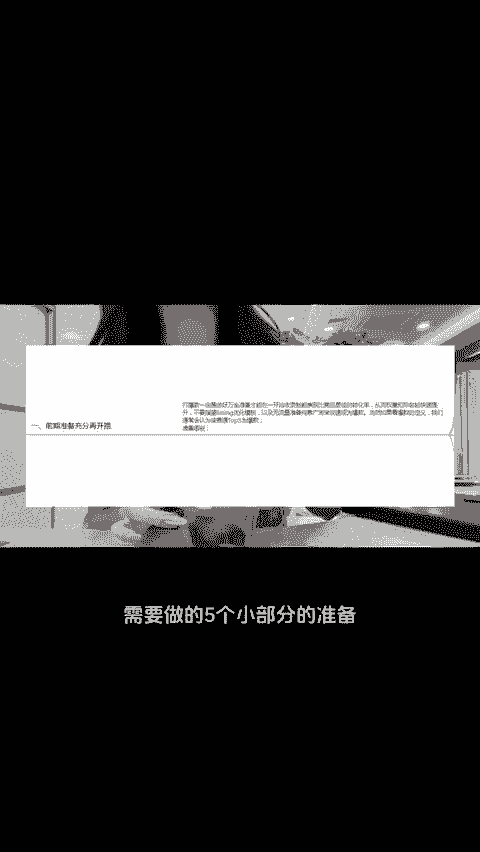
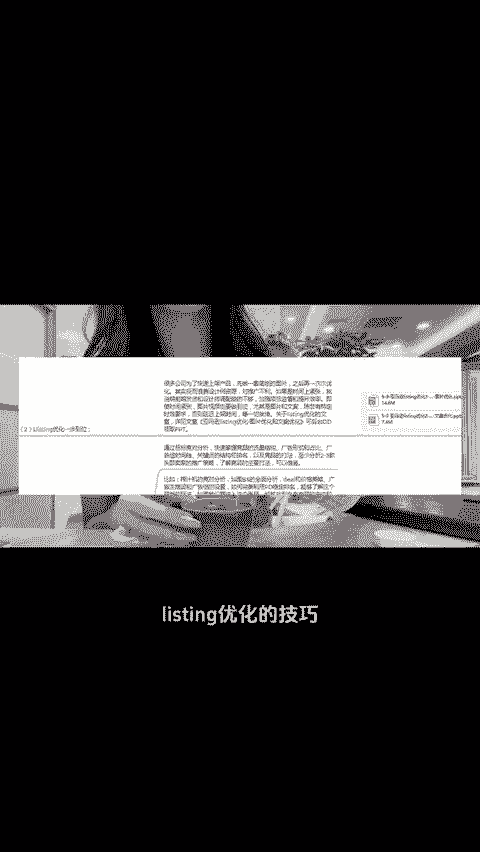
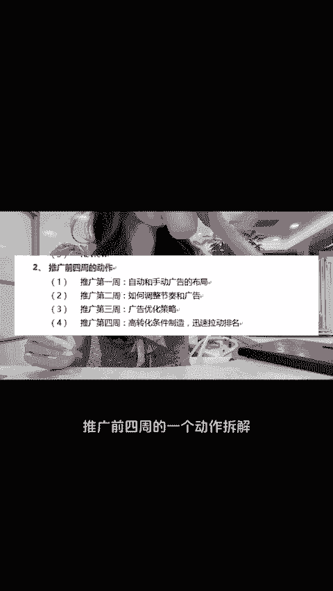
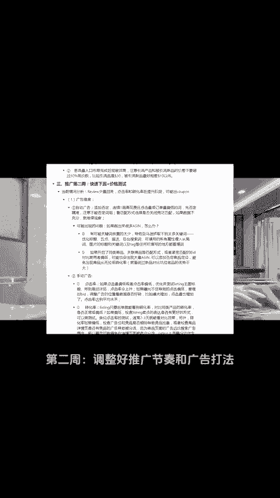
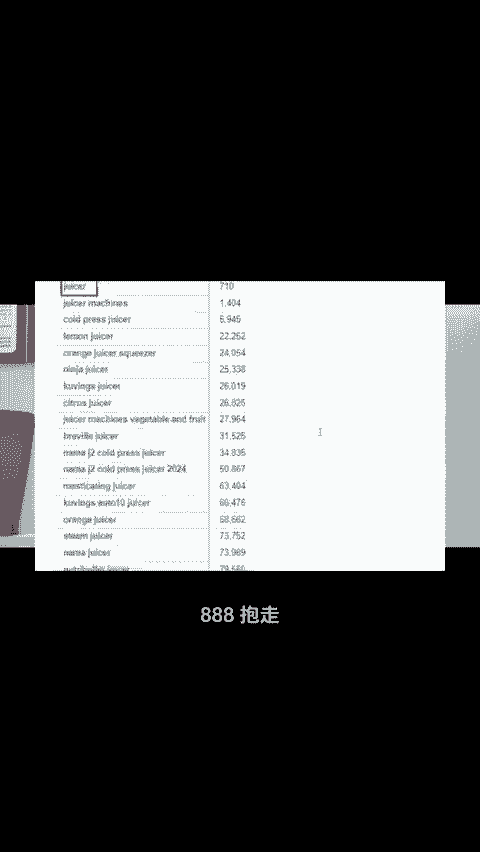

# 全网最全！亚马爆款打造前四周动作拆解（保姆级） - P1 - 小亚跨境研究 - BV1Sa28YxERH

今年亚马逊新品被现制作coupon，这对我们上新品来说很不友好，起码在新品上架前两周，我们可能都没有办法抓到参考价。但其实新品想要快速起量打爆，不仅仅是coupon这个手段。

我们可以多维度的提前准备和分阶段布局。制篇视频会稍长，但每一部分都非常重要，概括下来分为两个大部分，9个小部分，主要就是新品上架前需要做的5个小部分的准备，包括亚马逊平台各个流量入口的布局。

熟知nomod的底层逻辑和玩法。listing优化的技巧，含案例说明的精品调研以及review获取。另外一个大部分就是推广前四周的一个动作拆解。第一周，我们需要学会布局自动和手动广告。

第二周调整好推广节奏和广告打法。第三周，根据产品实际推广情况进行广告优化。第四周，打造高转化条件，拉动排名。这里每一周都有给到详细的推广动作，这里都给大家整理好了，需要的三个8抱走，一起跨进，一起暴富。

😊。

