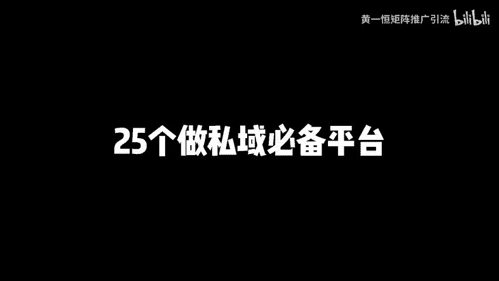

# 公域流量有哪些渠道？25个做私域必备平台！公域流量怎么引流到私域，公域流量和私域流量，公域流量如何运营，获客引流渠道平台有哪些，公域流量公域转私域，私域流量搭建 - P1 - 黄一恒矩阵推广引流 - BV1tw4m1e7bp

用一个月时间加满几个C1账号是种什么体验？我们公司刚来C生，我叫他去做失意流量渠道，他做了一个月，又加满了几个账号，我们一起来看看他怎么做的。😡。

多平台一起操作的呀，真是个人才。😡，🎼nice这个方法不错，打造多流量管道，一个平台加10个人，10个平台就能加100个人。季节废话一个视频教会你公益流量有哪些渠道，25个公益必备平台。

详细教程在这里记得先收藏，一起来看，我会给你分享公益流量分布的6大板块，社交流量、文章流量、图文流量、音频流量、视频流量直播流量，合计25个平台，最后还会给你分享如何筛选平台。

找到适合自己产品项目的推广平台。现在看社交流量。目前整个互联网夜活用户量最高的就是社交流量里面的微信，有13。58亿的业活用户。很多伙伴前几年光做一个微信爆粉就赚的盆满钵满。现在呢微信爆粉就难操作。

可以转做企业微信爆粉效果呢也非常不错。第二个QQ有5。53亿的夜活用户。前几年我们做的QQ生态推广。比如说群排名群推广。

现在就没有去操作，为什么呢？因为现在大家都是光挂着QQ，但是呢却很少聊QQQQ已经很难搞到流量，而且管理的特别严格，已经不太值得我们花时间去操作的。第三个，微博微博整体的流量质量还是比较不错的。

如果是企业有适合的产品还可以搞搞微博推广。第二个文章流量文章流量就是大家熟悉的自媒体推广。第一个公众号，背靠微信的13。58亿业活用户头条号，背靠2。6亿头条业活用户，百家号，背靠百度6。

67亿业活用户量，企业号，背靠QQ的5。53亿业活用户量，还有B站专栏背靠B站的3。36亿业活用户，其他的还有一些搜狐号网易号知付专栏也是可以同时操作的。文章这一块呢，整体操作难度啊还是比较低。

对于那种to b的产品做文章排名，文章流量整体呢还是比较不错，值得大家花时间进行操作。而现在有了AI之后，我们只需要找一些高质量的文章，通过AI进行改写，然后手动认识修改之后就可以进行发布。像文章流量。

还有一些专业软件，可以一键帮你发布到这些平台。那这里给大家分享的是头部平台。还有一些比较小的平。咱们在这里面呢就没有给大家整理了。但文章流量对比前两年来说，它的流量其实还是有减少的。像我们自己在操作。

现在加的粉呀已经比较少了。如果大家想花时间重点操作，而且流量比较大，想一天就加几十上百个人，那怎么办？比较值得我们目前当下操作的是图文流量。因为整个文章流量里面很多的用户量都在下降。

但是图文流量它在增加。比如说小红书有3。12亿的验活用户量，虽然比不上前面很多平台，但是它去做实际的加粉效果是大于其他平台，而且做图文这一块，整体来比较简单，进到流量池之后。

上了热门就能够拿到几千上万的点载量就能够加到几百上千个人，比较值得我们去操作，还能够同步发布到抖音图文，抖音图文目前流量也是非常不错的。完全等于一个小红书，所以大家如果想重点做流量。

我个人比较推荐的就是搞这个图文流量，而且抖音的业活用户量，目前除了。之外可以说能排在第二9。5亿的用户用户量，应该其他平台都很难超过这个数字。第四个音频流量音频流量大家熟悉的就是喜马拉雅，有3。

45亿的业活用户，还有蜻蜓FM有1。3亿的夜活用户。前几年我们也做了这个喜马拉雅推广流量还是比较不错的。但是最近1到2年这个喜马拉雅的加粉量来。我们的行业可以说大打折扣。以前一天可以加一二十个粉。

好多时候三五十个粉，现在一天只能加一两个两三个粉，为什么？因为现在你会发现互联网整个流量都集中到了像抖音视频号、小红书B站这的平台，这平台用户在不断增加。

说音频这一块如果有比较适合比较匹配的类目还是可以操作的。但其他类目呢已经不太见大家花太多时间去做这个喜马拉雅去做这个音频可以当成一个附加流量。来看第5个视频流量。

目前整个互联网的流量天平都倾向了视频板块，也是我们用户花时间最多的平台，咱们吃饭。睡觉等朋友都在刷视频。除了图文流量之外，视频流量是目前我们最值得操作的平台。抖音有9。5亿用户，快手7亿视频号背靠13。

58亿的微信业活用户B站3。36亿小红书3。12亿西瓜1。8亿，而且视频这一块带着用户质量比较高。为什么？因为视频有交易用户的效果。当用户看完视频之后，能够加快的人都是比较精准的。

而且视频一旦我们进到流量池里面就能够获得几万几十万流量，加粉基数也是比较猛的。所以大家如果想重点操作流量比较大，想加的比较猛，一天加上百个客户想做你只有两个选择。第一个搞图文流量。第二个搞视频流量。

好来看第六个直播流量。那除了前面的方式之外，目前整个互联网又新增加了一种方式，这种方式很多伙伴可能没接触过。就是我们开直播间在直播间里面放。上钩子来用户之后呢，通过直播再导流到失意。

只要我们具备一定的直播能力就可以开搞。比如说抖音直播、视频号直播、快手直播都是非常值得操作的。而且直播这一块，他跟我们做图文视频有个相似之处。只要我们的直播间能够有一定的吸引力。

就能够撬动平台的公益流量平台。比如说我们波一场能够给你推几千上万流量，这几千上万的就能够转换几十个或者上百个人到我们的实意里面。当我们了解了六大板块的流量，合计20多个平台。接下来我们需要去筛选平台。

找到适合自己产品项目的推广平台，那怎么筛选？首先我们需要根据项目的人群定位来进行筛选。在互联网里面最直观的就通过关键词，也就是用户他需要解决问题的时候，会搜索什么关键词。

这个关键词跟你产品对应的关键词有没有贴合。如果贴合，这就是我们的吸有关键词，先把它整理下来，多多益善。那整理完关键。后接下来我们需要去筛选平台。平台这一块，第一个根据能力来筛选。

如果咱们比如说不能拍视频，也不能搞直播，那视频直播我们就得给他pass掉。这时候我们再看一下能搞的有什么哎，写文章或者做图文，这两个人操作门槛比较低，对人家没什么要求。那如果我们积本能力。

我们什么流量大，什么流量猛，我们就去搞什么？那肯定是优先去搞这个图文流量，视频流量，直播流量，这三个是目前整个互联网加盟最猛的。一旦我们进到流量时上了热门就能够一天加到几百个客户甚至上千个。

第二人群我们还需要根据人群来匹配平台。比如说如果你的人群是偏年轻化，那小红书肯定是首选。因为小红书啊，90后用户占到50%。如果你的人群是偏中老年比较多，那你做小红书加过来的人基本上没办法成交。

那怎么办呢？我们可以做。比如说视频号，比如说抖音这两个平台。它的覆盖人群，包括快手，中老年的其实还是比较偏多的。好第三个生产内容。当我们筛选的平台之后，接下来，如果是文章平台需要写文章。

图文呢需要做同笔记。视频我们就要去拍摄了。直播呢？每天播个两场三场，每场两个小时，以固定时间段来播就可以了。那么当我们生产内容撬动到平台的公益流量。怎么把这些流量导入到我们的私应流量里面来。

这时候就要学会一枚线索。虽以多伙伴呀生产内容之后，获得曝光，但是很少有人去加诗意，就是因为没有放钩子，钩子放的好，就可以在同样的曝光下，让更多人进到咱们的私意里面来。各位伙伴通过这样分享。

你是不是发现你的产品是个哪些平台就可以开始去进行筛选了。前面讲了最值得目前操作的几个方法。第一个就是企业微信。第二个就是我们的图文流量。第三个就是视频流量。第四个呢就直播流量。

大家如果有能力的情况下可以做的情况下，可以从这四个里面挑选。如果你有些平台做不了，你可以再结合我们前面讲的，接近筛选。好了，伙伴，我是黄一涵只做落地推广方法，刚才给大家分享的六大板块，25个平台。

那今理这一平台，比如说有个伙伴觉得哎，现在我知道小红书加粉比较萌，视频比较不错啊，或者做做企微爆粉，那这些到底该如何操作，我都给大家准备的详细的视频，可以通过主页来领取进行学习。

如果觉得今天视频比较不错的，请大家一键三连，感谢大家支持，咱们下个视频台再会。